# Abstraction Level Analysis: Semantic Zoom Design

## Executive Summary

This document explores how abstraction levels can work in the Planning Agent system, treating information as a "Rubik's cube" — interactive content that reveals different information based on the viewing angle/zoom level.

---

## Current State

### Existing Abstraction Levels

```typescript
export type AbstractionLevel =
  | "vision" // Why we exist - the big picture
  | "strategy" // How we'll win - the approach
  | "tactic" // What we'll do - the actions
  | "implementation"; // How we'll do it - the details
```

### Existing Link Types for Abstraction

| Link Type        | Direction           | Purpose                             |
| ---------------- | ------------------- | ----------------------------------- |
| `implements`     | Concrete → Abstract | Child node implements parent        |
| `implemented_by` | Abstract → Concrete | Parent node is implemented by child |

### Existing Clustering Strategies

```typescript
export type ClusterStrategy =
  | "none"
  | "graphMembership" // Group by problem, solution, market, etc.
  | "blockType" // Group by insight, decision, fact, etc.
  | "abstraction" // Group by vision, strategy, tactic, implementation
  | "status"
  | "custom";
```

### Current Usage: None

The abstraction level filter exists but isn't actively used. The `abstractionTraversal.ts` utilities exist but aren't integrated into the main flow.

---

## The Core Question

**How should users navigate between different levels of detail?**

Three paradigms to explore:

1. **Hierarchical Nesting** — Traditional tree/folder structure
2. **Semantic Zoom** — Detail emerges as you zoom in
3. **Dimensional Filtering** — Show/hide by abstraction level

---

## Option A: Hierarchical Nesting (Tree Model)

### Concept

Information organized in explicit parent-child relationships. Vision nodes contain strategy nodes, which contain tactic nodes.


### Stress Test Scenarios

| Scenario                | Input                                                         | Expected Behavior                 | Failure Mode                  |
| ----------------------- | ------------------------------------------------------------- | --------------------------------- | ----------------------------- |
| ST-A1: Multi-parent     | "iOS app" implements both "mobile-first" and "habit reversal" | Node appears under both parents   | Tree breaks — becomes DAG     |
| ST-A2: Cross-level link | Tactic directly relates to Vision                             | Must create intermediate strategy | Forced indirection, pollution |
| ST-A3: Unclear level    | "User research findings" — which level?                       | System must assign or ask         | Classification burden         |
| ST-A4: Refactoring      | Move tactic from one strategy to another                      | Update parent-child links         | Orphans, broken chains        |
| ST-A5: Scale            | 500+ nodes at implementation level                            | Tree becomes unnavigable          | Visual collapse               |

### Analysis

| Dimension       | Score | Notes                                  |
| --------------- | ----- | -------------------------------------- |
| **Intuitive**   | 7/10  | Familiar folder mental model           |
| **Flexible**    | 3/10  | Forces single-parent, strict hierarchy |
| **Scalable**    | 4/10  | Deep trees become hard to navigate     |
| **Queryable**   | 8/10  | Easy: "show all children of X"         |
| **Natural fit** | 4/10  | Ideas don't naturally form trees       |

### Verdict: **Not recommended**

Ideas are graphs, not trees. Forcing tree structure creates artificial constraints and classification burden.

---

## Option B: Semantic Zoom (Detail Emergence)

### Concept

Zoom level determines what you see. Zoomed out = vision level. Zoomed in = implementation details. Like Google Maps showing countries → cities → streets → buildings.


### Visual Behavior

| Zoom Level | What's Visible          | Node Representation                             |
| ---------- | ----------------------- | ----------------------------------------------- |
| 0.1 - 0.4  | Vision only             | Large, high opacity                             |
| 0.4 - 0.7  | Vision + Strategy       | Vision shrinks, Strategy appears                |
| 0.7 - 1.0  | Strategy + Tactic       | Vision hidden, Strategy shrinks, Tactic appears |
| 1.0 - 1.5  | Tactic + Implementation | Full detail, smallest nodes                     |
| 1.5+       | Full detail with labels | Everything visible                              |

### Implementation Approach

```typescript
// Pseudocode for semantic zoom
function getVisibleNodes(
  allNodes: GraphNode[],
  zoomLevel: number,
): GraphNode[] {
  const visibilityThresholds: Record<AbstractionLevel, [number, number]> = {
    vision: [0.0, 0.8], // Visible at low zoom
    strategy: [0.3, 1.2], // Mid zoom
    tactic: [0.6, 1.5], // Higher zoom
    implementation: [0.9, 2.0], // Highest zoom
  };

  return allNodes.filter((node) => {
    const [min, max] = visibilityThresholds[node.abstractionLevel];
    return zoomLevel >= min && zoomLevel <= max;
  });
}

function getNodeOpacity(node: GraphNode, zoomLevel: number): number {
  const [min, max] = visibilityThresholds[node.abstractionLevel];
  const mid = (min + max) / 2;
  // Fade in/out at boundaries
  if (zoomLevel < mid) {
    return (zoomLevel - min) / (mid - min);
  } else {
    return (max - zoomLevel) / (max - mid);
  }
}
```

### Stress Test Scenarios

| Scenario                     | Input                                | Expected Behavior                 | Failure Mode             |
| ---------------------------- | ------------------------------------ | --------------------------------- | ------------------------ |
| ST-B1: Missing level         | Node has no abstractionLevel         | Show at all zoom levels? Hide?    | Inconsistent visibility  |
| ST-B2: Edge crossing         | Edge from vision to implementation   | Edge appears/disappears awkwardly | Broken visual continuity |
| ST-B3: Selection persistence | Select node, zoom out, it disappears | Keep selected node visible?       | Lost context             |
| ST-B4: Search result         | Search finds implementation node     | Auto-zoom to reveal?              | Disorienting zoom jumps  |
| ST-B5: Animation perf        | 200+ nodes fading in/out             | Smooth 60fps animation            | Jank, layout thrashing   |

### reagraph Capabilities Check

From code analysis:

- `shouldShowEdgeLabel(zoomLevel)` already exists (shows labels at zoom > 1.2)
- Clustering via `clusterAttribute` is supported
- No built-in semantic zoom, but can be implemented via:
  - Node filtering
  - Dynamic node size/opacity
  - Custom render functions

### Analysis

| Dimension       | Score | Notes                                   |
| --------------- | ----- | --------------------------------------- |
| **Intuitive**   | 9/10  | Natural "dive deeper" interaction       |
| **Flexible**    | 7/10  | Nodes don't need strict parent-child    |
| **Scalable**    | 8/10  | Only shows relevant nodes at each level |
| **Queryable**   | 5/10  | Harder to "show all tactics"            |
| **Natural fit** | 8/10  | Matches how users explore complex info  |

### Verdict: **Recommended for exploration**

Best matches the "Rubik's cube" mental model. User zooms to reveal detail, like unwrapping layers.

---

## Option C: Dimensional Filtering (Toggle Model)

### Concept

Abstraction levels are just another filter dimension. User toggles which levels to see, like current graph type filters.

```
┌────────────────────────────────────────────────────────────────────┐
│ FILTERS                                                            │
│                                                                    │
│ ABSTRACTION LEVEL                                                  │
│ ─────────────────                                                  │
│ ☑ Vision         5%                                                │
│ ☑ Strategy      15%                                                │
│ ☐ Tactic        45%                                                │
│ ☐ Implementation 35%                                               │
│                                                                    │
└────────────────────────────────────────────────────────────────────┘
```

### Stress Test Scenarios

| Scenario             | Input                                     | Expected Behavior      | Failure Mode          |
| -------------------- | ----------------------------------------- | ---------------------- | --------------------- |
| ST-C1: Empty level   | Toggle "vision" but none exist            | Empty filter, no nodes | Confusing empty state |
| ST-C2: Orphan edges  | Show only implementation, edge to tactic  | Edge to hidden node    | Dangling edges        |
| ST-C3: Mixed view    | Show vision + implementation, skip middle | Gap in chain           | Context disconnect    |
| ST-C4: Default state | New session                               | Which levels selected? | Analysis paralysis    |
| ST-C5: Mobile        | 4 toggles on small screen                 | Space constraint       | Cramped UI            |

### Analysis

| Dimension       | Score | Notes                                        |
| --------------- | ----- | -------------------------------------------- |
| **Intuitive**   | 6/10  | Familiar filter pattern, but adds complexity |
| **Flexible**    | 9/10  | Any combination of levels                    |
| **Scalable**    | 6/10  | Still shows all nodes at selected levels     |
| **Queryable**   | 9/10  | Direct: "show only tactics"                  |
| **Natural fit** | 5/10  | Doesn't match exploration flow               |

### Verdict: **Good for power users, not primary**

Works as a secondary control alongside semantic zoom.

---

## Option D: Hybrid — Semantic Zoom + Filter Override

### Concept

Combine Options B and C. Default behavior is semantic zoom, but users can pin/lock specific levels to always show.


### UI Mockup

```
┌────────────────────────────────────────────────────────────────────┐
│ VIEW CONTROLS                                                      │
│                                                                    │
│ ABSTRACTION                                                        │
│ ─────────────                                                      │
│ ○ Auto (zoom-based)  ←─ Default                                    │
│ ● Custom levels                                                    │
│                                                                    │
│   ☑ Vision         5%    [📌 Pin]                                  │
│   ☑ Strategy      15%    [   ]                                     │
│   ☐ Tactic        45%    [   ]                                     │
│   ☐ Implementation 35%    [   ]                                    │
│                                                                    │
│ [Reset to Auto]                                                    │
└────────────────────────────────────────────────────────────────────┘
```

### Interaction Flow

```mermaid
sequenceDiagram
    participant User
    participant Zoom as Zoom Control
    participant Filter as Abstraction Filter
    participant Graph as Graph Canvas

    Note over User,Graph: Default: Auto mode
    User->>Zoom: Zoom in
    Zoom->>Graph: Show more detail (strategy→tactic)

    Note over User,Graph: User pins Vision
    User->>Filter: Click 📌 on Vision
    Filter->>Graph: Vision always visible
    User->>Zoom: Zoom in more
    Zoom->>Graph: Vision stays, tactic appears

    Note over User,Graph: User switches to Custom
    User->>Filter: Select "Custom levels"
    Filter->>Graph: Ignore zoom, use filter state
```



### Stress Test Scenarios

| Scenario              | Input                              | Expected Behavior           | Failure Mode          |
| --------------------- | ---------------------------------- | --------------------------- | --------------------- |
| ST-D1: Pin conflict   | Pin vision, zoom to implementation | Both visible, edge drawn    | Layout disruption     |
| ST-D2: Mode switch    | Switch from Auto to Custom         | Preserve current visibility | Jarring layout change |
| ST-D3: URL sharing    | Share link with custom pins        | Restore pinned state        | State complexity      |
| ST-D4: Cognitive load | Both zoom and filter controlling   | User confusion              | Two mental models     |
| ST-D5: Mobile         | Auto mode only?                    | Simplify                    | Feature disparity     |

### Analysis

| Dimension       | Score | Notes                                 |
| --------------- | ----- | ------------------------------------- |
| **Intuitive**   | 7/10  | Good default, power available         |
| **Flexible**    | 10/10 | Best of both worlds                   |
| **Scalable**    | 8/10  | Auto mode handles scale well          |
| **Queryable**   | 8/10  | Custom mode enables queries           |
| **Natural fit** | 8/10  | Matches exploration + precision needs |

### Verdict: **Best overall solution**

Provides natural exploration (zoom) with precision override (filters).

---

## Option E: Cluster Collapse/Expand

### Concept

Use reagraph's clustering to group nodes by abstraction level, then allow expand/collapse of clusters.

```mermaid
graph TD
    subgraph Collapsed View
        VC[Vision Cluster ●3]
        SC[Strategy Cluster ●8]
        TC[Tactic Cluster ●25]
        IC[Implementation Cluster ●64]

        VC --- SC
        SC --- TC
        TC --- IC
    end

    subgraph Expanded Strategy
        VC2[Vision Cluster ●3]
        S1[Mobile Strategy]
        S2[Therapy Strategy]
        S3[Community Strategy]
        TC2[Tactic Cluster ●25]

        VC2 --- S1
        VC2 --- S2
        VC2 --- S3
        S1 --- TC2
        S2 --- TC2
    end
```



### reagraph Integration

```typescript
// Current clustering code from useGraphClustering.ts
case "abstraction":
  return node.abstractionLevel;  // Already supported!
```

reagraph supports:

- `clusterAttribute="cluster"` for grouping
- Cluster strength via `clusterStrength` prop
- Only works on force-directed layout

### Stress Test Scenarios

| Scenario                   | Input                                | Expected Behavior                          | Failure Mode            |
| -------------------------- | ------------------------------------ | ------------------------------------------ | ----------------------- |
| ST-E1: Expand one          | Expand Strategy cluster              | Show strategy nodes, keep others collapsed | Layout jump             |
| ST-E2: Cross-cluster edges | Edge from Strategy to Implementation | Shown as cluster→cluster edge              | Edge routing complexity |
| ST-E3: Search              | Search finds collapsed node          | Auto-expand cluster?                       | Disorienting            |
| ST-E4: Deep expand         | Expand all levels                    | Same as no clustering                      | Defeats purpose         |
| ST-E5: Cluster size        | 100 nodes in one cluster             | Cluster node is huge?                      | Visual balance          |

### Analysis

| Dimension       | Score | Notes                                     |
| --------------- | ----- | ----------------------------------------- |
| **Intuitive**   | 7/10  | Familiar expand/collapse                  |
| **Flexible**    | 6/10  | Binary: collapsed or expanded             |
| **Scalable**    | 9/10  | Excellent for large graphs                |
| **Queryable**   | 6/10  | Must expand to see details                |
| **Natural fit** | 7/10  | Good for overview, not detail exploration |

### Verdict: **Good for scale, not primary navigation**

Best used alongside Option D for handling large node counts.

---

## Comparison Matrix

| Criteria               | A: Tree  | B: Semantic Zoom | C: Filter  | D: Hybrid  | E: Cluster |
| ---------------------- | -------- | ---------------- | ---------- | ---------- | ---------- |
| Intuitive exploration  | ⭐⭐     | ⭐⭐⭐⭐⭐       | ⭐⭐⭐     | ⭐⭐⭐⭐   | ⭐⭐⭐     |
| Flexible relationships | ⭐       | ⭐⭐⭐⭐         | ⭐⭐⭐⭐⭐ | ⭐⭐⭐⭐⭐ | ⭐⭐⭐     |
| Handles 500+ nodes     | ⭐⭐     | ⭐⭐⭐⭐         | ⭐⭐⭐     | ⭐⭐⭐⭐   | ⭐⭐⭐⭐⭐ |
| Direct queries         | ⭐⭐⭐⭐ | ⭐⭐             | ⭐⭐⭐⭐⭐ | ⭐⭐⭐⭐   | ⭐⭐⭐     |
| Matches mental model   | ⭐⭐     | ⭐⭐⭐⭐⭐       | ⭐⭐⭐     | ⭐⭐⭐⭐   | ⭐⭐⭐     |
| Implementation effort  | ⭐⭐⭐⭐ | ⭐⭐             | ⭐⭐⭐⭐⭐ | ⭐⭐       | ⭐⭐⭐⭐   |
| reagraph support       | ⭐⭐     | ⭐⭐⭐           | ⭐⭐⭐⭐⭐ | ⭐⭐⭐     | ⭐⭐⭐⭐   |
| **TOTAL**              | 17       | 27               | 28         | 30         | 27         |

---

## Recommendation: Option D (Hybrid) with E (Cluster) for Scale

### Phase 1: Semantic Zoom Foundation

Implement zoom-based visibility:

```typescript
// Add to GraphCanvas.tsx
const getNodeVisibility = useCallback((node: GraphNode, zoomLevel: number) => {
  if (!node.abstractionLevel) return { visible: true, opacity: 1 };

  const thresholds = {
    vision: { fadeIn: 0.0, peak: 0.3, fadeOut: 0.8 },
    strategy: { fadeIn: 0.2, peak: 0.5, fadeOut: 1.2 },
    tactic: { fadeIn: 0.5, peak: 0.9, fadeOut: 1.5 },
    implementation: { fadeIn: 0.8, peak: 1.2, fadeOut: 2.0 },
  };

  const t = thresholds[node.abstractionLevel];
  // ... opacity calculation
}, []);
```

### Phase 2: Filter Override

Add abstraction level filter with "Auto" default:

```typescript
interface AbstractionViewConfig {
  mode: "auto" | "custom";
  pinnedLevels: AbstractionLevel[]; // Always visible in auto mode
  selectedLevels: AbstractionLevel[]; // Visible in custom mode
}
```

### Phase 3: Cluster Collapse for Scale

Enable cluster collapse when node count exceeds threshold:

```typescript
const shouldCluster = useCallback((nodes: GraphNode[]) => {
  return nodes.length > 100; // Threshold for clustering
}, []);
```

---

## How This Fits With the Idea Node

The Idea Node should be special:

| Property          | Value                              |
| ----------------- | ---------------------------------- |
| Abstraction level | `vision`                           |
| Visibility        | Always visible (pinned by default) |
| Position          | Center of graph at all zoom levels |
| Size              | Largest node, doesn't shrink       |


---

## Technical Implementation Notes

### reagraph Validation Results

**Validated on 2026-01-30** — reagraph v4.20.0

#### What reagraph DOES support:

| Feature                    | Status | Evidence                                                          |
| -------------------------- | ------ | ----------------------------------------------------------------- |
| Clustering by attribute    | ✅     | `clusterAttribute="cluster"` in GraphCanvas.tsx:1206              |
| Dynamic node filtering     | ✅     | Filter `nodes` array before passing to canvas                     |
| Dynamic node opacity       | ✅     | Node `opacity` prop in render function                            |
| Access underlying controls | ✅     | `graphRef.current?.getControls()` — already used for `smoothTime` |
| Zoom in/out methods        | ✅     | `zoomIn()`, `zoomOut()`, `dollyIn()`, `dollyOut()`                |

#### What reagraph DOES NOT support:

| Feature                         | Status | Workaround                                         |
| ------------------------------- | ------ | -------------------------------------------------- |
| **onZoomChange callback**       | ❌     | Must use underlying camera-controls event listener |
| **Current zoom level property** | ❌     | Must poll `controls.distance` or use event         |
| Collapse/expand clusters        | ❌     | Custom UI required                                 |
| Animated opacity transitions    | ⚠️     | Must handle externally                             |

#### Workaround for Zoom Level Access

The underlying [camera-controls](https://github.com/yomotsu/camera-controls) library supports event listeners:

```typescript
// Access underlying three.js camera controls
const controls = graphRef.current?.getControls();

// Option 1: Event listener (recommended)
controls?.addEventListener("change", () => {
  const distance = controls.distance; // Camera distance = effective "zoom"
  setZoomLevel(distance);
});

// Option 2: Polling (fallback)
useEffect(() => {
  const interval = setInterval(() => {
    const controls = graphRef.current?.getControls();
    if (controls) {
      setZoomLevel(controls.distance);
    }
  }, 100); // Poll every 100ms
  return () => clearInterval(interval);
}, []);
```

**Note:** Camera "distance" is inversely related to perceived zoom — closer distance = more zoomed in.

### reagraph Capabilities Summary

| Feature                  | Supported | Notes                                         |
| ------------------------ | --------- | --------------------------------------------- |
| Clustering by attribute  | ✅        | `clusterAttribute="cluster"`                  |
| Dynamic node visibility  | ✅        | Filter nodes array                            |
| Dynamic node opacity     | ✅        | Node `opacity` prop                           |
| Zoom level access        | ⚠️        | Via `getControls().distance` + event listener |
| Zoom change callback     | ⚠️        | Must attach to underlying camera-controls     |
| Animated transitions     | ⚠️        | Some support, may need custom                 |
| Collapse/expand clusters | ❌        | Not built-in, need custom UI                  |

### Option D Feasibility Assessment

**Verdict: FEASIBLE with workarounds**

| Requirement            | Can reagraph do it?     | How                                             |
| ---------------------- | ----------------------- | ----------------------------------------------- |
| Detect zoom changes    | ⚠️ Yes, with workaround | `getControls().addEventListener("change", ...)` |
| Filter nodes by zoom   | ✅ Yes                  | Filter `nodes` array before render              |
| Change node opacity    | ✅ Yes                  | Pass `opacity` to node render function          |
| Pin specific nodes     | ✅ Yes                  | Custom logic before filtering                   |
| Cluster by abstraction | ✅ Yes                  | `clusterAttribute` already supports this        |

**Implementation effort: Medium**

The semantic zoom feature requires:

1. Hook into underlying camera-controls (not exposed by reagraph API)
2. Convert camera distance to a normalized zoom value
3. Manage node visibility state based on zoom + pins
4. Handle edge cases (selected nodes, search results)

**Alternative: Start with Option C (Filter toggles)**

If the zoom-based approach proves too complex, fall back to explicit filter toggles:

- No camera event listener needed
- Simpler mental model
- Already have abstraction filter UI pattern

### Performance Considerations

| Scale       | Semantic Zoom         | Filtering             | Clustering  |
| ----------- | --------------------- | --------------------- | ----------- |
| 100 nodes   | No issues             | No issues             | Unnecessary |
| 500 nodes   | May need throttling   | Filter before render  | Recommended |
| 1000+ nodes | Virtualization needed | Virtualization needed | Essential   |

### Edge Handling

When source/target at different abstraction levels:

1. **Option A**: Always show edge if either endpoint visible
2. **Option B**: Show edge only if both endpoints visible
3. **Option C**: Show edge to cluster if target hidden

Recommendation: **Option A** with reduced opacity for edges to hidden nodes.

---

## Summary Decision Table

| Decision           | Choice                 | Rationale                    |
| ------------------ | ---------------------- | ---------------------------- |
| Primary navigation | Semantic zoom          | Natural exploration metaphor |
| Secondary control  | Level filters          | Power user precision         |
| Default mode       | Auto (zoom-based)      | Lowest cognitive load        |
| Idea node          | Always visible         | Anchor point for all content |
| Large graphs       | Cluster collapse       | Performance and clarity      |
| Edge visibility    | Show if either visible | Maintains context            |
| URL sharing        | Encode view state      | Collaborative review         |

---

## Next Steps

1. **Validate zoom thresholds** — Test with real graph data
2. **Prototype semantic zoom** — Spike on opacity/visibility logic
3. **Design filter UI** — Auto/Custom mode toggle
4. **Test with large graphs** — Determine clustering threshold
5. **Document abstraction assignment** — When should agent assign levels?

---

_Analysis complete. Ready for implementation planning._
