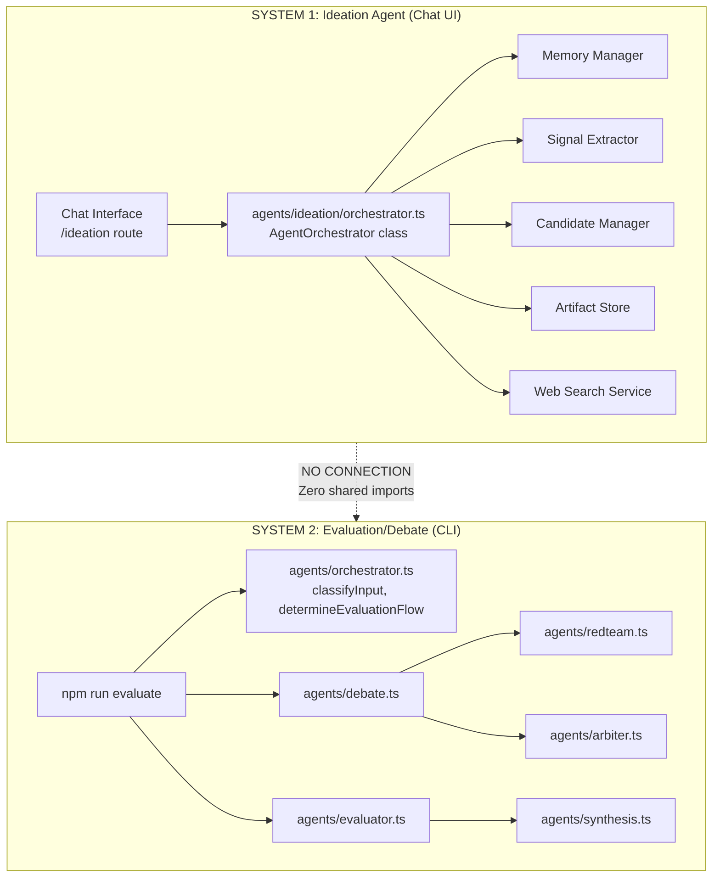
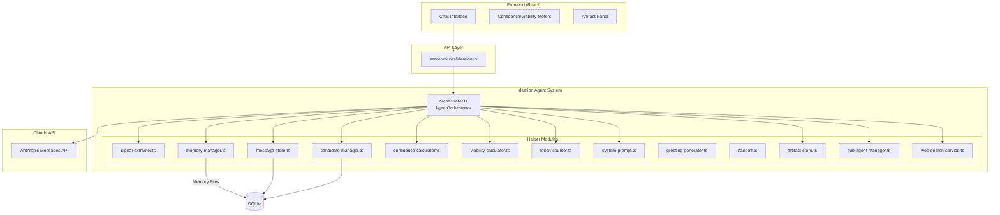
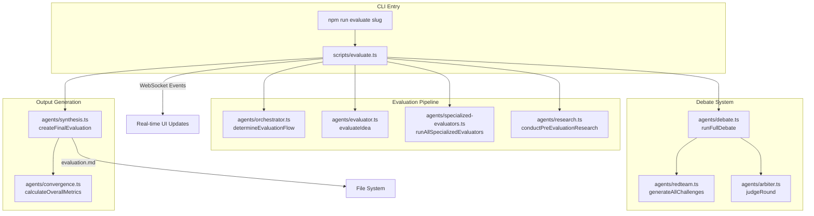
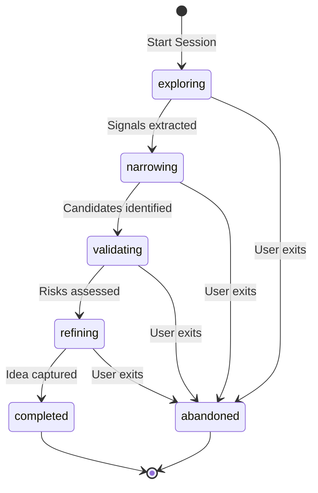
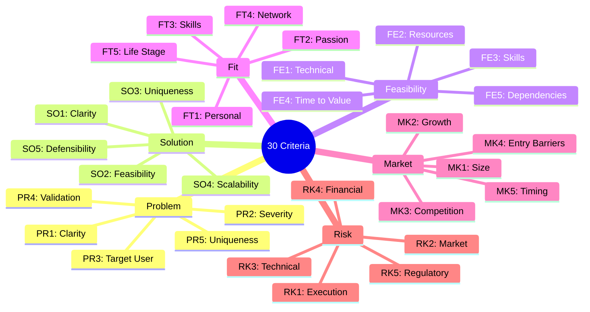
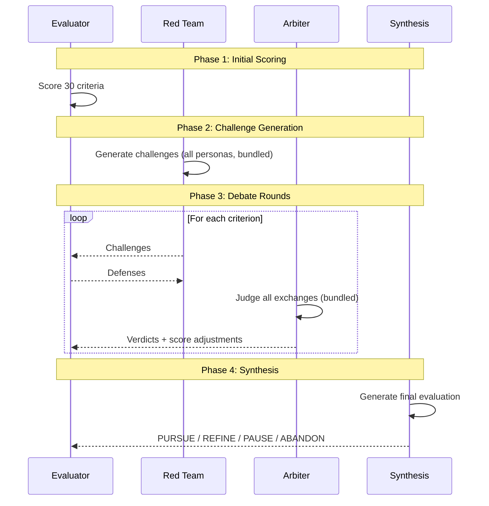

# Idea Incubator Agent Systems - Technical & Functional Analysis

> **Generated**: 2026-01-19
> **Analysis Method**: First Principles Reasoning
> **Scope**: Complete analysis of the TWO INDEPENDENT agent systems

---

## Table of Contents

1. [Critical Distinction: Two Separate Systems](#critical-distinction-two-separate-systems)
2. [System 1: Ideation Agent (Chat UI)](#system-1-ideation-agent-chat-ui)
3. [System 2: Evaluation/Debate System (CLI)](#system-2-evaluationdebate-system-cli)
4. [No Connection Between Systems](#no-connection-between-systems)
5. [Ideation Agent Deep Dive](#ideation-agent-deep-dive)
6. [Evaluation System Deep Dive](#evaluation-system-deep-dive)
7. [File Structure](#file-structure)

---

## Critical Distinction: Two Separate Systems

**This codebase contains TWO COMPLETELY INDEPENDENT agent systems that share ZERO code paths:**



| Aspect               | System 1: Ideation Agent            | System 2: Evaluation/Debate        |
| -------------------- | ----------------------------------- | ---------------------------------- |
| **Entry Point**      | UI chat at `/ideation`              | CLI via `npm run evaluate <slug>`  |
| **Main File**        | `agents/ideation/orchestrator.ts`   | `scripts/evaluate.ts`              |
| **Orchestrator**     | `AgentOrchestrator` class           | `agents/orchestrator.ts` functions |
| **Purpose**          | Conversational idea exploration     | Score ideas against 30 criteria    |
| **User Interaction** | Real-time chat with Claude          | Batch CLI execution                |
| **Output**           | Idea candidates, artifacts, signals | Evaluation scores, recommendations |

---

## System 1: Ideation Agent (Chat UI)

### What It Is

The Ideation Agent is a **conversational AI system** that helps users discover and develop business ideas through interactive chat sessions in the UI.

### What It Does

1. **Dual-mode questioning** - Covert extraction and transparent inquiry
2. **Signal extraction** - Captures self-discovery, market discovery, and narrowing signals
3. **Memory management** - Preserves context across handoffs
4. **Candidate tracking** - Tracks idea candidates with confidence/viability scores
5. **Web search** - Asynchronous market research via `webSearchNeeded`
6. **Artifact creation** - Mermaid diagrams, code, analysis documents

### What It Does NOT Do

- Does NOT score ideas against 30 criteria
- Does NOT run adversarial red team challenges
- Does NOT conduct debates
- Does NOT produce PURSUE/REFINE/PAUSE/ABANDON recommendations
- Has ZERO imports from debate.ts, evaluator.ts, redteam.ts, arbiter.ts, or synthesis.ts

### Architecture



### Module Inventory (30+ files in agents/ideation/)

| Module                        | Purpose                                             |
| ----------------------------- | --------------------------------------------------- |
| `orchestrator.ts`             | Main coordinator - processes messages, manages flow |
| `signal-extractor.ts`         | Extract structured signals from conversation        |
| `memory-manager.ts`           | Persist context across handoffs                     |
| `message-store.ts`            | Store conversation messages                         |
| `candidate-manager.ts`        | Track idea candidates                               |
| `confidence-calculator.ts`    | Calculate idea definition confidence                |
| `viability-calculator.ts`     | Calculate idea viability score                      |
| `token-counter.ts`            | Track token usage for handoffs                      |
| `system-prompt.ts`            | Build agent system prompt                           |
| `greeting-generator.ts`       | Generate session greetings                          |
| `handoff.ts`                  | Prepare handoff to new context                      |
| `artifact-store.ts`           | Store visual artifacts                              |
| `unified-artifact-store.ts`   | Unified file system artifacts                       |
| `artifact-editor.ts`          | Edit existing artifacts                             |
| `sub-agent-manager.ts`        | Manage parallel sub-agent tasks                     |
| `subagent-store.ts`           | Persist sub-agent state                             |
| `web-search-service.ts`       | Async web search                                    |
| `streaming.ts`                | SSE streaming responses                             |
| `session-manager.ts`          | Manage session lifecycle                            |
| `phase-manager.ts`            | Track session phases                                |
| `vagueness-detector.ts`       | Detect vague user inputs                            |
| `witty-interjections.ts`      | Add personality to responses                        |
| `classification-rules.ts`     | Classify idea types                                 |
| `document-classifier.ts`      | Classify documents                                  |
| `communication-classifier.ts` | Classify communication style                        |
| `idea-context-builder.ts`     | Build idea context                                  |
| `context-helpers.ts`          | Context utilities                                   |
| `priority-manager.ts`         | Manage question priorities                          |
| `readiness-calculator.ts`     | Calculate spec readiness                            |
| `spec-generator.ts`           | Generate specifications                             |
| `pre-answered-mapper.ts`      | Map pre-answered questions                          |
| `prompts/spec-generation.ts`  | Spec generation prompts                             |

---

## System 2: Evaluation/Debate System (CLI)

### What It Is

The Evaluation/Debate System is a **batch CLI process** that scores ideas against 30 criteria using adversarial red team challenges and multi-round debates.

### What It Does

1. **Score 30 criteria** across 6 categories (Problem, Solution, Feasibility, Fit, Market, Risk)
2. **Generate red team challenges** from 6 adversarial personas
3. **Conduct multi-round debates** between evaluator and red team
4. **Judge exchanges** via impartial arbiter
5. **Synthesize recommendations** (PURSUE/REFINE/PAUSE/ABANDON)

### What It Does NOT Do

- Does NOT power the chat UI
- Does NOT handle real-time conversation
- Does NOT track session state or memory files
- Does NOT create artifacts
- Has ZERO imports from agents/ideation/\*

### Architecture



### Invocation

```bash
# Basic evaluation
npm run evaluate my-idea-slug

# With options
npm run evaluate my-idea-slug --budget=15 --debate-rounds=2 --verbose
```

### Module Inventory (agents/\*.ts - root level)

| Module                      | Purpose                                |
| --------------------------- | -------------------------------------- |
| `orchestrator.ts`           | Evaluation flow control (NOT ideation) |
| `evaluator.ts`              | Score 30 criteria                      |
| `specialized-evaluators.ts` | Category-specific parallel evaluation  |
| `redteam.ts`                | 6 adversarial personas                 |
| `arbiter.ts`                | Judge debate exchanges                 |
| `debate.ts`                 | Multi-round debate orchestration       |
| `synthesis.ts`              | Final recommendation generation        |
| `convergence.ts`            | Calculate confidence metrics           |
| `config.ts`                 | 30 criteria definitions                |
| `research.ts`               | Pre-evaluation market research         |
| `development.ts`            | Probing questions (standalone)         |
| `classifier.ts`             | Idea classification                    |
| `differentiation.ts`        | Differentiation analysis               |
| `gap-analysis.ts`           | Gap analysis                           |
| `positioning.ts`            | Market positioning                     |
| `iteration.ts`              | Idea iteration                         |

---

## No Connection Between Systems

### Proof: Import Analysis

**agents/ideation/orchestrator.ts imports:**

```typescript
import { client } from "../../utils/anthropic-client.js";
import { messageStore } from "./message-store.js";
import { memoryManager } from "./memory-manager.js";
import { candidateManager } from "./candidate-manager.js";
import { extractSignals } from "./signal-extractor.js";
import { calculateConfidence } from "./confidence-calculator.js";
import { calculateViability } from "./viability-calculator.js";
import { prepareHandoff } from "./handoff.js";
import { buildSystemPrompt } from "./system-prompt.js";
import { artifactStore } from "./artifact-store.js";
// ... NO imports from debate.ts, evaluator.ts, redteam.ts, arbiter.ts, synthesis.ts
```

**scripts/evaluate.ts imports:**

```typescript
import { evaluateIdea } from "../agents/evaluator.js";
import { runFullDebate } from "../agents/debate.js";
import { determineEvaluationFlow } from "../agents/orchestrator.js"; // Different file!
import { runAllSpecializedEvaluators } from "../agents/specialized-evaluators.js";
import { conductPreEvaluationResearch } from "../agents/research.js";
// ... NO imports from agents/ideation/*
```

### The Naming Confusion

Two files are named similarly but are COMPLETELY DIFFERENT:

| File                              | Class/Functions                                | Used By | Purpose                 |
| --------------------------------- | ---------------------------------------------- | ------- | ----------------------- |
| `agents/ideation/orchestrator.ts` | `AgentOrchestrator` class                      | Chat UI | Conversational ideation |
| `agents/orchestrator.ts`          | `classifyInput()`, `determineEvaluationFlow()` | CLI     | Evaluation flow control |

---

## Ideation Agent Deep Dive

### System Prompt Strategy

The Ideation Agent uses a sophisticated system prompt (`system-prompt.ts`) that defines:

1. **Mandatory JSON output format** - All responses must be valid JSON
2. **Dual-mode questioning** - Covert extraction vs transparent inquiry
3. **Key areas to populate**:
   - Self-Discovery (impact vision, frustrations, expertise, interests, skills, constraints)
   - Market Discovery (competitors, gaps, timing, failed attempts, location)
   - Narrowing Dimensions (product type, customer type, geography, scale, technical depth)
4. **Dual metering system** - Confidence (definition) and Viability (realism)
5. **Viability intervention** - Pause when viability drops below 50%

### Signal Extraction

```typescript
interface ExtractedSignals {
  selfDiscovery: Partial<SelfDiscoveryState>;
  marketDiscovery: Partial<MarketDiscoveryState>;
  narrowing: Partial<NarrowingState>;
}
```

Signals are extracted through:

1. **LLM-extracted signals** - Claude returns signals in JSON response
2. **Rule-based patterns** - Regex matching for common patterns

### Memory File Types

```typescript
type MemoryFileType =
  | "self_discovery" // User's skills, interests, constraints
  | "market_discovery" // Market research, competitors
  | "narrowing_state" // Hypothesis tracking
  | "conversation_summary" // Compressed context
  | "idea_candidate" // Captured idea details
  | "viability_assessment" // Risk analysis
  | "handoff_notes"; // Context for session continuation
```

### Session Lifecycle



### Session Phases

| Phase          | Purpose                                          | Transition Trigger              |
| -------------- | ------------------------------------------------ | ------------------------------- |
| **exploring**  | Understand user context, frustrations, interests | Sufficient signals extracted    |
| **narrowing**  | Identify specific idea candidates                | Candidates with >50% confidence |
| **validating** | Assess viability risks                           | Risks acknowledged by user      |
| **refining**   | Polish and capture final idea                    | User confirms capture           |

### Orchestrator Response

```typescript
interface OrchestratorResponse {
  reply: string; // Text shown to user
  buttons: ButtonOption[] | null; // Quick action buttons
  form: FormDefinition | null; // Form for structured input
  candidateUpdate: { title; summary }; // Update to idea candidate
  confidence: number; // 0-100 definition confidence
  viability: number; // 0-100 realism score
  risks: ViabilityRisk[]; // Identified risks
  requiresIntervention: boolean; // Pause for user action
  handoffOccurred: boolean; // Context was handed off
  webSearchQueries?: string[]; // Queries for async search
  artifact?: AgentArtifact; // Visual artifact to create
  artifactUpdate?: AgentArtifactUpdate; // Update existing artifact
  isQuickAck: boolean; // Fast acknowledgment
  subAgentTasks?: SubAgentTask[]; // Parallel tasks
}
```

### Confidence vs Viability

| Meter          | What It Measures              | Data Source                                                             |
| -------------- | ----------------------------- | ----------------------------------------------------------------------- |
| **Confidence** | How well-defined is the idea? | Internal signals (problem, target, solution, differentiation, user fit) |
| **Viability**  | How realistic is the idea?    | Web search evidence + risk analysis                                     |

### Quick Acknowledgment Pattern

When a user selects numbered options (e.g., "1 and 3"), the orchestrator:

1. Detects task selection pattern
2. Returns immediately with "Working on N tasks..."
3. Spawns sub-agents for parallel execution
4. Does NOT call Claude for acknowledgment

---

## Evaluation System Deep Dive

### 30 Evaluation Criteria



### Red Team Personas

| Persona              | Focus              | Challenge Types                   |
| -------------------- | ------------------ | --------------------------------- |
| **Skeptic**          | Evidence quality   | Demands proof, questions data     |
| **Realist**          | Practical barriers | Resource, time, capability gaps   |
| **First Principles** | Assumption testing | Questions fundamentals            |
| **Competitor**       | Market dynamics    | Competitive threats, moat erosion |
| **Contrarian**       | Alternative views  | Opposite perspectives             |
| **Edge-Case Hunter** | Failure modes      | Edge cases, error scenarios       |

### Debate Flow



### Verdict Types

| Verdict       | Description               | Score Impact         |
| ------------- | ------------------------- | -------------------- |
| **EVALUATOR** | Defense refuted challenge | +1 point (evaluator) |
| **RED_TEAM**  | Challenge stands          | +1 point (red team)  |
| **DRAW**      | Both valid points         | +0.5 each            |

### Score Adjustments

| Adjustment | Meaning                                   |
| ---------- | ----------------------------------------- |
| -3 to -1   | Red team revealed significant flaw        |
| 0          | No change warranted                       |
| +1 to +3   | Evaluator's defense strengthened the case |

### First Principles Bonus

**+0.5 points** awarded when an argument:

- Derives from fundamental truths rather than analogy
- Questions assumptions others take for granted
- Provides novel insight that reframes the issue

### Recommendation Matrix

| Score Range | Confidence | Recommendation                   |
| ----------- | ---------- | -------------------------------- |
| 7.0+        | High       | **PURSUE** - Clear path forward  |
| 5.0-6.9     | Any        | **REFINE** - Needs improvement   |
| 7.0+        | Low        | **REFINE** - High score but gaps |
| 4.0-4.9     | Any        | **PAUSE** - Major blockers       |
| < 4.0       | Any        | **ABANDON** - Fundamental flaws  |

### API Bundling Optimizations

| Operation  | Before   | After        | Savings |
| ---------- | -------- | ------------ | ------- |
| Evaluation | 30 calls | 6 calls      | 80%     |
| Red Team   | 6+ calls | 1 call       | 83%     |
| Arbiter    | N calls  | 1 call/round | ~90%    |

### WebSocket Events (Evaluation)

The CLI broadcasts real-time events for UI visualization:

| Event                           | Purpose                     |
| ------------------------------- | --------------------------- |
| `evaluation:started`            | Evaluation began            |
| `evaluation:criterion:start`    | Starting criterion debate   |
| `evaluation:challenge`          | Red team challenge          |
| `evaluation:defense`            | Evaluator defense           |
| `evaluation:verdict`            | Arbiter verdict             |
| `evaluation:criterion:complete` | Criterion debate finished   |
| `evaluation:complete`           | Full evaluation done        |
| `evaluation:error`              | Error occurred              |
| `budget:status`                 | Cost tracking update        |
| `api:call`                      | Individual API call details |

---

## File Structure

```
agents/
├── ideation/                     # SYSTEM 1: Chat UI (30+ files)
│   ├── orchestrator.ts           # Main AgentOrchestrator class
│   ├── signal-extractor.ts       # Extract signals from conversation
│   ├── memory-manager.ts         # Persist context across handoffs
│   ├── message-store.ts          # Store messages
│   ├── candidate-manager.ts      # Track idea candidates
│   ├── confidence-calculator.ts  # Calculate confidence
│   ├── viability-calculator.ts   # Calculate viability
│   ├── token-counter.ts          # Track tokens
│   ├── system-prompt.ts          # Agent system prompt
│   ├── handoff.ts                # Prepare handoffs
│   ├── artifact-store.ts         # Store artifacts
│   ├── sub-agent-manager.ts      # Parallel tasks
│   ├── web-search-service.ts     # Async web search
│   ├── streaming.ts              # SSE streaming
│   └── ... (16+ more helper modules)
│
├── orchestrator.ts               # SYSTEM 2: Evaluation flow (NOT ideation!)
├── evaluator.ts                  # Score 30 criteria
├── redteam.ts                    # 6 adversarial personas
├── arbiter.ts                    # Judge debates
├── debate.ts                     # Multi-round debate
├── synthesis.ts                  # Final recommendations
├── convergence.ts                # Confidence metrics
├── config.ts                     # 30 criteria definitions
├── research.ts                   # Pre-evaluation research
├── specialized-evaluators.ts     # Parallel category evaluation
├── development.ts                # Probing questions (standalone)
├── classifier.ts                 # Idea classification
└── ... (other evaluation modules)

scripts/
└── evaluate.ts                   # CLI entry point for SYSTEM 2

server/
└── routes/
    ├── ideation.ts               # Routes for SYSTEM 1 (uses agents/ideation/*)
    └── debates.ts                # Routes for SYSTEM 2 debate data
```

---

## Key Design Decisions

### Why Two Separate Systems?

**First Principles**: Conversational exploration and batch evaluation serve different purposes:

| Aspect            | Conversational (System 1)  | Batch Evaluation (System 2) |
| ----------------- | -------------------------- | --------------------------- |
| **Goal**          | Discover and develop ideas | Score and stress-test ideas |
| **Interaction**   | Real-time dialogue         | One-time execution          |
| **Duration**      | Minutes to hours           | 10-30 minutes               |
| **Output**        | Evolving candidates        | Fixed scores                |
| **User presence** | Required                   | Not required                |
| **Cost model**    | Per-message                | All-at-once                 |

### Why Not Merge Them?

1. **Different user needs** - Exploration is interactive; evaluation is analytical
2. **Different cost profiles** - Chat is per-message; evaluation is all-at-once
3. **Different feedback loops** - Chat adapts to user; evaluation is adversarial
4. **Separation of concerns** - Each system does one thing well

### Why Keep the Naming Similar?

Both are "agent orchestrators" but for different contexts:

- `agents/ideation/orchestrator.ts` orchestrates **conversational flow**
- `agents/orchestrator.ts` orchestrates **evaluation flow**

The confusion is unfortunate but reflects the codebase's evolution.

---

## Summary Table

| Question                         | System 1: Ideation Agent          | System 2: Evaluation/Debate       |
| -------------------------------- | --------------------------------- | --------------------------------- |
| Where do I use it?               | Chat UI at `/ideation`            | CLI: `npm run evaluate`           |
| What file?                       | `agents/ideation/orchestrator.ts` | `scripts/evaluate.ts`             |
| What does it do?                 | Conversational idea exploration   | Batch scoring with debates        |
| Does it use debate.ts?           | **NO**                            | Yes                               |
| Does it use redteam.ts?          | **NO**                            | Yes                               |
| Does it use arbiter.ts?          | **NO**                            | Yes                               |
| Does it use synthesis.ts?        | **NO**                            | Yes                               |
| Does it produce recommendations? | **NO** (produces candidates)      | Yes (PURSUE/REFINE/PAUSE/ABANDON) |
| Is it connected to the other?    | **NO SHARED IMPORTS**             | **NO SHARED IMPORTS**             |

---

## Conclusion

The Idea Incubator contains **two completely independent agent systems**:

1. **Ideation Agent** (`agents/ideation/orchestrator.ts`) - Conversational chat for exploring ideas via UI
2. **Evaluation/Debate System** (`scripts/evaluate.ts` + `agents/*.ts`) - CLI batch process for scoring ideas

These systems:

- Share **zero imports**
- Serve **different purposes**
- Have **different entry points**
- Produce **different outputs**

**The Ideation Agent you interact with in the chat UI has no connection to the debate system, evaluator, red team, arbiter, or synthesis agents.**
