# System 1: Ideation Agent - Comprehensive Analysis

> **Generated**: 2026-01-19
> **Scope**: Complete technical and functional analysis of the Ideation Agent system
> **Source**: First principles codebase analysis

---

## Table of Contents

1. [Executive Summary](#executive-summary)
2. [System Overview](#system-overview)
3. [Architecture](#architecture)
4. [File Inventory](#file-inventory)
5. [Core Components Deep Dive](#core-components-deep-dive)
6. [Data Flow Analysis](#data-flow-analysis)
7. [Database Schema](#database-schema)
8. [API Reference](#api-reference)
9. [Frontend Components](#frontend-components)
10. [Key Features & Patterns](#key-features--patterns)
11. [AI vs Rule-Based Processing](#ai-vs-rule-based-processing) ⬅️ **NEW**
12. [WebSocket Events](#websocket-events)
13. [Configuration & Constants](#configuration--constants)

---

## Executive Summary

The **Ideation Agent** is a conversational AI system that helps users discover and develop viable business ideas through interactive chat sessions. It is **completely separate** from the Evaluation/Debate system (System 2) and shares **zero code paths** with it.

### Key Characteristics

| Aspect                | Description                                                   |
| --------------------- | ------------------------------------------------------------- |
| **Entry Point**       | Web UI at `/ideation` route                                   |
| **Main Orchestrator** | `agents/ideation/orchestrator.ts` (`AgentOrchestrator` class) |
| **User Interaction**  | Real-time conversational chat with Claude                     |
| **Output**            | Idea candidates, artifacts, extracted signals                 |
| **Total Files**       | 33 TypeScript files in `agents/ideation/`                     |
| **Lines of Code**     | ~8,000+ lines across all modules                              |

### What It Does

- **Dual-mode questioning** — Covert extraction and transparent inquiry
- **Signal extraction** — Captures self-discovery, market discovery, and narrowing signals
- **Memory management** — Preserves context across handoffs
- **Candidate tracking** — Tracks idea candidates with confidence/viability scores
- **Web search** — Asynchronous market research via `webSearchNeeded`
- **Artifact creation** — Mermaid diagrams, code, analysis documents
- **Sub-agent parallelism** — Background task execution

### What It Does NOT Do

- ❌ Does NOT score ideas against 30 criteria
- ❌ Does NOT run adversarial red team challenges
- ❌ Does NOT conduct debates
- ❌ Does NOT produce PURSUE/REFINE/PAUSE/ABANDON recommendations
- ❌ Has ZERO imports from `debate.ts`, `evaluator.ts`, `redteam.ts`, `arbiter.ts`, or `synthesis.ts`

---

## System Overview

### Purpose

The Ideation Agent serves as an AI-powered idea discovery companion that:

1. **Explores** user context, frustrations, interests, and expertise
2. **Narrows** potential idea space through targeted questioning
3. **Validates** viability through web search evidence
4. **Refines** and captures well-defined idea candidates

### Session Lifecycle


### Session Phases

| Phase          | Purpose                                          | Transition Trigger              |
| -------------- | ------------------------------------------------ | ------------------------------- |
| **exploring**  | Understand user context, frustrations, interests | Sufficient signals extracted    |
| **narrowing**  | Identify specific idea candidates                | Candidates with >50% confidence |
| **validating** | Assess viability risks                           | Risks acknowledged by user      |
| **refining**   | Polish and capture final idea                    | User confirms capture           |

---

## Architecture

### High-Level System Architecture


### Module Dependency Graph


---

## File Inventory

### Complete Module Inventory (33 Files)

| Module                        | Lines | Purpose                                             | Exports                                           |
| ----------------------------- | ----- | --------------------------------------------------- | ------------------------------------------------- |
| `orchestrator.ts`             | 2,028 | Main coordinator — processes messages, manages flow | `AgentOrchestrator`, `agentOrchestrator`          |
| `signal-extractor.ts`         | 601   | Extract structured signals from conversation        | `extractSignals`, `ParsedAgentResponse`           |
| `memory-manager.ts`           | 707   | Persist context across handoffs                     | `MemoryManager`, `memoryManager`                  |
| `message-store.ts`            | 416   | Store conversation messages                         | `MessageStore`, `messageStore`                    |
| `candidate-manager.ts`        | 280   | Track idea candidates                               | `CandidateManager`, `candidateManager`            |
| `session-manager.ts`          | 309   | Manage session lifecycle                            | `SessionManager`, `sessionManager`                |
| `confidence-calculator.ts`    | 200+  | Calculate idea definition confidence                | `calculateConfidence`, `ConfidenceBreakdown`      |
| `viability-calculator.ts`     | 200+  | Calculate idea viability score                      | `calculateViability`, `ViabilityBreakdown`        |
| `token-counter.ts`            | 150   | Track token usage for handoffs                      | `countTokens`, `estimateTokenUsage`               |
| `system-prompt.ts`            | 500+  | Build agent system prompt                           | `buildSystemPrompt`                               |
| `greeting-generator.ts`       | 200   | Generate session greetings                          | `generateGreeting`, `generateGreetingWithButtons` |
| `handoff.ts`                  | 300   | Prepare handoff to new context                      | `prepareHandoff`                                  |
| `artifact-store.ts`           | 250   | Store visual artifacts (legacy)                     | `artifactStore`                                   |
| `unified-artifact-store.ts`   | 800+  | Unified file system artifacts                       | `saveArtifact`, `loadArtifact`, `listArtifacts`   |
| `artifact-editor.ts`          | 350   | Edit existing artifacts                             | `detectArtifactEditRequest`, `editArtifact`       |
| `sub-agent-manager.ts`        | 300+  | Manage parallel sub-agent tasks                     | `SubAgentManager`, `subAgentManager`              |
| `subagent-store.ts`           | 150   | Persist sub-agent state                             | `subagentStore`                                   |
| `web-search-service.ts`       | 250   | Async web search                                    | `performWebSearch`                                |
| `streaming.ts`                | 200   | SSE streaming responses                             | `streamResponse`                                  |
| `phase-manager.ts`            | 150   | Track session phases                                | `determinePhase`, `shouldAdvancePhase`            |
| `vagueness-detector.ts`       | 180   | Detect vague user inputs                            | `detectVagueness`                                 |
| `witty-interjections.ts`      | 100   | Add personality to responses                        | `getWittyInterjection`                            |
| `classification-rules.ts`     | 200   | Classify idea types                                 | `classifyIdea`                                    |
| `document-classifier.ts`      | 180   | Classify documents                                  | `classifyDocument`                                |
| `communication-classifier.ts` | 150   | Classify communication style                        | `classifyCommunicationStyle`                      |
| `idea-context-builder.ts`     | 250   | Build idea context                                  | `buildIdeaContext`                                |
| `context-helpers.ts`          | 300   | Context utilities                                   | Various helpers                                   |
| `priority-manager.ts`         | 180   | Manage question priorities                          | `calculateQuestionPriority`                       |
| `readiness-calculator.ts`     | 150   | Calculate spec readiness                            | `calculateReadiness`                              |
| `spec-generator.ts`           | 400   | Generate specifications                             | `generateSpec`                                    |
| `pre-answered-mapper.ts`      | 200   | Map pre-answered questions                          | `mapPreAnsweredQuestions`                         |
| `types.ts`                    | 300   | Type definitions                                    | All interfaces                                    |
| `prompts/spec-generation.ts`  | 150   | Spec generation prompts                             | Prompt templates                                  |

### File Size Distribution


---

## Core Components Deep Dive

### 1. AgentOrchestrator

**File**: `agents/ideation/orchestrator.ts`
**Lines**: 2,028
**Pattern**: Singleton

The orchestrator is the central coordinator that processes all user messages and manages the entire ideation flow.

#### Key Methods

| Method                          | Purpose                                         | Returns                 |
| ------------------------------- | ----------------------------------------------- | ----------------------- |
| `processMessage()`              | Main entry point for message processing         | `OrchestratorResponse`  |
| `buildContext()`                | Prepares system prompt and conversation history | `AgentContext`          |
| `parseResponse()`               | Parses Claude's JSON response                   | `ParsedAgentResponse`   |
| `detectTaskSelection()`         | Recognizes numbered option selections           | `TaskSelectionResult`   |
| `detectDirectArtifactRequest()` | Detects multi-artifact creation requests        | `DirectArtifactRequest` |
| `handleQuickAcknowledgment()`   | Immediate response for task selections          | `OrchestratorResponse`  |
| `loadSessionState()`            | Loads current state from memory files           | `SessionState`          |
| `mergeState()`                  | Intelligently merges state updates              | `T`                     |
| `performHandoff()`              | Prepares for token context handoff              | `void`                  |

#### Message Processing Flow


#### OrchestratorResponse Interface

```typescript
interface OrchestratorResponse {
  reply: string; // Text shown to user
  buttons: ButtonOption[] | null; // Quick action buttons
  form: FormDefinition | null; // Form for structured input
  candidateUpdate: { title; summary }; // Update to idea candidate
  confidence: number; // 0-100 definition confidence
  viability: number; // 0-100 realism score
  risks: ViabilityRisk[]; // Identified risks
  requiresIntervention: boolean; // Pause for user action
  handoffOccurred: boolean; // Context was handed off
  webSearchQueries?: string[]; // Queries for async search
  artifact?: AgentArtifact; // Visual artifact to create
  artifactUpdate?: AgentArtifactUpdate; // Update existing artifact
  isQuickAck: boolean; // Fast acknowledgment
  subAgentTasks?: SubAgentTask[]; // Parallel tasks
}
```

---

### 2. Signal Extractor

**File**: `agents/ideation/signal-extractor.ts`
**Lines**: 601

Extracts structured signals from user messages using both LLM-provided signals and rule-based pattern matching.

#### Signal Categories


#### Rule-Based Patterns

| Signal Type   | Pattern Examples                                    |
| ------------- | --------------------------------------------------- |
| Frustrations  | "hate", "frustrated", "annoyed", "sick of"          |
| Expertise     | "I've worked in X for N years", "I'm an expert in"  |
| Interests     | "I'm interested in", "I love", "I enjoy"            |
| Impact Vision | "change the world", "global impact", "my community" |
| Customer Type | B2B keywords, B2C signals, marketplace patterns     |
| Product Type  | Digital, Physical, Service, Hybrid indicators       |
| Geography     | Local, National, Global scope markers               |

#### Extraction Flow


---

### 3. Memory Manager

**File**: `agents/ideation/memory-manager.ts`
**Lines**: 707

Persists session context across handoffs through markdown memory files stored in the database.

#### Memory File Types

| File Type              | Purpose                               | Content                                        |
| ---------------------- | ------------------------------------- | ---------------------------------------------- |
| `self_discovery`       | User's skills, interests, constraints | Impact Vision, Frustrations, Expertise, Skills |
| `market_discovery`     | Market research, competitors          | Competitors, Gaps, Timing, Failed Attempts     |
| `narrowing_state`      | Hypothesis tracking                   | Dimensions table, Working Hypotheses           |
| `conversation_summary` | Compressed context                    | JSON state for reliable loading                |
| `idea_candidate`       | Captured idea details                 | Title, Summary, Confidence, Viability          |
| `viability_assessment` | Risk analysis                         | Overall score, Risk list                       |
| `handoff_notes`        | Context for continuation              | Handoff summary                                |

#### Memory File Lifecycle


---

### 4. Confidence Calculator

**File**: `agents/ideation/confidence-calculator.ts`
**Lines**: 200+

Calculates how well-defined an idea is (not how good it is).

#### Confidence Components

| Component          | Max Points | Description                                                   |
| ------------------ | ---------- | ------------------------------------------------------------- |
| Problem Definition | 25         | User has identified specific frustrations + market validation |
| Target User        | 20         | Customer type defined with evidence                           |
| Solution Direction | 20         | Proposed solution exists with feasibility signals             |
| Differentiation    | 20         | Unique angle compared to competitors                          |
| User Fit           | 15         | Solution aligns with user's skills/expertise/network          |
| **Total**          | **100**    |                                                               |

#### Confidence Thresholds


---

### 5. Viability Calculator

**File**: `agents/ideation/viability-calculator.ts`
**Lines**: 200+

Calculates how realistic an idea is based on hard evidence from web search.

#### Viability Components

| Component             | Max Points | Description                                |
| --------------------- | ---------- | ------------------------------------------ |
| Market Exists         | 25         | Competitors, search volume, demand signals |
| Technical Feasibility | 20         | Technology exists, not impossible          |
| Competitive Space     | 20         | Market saturation assessment               |
| Resource Reality      | 20         | User's skills match requirements           |
| Clarity Score         | 15         | Idea well-defined enough to validate       |
| **Total**             | **100**    |                                            |

#### Viability Thresholds & Actions

| Range   | Status   | Action                   |
| ------- | -------- | ------------------------ |
| 75-100% | Healthy  | Continue exploration     |
| 50-74%  | Caution  | Mention concerns         |
| 25-49%  | Warning  | Pause and discuss        |
| 0-24%   | Critical | Must address immediately |

#### Risk Types

| Risk Type           | Description                            |
| ------------------- | -------------------------------------- |
| `impossible`        | Technically cannot be done             |
| `unrealistic`       | Theoretically possible but impractical |
| `too_complex`       | Requires resources beyond reach        |
| `too_vague`         | Not defined enough to assess           |
| `saturated_market`  | Market is overcrowded                  |
| `wrong_timing`      | Market not ready or too late           |
| `resource_mismatch` | User lacks required skills/resources   |

---

### 6. Sub-Agent Manager

**File**: `agents/ideation/sub-agent-manager.ts`
**Lines**: 300+

Manages parallel execution of background sub-agents for tasks like action planning, pitch refinement, and architecture exploration.

#### Task Types

| Type                   | Purpose                          | Output                                |
| ---------------------- | -------------------------------- | ------------------------------------- |
| `action-plan`          | Creates 30/60/90 day action plan | Goals, blockers, resources            |
| `pitch-refine`         | Creates refined pitch            | One-liner, elevator pitch, value prop |
| `architecture-explore` | Creates system design            | Overview, components, data flow       |
| `custom`               | Custom task with user prompt     | User-defined                          |

#### Task Status Flow


#### Parallel Execution Flow


---

## Data Flow Analysis

### Complete Message Processing Flow


### State Accumulation Over Session


---

## Database Schema

### Entity Relationship Diagram


### Table Details

| Table                   | Purpose              | Key Columns                                               |
| ----------------------- | -------------------- | --------------------------------------------------------- |
| `ideation_sessions`     | Session metadata     | id, profile_id, status, current_phase, handoff_count      |
| `ideation_messages`     | Conversation history | id, session_id, role, content, buttons_shown, token_count |
| `ideation_candidates`   | Idea candidates      | id, session_id, title, confidence, viability, status      |
| `ideation_memory_files` | Memory persistence   | id, session_id, file_type, content, version               |
| `ideation_artifacts`    | Visual artifacts     | id, session_id, type, title, content, language            |
| `user_profiles`         | User profiles        | id, name, technical_skills, interests                     |

---

## API Reference

### Session Management

| Endpoint              | Method | Purpose            | Request         | Response                           |
| --------------------- | ------ | ------------------ | --------------- | ---------------------------------- |
| `/api/ideation/start` | POST   | Create new session | `{ profileId }` | `{ sessionId, greeting, buttons }` |

### Message Processing

| Endpoint                     | Method | Purpose                | Request                                | Response               |
| ---------------------------- | ------ | ---------------------- | -------------------------------------- | ---------------------- |
| `/api/ideation/message`      | POST   | Process user message   | `{ sessionId, message }`               | `OrchestratorResponse` |
| `/api/ideation/button-click` | POST   | Handle button click    | `{ sessionId, buttonId, buttonValue }` | `OrchestratorResponse` |
| `/api/ideation/form-submit`  | POST   | Handle form submission | `{ sessionId, formId, responses }`     | `OrchestratorResponse` |

### Idea Capture

| Endpoint                            | Method | Purpose           | Request                               | Response           |
| ----------------------------------- | ------ | ----------------- | ------------------------------------- | ------------------ |
| `/api/ideation/capture`             | POST   | Capture idea      | `{ sessionId }`                       | `{ ideaId, slug }` |
| `/api/ideation/save-for-later`      | POST   | Save candidate    | `{ sessionId, candidateId?, notes? }` | Success            |
| `/api/ideation/discard-and-restart` | POST   | Discard & restart | `{ sessionId, reason? }`              | Success            |

### Message Editing

| Endpoint                     | Method | Purpose      | Request                                | Response           |
| ---------------------------- | ------ | ------------ | -------------------------------------- | ------------------ |
| `/api/ideation/edit-message` | POST   | Edit message | `{ sessionId, messageId, newContent }` | Recalculated state |

### Web Search

| Endpoint                   | Method | Purpose        | Request                            | Response       |
| -------------------------- | ------ | -------------- | ---------------------------------- | -------------- |
| `/api/ideation/web-search` | POST   | Perform search | `{ sessionId, queries, context? }` | Search results |

### Artifact Management

| Endpoint                             | Method | Purpose           | Request                               | Response         |
| ------------------------------------ | ------ | ----------------- | ------------------------------------- | ---------------- |
| `/api/ideation/artifacts/:sessionId` | GET    | Get all artifacts | -                                     | Artifact list    |
| `/api/ideation/artifacts`            | POST   | Create artifact   | `{ sessionId, type, title, content }` | Artifact         |
| `/api/ideation/artifacts/:id`        | PUT    | Update artifact   | Updated fields                        | Updated artifact |
| `/api/ideation/artifacts/:id`        | DELETE | Delete artifact   | -                                     | Success          |

### Sub-Agent Management

| Endpoint                                  | Method | Purpose       | Request | Response  |
| ----------------------------------------- | ------ | ------------- | ------- | --------- |
| `/api/ideation/sub-agents/:sessionId`     | GET    | Get all tasks | -       | Task list |
| `/api/ideation/sub-agents/:taskId/cancel` | POST   | Cancel task   | -       | Success   |

---

## Frontend Components

### Component Hierarchy


### Component Inventory

| Component                | Purpose                    | Key Props                |
| ------------------------ | -------------------------- | ------------------------ |
| `IdeationSession.tsx`    | Main session container     | `sessionId`, `profileId` |
| `ConversationPanel.tsx`  | Renders conversation       | `messages`, `onSend`     |
| `MessageList.tsx`        | Lists all messages         | `messages`               |
| `MessageText.tsx`        | Renders single message     | `message`, `role`        |
| `AgentMessage.tsx`       | Formats assistant messages | `content`, `buttons`     |
| `InputArea.tsx`          | User input field           | `onSend`, `disabled`     |
| `ButtonGroup.tsx`        | Interactive buttons        | `buttons`, `onSelect`    |
| `FormRenderer.tsx`       | Renders forms              | `form`, `onSubmit`       |
| `ArtifactPanel.tsx`      | Shows artifacts            | `sessionId`              |
| `ArtifactRenderer.tsx`   | Renders artifact types     | `artifact`               |
| `IdeaCandidatePanel.tsx` | Shows current candidate    | `candidate`              |
| `ConfidenceMeter.tsx`    | Visual confidence meter    | `value`                  |
| `ReadinessIndicator.tsx` | Ready status               | `confidence`             |
| `RisksList.tsx`          | Displays risks             | `risks`                  |
| `IdeationEntryModal.tsx` | Entry modal                | `onStart`                |
| `IdeaTypeModal.tsx`      | Type selection modal       | `onSelect`               |

---

## Key Features & Patterns

### 1. Dual Metering System


### 2. Quick Acknowledgment Pattern

When a user selects numbered options (e.g., "1 and 3"), the system:

1. **Detects** task selection pattern via regex
2. **Returns immediately** with "On it..." acknowledgment
3. **Spawns sub-agents** for parallel execution
4. **Streams results** via WebSocket
5. **Does NOT** call Claude for acknowledgment

### 3. Handoff Pattern

Token management for long conversations:


### 4. Memory File Strategy

| Strategy              | Description                                      |
| --------------------- | ------------------------------------------------ |
| **Markdown Format**   | Human-readable for debugging                     |
| **JSON Embedding**    | Reliable state loading via `<!-- STATE_JSON -->` |
| **Version Tracking**  | Every update increments version                  |
| **Selective Loading** | Only load needed files                           |

### 5. Signal Extraction Layers


---

## AI vs Rule-Based Processing

This section provides a comprehensive breakdown of which parts of the Ideation Agent use **AI (Claude API calls)** versus **rule-based logic (deterministic algorithms)**. Understanding this distinction is critical for debugging, cost optimization, and system modification.

### High-Level Processing Architecture


### AI-Powered Functions (Claude API Calls)

Functions that make calls to Claude API and require API credits.

| File                      | Function                   | Line | Model                    | Purpose                                       |
| ------------------------- | -------------------------- | ---- | ------------------------ | --------------------------------------------- |
| `orchestrator.ts`         | `processMessage()`         | 204  | claude-sonnet-4-20250514 | Main conversation response generation         |
| `sub-agent-manager.ts`    | `executeTask()`            | 325  | claude-opus-4-5-20251101 | Background sub-agent task execution           |
| `artifact-editor.ts`      | `editArtifact()`           | 114  | claude-sonnet-4-20250514 | Artifact modification based on user request   |
| `spec-generator.ts`       | `generateSpec()`           | 354  | claude-sonnet-4-20250514 | Technical specification generation            |
| `readiness-calculator.ts` | `calculateReadiness()`     | 230  | claude-sonnet-4-20250514 | Readiness analysis (with rule-based fallback) |
| `streaming.ts`            | `streamResponse()`         | 86   | claude-sonnet-4-20250514 | Streaming conversation responses              |
| `web-search-service.ts`   | `runClaudeCliWithSearch()` | 105  | Claude CLI               | Web search via Claude CLI with WebSearch tool |

### AI Function Details

#### 1. Main Conversation (`orchestrator.ts:204`)

```typescript
// AI-POWERED: Main Claude call for conversation
const response = await this.client.messages.create({
  model: getConfig().model || "claude-sonnet-4-20250514",
  max_tokens: 8192,
  system: context.systemPrompt,
  messages: context.messages,
});
```

**Triggers**: Every user message (except quick acknowledgments)
**Cost Impact**: High (primary API usage)

#### 2. Sub-Agent Tasks (`sub-agent-manager.ts:325`)

```typescript
// AI-POWERED: Sub-agent Claude call
this.client.messages.create({
  model: "claude-opus-4-5-20251101",
  max_tokens: 8192,
  system: taskPrompt,
  messages: [{ role: "user", content: task.prompt }],
});
```

**Triggers**: Task selection ("1 and 3"), direct artifact requests
**Cost Impact**: Medium-High (uses Opus model)

#### 3. Artifact Editing (`artifact-editor.ts:114`)

```typescript
// AI-POWERED: Artifact editor Claude call
const response = await anthropicClient.messages.create({
  model: getConfig().model || "claude-sonnet-4-20250514",
  max_tokens: 4096,
  system: ARTIFACT_EDITOR_SYSTEM_PROMPT,
  messages: [...],
});
```

**Triggers**: User requests artifact modification via `@artifact:ID`
**Cost Impact**: Low-Medium (smaller context)

---

### Rule-Based Functions (No AI)

Functions that use deterministic algorithms, pattern matching, and mathematical formulas.

#### Pre-Processing Rules

| File               | Function                        | Line      | Algorithm        | Purpose                                 |
| ------------------ | ------------------------------- | --------- | ---------------- | --------------------------------------- |
| `orchestrator.ts`  | `detectTaskSelection()`         | 957-1138  | Regex patterns   | Detect numbered option selections       |
| `orchestrator.ts`  | `detectDirectArtifactRequest()` | 1168-1272 | Regex patterns   | Detect multi-artifact creation requests |
| `token-counter.ts` | `estimateTokens()`              | 32        | `length / 4`     | Estimate token count from text          |
| `token-counter.ts` | `calculateTokenUsage()`         | 39        | Sum of estimates | Calculate total token usage             |
| `token-counter.ts` | `isApproachingHandoff()`        | 78        | Threshold check  | Check if handoff needed soon            |

#### Signal Extraction Rules

| File                  | Function                | Line    | Algorithm               | Purpose                            |
| --------------------- | ----------------------- | ------- | ----------------------- | ---------------------------------- |
| `signal-extractor.ts` | `extractWithRules()`    | 96      | Multiple regex patterns | Rule-based signal extraction       |
| `signal-extractor.ts` | `extractCustomerType()` | 201-240 | Keyword scoring         | B2B/B2C/marketplace detection      |
| `signal-extractor.ts` | `extractProductType()`  | 250-290 | Keyword scoring         | Digital/physical/service detection |
| `signal-extractor.ts` | `extractGeography()`    | 320-350 | Keyword scoring         | Local/national/global detection    |
| `signal-extractor.ts` | `extractExpertise()`    | 490-525 | Regex patterns          | Expertise extraction               |
| `signal-extractor.ts` | `extractInterests()`    | 530-560 | Regex patterns          | Interest extraction                |
| `signal-extractor.ts` | `extractImpactVision()` | 565-590 | Regex patterns          | Impact vision detection            |
| `signal-extractor.ts` | `determineSeverity()`   | 181     | Keyword intensity       | Frustration severity scoring       |

#### Confidence Calculation Rules

| File                       | Function                   | Line | Algorithm                                | Purpose                    |
| -------------------------- | -------------------------- | ---- | ---------------------------------------- | -------------------------- |
| `confidence-calculator.ts` | `calculateConfidence()`    | 46   | Weighted scoring (5 components, max 100) | Idea definition confidence |
| `confidence-calculator.ts` | `shouldDisplayCandidate()` | 369  | Threshold `>= 30`                        | Check display threshold    |
| `confidence-calculator.ts` | `isIdeaReady()`            | 374  | Threshold `>= 75`                        | Check ready threshold      |
| `confidence-calculator.ts` | `isCaptureEnabled()`       | 379  | Threshold `>= 60`                        | Check capture threshold    |

#### Viability Calculation Rules

| File                      | Function               | Line  | Algorithm                                | Purpose                                         |
| ------------------------- | ---------------------- | ----- | ---------------------------------------- | ----------------------------------------------- |
| `viability-calculator.ts` | `calculateViability()` | 86    | Weighted scoring (5 components, max 100) | Idea realism score                              |
| `viability-calculator.ts` | `getViabilityStatus()` | 357   | Threshold classification                 | Status label (healthy/caution/warning/critical) |
| `viability-calculator.ts` | `needsIntervention()`  | 367   | Threshold check                          | Intervention requirement                        |
| `viability-calculator.ts` | —                      | 64-84 | Keyword arrays                           | `IMPOSSIBLE_KEYWORDS`, `HIGH_CAPITAL_KEYWORDS`  |

#### Phase Management Rules

| File               | Function               | Line | Algorithm                      | Purpose                    |
| ------------------ | ---------------------- | ---- | ------------------------------ | -------------------------- |
| `phase-manager.ts` | `isValidTransition()`  | 307  | State machine rules            | Validate phase transitions |
| `phase-manager.ts` | `isDocumentComplete()` | 350  | File existence + content check | Document completeness      |
| `phase-manager.ts` | `canTransitionTo()`    | 392  | Required document checklist    | Phase transition readiness |

#### Other Rule-Based Functions

| File                          | Function                       | Algorithm                          | Purpose                      |
| ----------------------------- | ------------------------------ | ---------------------------------- | ---------------------------- |
| `vagueness-detector.ts`       | `detectVagueness()`            | Regex patterns                     | Detect vague language        |
| `communication-classifier.ts` | `classifyCommunicationStyle()` | Pattern counting                   | Communication style analysis |
| `context-helpers.ts`          | Various                        | Regex patterns                     | Context extraction           |
| `document-classifier.ts`      | `classifyDocument()`           | Frontmatter parsing                | Document classification      |
| `memory-manager.ts`           | `loadState()`                  | JSON extraction from HTML comments | State loading                |
| `orchestrator.ts`             | `parseResponse()`              | JSON parsing + repair              | Parse Claude response        |
| `orchestrator.ts`             | `countConfirmations()`         | Regex patterns                     | Count user affirmations      |

---

### Complete Function Classification by File

```mermaid
graph LR
    subgraph orchestrator["orchestrator.ts"]
        O_AI[processMessage<br/>🤖 AI]
        O_R1[detectTaskSelection<br/>📐 Rule]
        O_R2[detectDirectArtifactRequest<br/>📐 Rule]
        O_R3[parseResponse<br/>📐 Rule]
        O_R4[countConfirmations<br/>📐 Rule]
        O_R5[mergeState<br/>📐 Rule]
    end

    subgraph signal["signal-extractor.ts"]
        S_AI[extractSignals<br/>🔄 Hybrid*]
        S_R1[extractWithRules<br/>📐 Rule]
        S_R2[extractCustomerType<br/>📐 Rule]
        S_R3[extractProductType<br/>📐 Rule]
        S_R4[extractGeography<br/>📐 Rule]
        S_R5[extractExpertise<br/>📐 Rule]
        S_R6[determineSeverity<br/>📐 Rule]
    end

    subgraph confidence["confidence-calculator.ts"]
        C_R1[calculateConfidence<br/>📐 Rule]
        C_R2[shouldDisplayCandidate<br/>📐 Rule]
        C_R3[isIdeaReady<br/>📐 Rule]
    end

    subgraph viability["viability-calculator.ts"]
        V_R1[calculateViability<br/>📐 Rule]
        V_R2[getViabilityStatus<br/>📐 Rule]
        V_R3[needsIntervention<br/>📐 Rule]
    end

    subgraph subagent["sub-agent-manager.ts"]
        SA_AI[spawn/executeTask<br/>🤖 AI]
        SA_R1[getAll/getById<br/>📐 Rule]
    end

    subgraph artifact["artifact-editor.ts"]
        A_AI[editArtifact<br/>🤖 AI]
        A_R1[detectArtifactEditRequest<br/>📐 Rule]
    end

    subgraph token["token-counter.ts"]
        T_R1[estimateTokens<br/>📐 Rule]
        T_R2[calculateTokenUsage<br/>📐 Rule]
        T_R3[isApproachingHandoff<br/>📐 Rule]
    end

    subgraph storage["Storage Managers"]
        ST_R1[memoryManager<br/>📐 Rule/CRUD]
        ST_R2[messageStore<br/>📐 Rule/CRUD]
        ST_R3[candidateManager<br/>📐 Rule/CRUD]
        ST_R4[sessionManager<br/>📐 Rule/CRUD]
    end

    style O_AI fill:#e1f5fe
    style SA_AI fill:#e1f5fe
    style A_AI fill:#e1f5fe
    style S_AI fill:#fff9c4
```



**Legend**: 🤖 AI = Claude API call | 📐 Rule = Deterministic algorithm | 🔄 Hybrid = Merges AI + Rule outputs

---

### Detailed Rule Algorithms

#### Confidence Calculator Formula

```
Total Confidence = Problem (0-25) + Target (0-20) + Solution (0-20) + Differentiation (0-20) + Fit (0-15)

Problem Definition (max 25):
  +10: High-severity frustrations identified
  +5:  Any frustrations identified
  +10: High-relevance market gaps found
  +5:  Any market gaps found
  +5:  Candidate summary > 50 chars

Target User (max 20):
  +10: Customer type with confidence > 0.7
  +5:  Any customer type defined
  +5:  Location context established
  +5:  Geography narrowed

Solution Direction (max 20):
  +7:  Product type narrowed
  +7:  Technical depth assessed
  +6:  Candidate title > 5 chars

Differentiation (max 20):
  +8:  Competitors identified
  +7:  Competitor weaknesses found
  +5:  User expertise matches gaps (partial: +3)

User Fit (max 15):
  +5:  Skills match product type
  +5:  Constraints compatible
  +5:  User confirmations (max +5, +2 per confirmation)
```

#### Viability Calculator Formula

```
Total Viability = 100 - (deductions)

Starting: 100 points across 5 components (25+20+20+20+15)

Market Exists (start: 25):
  -15: No competitors AND no gaps found
  -10: Failed attempts with no clear differentiation

Technical Feasibility (start: 20):
  -15: IMPOSSIBLE_KEYWORDS found in web search
  -10: More than 2 skill gaps identified

Competitive Space (start: 20):
  -15: More than 10 competitors
  -10: 5-10 competitors with no high-relevance gaps

Resource Reality (start: 20):
  -15: HIGH_CAPITAL_KEYWORDS found + bootstrap constraint
  -10: <10 hours/week + "full_custom" technical depth

Clarity Score (start: 15):
  -10: No customer type defined
  -5:  No product type defined

Intervention Required: total < 50 OR any critical risk
```

#### Task Selection Detection Patterns

```typescript
// Patterns detected by detectTaskSelection():

// Select all variations:
/\b(do\s+)?all(\s+\d+)?(\s+(points?|options?|tasks?|of\s+(them|the\s+above)))?\b/i
/\b(everything|do\s+both|both\s+(of\s+(them|those|the\s+above)|options?|tasks?))\b/i

// Number-only selection:
/^\d+(\s*(,|and|\+|&)\s*\d+)*$/

// Ordinal selection:
/^(first|second|third|fourth|fifth|last|1st|2nd|3rd|4th|5th)(\s+one)?$/i

// Mixed patterns:
/\b(options?|tasks?|points?|items?)\s+(\d+\s*(,|and|&|\s)\s*)*\d+\b/i
/\b(first|second|third|fourth|fifth)\s*(,|and|&)\s*(first|second|third|fourth|fifth)/i
```

#### Signal Extraction Patterns

```typescript
// Customer Type Detection:
B2B patterns: /\b(b2b|business|enterprise|company|companies|corporate|saas|platform)\b/i
B2C patterns: /\b(b2c|consumer|user|customer|people|individual|app|mobile)\b/i
Marketplace patterns: /\b(marketplace|two-sided|platform|connect|matching)\b/i

// Product Type Detection:
Digital patterns: /\b(app|software|saas|digital|online|web|mobile|platform)\b/i
Physical patterns: /\b(physical|hardware|device|product|manufacturing|tangible)\b/i
Service patterns: /\b(service|consulting|agency|freelance|coaching|training)\b/i

// Geography Detection:
Local patterns: /\b(local|city|neighborhood|community|nearby|regional)\b/i
National patterns: /\b(national|country-wide|domestic|nationwide)\b/i
Global patterns: /\b(global|international|worldwide|cross-border)\b/i

// Frustration Detection:
/(?:hate|frustrate|annoy|bother|drives me crazy|sick of)\s+(?:it\s+)?(?:when\s+)?(.+?)(?:\.|$)/gi
/(?:I'm tired of|I'm sick of|I can't stand)\s+(.+?)(?:\.|$)/gi
```

---

### Processing Pipeline Summary

| Stage                            | Type              | Cost       | Latency |
| -------------------------------- | ----------------- | ---------- | ------- |
| **1. Pre-Processing**            | Rule-Based        | Free       | ~1ms    |
| **2. Quick Ack Detection**       | Rule-Based        | Free       | ~1ms    |
| **3. Context Building**          | Rule-Based        | Free       | ~10ms   |
| **4. Main AI Call**              | AI (Claude)       | $0.01-0.05 | 2-10s   |
| **5. Response Parsing**          | Rule-Based        | Free       | ~5ms    |
| **6. Signal Extraction (LLM)**   | From AI Response  | Free\*     | ~1ms    |
| **7. Signal Extraction (Rules)** | Rule-Based        | Free       | ~5ms    |
| **8. Confidence Calculation**    | Rule-Based        | Free       | ~1ms    |
| **9. Viability Calculation**     | Rule-Based        | Free       | ~1ms    |
| **10. State Persistence**        | Rule-Based (CRUD) | Free       | ~10ms   |

\*Signal extraction from LLM response is "free" because signals are part of the main AI response.

---

### AI vs Rules Summary Table

| Category              | AI Functions                 | Rule Functions | Ratio    |
| --------------------- | ---------------------------- | -------------- | -------- |
| **Orchestration**     | 1 (`processMessage`)         | 5              | 1:5      |
| **Signal Extraction** | 0 (uses AI response)         | 7              | 0:7      |
| **Calculators**       | 0                            | 8              | 0:8      |
| **Sub-Agent Manager** | 1 (`executeTask`)            | 3              | 1:3      |
| **Artifact System**   | 1 (`editArtifact`)           | 1              | 1:1      |
| **Spec Generation**   | 1 (`generateSpec`)           | 0              | 1:0      |
| **Readiness**         | 1 (with fallback)            | 1              | 1:1      |
| **Web Search**        | 1 (`runClaudeCliWithSearch`) | 0              | 1:0      |
| **Storage**           | 0                            | 20+            | 0:20+    |
| **Phase Management**  | 0                            | 5              | 0:5      |
| **Token Management**  | 0                            | 3              | 0:3      |
| **Other Utilities**   | 0                            | 10+            | 0:10+    |
| **TOTAL**             | ~7                           | ~60+           | **~1:9** |

> **Key Insight**: Approximately 90% of System 1 functions are rule-based, with AI used primarily for:
>
> 1. Generating natural language responses
> 2. Background task execution
> 3. Artifact content modification
> 4. Specification generation
> 5. Web search synthesis

---

## WebSocket Events

### Event Types

| Event               | Direction       | Payload              | Purpose                     |
| ------------------- | --------------- | -------------------- | --------------------------- |
| `session:started`   | Server → Client | `{ sessionId }`      | New session created         |
| `message:received`  | Server → Client | `{ message }`        | New message in conversation |
| `candidate:updated` | Server → Client | `{ candidate }`      | Idea candidate changed      |
| `artifact:created`  | Server → Client | `{ artifact }`       | New artifact created        |
| `artifact:updated`  | Server → Client | `{ artifact }`       | Artifact modified           |
| `artifact:updating` | Server → Client | `{ artifactId }`     | Artifact edit in progress   |
| `subagent:spawned`  | Server → Client | `{ task }`           | Sub-agent task started      |
| `subagent:status`   | Server → Client | `{ taskId, status }` | Sub-agent status change     |
| `subagent:result`   | Server → Client | `{ taskId, result }` | Sub-agent completed         |
| `session:abandoned` | Server → Client | `{ sessionId }`      | Session abandoned           |
| `handoff:occurred`  | Server → Client | `{ sessionId }`      | Handoff to new context      |

### Connection Patterns

```javascript
// Subscribe to session events
ws://localhost:3001/ws?session={sessionId}

// Subscribe to all ideation events
ws://localhost:3001/ws?ideation=true
```

---

## Configuration & Constants

### Confidence Thresholds

| Threshold         | Value | Effect                  |
| ----------------- | ----- | ----------------------- |
| Display threshold | 30%   | Candidate appears in UI |
| Ready threshold   | 75%   | Idea considered "ready" |

### Viability Thresholds

| Range   | Status   | Intervention     |
| ------- | -------- | ---------------- |
| 75-100% | Healthy  | None             |
| 50-74%  | Caution  | Mention concerns |
| 25-49%  | Warning  | Pause discussion |
| 0-24%   | Critical | Must address     |

### Token Limits

| Limit                | Value   | Purpose                     |
| -------------------- | ------- | --------------------------- |
| Max context          | 100,000 | Claude's context window     |
| Handoff threshold    | 80,000  | Trigger handoff preparation |
| Per-message estimate | ~500    | Rough estimate per turn     |

### Session Defaults

| Setting            | Value       |
| ------------------ | ----------- |
| Default phase      | `exploring` |
| Default entry mode | `discover`  |
| Default confidence | 0           |
| Default viability  | 100         |

---

## Summary

The Ideation Agent is a sophisticated multi-component AI system that:

1. **Orchestrates** conversational exploration through a central coordinator
2. **Extracts** structured signals from natural language using dual methods
3. **Persists** state across handoffs via markdown memory files
4. **Tracks** idea candidates with dual confidence/viability metrics
5. **Executes** parallel sub-agent tasks for complex operations
6. **Creates** visual artifacts (diagrams, code, analysis)
7. **Streams** real-time updates via WebSocket

The system is completely independent from the Evaluation/Debate system (System 2) and serves a fundamentally different purpose: conversational idea discovery vs. batch scoring and adversarial challenge.

---

## Appendix: Quick Reference

### Key Files

| Purpose            | File                                                   |
| ------------------ | ------------------------------------------------------ |
| Main orchestrator  | `agents/ideation/orchestrator.ts`                      |
| Signal extraction  | `agents/ideation/signal-extractor.ts`                  |
| Memory persistence | `agents/ideation/memory-manager.ts`                    |
| Message storage    | `agents/ideation/message-store.ts`                     |
| Candidate tracking | `agents/ideation/candidate-manager.ts`                 |
| API routes         | `server/routes/ideation.ts`                            |
| Frontend entry     | `frontend/src/components/ideation/IdeationSession.tsx` |

### Key Interfaces

| Interface              | Location                   | Purpose                  |
| ---------------------- | -------------------------- | ------------------------ |
| `OrchestratorResponse` | `orchestrator.ts`          | Main response type       |
| `ExtractedSignals`     | `signal-extractor.ts`      | Signal extraction output |
| `ConfidenceBreakdown`  | `confidence-calculator.ts` | Confidence calculation   |
| `ViabilityBreakdown`   | `viability-calculator.ts`  | Viability calculation    |
| `IdeaCandidate`        | `types.ts`                 | Candidate entity         |
| `IdeationSession`      | `types.ts`                 | Session entity           |

### Key Singletons

| Singleton           | Export                 | Purpose            |
| ------------------- | ---------------------- | ------------------ |
| `agentOrchestrator` | `orchestrator.ts`      | Message processing |
| `memoryManager`     | `memory-manager.ts`    | Memory persistence |
| `messageStore`      | `message-store.ts`     | Message storage    |
| `candidateManager`  | `candidate-manager.ts` | Candidate tracking |
| `sessionManager`    | `session-manager.ts`   | Session lifecycle  |
| `subAgentManager`   | `sub-agent-manager.ts` | Background tasks   |
