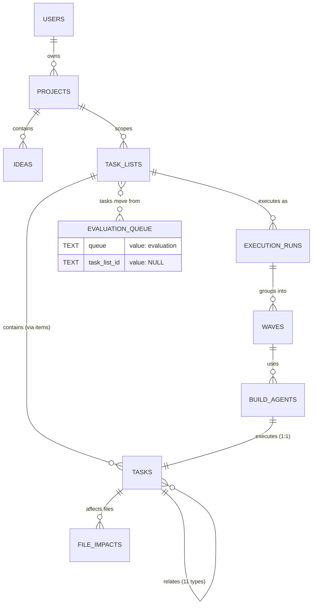
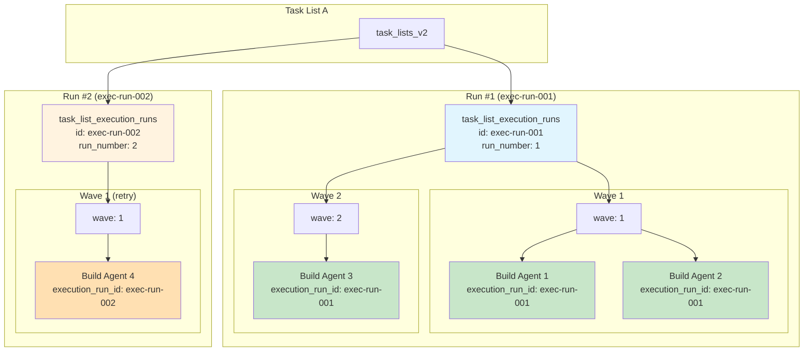
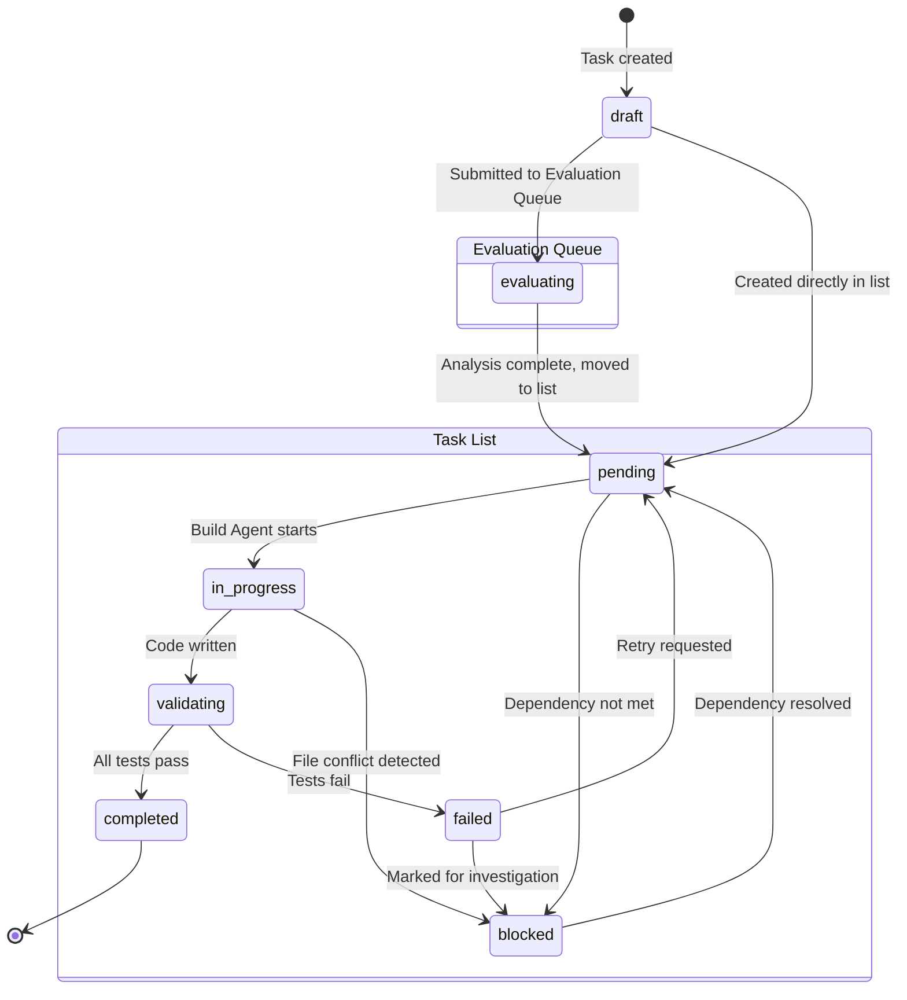
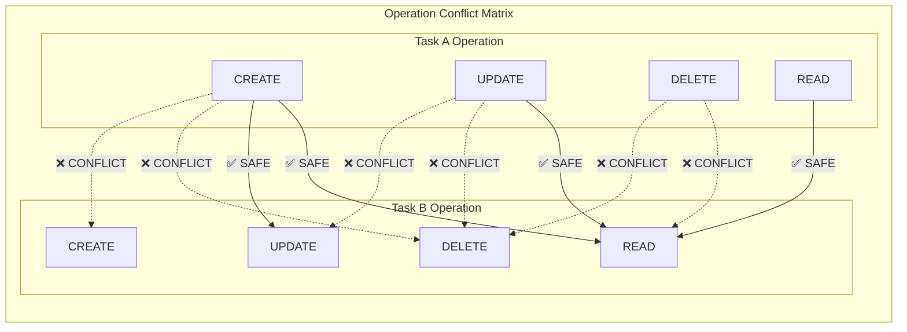
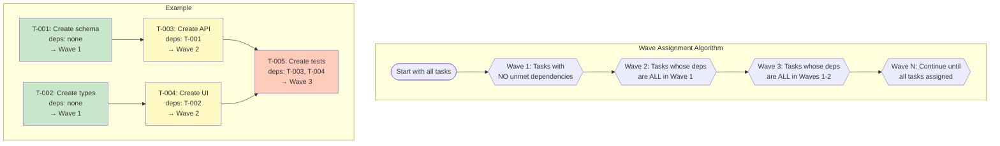

# Task Data Model - Complete ER Diagram

**Created:** 2026-01-13
**Purpose:** Visual representation of the complete Task Agent data model
**Related:** [task-data-model.md](./task-data-model.md)

---

## Complete Entity Relationship Diagram

```mermaid
erDiagram
    %% ============================================
    %% CORE ENTITIES
    %% ============================================

    users {
        TEXT id PK "UUID"
        TEXT slug UK "Short identifier"
        TEXT name "Display name"
        TEXT email
        TEXT telegram_chat_id "Linked Telegram"
        TEXT settings "JSON: preferences"
        TEXT created_at
        TEXT updated_at
    }

    projects {
        TEXT id PK "UUID"
        TEXT slug UK
        TEXT name
        TEXT description
        TEXT owner_id FK "users.id"
        TEXT status "active|paused|archived"
        TEXT created_at
        TEXT updated_at
    }

    ideas {
        TEXT id PK "UUID"
        TEXT slug
        TEXT project_id FK "projects.id"
        TEXT name
        TEXT description
        TEXT lifecycle_stage "spark|clarify|research|..."
        TEXT created_at
        TEXT updated_at
    }

    %% ============================================
    %% TASK CORE
    %% ============================================

    tasks {
        TEXT id PK "UUID"
        TEXT display_id UK "TU-PROJ-CAT-###"
        TEXT user_id FK "users.id"
        TEXT project_id FK "projects.id"
        TEXT idea_id FK "ideas.id"
        TEXT parent_task_id FK "tasks.id (subtasks)"
        TEXT queue "evaluation|NULL"
        TEXT task_list_id FK "task_lists_v2.id|NULL"
        TEXT title
        TEXT description
        TEXT category "feature|bug|task|..."
        TEXT status "draft|evaluating|pending|in_progress|..."
        TEXT risk_level "low|medium|high"
        TEXT priority "P1|P2|P3|P4"
        INTEGER priority_score "Computed"
        INTEGER blocks_count "Tasks blocked by this"
        INTEGER is_quick_win "1 if <1hr"
        TEXT deadline
        TEXT effort "trivial|small|medium|large|epic"
        TEXT owner "Build Agent|Human|Task Agent"
        TEXT assigned_agent FK "build_agent_instances.id"
        INTEGER phase "1-5: DB|Types|API|UI|Tests"
        TEXT acceptance_criteria "JSON array"
        TEXT codebase_tests "JSON array"
        TEXT api_tests "JSON array"
        TEXT ui_tests "JSON array"
        INTEGER actual_effort_minutes
        TEXT affected_files "JSON array"
        TEXT execution_log "JSON array"
        INTEGER version
        TEXT supersedes_task_id FK "tasks.id"
        BLOB embedding "Similarity search"
        TEXT embedding_model
        TEXT created_at
        TEXT updated_at
        TEXT started_at
        TEXT completed_at
    }

    task_lists_v2 {
        TEXT id PK "UUID"
        TEXT name
        TEXT description
        TEXT project_id FK "projects.id"
        TEXT user_id FK "users.id"
        TEXT status "draft|ready|in_progress|paused|completed|archived"
        INTEGER max_parallel_agents "Default 3"
        INTEGER auto_execute "1=start automatically"
        INTEGER total_tasks
        INTEGER completed_tasks
        INTEGER failed_tasks
        TEXT telegram_chat_id
        TEXT created_at
        TEXT updated_at
        TEXT started_at
        TEXT completed_at
    }

    task_list_items {
        TEXT id PK "UUID"
        TEXT task_list_id FK "task_lists_v2.id"
        TEXT task_id FK "tasks.id"
        INTEGER position "Order in list"
        TEXT item_status "pending|in_progress|completed|failed|skipped"
        TEXT started_at
        TEXT completed_at
        TEXT execution_notes
        TEXT added_at
    }

    %% ============================================
    %% TASK RELATIONSHIPS & METADATA
    %% ============================================

    task_relationships {
        TEXT id PK "UUID"
        TEXT source_task_id FK "tasks.id"
        TEXT target_task_id FK "tasks.id"
        TEXT relationship_type "depends_on|blocks|related_to|duplicate_of|subtask_of|supersedes|implements|conflicts_with|enables|inspired_by|tests"
        REAL strength "0-1 similarity"
        TEXT notes
        TEXT created_at
        TEXT created_by FK "users.id"
    }

    task_state_history {
        TEXT id PK "UUID"
        TEXT task_id FK "tasks.id"
        TEXT execution_run_id FK "task_list_execution_runs.id"
        TEXT from_status
        TEXT to_status
        TEXT reason
        TEXT changed_by "user_id or agent_id"
        TEXT changed_at
    }

    task_blocks {
        TEXT id PK "UUID"
        TEXT task_id FK "tasks.id"
        TEXT block_type "validation|dependency|manual|conflict"
        TEXT reason
        TEXT blocking_entity_id "task_id if dependency"
        TEXT resolved_at
        TEXT resolved_by
        TEXT resolution_notes
        TEXT created_at
    }

    task_test_results {
        TEXT id PK "UUID"
        TEXT task_id FK "tasks.id"
        TEXT task_list_id FK "task_lists_v2.id"
        TEXT execution_run_id FK "task_list_execution_runs.id"
        TEXT agent_id FK "build_agent_instances.id"
        TEXT test_level "codebase|api|ui"
        INTEGER test_index
        TEXT test_name
        TEXT status "passed|failed|skipped|error"
        TEXT output
        TEXT error
        INTEGER duration_ms
        TEXT executed_by
        TEXT executed_at
    }

    task_templates {
        TEXT id PK "UUID"
        TEXT name
        TEXT description
        TEXT category
        TEXT default_acceptance_criteria "JSON"
        TEXT default_codebase_tests "JSON"
        TEXT default_api_tests "JSON"
        TEXT default_ui_tests "JSON"
        TEXT default_affected_files "JSON"
        TEXT scope "global|project|user"
        TEXT scope_id "project_id or user_id"
        INTEGER usage_count
        TEXT created_by FK "users.id"
        TEXT created_at
        TEXT updated_at
    }

    %% ============================================
    %% EXECUTION LOG (Build Agent Handoff + SIA)
    %% ============================================

    task_execution_log {
        TEXT id PK "Execution ID = Lane Isolation"
        TEXT task_id FK "tasks.id"
        TEXT task_list_id FK "task_lists_v2.id"
        TEXT execution_run_id FK "task_list_execution_runs.id"
        TEXT agent_id FK "build_agent_instances.id"
        TEXT wave_id FK "parallel_execution_waves.id"
        TEXT started_at
        TEXT ended_at
        INTEGER duration_ms
        TEXT status "running|completed|failed|interrupted|cancelled"
        INTEGER attempt_number
        TEXT last_error
        TEXT files_modified "JSON array"
        TEXT git_commits "JSON array"
        TEXT log_content "LINE-BASED LOG for handoff"
        TEXT created_at
    }

    %% ============================================
    %% QUESTIONS (Human-in-the-Loop)
    %% ============================================

    questions {
        TEXT id PK "UUID"
        TEXT task_list_id FK "task_lists.id"
        TEXT task_id FK "tasks.id"
        TEXT question_type "validation|approval|duplicate_merge|decision"
        TEXT priority "critical|high|medium|low"
        TEXT question_text
        TEXT options "JSON array"
        TEXT telegram_message_id
        TEXT callback_data UK "Unique for buttons"
        TEXT status "pending|answered|expired|skipped"
        TEXT answer
        TEXT answered_at
        TEXT answered_by
        TEXT timeout_action
        TEXT expires_at
        TEXT created_at
    }

    validation_rules {
        TEXT id PK "UUID"
        TEXT name
        TEXT description
        TEXT rule_type "required_field|test_required|pattern_match|custom"
        TEXT category_filter "Comma-separated"
        TEXT config "JSON"
        TEXT severity "error|warning"
        INTEGER enabled
        TEXT created_at
    }

    %% ============================================
    %% FILE IMPACT & PARALLELISM
    %% ============================================

    task_file_impacts {
        TEXT id PK "UUID"
        TEXT task_id FK "tasks.id"
        TEXT file_path
        TEXT operation "CREATE|UPDATE|DELETE|READ"
        REAL confidence "0.0-1.0"
        TEXT source "ai_estimate|pattern_match|user_declared|validated"
        INTEGER was_accurate "Post-execution validation"
        TEXT validated_at
        TEXT created_at
        TEXT updated_at
    }

    parallelism_analysis {
        TEXT id PK "UUID"
        TEXT task_a_id FK "tasks.id"
        TEXT task_b_id FK "tasks.id"
        INTEGER can_parallel "1=safe to run together"
        TEXT conflict_type "dependency|file_conflict|resource_conflict"
        TEXT conflict_details "JSON"
        TEXT analyzed_at
        TEXT invalidated_at
    }

    %% ============================================
    %% EXECUTION RUNS (CRITICAL: Groups All Parallel Activity)
    %% ============================================

    task_list_execution_runs {
        TEXT id PK "Execution Run ID"
        TEXT task_list_id FK "task_lists_v2.id"
        INTEGER run_number "1, 2, 3... per list"
        TEXT status "pending|running|paused|completed|failed|cancelled"
        TEXT triggered_by "user|auto|retry|schedule"
        TEXT triggered_reason
        INTEGER tasks_total
        INTEGER tasks_completed
        INTEGER tasks_failed
        INTEGER tasks_skipped
        INTEGER tasks_blocked
        INTEGER waves_total
        INTEGER waves_completed
        INTEGER current_wave
        INTEGER agents_spawned
        INTEGER agents_active
        INTEGER max_parallel_reached "Peak concurrent"
        TEXT started_at
        TEXT completed_at
        INTEGER duration_ms
        TEXT failure_reason
        TEXT last_error
        TEXT created_at
        TEXT updated_at
    }

    parallel_execution_waves {
        TEXT id PK "UUID"
        TEXT task_list_id FK "task_lists_v2.id"
        TEXT execution_run_id FK "task_list_execution_runs.id"
        INTEGER wave_number "1, 2, 3..."
        TEXT status "pending|in_progress|completed|failed|skipped"
        INTEGER task_count
        INTEGER completed_count
        INTEGER failed_count
        INTEGER skipped_count
        TEXT started_at
        TEXT completed_at
        INTEGER duration_ms
        TEXT created_at
    }

    wave_task_assignments {
        TEXT id PK "UUID"
        TEXT wave_id FK "parallel_execution_waves.id"
        TEXT task_id FK "tasks.id"
        TEXT execution_run_id FK "task_list_execution_runs.id"
        INTEGER position
        TEXT task_status "pending|in_progress|completed|failed|skipped"
        TEXT assigned_at
        TEXT started_at
        TEXT completed_at
    }

    %% ============================================
    %% BUILD AGENTS
    %% ============================================

    build_agent_instances {
        TEXT id PK "UUID"
        TEXT execution_run_id FK "task_list_execution_runs.id"
        TEXT wave_id FK "parallel_execution_waves.id"
        TEXT task_id FK "tasks.id (1:1, unique)"
        TEXT task_list_id FK "task_lists_v2.id"
        TEXT process_id
        TEXT hostname
        TEXT working_directory
        TEXT status "spawning|idle|running|completing|terminated"
        TEXT last_heartbeat_at
        INTEGER heartbeat_count
        INTEGER consecutive_missed_heartbeats
        INTEGER tasks_completed
        INTEGER tasks_failed
        INTEGER total_duration_ms
        INTEGER progress_percent "0-100"
        TEXT current_step
        TEXT spawned_at
        TEXT terminated_at
        TEXT termination_reason
        TEXT error_message
    }

    agent_heartbeats {
        TEXT id PK "UUID"
        TEXT agent_id FK "build_agent_instances.id"
        TEXT execution_run_id FK "task_list_execution_runs.id"
        TEXT task_id FK "tasks.id"
        TEXT status
        INTEGER progress_percent "0-100"
        TEXT current_step
        INTEGER memory_mb
        REAL cpu_percent
        TEXT recorded_at
    }

    %% ============================================
    %% AUTO-GROUPING
    %% ============================================

    grouping_suggestions {
        TEXT id PK "UUID"
        TEXT status "pending|accepted|rejected|expired|modified"
        TEXT suggested_name
        TEXT suggested_tasks "JSON array of task IDs"
        TEXT grouping_reason
        REAL similarity_score
        TEXT project_id FK "projects.id"
        TEXT triggered_by "task_created|dependency_changed|manual"
        TEXT trigger_task_id FK "tasks.id"
        TEXT created_task_list_id FK "task_lists_v2.id"
        TEXT resolved_by "user|system"
        TEXT resolved_at
        TEXT expires_at
        TEXT created_at
    }

    grouping_criteria_weights {
        TEXT id PK "UUID"
        TEXT project_id FK "projects.id (unique)"
        REAL file_overlap_weight "Default 0.3"
        REAL dependency_weight "Default 0.25"
        REAL category_weight "Default 0.2"
        REAL description_similarity_weight "Default 0.15"
        REAL component_weight "Default 0.1"
        TEXT created_at
        TEXT updated_at
    }

    %% ============================================
    %% TASK AGENT INSTANCES
    %% ============================================

    task_agent_instances {
        TEXT id PK "UUID"
        TEXT task_list_id FK "task_lists_v2.id"
        INTEGER is_evaluation_queue "1=manages Evaluation Queue"
        TEXT telegram_channel_id
        TEXT telegram_bot_token
        TEXT status "active|paused|terminated"
        TEXT project_id FK "projects.id"
        TEXT last_heartbeat_at
        INTEGER error_count
        TEXT last_error
        INTEGER tasks_processed
        INTEGER suggestions_made
        INTEGER questions_asked
        TEXT created_at
        TEXT updated_at
        TEXT terminated_at
    }

    %% ============================================
    %% RELATIONSHIPS
    %% ============================================

    %% Core ownership
    users ||--o{ projects : "owns"
    users ||--o{ task_lists_v2 : "owns"
    users ||--o{ tasks : "creates"
    users ||--o{ task_templates : "creates"

    %% Project hierarchy
    projects ||--o{ ideas : "contains"
    projects ||--o{ task_lists_v2 : "scopes"
    projects ||--o{ tasks : "scopes"
    projects ||--o{ grouping_suggestions : "scopes"
    projects ||--|| grouping_criteria_weights : "has weights"
    projects ||--o{ task_agent_instances : "managed by"

    %% Ideas
    ideas ||--o{ tasks : "relates to"

    %% Tasks - Queue OR List (mutually exclusive)
    task_lists_v2 ||--o{ task_list_items : "contains"
    task_list_items }o--|| tasks : "links to"
    tasks ||--o{ tasks : "parent/subtask"
    tasks ||--o{ tasks : "supersedes"

    %% Task relationships (11 types)
    tasks ||--o{ task_relationships : "source"
    tasks ||--o{ task_relationships : "target"

    %% Task metadata
    tasks ||--o{ task_state_history : "has history"
    tasks ||--o{ task_blocks : "can be blocked"
    tasks ||--o{ task_test_results : "has test results"
    tasks ||--o{ task_file_impacts : "has file impacts"
    tasks ||--o{ task_execution_log : "has execution log"

    %% Parallelism analysis (task pairs)
    tasks ||--o{ parallelism_analysis : "task_a"
    tasks ||--o{ parallelism_analysis : "task_b"

    %% Execution Runs (CRITICAL: groups all parallel activity)
    task_lists_v2 ||--o{ task_list_execution_runs : "has runs"
    task_list_execution_runs ||--o{ parallel_execution_waves : "has waves"
    task_list_execution_runs ||--o{ wave_task_assignments : "has assignments"
    task_list_execution_runs ||--o{ build_agent_instances : "spawns agents"
    task_list_execution_runs ||--o{ agent_heartbeats : "receives heartbeats"
    task_list_execution_runs ||--o{ task_state_history : "tracks changes"
    task_list_execution_runs ||--o{ task_test_results : "records results"
    task_list_execution_runs ||--o{ task_execution_log : "captures logs"

    %% Waves
    parallel_execution_waves ||--o{ wave_task_assignments : "assigns tasks"
    parallel_execution_waves ||--o{ build_agent_instances : "uses agents"
    parallel_execution_waves ||--o{ task_execution_log : "tracks execution"

    %% Wave assignments
    wave_task_assignments }o--|| tasks : "executes"

    %% Build Agents (1 agent = 1 task)
    build_agent_instances ||--|| tasks : "executes (1:1)"
    build_agent_instances ||--o{ agent_heartbeats : "sends"
    build_agent_instances ||--o{ task_execution_log : "writes"
    build_agent_instances ||--o{ task_test_results : "runs tests"

    %% Questions
    task_lists_v2 ||--o{ questions : "generates"
    tasks ||--o{ questions : "relates to"

    %% Grouping suggestions
    grouping_suggestions }o--|| tasks : "triggered by"
    grouping_suggestions }o--|| task_lists_v2 : "creates"

    %% Task Agent instances
    task_agent_instances }o--|| task_lists_v2 : "manages"
```

---

## Simplified High-Level View



---

## Execution Run Isolation (Lane Concept)



---

## Task Lifecycle State Machine



---

## File Conflict Matrix



---

## Wave Calculation Algorithm



---

## Table Categories Summary

| Category | Tables | Purpose |
|----------|--------|---------|
| **Core Entities** | `users`, `projects`, `ideas` | Ownership and organization |
| **Task Core** | `tasks`, `task_lists_v2`, `task_list_items` | Task storage and grouping |
| **Task Metadata** | `task_relationships`, `task_state_history`, `task_blocks`, `task_templates` | Task details and history |
| **Testing** | `task_test_results`, `validation_rules` | Quality validation |
| **Execution Log** | `task_execution_log` | Build Agent handoff + SIA analysis |
| **Questions** | `questions` | Human-in-the-loop |
| **File Analysis** | `task_file_impacts`, `parallelism_analysis` | Conflict detection |
| **Execution Runs** | `task_list_execution_runs`, `parallel_execution_waves`, `wave_task_assignments` | Run isolation and waves |
| **Build Agents** | `build_agent_instances`, `agent_heartbeats` | Worker management |
| **Auto-Grouping** | `grouping_suggestions`, `grouping_criteria_weights` | Intelligent grouping |
| **Task Agent** | `task_agent_instances` | Orchestrator management |

---

## Key Design Principles

1. **`execution_run_id` = Lane Isolation**
   - ALL parallel activity is scoped to one execution run
   - Multiple runs can exist for the same task list
   - No cross-lane interference

2. **Queue vs List (Mutually Exclusive)**
   - `queue = 'evaluation'` AND `task_list_id = NULL` → Evaluation Queue
   - `queue = NULL` AND `task_list_id = ?` → In a Task List

3. **1 Build Agent = 1 Task**
   - Simple failure isolation
   - Unlimited parallelism (within file conflicts)

4. **11 Relationship Types**
   - `depends_on`, `blocks`, `related_to`, `duplicate_of`, `subtask_of`
   - `supersedes`, `implements`, `conflicts_with`, `enables`, `inspired_by`, `tests`

5. **Three-Level Testing**
   - Codebase (tsc, lint, unit)
   - API (HTTP endpoints)
   - UI (Puppeteer)

---

*This diagram represents the complete Task Agent data model as of 2026-01-13.*
