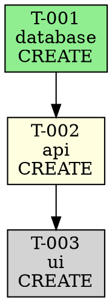

# Build Agent Task Dependency Resolution

## Overview

The Build Agent's Task Executor implements robust dependency resolution to ensure tasks are executed in the correct order based on their dependencies. This document describes the implementation, features, and usage.

## Features

### 1. Topological Sort
Tasks are automatically ordered based on their dependency graph using a depth-first search algorithm. Tasks with no dependencies are executed first, followed by dependent tasks once their dependencies complete.

**Example:**
```typescript
const tasks = [
  { id: 'T-003', dependsOn: ['T-002'] },
  { id: 'T-001', dependsOn: [] },
  { id: 'T-002', dependsOn: ['T-001'] }
];

// Executor automatically orders as: T-001 → T-002 → T-003
```

### 2. Circular Dependency Detection
The executor detects circular dependencies and throws an error before execution begins, preventing infinite loops.

**Example:**
```typescript
const tasks = [
  { id: 'T-001', dependsOn: ['T-002'] },
  { id: 'T-002', dependsOn: ['T-001'] }
];

// Throws: "Circular dependency detected: T-001 -> T-002 -> T-001"
```

### 3. Dependency State Validation
Before executing a task, the executor verifies that all dependencies have completed successfully (status = 'done'). Tasks with failed dependencies are automatically skipped.

**Example:**
```typescript
// If T-001 fails, T-002 is skipped
const tasks = [
  { id: 'T-001', dependsOn: [] },  // fails
  { id: 'T-002', dependsOn: ['T-001'] }  // skipped
];

// Result for T-002:
// {
//   state: 'skipped',
//   error: 'Dependencies not satisfied: T-001 (failed)'
// }
```

### 4. Detailed Error Messages
When tasks are skipped due to dependency failures, the executor provides detailed information about which dependencies failed and their current state.

### 5. Dependency Graph Validation
The `validateDependencyGraph()` method performs pre-execution validation to catch common errors:

- **Missing dependencies**: Task depends on non-existent task
- **Self-dependencies**: Task depends on itself
- **Circular dependencies**: Cycle in dependency graph

**Usage:**
```typescript
const executor = createTaskExecutor();
const errors = executor.validateDependencyGraph(tasks);

if (errors.length > 0) {
  console.error('Dependency graph errors:', errors);
  // Handle errors before execution
}
```

### 6. Dependency Graph Visualization
Generate a DOT format visualization of the task dependency graph, including current task states.

**Usage:**
```typescript
const executor = createTaskExecutor();
const dotGraph = executor.visualizeDependencyGraph(tasks);

// Save to file for visualization with Graphviz
fs.writeFileSync('task-graph.dot', dotGraph);
// Then run: dot -Tpng task-graph.dot -o task-graph.png
```

**Output example:**


**State Colors:**
- `pending`: lightgray
- `running`: lightyellow
- `done`: lightgreen
- `failed`: lightcoral
- `blocked`: orange
- `skipped`: lightblue

## Implementation Details

### Task Structure
Tasks must include a `dependsOn` field listing their dependencies:

```typescript
interface AtomicTask {
  id: string;
  phase: string;
  action: 'CREATE' | 'UPDATE' | 'DELETE';
  file: string;
  status: string;
  requirements: string[];
  gotchas: string[];
  validation: {
    command: string;
    expected: string;
  };
  codeTemplate?: string;
  dependsOn: string[];  // List of task IDs this task depends on
}
```

### Execution Flow

1. **Load Tasks**: Parse tasks from `build/tasks.md`
2. **Validate Graph**: Check for circular dependencies, missing dependencies, etc.
3. **Topological Sort**: Order tasks by dependencies
4. **Execute in Order**: For each task:
   - Check if dependencies are satisfied
   - If not, skip task with detailed error
   - If yes, execute task
   - Track task state (pending → running → done/failed)
5. **Return Results**: Execution results for all tasks

### Dependency Resolution Algorithm

```typescript
private orderByDependency(tasks: AtomicTask[]): AtomicTask[] {
  const taskMap = new Map(tasks.map(t => [t.id, t]));
  const visited = new Set<string>();
  const visiting = new Set<string>();
  const result: AtomicTask[] = [];

  const visit = (taskId: string, path: string[] = []) => {
    if (visited.has(taskId)) return;

    if (visiting.has(taskId)) {
      // Circular dependency detected
      const cycle = [...path, taskId].slice(path.indexOf(taskId));
      throw new Error(`Circular dependency detected: ${cycle.join(' -> ')}`);
    }

    visiting.add(taskId);
    path.push(taskId);

    const task = taskMap.get(taskId);
    if (task) {
      for (const depId of task.dependsOn) {
        visit(depId, [...path]);
      }
      result.push(task);
    }

    visiting.delete(taskId);
    visited.add(taskId);
    path.pop();
  };

  for (const task of tasks) {
    visit(task.id);
  }

  return result;
}
```

## Usage Examples

### Basic Usage

```typescript
import { createTaskExecutor } from './agents/build/task-executor';

const executor = createTaskExecutor({
  maxRetries: 3,
  onProgress: (progress) => {
    console.log(`Progress: ${progress.completed}/${progress.total}`);
  }
});

const tasks: AtomicTask[] = [
  {
    id: 'T-001',
    phase: 'database',
    action: 'CREATE',
    file: 'database/migrations/001.sql',
    dependsOn: [],
    // ... other fields
  },
  {
    id: 'T-002',
    phase: 'api',
    action: 'CREATE',
    file: 'server/routes/users.ts',
    dependsOn: ['T-001'],  // Depends on database migration
    // ... other fields
  }
];

// Validate before execution
const errors = executor.validateDependencyGraph(tasks);
if (errors.length > 0) {
  console.error('Validation errors:', errors);
  process.exit(1);
}

// Execute tasks
const results = await executor.execute(tasks, '/path/to/spec.md');

// Check results
for (const result of results) {
  console.log(`Task ${result.taskId}: ${result.state}`);
  if (result.error) {
    console.error(`  Error: ${result.error}`);
  }
}
```

### Complex Dependency Chain

```typescript
// Diamond dependency pattern
const tasks = [
  { id: 'T-001', dependsOn: [] },           // Database schema
  { id: 'T-002', dependsOn: ['T-001'] },    // User model
  { id: 'T-003', dependsOn: ['T-001'] },    // Post model
  { id: 'T-004', dependsOn: ['T-002', 'T-003'] }  // Join query
];

// Execution order: T-001 → (T-002, T-003 in parallel) → T-004
```

### With Visualization

```typescript
const executor = createTaskExecutor();

// Before execution
const dotBefore = executor.visualizeDependencyGraph(tasks);
fs.writeFileSync('task-graph-before.dot', dotBefore);

// Execute tasks
await executor.execute(tasks, specPath);

// After execution (shows task states)
const dotAfter = executor.visualizeDependencyGraph(tasks);
fs.writeFileSync('task-graph-after.dot', dotAfter);
```

## Error Handling

### Missing Dependency
```typescript
// Task T-002 depends on non-existent T-999
const errors = executor.validateDependencyGraph(tasks);
// errors[0]: "Task T-002 depends on non-existent task T-999"
```

### Failed Dependency
```typescript
// During execution, if T-001 fails:
const results = await executor.execute(tasks, specPath);
// results for T-002:
// {
//   taskId: 'T-002',
//   state: 'skipped',
//   error: 'Dependencies not satisfied: T-001 (failed)'
// }
```

### Circular Dependency
```typescript
// Detected during ordering, before execution
try {
  await executor.execute(tasks, specPath);
} catch (error) {
  // Error: "Circular dependency detected: T-001 -> T-002 -> T-001"
}
```

## Best Practices

1. **Validate Early**: Always call `validateDependencyGraph()` before execution to catch errors early
2. **Phase-Based Dependencies**: Structure tasks by phase (database → types → api → ui → tests)
3. **Minimize Dependencies**: Only add dependencies when truly needed to maximize parallelism
4. **Descriptive Task IDs**: Use clear IDs that indicate the task's purpose (e.g., `DB-001`, `API-002`)
5. **Visualize Complex Graphs**: For large task sets, generate dependency visualizations to verify correctness

## Testing

The dependency resolution system is thoroughly tested in `tests/build-agent/task-executor.test.ts`:

- ✅ Basic dependency ordering
- ✅ Circular dependency detection
- ✅ Complex dependency chains (diamond patterns)
- ✅ Missing dependency validation
- ✅ Self-dependency detection
- ✅ Failed dependency handling
- ✅ Detailed error messages
- ✅ Dependency graph visualization

Run tests:
```bash
npm test tests/build-agent/task-executor.test.ts
```

## Related Documentation

- [Build Agent Specification](./build-agent-spec.md)
- [Atomic Task Format](./atomic-task-format.md)
- [CLAUDE.md - Atomic Task Conventions](../CLAUDE.md#atomic-task-conventions)
