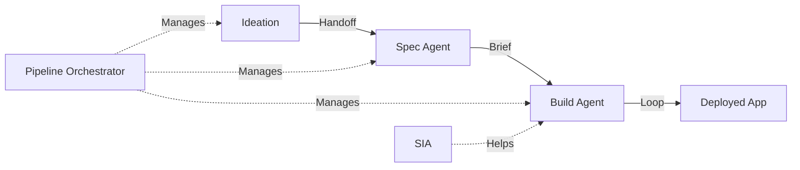

# Vibe Platform: Implementation Guide

> **Purpose:** Comprehensive roadmap to complete the Vibe platform
> **Created:** February 6, 2026
> **Status:** Active Implementation
> **Completion Estimate:** 2-3 weeks to functional E2E MVP

---

## Executive Summary

Vibe is **~55% complete** for end-to-end functionality. Individual components (ideation, evaluation, spec agent, build agent) are 60-90% complete, but the **integration layer connecting them is the critical gap**.

### Current State

| Component | Completion | Status |
|-----------|------------|--------|
| Ideation Agent | 90% | ✅ Functional, minor polish |
| Evaluation Pipeline | 85% | ✅ Fixed, working |
| Spec Agent | 70% | ⚠️ Core exists, not wired |
| Build Agent | 60% | ⚠️ Task execution works, loop incomplete |
| Pipeline Orchestrator | 20% | 🔴 Critical gap |
| SIA (Self-Improvement) | 40% | ⚠️ Exists but not integrated |
| Frontend UI | 75% | ⚠️ Disjointed components |
| Network Pillar | 0% | 🔴 Not started |

### Critical Path to MVP



**The missing piece:** A Pipeline Orchestrator that manages automatic handoffs between phases.

---

## Guide Structure

This implementation guide is split into focused documents:

| Document | Focus | Priority |
|----------|-------|----------|
| [01-UI-ARCHITECTURE.md](./01-UI-ARCHITECTURE.md) | Cohesive UI design, chat-as-left-panel | High |
| [02-PIPELINE-ORCHESTRATION.md](./02-PIPELINE-ORCHESTRATION.md) | Phase handoffs and orchestration | **Critical** |
| [03-SPEC-AGENT-COMPLETION.md](./03-SPEC-AGENT-COMPLETION.md) | Finishing the spec agent | High |
| [04-BUILD-AGENT-LOOP.md](./04-BUILD-AGENT-LOOP.md) | Build agent Ralph loop | High |
| [05-SIA-INTEGRATION.md](./05-SIA-INTEGRATION.md) | Self-improvement agent wiring | Medium |
| [06-TESTING-CRITERIA.md](./06-TESTING-CRITERIA.md) | Verification tests per task | **Critical** |
| [07-NETWORK-PILLAR.md](./07-NETWORK-PILLAR.md) | Future: Collaboration features | Deferred |

---

## Core Principles

### 1. Simplicity Over Complexity

- **Fewer moving parts** = easier debugging
- **Explicit handoffs** > magic orchestration
- **User visibility** into what's happening
- **Progressive disclosure** in UI

### 2. Depth Over Breadth

- **Complete one flow** before adding features
- **Test every integration point**
- **Document decisions** as you go

### 3. UI Cohesion

The current UI has disjointed components. The vision:

```
┌────────────────────────────────────────────────────────┐
│                    Fixed Header                         │
├──────────────┬─────────────────────────────────────────┤
│              │                                          │
│   Chat &     │         Main Content Area               │
│   Context    │    (Memory Graph / Artifacts /          │
│   Panel      │     Evaluation / Build Status)          │
│              │                                          │
│   - Session  │                                          │
│   - History  │                                          │
│   - Context  │                                          │
│              │                                          │
└──────────────┴─────────────────────────────────────────┘
```

**Key insight:** The chat is the primary interaction method. It should be persistent, not hidden.

---

## What "Done" Looks Like

### Minimum Viable Product (MVP)

A user can:

1. ✅ Start ideation conversation ("What makes you tick?")
2. ✅ Answer questions, develop idea through chat
3. 🔴 **Trigger transition to spec phase** (missing)
4. ⚠️ Have spec agent extract requirements
5. 🔴 **Trigger transition to build phase** (missing)
6. ⚠️ Watch build agent create tasks and execute
7. 🔴 **Get deployed app** (hosting not wired)

### Success Criteria

| Criterion | Metric |
|-----------|--------|
| E2E completion rate | >30% of started sessions reach deployed app |
| Phase transition success | >90% automatic handoffs work |
| Build agent success rate | >70% of tasks complete without SIA |
| Time to first deployed app | <2 hours from start |

---

## Implementation Order

### Week 1: Pipeline Foundation

1. **Pipeline Orchestrator core** (02-PIPELINE-ORCHESTRATION.md)
   - State machine for idea lifecycle
   - Automatic handoff triggers
   - Manual override capability

2. **Spec Agent wiring** (03-SPEC-AGENT-COMPLETION.md)
   - Connect to ideation output
   - Brief generation
   - Handoff to build

### Week 2: Build Loop & UI

3. **Build Agent loop** (04-BUILD-AGENT-LOOP.md)
   - Task list generation from spec
   - Execution loop with checkpoints
   - SIA integration points

4. **UI cohesion** (01-UI-ARCHITECTURE.md)
   - Chat-as-left-panel implementation
   - Phase context persistence
   - Progress visibility

### Week 3: Polish & Testing

5. **SIA integration** (05-SIA-INTEGRATION.md)
   - Failure detection
   - Intervention triggers
   - Success tracking

6. **Testing suite** (06-TESTING-CRITERIA.md)
   - E2E journey tests
   - Phase transition tests
   - Agent-specific tests

---

## Quick Reference: Key Files

### Backend

| File | Purpose |
|------|---------|
| `agents/ideation/orchestrator.ts` | Ideation conversation loop |
| `agents/specification/core.ts` | Spec generation |
| `agents/build/core.ts` | Build task execution |
| `agents/sia/` | Self-improvement agent |
| `server/routes/` | API endpoints |

### Frontend

| File | Purpose |
|------|---------|
| `frontend/src/pages/IdeaDetailPhased.tsx` | Main idea detail view |
| `frontend/src/components/ideation/` | Chat components |
| `frontend/src/components/graph/` | Memory graph visualization |
| `frontend/src/pages/IdeationPage.tsx` | Ideation session page |

### Database

| Table | Purpose |
|-------|---------|
| `idea_sessions` | Ideation conversations |
| `spec_sessions` | Specification sessions |
| `build_sessions` | Build execution state |
| `task_definitions` | Generated tasks |
| `task_executions` | Execution history |

---

## Getting Started

1. **Read this document** (you're here)
2. **Read [02-PIPELINE-ORCHESTRATION.md](./02-PIPELINE-ORCHESTRATION.md)** — this is the critical gap
3. **Start implementation** with the Pipeline Orchestrator
4. **Use [06-TESTING-CRITERIA.md](./06-TESTING-CRITERIA.md)** to verify each task

---

## Open Questions

These need decisions before implementation:

1. **Hosting strategy:** Railway vs Render vs custom?
2. **Build agent model:** Claude vs GPT-4 vs local?
3. **SIA trigger threshold:** How many failures before intervention?
4. **Network pillar priority:** Build now or defer completely?

---

*This is a living document. Update as implementation progresses.*
