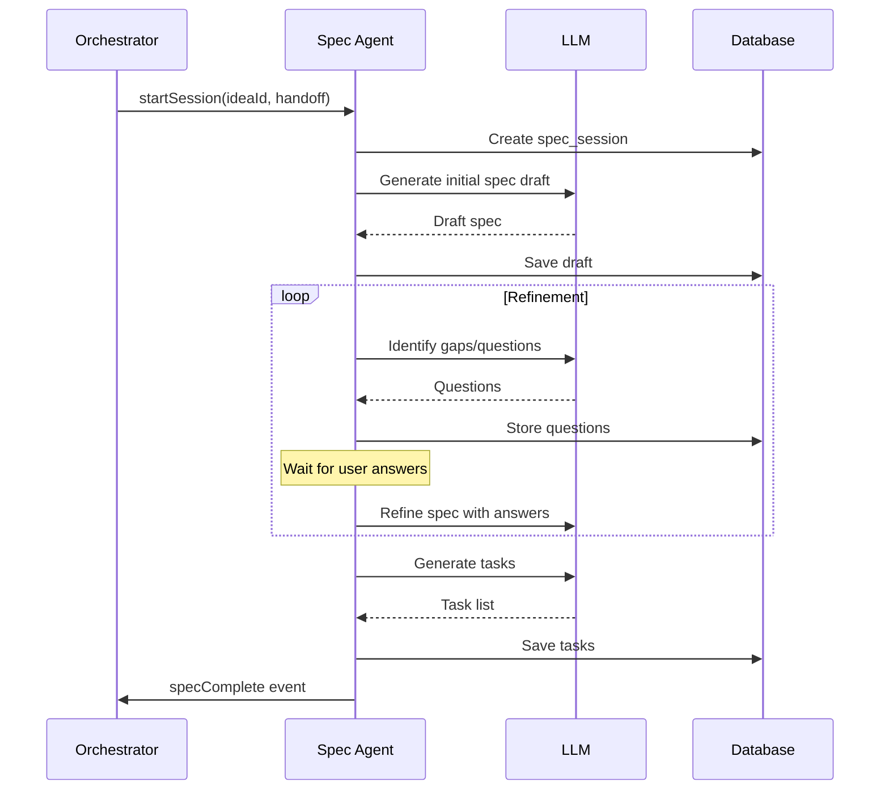

# Spec Agent Completion Guide

> **Status:** ⚠️ 70% Complete — Core exists, needs wiring
> **Priority:** High
> **Estimated Effort:** 3-5 days

---

## Current State Analysis

### What Exists

```
agents/specification/
├── brief-parser.ts      ✅ Parses ideation brief
├── claude-client.ts     ✅ LLM integration
├── context-loader.ts    ✅ Loads idea context
├── core.ts              ⚠️ Main logic, needs updates
├── gotcha-injector.ts   ✅ Edge case detection
├── prompts/             ✅ System prompts
├── question-generator.ts ✅ Generates clarifying questions
├── task-generator.ts    ✅ Generates tasks from spec
└── template-renderer.ts ✅ Renders spec templates
```

### What's Missing

1. **Session management** — No persistent spec sessions
2. **Pipeline integration** — Not wired to orchestrator
3. **Frontend integration** — No UI for spec phase
4. **Handoff consumption** — Doesn't use ideation handoff
5. **Progress tracking** — No progress reporting

---

## Part 1: Architecture Overview

### Spec Agent Flow



### Key Interfaces

```typescript
// types/specification.ts

export interface SpecSession {
  id: string;
  ideaId: string;
  status: "active" | "pending_input" | "complete" | "failed";

  // Specification content
  currentDraft: Specification | null;
  draftVersion: number;

  // Questions and refinement
  pendingQuestions: SpecQuestion[];
  answeredQuestions: SpecAnswer[];

  // Generated output
  tasks: TaskDefinition[];

  // Metadata
  createdAt: Date;
  updatedAt: Date;
}

export interface Specification {
  version: string;

  // Overview
  overview: {
    name: string;
    description: string;
    problemStatement: string;
    targetUsers: string[];
  };

  // Features
  features: Feature[];

  // Technical
  dataModel: DataModel;
  apiEndpoints: APIEndpoint[];
  uiComponents: UIComponent[];

  // Non-functional
  constraints: Constraint[];
  assumptions: string[];

  // Metadata
  generatedFrom: string; // ideation handoff ID
  confidence: number;
}

export interface Feature {
  id: string;
  name: string;
  description: string;
  priority: "must-have" | "should-have" | "nice-to-have";
  acceptanceCriteria: string[];
  technicalNotes?: string;
  estimatedComplexity: "low" | "medium" | "high";
}

export interface TaskDefinition {
  id: string;
  specId: string;
  featureId: string;

  name: string;
  description: string;
  type: "setup" | "database" | "api" | "ui" | "integration" | "test";

  dependencies: string[]; // Task IDs
  estimatedMinutes: number;

  // For build agent
  technicalDetails: string;
  testCriteria: string[];
}
```

---

## Part 2: Core Implementation

### 2.1 Spec Agent Core

**File:** `agents/specification/core.ts` (update existing)

```typescript
import { EventEmitter } from "events";
import { IdeationToSpecHandoff } from "../pipeline/handoffs";

export class SpecAgent extends EventEmitter {
  constructor(
    private llm: LLMClient,
    private db: Database,
    private briefParser: BriefParser,
    private questionGenerator: QuestionGenerator,
    private taskGenerator: TaskGenerator,
  ) {
    super();
  }

  /**
   * Start a new specification session
   */
  async startSession(
    ideaId: string,
    handoff: IdeationToSpecHandoff,
  ): Promise<SpecSession> {
    // Create session
    const session = await this.db.specSessions.create({
      data: {
        ideaId,
        status: "active",
        handoffData: JSON.stringify(handoff),
      },
    });

    // Generate initial spec draft
    const draft = await this.generateInitialDraft(handoff);

    // Identify gaps and questions
    const questions = await this.identifyGaps(draft, handoff);

    // Update session
    await this.db.specSessions.update({
      where: { id: session.id },
      data: {
        currentDraft: JSON.stringify(draft),
        pendingQuestions: JSON.stringify(questions),
        status: questions.length > 0 ? "pending_input" : "active",
      },
    });

    // Emit event
    this.emit("sessionStarted", {
      sessionId: session.id,
      ideaId,
      questionCount: questions.length,
    });

    return this.loadSession(session.id);
  }

  /**
   * Generate initial specification draft from handoff
   */
  private async generateInitialDraft(
    handoff: IdeationToSpecHandoff,
  ): Promise<Specification> {
    const prompt = this.buildDraftPrompt(handoff);

    const response = await this.llm.complete({
      model: "claude-sonnet-4-20250514",
      messages: [
        { role: "system", content: SPEC_SYSTEM_PROMPT },
        { role: "user", content: prompt },
      ],
      responseFormat: { type: "json_object" },
    });

    const spec = this.parseSpecResponse(response);

    // Inject gotchas (edge cases the user might not have considered)
    const enrichedSpec = await this.gotchaInjector.inject(spec, handoff);

    return enrichedSpec;
  }

  /**
   * Identify gaps in the specification that need user input
   */
  private async identifyGaps(
    draft: Specification,
    handoff: IdeationToSpecHandoff,
  ): Promise<SpecQuestion[]> {
    // Use question generator to find ambiguities
    const questions = await this.questionGenerator.generateForSpec(draft);

    // Filter out questions already answered in ideation
    const unanswered = questions.filter(
      (q) => !this.isAnsweredInHandoff(q, handoff),
    );

    // Prioritize questions
    return this.prioritizeQuestions(unanswered);
  }

  /**
   * Process user answer to a question
   */
  async answerQuestion(
    sessionId: string,
    questionId: string,
    answer: string,
  ): Promise<{ updated: boolean; remainingQuestions: number }> {
    const session = await this.loadSession(sessionId);

    // Find and update question
    const question = session.pendingQuestions.find((q) => q.id === questionId);
    if (!question) {
      throw new Error("Question not found");
    }

    // Move to answered
    session.answeredQuestions.push({
      ...question,
      answer,
      answeredAt: new Date(),
    });
    session.pendingQuestions = session.pendingQuestions.filter(
      (q) => q.id !== questionId,
    );

    // Refine spec with new answer
    const refinedDraft = await this.refineSpecWithAnswer(
      session.currentDraft!,
      question,
      answer,
    );

    session.currentDraft = refinedDraft;
    session.draftVersion++;

    // Check if more questions needed
    if (session.pendingQuestions.length === 0) {
      // Check for new gaps after refinement
      const newQuestions = await this.identifyGaps(
        refinedDraft,
        session.handoff,
      );

      if (newQuestions.length > 0) {
        session.pendingQuestions = newQuestions;
      } else {
        session.status = "active";
      }
    }

    await this.saveSession(session);

    return {
      updated: true,
      remainingQuestions: session.pendingQuestions.length,
    };
  }

  /**
   * Finalize specification and generate tasks
   */
  async finalize(sessionId: string): Promise<{
    spec: Specification;
    tasks: TaskDefinition[];
  }> {
    const session = await this.loadSession(sessionId);

    if (session.pendingQuestions.length > 0) {
      throw new Error(
        `Cannot finalize: ${session.pendingQuestions.length} questions pending`,
      );
    }

    // Final spec refinement
    const finalSpec = await this.finalizeSpec(session.currentDraft!);

    // Generate tasks
    const tasks = await this.taskGenerator.generateFromSpec(finalSpec);

    // Update session
    session.currentDraft = finalSpec;
    session.tasks = tasks;
    session.status = "complete";
    await this.saveSession(session);

    // Emit completion event
    this.emit("specComplete", {
      sessionId,
      ideaId: session.ideaId,
      taskCount: tasks.length,
    });

    return { spec: finalSpec, tasks };
  }

  /**
   * Handle chat message during spec session
   */
  async chat(
    sessionId: string,
    message: string,
  ): Promise<{ response: string; updatedSpec?: boolean }> {
    const session = await this.loadSession(sessionId);

    // Determine intent
    const intent = await this.classifyIntent(message, session);

    switch (intent.type) {
      case "question_answer":
        // Message is answering a pending question
        const result = await this.answerQuestion(
          sessionId,
          intent.questionId!,
          message,
        );
        return {
          response: this.formatQuestionResponse(result, session),
          updatedSpec: true,
        };

      case "spec_feedback":
        // User has feedback on the spec
        const refined = await this.incorporateFeedback(session, message);
        return {
          response: `I've updated the specification based on your feedback. ${refined.changes.join(", ")}`,
          updatedSpec: true,
        };

      case "clarification":
        // User is asking about something
        return {
          response: await this.answerClarification(session, message),
          updatedSpec: false,
        };

      default:
        return {
          response: "I'm not sure what you mean. Could you clarify?",
          updatedSpec: false,
        };
    }
  }
}
```

### 2.2 Session Manager

**File:** `agents/specification/session-manager.ts` (new)

```typescript
export class SpecSessionManager {
  constructor(private db: Database) {}

  async createSession(ideaId: string): Promise<SpecSession> {
    return this.db.specSessions.create({
      data: {
        ideaId,
        status: "active",
        draftVersion: 0,
      },
    });
  }

  async loadSession(sessionId: string): Promise<SpecSession | null> {
    const row = await this.db.specSessions.findUnique({
      where: { id: sessionId },
    });

    if (!row) return null;

    return {
      ...row,
      currentDraft: row.currentDraft ? JSON.parse(row.currentDraft) : null,
      pendingQuestions: row.pendingQuestions
        ? JSON.parse(row.pendingQuestions)
        : [],
      answeredQuestions: row.answeredQuestions
        ? JSON.parse(row.answeredQuestions)
        : [],
      tasks: row.tasks ? JSON.parse(row.tasks) : [],
    };
  }

  async loadByIdeaId(ideaId: string): Promise<SpecSession | null> {
    const row = await this.db.specSessions.findFirst({
      where: { ideaId },
      orderBy: { createdAt: "desc" },
    });

    return row ? this.loadSession(row.id) : null;
  }

  async saveSession(session: SpecSession): Promise<void> {
    await this.db.specSessions.update({
      where: { id: session.id },
      data: {
        status: session.status,
        currentDraft: JSON.stringify(session.currentDraft),
        draftVersion: session.draftVersion,
        pendingQuestions: JSON.stringify(session.pendingQuestions),
        answeredQuestions: JSON.stringify(session.answeredQuestions),
        tasks: JSON.stringify(session.tasks),
        updatedAt: new Date(),
      },
    });
  }
}
```

---

## Part 3: API Integration

### 3.1 Spec Routes

**File:** `server/routes/specification.ts` (new)

```typescript
import { Router } from "express";
import { specAgent } from "../agents/specification";

const router = Router();

/**
 * POST /api/specification/:ideaId/start
 * Start a new spec session
 */
router.post("/:ideaId/start", async (req, res) => {
  const { ideaId } = req.params;

  try {
    // Get handoff from orchestrator
    const handoff = await prepareIdeationHandoff(ideaId);

    // Start session
    const session = await specAgent.startSession(ideaId, handoff);

    res.json({
      sessionId: session.id,
      status: session.status,
      draft: session.currentDraft,
      questions: session.pendingQuestions,
    });
  } catch (error) {
    res.status(500).json({ error: "Failed to start spec session" });
  }
});

/**
 * GET /api/specification/:ideaId/session
 * Get current spec session
 */
router.get("/:ideaId/session", async (req, res) => {
  const { ideaId } = req.params;

  const session = await specAgent.getSessionByIdeaId(ideaId);

  if (!session) {
    return res.status(404).json({ error: "No spec session found" });
  }

  res.json({
    sessionId: session.id,
    status: session.status,
    draft: session.currentDraft,
    questions: session.pendingQuestions,
    taskCount: session.tasks.length,
  });
});

/**
 * POST /api/specification/:sessionId/answer
 * Answer a pending question
 */
router.post("/:sessionId/answer", async (req, res) => {
  const { sessionId } = req.params;
  const { questionId, answer } = req.body;

  try {
    const result = await specAgent.answerQuestion(
      sessionId,
      questionId,
      answer,
    );
    const session = await specAgent.loadSession(sessionId);

    res.json({
      success: true,
      remainingQuestions: result.remainingQuestions,
      updatedDraft: session?.currentDraft,
    });
  } catch (error) {
    res.status(400).json({ error: (error as Error).message });
  }
});

/**
 * POST /api/specification/:sessionId/chat
 * Send a chat message
 */
router.post("/:sessionId/chat", async (req, res) => {
  const { sessionId } = req.params;
  const { message } = req.body;

  try {
    const result = await specAgent.chat(sessionId, message);
    res.json(result);
  } catch (error) {
    res.status(500).json({ error: "Chat failed" });
  }
});

/**
 * POST /api/specification/:sessionId/finalize
 * Finalize spec and generate tasks
 */
router.post("/:sessionId/finalize", async (req, res) => {
  const { sessionId } = req.params;

  try {
    const result = await specAgent.finalize(sessionId);
    res.json({
      spec: result.spec,
      taskCount: result.tasks.length,
      tasks: result.tasks,
    });
  } catch (error) {
    res.status(400).json({ error: (error as Error).message });
  }
});

export default router;
```

---

## Part 4: Frontend Components

### 4.1 Spec Session View

**File:** `frontend/src/components/SpecificationView.tsx` (new)

```tsx
interface SpecificationViewProps {
  ideaId: string;
}

export function SpecificationView({ ideaId }: SpecificationViewProps) {
  const { session, loading, error, answerQuestion, finalizeSpec } =
    useSpecSession(ideaId);
  const [activeTab, setActiveTab] = useState<
    "overview" | "features" | "technical"
  >("overview");

  if (loading) return <Skeleton />;
  if (error) return <ErrorState error={error} />;
  if (!session) return <NoSessionState ideaId={ideaId} />;

  const { currentDraft, pendingQuestions, status } = session;

  return (
    <div className="h-full flex flex-col">
      {/* Status Header */}
      <div className="p-4 border-b flex items-center justify-between">
        <div className="flex items-center gap-2">
          <StatusBadge status={status} />
          {pendingQuestions.length > 0 && (
            <span className="text-sm text-amber-600">
              {pendingQuestions.length} questions need answers
            </span>
          )}
        </div>

        {status === "active" && pendingQuestions.length === 0 && (
          <button onClick={finalizeSpec} className="btn btn-primary">
            Finalize & Generate Tasks
          </button>
        )}
      </div>

      {/* Questions Panel (if any) */}
      {pendingQuestions.length > 0 && (
        <div className="p-4 bg-amber-50 border-b">
          <h3 className="font-medium mb-2">Please clarify:</h3>
          <QuestionsList
            questions={pendingQuestions}
            onAnswer={answerQuestion}
          />
        </div>
      )}

      {/* Spec Content */}
      {currentDraft && (
        <div className="flex-1 overflow-hidden flex flex-col">
          {/* Tabs */}
          <div className="flex border-b px-4">
            {(["overview", "features", "technical"] as const).map((tab) => (
              <button
                key={tab}
                onClick={() => setActiveTab(tab)}
                className={cn(
                  "px-4 py-2 border-b-2 font-medium",
                  activeTab === tab
                    ? "border-primary-500 text-primary-600"
                    : "border-transparent text-gray-500 hover:text-gray-700",
                )}
              >
                {tab.charAt(0).toUpperCase() + tab.slice(1)}
              </button>
            ))}
          </div>

          {/* Tab Content */}
          <div className="flex-1 overflow-auto p-4">
            {activeTab === "overview" && <SpecOverview spec={currentDraft} />}
            {activeTab === "features" && (
              <FeatureList features={currentDraft.features} />
            )}
            {activeTab === "technical" && <TechnicalSpec spec={currentDraft} />}
          </div>
        </div>
      )}
    </div>
  );
}
```

### 4.2 Questions List Component

**File:** `frontend/src/components/spec/QuestionsList.tsx` (new)

```tsx
interface QuestionsListProps {
  questions: SpecQuestion[];
  onAnswer: (questionId: string, answer: string) => Promise<void>;
}

export function QuestionsList({ questions, onAnswer }: QuestionsListProps) {
  const [answers, setAnswers] = useState<Record<string, string>>({});
  const [submitting, setSubmitting] = useState<string | null>(null);

  const handleSubmit = async (questionId: string) => {
    const answer = answers[questionId];
    if (!answer?.trim()) return;

    setSubmitting(questionId);
    try {
      await onAnswer(questionId, answer);
      // Clear answer after successful submission
      setAnswers((prev) => ({ ...prev, [questionId]: "" }));
    } finally {
      setSubmitting(null);
    }
  };

  return (
    <div className="space-y-4">
      {questions.map((q) => (
        <div key={q.id} className="bg-white rounded-lg p-4 border">
          <div className="flex items-start gap-3">
            <HelpCircle className="w-5 h-5 text-amber-500 shrink-0 mt-0.5" />
            <div className="flex-1">
              <p className="font-medium">{q.question}</p>
              {q.context && (
                <p className="text-sm text-gray-500 mt-1">{q.context}</p>
              )}

              <div className="mt-3">
                <textarea
                  value={answers[q.id] || ""}
                  onChange={(e) =>
                    setAnswers((prev) => ({ ...prev, [q.id]: e.target.value }))
                  }
                  placeholder="Your answer..."
                  className="w-full p-2 border rounded-md text-sm"
                  rows={2}
                />
                <button
                  onClick={() => handleSubmit(q.id)}
                  disabled={!answers[q.id]?.trim() || submitting === q.id}
                  className="mt-2 btn btn-sm btn-primary"
                >
                  {submitting === q.id ? "Submitting..." : "Submit Answer"}
                </button>
              </div>
            </div>
          </div>
        </div>
      ))}
    </div>
  );
}
```

---

## Part 5: Implementation Tasks

### Task SPEC-001: Database Schema for Spec Sessions

**Migration:**

```sql
CREATE TABLE spec_sessions (
  id TEXT PRIMARY KEY,
  idea_id TEXT NOT NULL REFERENCES ideas(id),
  status TEXT NOT NULL DEFAULT 'active',

  -- Specification data
  current_draft TEXT,  -- JSON
  draft_version INTEGER DEFAULT 0,

  -- Questions
  pending_questions TEXT,   -- JSON array
  answered_questions TEXT,  -- JSON array

  -- Generated output
  tasks TEXT,  -- JSON array

  -- Handoff data
  handoff_data TEXT,  -- JSON

  created_at TIMESTAMP DEFAULT CURRENT_TIMESTAMP,
  updated_at TIMESTAMP DEFAULT CURRENT_TIMESTAMP
);

CREATE INDEX idx_spec_sessions_idea ON spec_sessions(idea_id);
```

**Acceptance Criteria:**

- [ ] Migration runs successfully
- [ ] Can create and query sessions
- [ ] JSON fields store/retrieve correctly

**Test:**

```typescript
describe("Spec Session Schema", () => {
  it("creates session with JSON fields", async () => {
    const session = await db.specSessions.create({
      data: {
        ideaId: "idea-1",
        currentDraft: JSON.stringify({ name: "Test" }),
        pendingQuestions: JSON.stringify([{ id: "q1", question: "Test?" }]),
      },
    });

    const loaded = await db.specSessions.findUnique({
      where: { id: session.id },
    });
    expect(JSON.parse(loaded!.currentDraft!)).toEqual({ name: "Test" });
  });
});
```

---

### Task SPEC-002: Update Spec Agent Core

**File:** `agents/specification/core.ts`

**Acceptance Criteria:**

- [ ] startSession creates session and generates draft
- [ ] answerQuestion updates spec with answer
- [ ] chat handles different intent types
- [ ] finalize generates tasks

**Test:**

```typescript
describe("SpecAgent", () => {
  it("starts session with initial draft", async () => {
    const handoff = createMockHandoff();
    const session = await specAgent.startSession("idea-1", handoff);

    expect(session.currentDraft).toBeDefined();
    expect(session.currentDraft?.overview.name).toBeTruthy();
  });

  it("answers question and refines spec", async () => {
    const session = await specAgent.startSession("idea-1", handoff);
    const questionId = session.pendingQuestions[0]?.id;

    const result = await specAgent.answerQuestion(
      session.id,
      questionId,
      "Mobile app for iOS and Android",
    );

    expect(result.updated).toBe(true);

    const updated = await specAgent.loadSession(session.id);
    expect(updated?.answeredQuestions).toHaveLength(1);
  });
});
```

---

### Task SPEC-003: Wire to Pipeline Orchestrator

**File:** `server/pipeline/orchestrator.ts`

**Acceptance Criteria:**

- [ ] Orchestrator starts spec agent on transition
- [ ] Spec agent emits events to orchestrator
- [ ] Handoff data is passed correctly

**Test:**

```typescript
describe("Spec Agent Pipeline Integration", () => {
  it("starts spec session on ideation_ready -> specification", async () => {
    const startSession = jest.spyOn(specAgent, "startSession");

    await orchestrator.requestTransition("idea-1", "specification", "test");

    expect(startSession).toHaveBeenCalledWith(
      "idea-1",
      expect.objectContaining({ ideaId: "idea-1" }),
    );
  });

  it("transitions to spec_ready when spec is complete", async () => {
    await setIdeaPhase("idea-1", "specification");

    // Simulate spec completion
    specAgent.emit("specComplete", { ideaId: "idea-1", taskCount: 10 });

    await waitFor(() => {
      const state = orchestrator.getState("idea-1");
      expect(state.currentPhase).toBe("spec_ready");
    });
  });
});
```

---

### Task SPEC-004: Create API Routes

**File:** `server/routes/specification.ts`

**Acceptance Criteria:**

- [ ] POST /start creates session
- [ ] GET /session returns current state
- [ ] POST /answer updates spec
- [ ] POST /finalize generates tasks

**Test:**

```typescript
describe("Specification API", () => {
  it("POST /start creates new session", async () => {
    // Setup: idea is ready for spec
    await setIdeaPhase("idea-1", "ideation_ready");

    const res = await request(app)
      .post("/api/specification/idea-1/start")
      .expect(200);

    expect(res.body.sessionId).toBeDefined();
    expect(res.body.draft).toBeDefined();
  });

  it("POST /finalize generates tasks", async () => {
    // Setup: session with no pending questions
    const session = await createSpecSession("idea-1", { pendingQuestions: [] });

    const res = await request(app)
      .post(`/api/specification/${session.id}/finalize`)
      .expect(200);

    expect(res.body.tasks).toBeInstanceOf(Array);
    expect(res.body.tasks.length).toBeGreaterThan(0);
  });
});
```

---

### Task SPEC-005: Create Frontend Components

**Files:**

- `frontend/src/components/SpecificationView.tsx`
- `frontend/src/components/spec/QuestionsList.tsx`
- `frontend/src/hooks/useSpecSession.ts`

**Acceptance Criteria:**

- [ ] SpecificationView renders current draft
- [ ] QuestionsList allows answering questions
- [ ] Tab navigation works
- [ ] Finalize button triggers task generation

**Test:**

```typescript
describe('SpecificationView', () => {
  it('renders pending questions', () => {
    render(<SpecificationView ideaId="idea-1" />);

    expect(screen.getByText('Please clarify:')).toBeInTheDocument();
    expect(screen.getByText(/questions need answers/)).toBeInTheDocument();
  });

  it('shows finalize button when ready', async () => {
    mockUseSpecSession.mockReturnValue({
      session: { pendingQuestions: [], status: 'active', currentDraft: mockDraft },
      ...
    });

    render(<SpecificationView ideaId="idea-1" />);

    expect(screen.getByText('Finalize & Generate Tasks')).toBeInTheDocument();
  });
});
```

---

## Summary

The Spec Agent needs:

1. **Session management** — Track spec sessions in database
2. **Pipeline wiring** — Connect to orchestrator events
3. **API routes** — Expose spec functionality
4. **Frontend components** — UI for spec phase

**Implementation order:**

1. SPEC-001: Database schema
2. SPEC-002: Core agent updates
3. SPEC-003: Pipeline integration
4. SPEC-004: API routes
5. SPEC-005: Frontend components

**Key insight:** The spec agent is mostly built — it just needs to be connected to the pipeline and given a frontend.

---

_Next: [04-BUILD-AGENT-LOOP.md](./04-BUILD-AGENT-LOOP.md) — Build agent Ralph loop_
