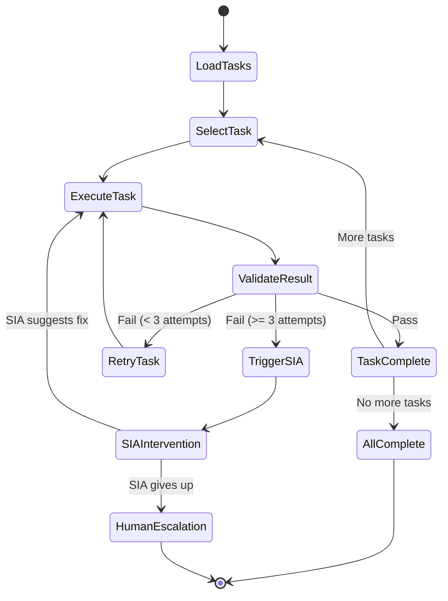

# Build Agent: Ralph Loop Implementation

> **Status:** ⚠️ 60% Complete — Task execution works, loop incomplete
> **Priority:** High
> **Estimated Effort:** 5-7 days

---

## Current State Analysis

### What Exists

```
agents/build/
├── checkpoint-manager.ts  ✅ Save/restore state
├── code-generator.ts      ✅ Generate code
├── context-primer.ts      ✅ Load context for LLM
├── core.ts                ⚠️ Main loop, needs updates
├── file-writer.ts         ✅ Write files to disk
├── git-integration.ts     ✅ Commit changes
├── retry-handler.ts       ✅ Retry failed operations
├── task-executor.ts       ⚠️ Execute tasks, needs SIA hook
├── task-loader.ts         ✅ Load tasks from spec
└── validation-runner.ts   ✅ Run tests/validation
```

### What's Missing

1. **Full loop automation** — Manual triggering required
2. **SIA integration** — No automatic intervention on failure
3. **Progress reporting** — No real-time status updates
4. **Human-in-the-loop** — No escalation mechanism
5. **Pipeline integration** — Not wired to orchestrator

---

## Part 1: Ralph Loop Architecture

### The Loop



### Key Principles

1. **One task at a time** — Complete focus, clean state
2. **Validate immediately** — Know if it worked before moving on
3. **Commit on success** — Git commit after each task
4. **SIA after 3 failures** — Don't keep banging head on wall
5. **Human escalation** — Some things need a human

---

## Part 2: Core Loop Implementation

### 2.1 Build Agent Core

**File:** `agents/build/core.ts` (update)

```typescript
import { EventEmitter } from 'events';

export interface BuildSession {
  id: string;
  ideaId: string;
  specId: string;
  
  status: 'active' | 'paused' | 'complete' | 'failed' | 'human_needed';
  
  // Tasks
  tasks: TaskDefinition[];
  currentTaskIndex: number;
  completedTasks: string[];
  failedTasks: string[];
  
  // Execution state
  currentAttempt: number;
  lastError: string | null;
  siaInterventions: number;
  
  // Output
  generatedFiles: string[];
  gitCommits: string[];
  
  // Metadata
  startedAt: Date;
  lastActivityAt: Date;
}

export class BuildAgent extends EventEmitter {
  private sessions: Map<string, BuildSession> = new Map();
  private isRunning: Map<string, boolean> = new Map();
  
  constructor(
    private taskExecutor: TaskExecutor,
    private validationRunner: ValidationRunner,
    private checkpointManager: CheckpointManager,
    private gitIntegration: GitIntegration,
    private siaAgent: SIAAgent,
    private db: Database
  ) {
    super();
  }
  
  /**
   * Start a new build session
   */
  async startBuild(ideaId: string): Promise<BuildSession> {
    // Load tasks from spec
    const handoff = await this.loadSpecHandoff(ideaId);
    const tasks = handoff.tasks;
    
    // Create session
    const session: BuildSession = {
      id: generateId(),
      ideaId,
      specId: handoff.specId,
      status: 'active',
      tasks,
      currentTaskIndex: 0,
      completedTasks: [],
      failedTasks: [],
      currentAttempt: 0,
      lastError: null,
      siaInterventions: 0,
      generatedFiles: [],
      gitCommits: [],
      startedAt: new Date(),
      lastActivityAt: new Date(),
    };
    
    await this.saveSession(session);
    this.sessions.set(session.id, session);
    
    // Emit event
    this.emit('buildStarted', { sessionId: session.id, ideaId, taskCount: tasks.length });
    
    // Start the loop
    this.runLoop(session.id);
    
    return session;
  }
  
  /**
   * The main Ralph loop
   */
  private async runLoop(sessionId: string): Promise<void> {
    if (this.isRunning.get(sessionId)) {
      return; // Already running
    }
    
    this.isRunning.set(sessionId, true);
    
    try {
      while (true) {
        const session = await this.loadSession(sessionId);
        
        if (!session || session.status !== 'active') {
          break;
        }
        
        // Get current task
        const task = session.tasks[session.currentTaskIndex];
        
        if (!task) {
          // All tasks complete
          session.status = 'complete';
          await this.saveSession(session);
          this.emit('buildComplete', { sessionId, ideaId: session.ideaId });
          break;
        }
        
        // Execute task
        const result = await this.executeTask(session, task);
        
        if (result.success) {
          await this.handleTaskSuccess(session, task, result);
        } else {
          const shouldContinue = await this.handleTaskFailure(session, task, result);
          if (!shouldContinue) {
            break;
          }
        }
        
        // Save checkpoint
        await this.saveSession(session);
        
        // Small delay to prevent tight loops
        await sleep(100);
      }
    } finally {
      this.isRunning.set(sessionId, false);
    }
  }
  
  /**
   * Execute a single task
   */
  private async executeTask(
    session: BuildSession, 
    task: TaskDefinition
  ): Promise<TaskResult> {
    session.currentAttempt++;
    session.lastActivityAt = new Date();
    
    this.emit('taskStarted', {
      sessionId: session.id,
      taskId: task.id,
      taskName: task.name,
      attempt: session.currentAttempt,
    });
    
    try {
      // Prime context
      const context = await this.buildTaskContext(session, task);
      
      // Execute via task executor
      const result = await this.taskExecutor.execute(task, context);
      
      // Validate result
      const validation = await this.validationRunner.validate(task, result);
      
      return {
        success: validation.passed,
        output: result,
        validation,
        error: validation.passed ? null : validation.errors.join('; '),
      };
    } catch (error) {
      return {
        success: false,
        output: null,
        validation: null,
        error: error instanceof Error ? error.message : 'Unknown error',
      };
    }
  }
  
  /**
   * Handle successful task completion
   */
  private async handleTaskSuccess(
    session: BuildSession,
    task: TaskDefinition,
    result: TaskResult
  ): Promise<void> {
    // Record completion
    session.completedTasks.push(task.id);
    session.generatedFiles.push(...(result.output?.files || []));
    
    // Git commit
    const commitHash = await this.gitIntegration.commit(
      session.ideaId,
      `feat: ${task.name}\n\nTask ID: ${task.id}`
    );
    session.gitCommits.push(commitHash);
    
    // Move to next task
    session.currentTaskIndex++;
    session.currentAttempt = 0;
    session.lastError = null;
    
    this.emit('taskComplete', {
      sessionId: session.id,
      taskId: task.id,
      taskName: task.name,
      commitHash,
    });
  }
  
  /**
   * Handle task failure
   */
  private async handleTaskFailure(
    session: BuildSession,
    task: TaskDefinition,
    result: TaskResult
  ): Promise<boolean> {
    session.lastError = result.error;
    
    this.emit('taskFailed', {
      sessionId: session.id,
      taskId: task.id,
      taskName: task.name,
      attempt: session.currentAttempt,
      error: result.error,
    });
    
    // Check if we should retry
    if (session.currentAttempt < 3) {
      // Simple retry
      return true;
    }
    
    // Time for SIA intervention
    return this.triggerSIA(session, task, result);
  }
  
  /**
   * Trigger SIA intervention
   */
  private async triggerSIA(
    session: BuildSession,
    task: TaskDefinition,
    lastResult: TaskResult
  ): Promise<boolean> {
    session.siaInterventions++;
    
    this.emit('siaTriggered', {
      sessionId: session.id,
      taskId: task.id,
      interventionNumber: session.siaInterventions,
    });
    
    // Call SIA
    const siaResult = await this.siaAgent.intervene({
      task,
      lastError: lastResult.error,
      attempts: session.currentAttempt,
      context: await this.buildTaskContext(session, task),
    });
    
    if (siaResult.type === 'fixed') {
      // SIA suggests a fix - reset attempts and try again
      session.currentAttempt = 0;
      
      // Apply SIA's suggested changes
      if (siaResult.modifiedTask) {
        session.tasks[session.currentTaskIndex] = siaResult.modifiedTask;
      }
      
      this.emit('siaSuccess', { sessionId: session.id, taskId: task.id });
      return true;
    }
    
    if (siaResult.type === 'decomposed') {
      // SIA broke task into subtasks
      const newTasks = siaResult.subtasks!;
      session.tasks.splice(session.currentTaskIndex, 1, ...newTasks);
      session.currentAttempt = 0;
      
      this.emit('siaDecomposed', { 
        sessionId: session.id, 
        originalTaskId: task.id,
        newTaskCount: newTasks.length,
      });
      return true;
    }
    
    // SIA gives up - need human
    session.status = 'human_needed';
    session.failedTasks.push(task.id);
    
    this.emit('humanNeeded', {
      sessionId: session.id,
      taskId: task.id,
      taskName: task.name,
      reason: siaResult.reason || 'SIA could not resolve the issue',
    });
    
    return false;
  }
  
  /**
   * Resume a paused session
   */
  async resume(sessionId: string): Promise<void> {
    const session = await this.loadSession(sessionId);
    
    if (session?.status === 'paused') {
      session.status = 'active';
      await this.saveSession(session);
      this.runLoop(sessionId);
    }
  }
  
  /**
   * Pause a running session
   */
  async pause(sessionId: string): Promise<void> {
    const session = await this.loadSession(sessionId);
    
    if (session?.status === 'active') {
      session.status = 'paused';
      await this.saveSession(session);
    }
  }
  
  /**
   * Skip current task and continue
   */
  async skipTask(sessionId: string): Promise<void> {
    const session = await this.loadSession(sessionId);
    
    if (session) {
      const task = session.tasks[session.currentTaskIndex];
      session.failedTasks.push(task.id);
      session.currentTaskIndex++;
      session.currentAttempt = 0;
      session.status = 'active';
      await this.saveSession(session);
      this.runLoop(sessionId);
    }
  }
  
  /**
   * Manually resolve a task and continue
   */
  async resolveTask(sessionId: string, resolution: string): Promise<void> {
    const session = await this.loadSession(sessionId);
    
    if (session) {
      // Record that task was manually resolved
      const task = session.tasks[session.currentTaskIndex];
      session.completedTasks.push(task.id);
      session.currentTaskIndex++;
      session.currentAttempt = 0;
      session.status = 'active';
      
      // Git commit the manual resolution
      await this.gitIntegration.commit(
        session.ideaId,
        `fix: Manual resolution for ${task.name}\n\n${resolution}`
      );
      
      await this.saveSession(session);
      this.runLoop(sessionId);
    }
  }
}
```

### 2.2 Task Executor Updates

**File:** `agents/build/task-executor.ts` (update)

```typescript
export class TaskExecutor {
  constructor(
    private codeGenerator: CodeGenerator,
    private fileWriter: FileWriter,
    private llm: LLMClient
  ) {}
  
  async execute(
    task: TaskDefinition,
    context: TaskContext
  ): Promise<TaskOutput> {
    switch (task.type) {
      case 'setup':
        return this.executeSetupTask(task, context);
      case 'database':
        return this.executeDatabaseTask(task, context);
      case 'api':
        return this.executeApiTask(task, context);
      case 'ui':
        return this.executeUiTask(task, context);
      case 'integration':
        return this.executeIntegrationTask(task, context);
      case 'test':
        return this.executeTestTask(task, context);
      default:
        throw new Error(`Unknown task type: ${task.type}`);
    }
  }
  
  private async executeSetupTask(
    task: TaskDefinition,
    context: TaskContext
  ): Promise<TaskOutput> {
    // Generate setup code (package.json, config files, etc.)
    const files = await this.codeGenerator.generateSetup(task, context);
    
    // Write files
    await this.fileWriter.writeFiles(context.projectPath, files);
    
    // Run npm install if needed
    if (files.some(f => f.path === 'package.json')) {
      await this.runCommand('npm install', context.projectPath);
    }
    
    return { files: files.map(f => f.path), commands: ['npm install'] };
  }
  
  private async executeApiTask(
    task: TaskDefinition,
    context: TaskContext
  ): Promise<TaskOutput> {
    // Generate API endpoint code
    const prompt = this.buildApiPrompt(task, context);
    
    const response = await this.llm.complete({
      model: 'claude-sonnet-4-20250514',
      messages: [
        { role: 'system', content: API_GENERATION_PROMPT },
        { role: 'user', content: prompt }
      ],
      responseFormat: { type: 'json_object' }
    });
    
    const generated = JSON.parse(response.content);
    
    // Write generated files
    await this.fileWriter.writeFiles(context.projectPath, generated.files);
    
    return { 
      files: generated.files.map((f: any) => f.path),
      endpoints: generated.endpoints,
    };
  }
  
  private async executeUiTask(
    task: TaskDefinition,
    context: TaskContext
  ): Promise<TaskOutput> {
    // Generate UI component
    const prompt = this.buildUiPrompt(task, context);
    
    const response = await this.llm.complete({
      model: 'claude-sonnet-4-20250514',
      messages: [
        { role: 'system', content: UI_GENERATION_PROMPT },
        { role: 'user', content: prompt }
      ],
      responseFormat: { type: 'json_object' }
    });
    
    const generated = JSON.parse(response.content);
    
    // Write generated files
    await this.fileWriter.writeFiles(context.projectPath, generated.files);
    
    return { 
      files: generated.files.map((f: any) => f.path),
      components: generated.components,
    };
  }
}
```

---

## Part 3: Progress Reporting

### 3.1 Real-time Updates

**File:** `server/routes/build.ts`

```typescript
import { Router } from 'express';
import { buildAgent } from '../agents/build';

const router = Router();

/**
 * GET /api/build/:ideaId/status
 * Get current build status
 */
router.get('/:ideaId/status', async (req, res) => {
  const { ideaId } = req.params;
  
  const session = await buildAgent.getSessionByIdeaId(ideaId);
  
  if (!session) {
    return res.json({ status: 'not_started' });
  }
  
  res.json({
    sessionId: session.id,
    status: session.status,
    progress: {
      total: session.tasks.length,
      completed: session.completedTasks.length,
      failed: session.failedTasks.length,
      current: session.tasks[session.currentTaskIndex]?.name || null,
      currentAttempt: session.currentAttempt,
    },
    siaInterventions: session.siaInterventions,
    lastError: session.lastError,
    generatedFiles: session.generatedFiles.length,
    commits: session.gitCommits.length,
  });
});

/**
 * WebSocket: /api/build/:ideaId/stream
 * Real-time build updates
 */
router.ws('/:ideaId/stream', (ws, req) => {
  const { ideaId } = req.params;
  
  const events = [
    'taskStarted', 'taskComplete', 'taskFailed',
    'siaTriggered', 'siaSuccess', 'siaDecomposed',
    'humanNeeded', 'buildComplete'
  ];
  
  const handlers: Record<string, Function> = {};
  
  events.forEach(event => {
    handlers[event] = (data: any) => {
      if (data.ideaId === ideaId || data.sessionId?.startsWith(ideaId)) {
        ws.send(JSON.stringify({ type: event, ...data }));
      }
    };
    buildAgent.on(event, handlers[event] as any);
  });
  
  ws.on('close', () => {
    events.forEach(event => {
      buildAgent.off(event, handlers[event] as any);
    });
  });
});

/**
 * POST /api/build/:ideaId/start
 * Start a new build
 */
router.post('/:ideaId/start', async (req, res) => {
  const { ideaId } = req.params;
  
  try {
    const session = await buildAgent.startBuild(ideaId);
    res.json({ sessionId: session.id, status: 'started' });
  } catch (error) {
    res.status(500).json({ error: (error as Error).message });
  }
});

/**
 * POST /api/build/:sessionId/pause
 */
router.post('/:sessionId/pause', async (req, res) => {
  const { sessionId } = req.params;
  await buildAgent.pause(sessionId);
  res.json({ success: true });
});

/**
 * POST /api/build/:sessionId/resume
 */
router.post('/:sessionId/resume', async (req, res) => {
  const { sessionId } = req.params;
  await buildAgent.resume(sessionId);
  res.json({ success: true });
});

/**
 * POST /api/build/:sessionId/skip
 * Skip current task
 */
router.post('/:sessionId/skip', async (req, res) => {
  const { sessionId } = req.params;
  await buildAgent.skipTask(sessionId);
  res.json({ success: true });
});

/**
 * POST /api/build/:sessionId/resolve
 * Manually resolve current task
 */
router.post('/:sessionId/resolve', async (req, res) => {
  const { sessionId } = req.params;
  const { resolution } = req.body;
  await buildAgent.resolveTask(sessionId, resolution);
  res.json({ success: true });
});

export default router;
```

---

## Part 4: Frontend Integration

### 4.1 Build Progress View

**File:** `frontend/src/components/BuildProgressView.tsx`

```tsx
interface BuildProgressViewProps {
  ideaId: string;
}

export function BuildProgressView({ ideaId }: BuildProgressViewProps) {
  const { session, events, pause, resume, skip, resolve } = useBuildSession(ideaId);
  const [showResolveDialog, setShowResolveDialog] = useState(false);
  
  if (!session) {
    return <NoBuildSession ideaId={ideaId} />;
  }
  
  const { status, tasks, completedTasks, failedTasks, currentTaskIndex } = session;
  const currentTask = tasks[currentTaskIndex];
  const progress = (completedTasks.length / tasks.length) * 100;
  
  return (
    <div className="h-full flex flex-col">
      {/* Status Header */}
      <div className="p-4 border-b">
        <div className="flex items-center justify-between mb-2">
          <div className="flex items-center gap-2">
            <StatusBadge status={status} />
            <span className="text-sm text-gray-500">
              {completedTasks.length} / {tasks.length} tasks
            </span>
          </div>
          
          <div className="flex gap-2">
            {status === 'active' && (
              <button onClick={pause} className="btn btn-sm btn-secondary">
                Pause
              </button>
            )}
            {status === 'paused' && (
              <button onClick={resume} className="btn btn-sm btn-primary">
                Resume
              </button>
            )}
          </div>
        </div>
        
        <Progress value={progress} className="h-2" />
      </div>
      
      {/* Human Needed Alert */}
      {status === 'human_needed' && (
        <div className="p-4 bg-amber-50 border-b">
          <div className="flex items-start gap-3">
            <AlertTriangle className="w-5 h-5 text-amber-500 shrink-0" />
            <div>
              <h3 className="font-medium">Human intervention needed</h3>
              <p className="text-sm text-gray-600 mt-1">
                The build agent couldn't complete "{currentTask?.name}".
                {session.lastError && ` Error: ${session.lastError}`}
              </p>
              <div className="mt-3 flex gap-2">
                <button 
                  onClick={() => setShowResolveDialog(true)}
                  className="btn btn-sm btn-primary"
                >
                  I've fixed it
                </button>
                <button 
                  onClick={skip}
                  className="btn btn-sm btn-secondary"
                >
                  Skip this task
                </button>
              </div>
            </div>
          </div>
        </div>
      )}
      
      {/* Task List */}
      <div className="flex-1 overflow-auto p-4">
        <div className="space-y-2">
          {tasks.map((task, index) => (
            <TaskCard
              key={task.id}
              task={task}
              status={getTaskStatus(task.id, index, completedTasks, failedTasks, currentTaskIndex)}
              isCurrent={index === currentTaskIndex && status === 'active'}
              attempt={index === currentTaskIndex ? session.currentAttempt : undefined}
            />
          ))}
        </div>
      </div>
      
      {/* Live Events */}
      <div className="border-t p-4 max-h-32 overflow-auto bg-gray-50">
        <h4 className="text-xs font-medium text-gray-500 mb-2">Live Activity</h4>
        <div className="space-y-1 text-xs font-mono">
          {events.slice(-5).map((event, i) => (
            <div key={i} className="text-gray-600">
              {formatEvent(event)}
            </div>
          ))}
        </div>
      </div>
      
      {/* Resolve Dialog */}
      <ResolveTaskDialog
        open={showResolveDialog}
        onClose={() => setShowResolveDialog(false)}
        onResolve={(resolution) => {
          resolve(resolution);
          setShowResolveDialog(false);
        }}
        taskName={currentTask?.name}
      />
    </div>
  );
}

function TaskCard({ task, status, isCurrent, attempt }: TaskCardProps) {
  return (
    <div className={cn(
      "p-3 rounded-lg border",
      status === 'completed' && "bg-green-50 border-green-200",
      status === 'failed' && "bg-red-50 border-red-200",
      status === 'running' && "bg-blue-50 border-blue-200 ring-2 ring-blue-300",
      status === 'pending' && "bg-gray-50 border-gray-200"
    )}>
      <div className="flex items-center gap-3">
        {status === 'completed' && <CheckCircle className="w-5 h-5 text-green-500" />}
        {status === 'failed' && <XCircle className="w-5 h-5 text-red-500" />}
        {status === 'running' && <Loader className="w-5 h-5 text-blue-500 animate-spin" />}
        {status === 'pending' && <Circle className="w-5 h-5 text-gray-300" />}
        
        <div className="flex-1">
          <p className="font-medium">{task.name}</p>
          <p className="text-xs text-gray-500">{task.type}</p>
        </div>
        
        {isCurrent && attempt && attempt > 1 && (
          <span className="text-xs text-amber-600">
            Attempt {attempt}
          </span>
        )}
      </div>
    </div>
  );
}
```

### 4.2 Build Session Hook

**File:** `frontend/src/hooks/useBuildSession.ts`

```typescript
export function useBuildSession(ideaId: string) {
  const [session, setSession] = useState<BuildSession | null>(null);
  const [events, setEvents] = useState<BuildEvent[]>([]);
  
  useEffect(() => {
    // Initial fetch
    fetchStatus();
    
    // WebSocket for real-time updates
    const ws = new WebSocket(`/api/build/${ideaId}/stream`);
    
    ws.onmessage = (event) => {
      const data = JSON.parse(event.data);
      setEvents(prev => [...prev, data].slice(-100));
      
      // Update session state based on event
      if (['taskComplete', 'taskFailed', 'buildComplete', 'humanNeeded'].includes(data.type)) {
        fetchStatus();
      }
    };
    
    return () => ws.close();
  }, [ideaId]);
  
  const fetchStatus = async () => {
    const res = await fetch(`/api/build/${ideaId}/status`);
    const data = await res.json();
    if (data.status !== 'not_started') {
      setSession(data);
    }
  };
  
  const start = async () => {
    await fetch(`/api/build/${ideaId}/start`, { method: 'POST' });
    fetchStatus();
  };
  
  const pause = async () => {
    if (session) {
      await fetch(`/api/build/${session.sessionId}/pause`, { method: 'POST' });
      fetchStatus();
    }
  };
  
  const resume = async () => {
    if (session) {
      await fetch(`/api/build/${session.sessionId}/resume`, { method: 'POST' });
    }
  };
  
  const skip = async () => {
    if (session) {
      await fetch(`/api/build/${session.sessionId}/skip`, { method: 'POST' });
    }
  };
  
  const resolve = async (resolution: string) => {
    if (session) {
      await fetch(`/api/build/${session.sessionId}/resolve`, {
        method: 'POST',
        body: JSON.stringify({ resolution }),
      });
    }
  };
  
  return { session, events, start, pause, resume, skip, resolve };
}
```

---

## Part 5: Implementation Tasks

### Task BUILD-001: Database Schema for Build Sessions

**Migration:**

```sql
CREATE TABLE build_sessions (
  id TEXT PRIMARY KEY,
  idea_id TEXT NOT NULL REFERENCES ideas(id),
  spec_id TEXT REFERENCES spec_sessions(id),
  
  status TEXT NOT NULL DEFAULT 'active',
  
  -- Tasks
  tasks TEXT NOT NULL,  -- JSON array
  current_task_index INTEGER DEFAULT 0,
  completed_tasks TEXT,  -- JSON array
  failed_tasks TEXT,     -- JSON array
  
  -- Execution state
  current_attempt INTEGER DEFAULT 0,
  last_error TEXT,
  sia_interventions INTEGER DEFAULT 0,
  
  -- Output
  generated_files TEXT,  -- JSON array
  git_commits TEXT,      -- JSON array
  
  started_at TIMESTAMP DEFAULT CURRENT_TIMESTAMP,
  last_activity_at TIMESTAMP DEFAULT CURRENT_TIMESTAMP
);

CREATE INDEX idx_build_sessions_idea ON build_sessions(idea_id);
CREATE INDEX idx_build_sessions_status ON build_sessions(status);
```

**Acceptance Criteria:**
- [ ] Migration runs successfully
- [ ] Can create and query sessions
- [ ] JSON arrays store correctly

**Test:**
```typescript
describe('Build Session Schema', () => {
  it('creates session with tasks', async () => {
    const session = await db.buildSessions.create({
      data: {
        ideaId: 'idea-1',
        tasks: JSON.stringify([{ id: 't1', name: 'Setup' }]),
        completedTasks: JSON.stringify([]),
        failedTasks: JSON.stringify([]),
        generatedFiles: JSON.stringify([]),
        gitCommits: JSON.stringify([]),
      }
    });
    
    expect(session.currentTaskIndex).toBe(0);
    expect(JSON.parse(session.tasks!)).toHaveLength(1);
  });
});
```

---

### Task BUILD-002: Implement Build Agent Loop

**File:** `agents/build/core.ts`

**Acceptance Criteria:**
- [ ] startBuild creates session and runs loop
- [ ] Loop processes tasks sequentially
- [ ] Success commits to git
- [ ] Failure triggers retry (up to 3)
- [ ] SIA triggered after 3 failures

**Test:**
```typescript
describe('BuildAgent', () => {
  it('executes tasks sequentially', async () => {
    const session = await buildAgent.startBuild('idea-1');
    
    // Wait for completion
    await waitFor(() => {
      const s = buildAgent.getSession(session.id);
      return s?.status === 'complete';
    }, { timeout: 30000 });
    
    expect(session.completedTasks).toHaveLength(session.tasks.length);
  });
  
  it('triggers SIA after 3 failures', async () => {
    const siaIntervene = jest.spyOn(siaAgent, 'intervene');
    
    // Setup: task that always fails
    mockTaskExecutor.execute.mockRejectedValue(new Error('Always fails'));
    
    await buildAgent.startBuild('idea-1');
    
    await waitFor(() => {
      expect(siaIntervene).toHaveBeenCalled();
    });
  });
});
```

---

### Task BUILD-003: Wire to Pipeline Orchestrator

**File:** `server/pipeline/orchestrator.ts`

**Acceptance Criteria:**
- [ ] Orchestrator starts build on spec_ready → building
- [ ] Build events update pipeline state
- [ ] humanNeeded pauses pipeline

**Test:**
```typescript
describe('Build Agent Pipeline Integration', () => {
  it('starts build on transition to building', async () => {
    const startBuild = jest.spyOn(buildAgent, 'startBuild');
    
    await setIdeaPhase('idea-1', 'spec_ready');
    await orchestrator.requestTransition('idea-1', 'building', 'test');
    
    expect(startBuild).toHaveBeenCalledWith('idea-1');
  });
  
  it('transitions to deployed on build complete', async () => {
    await setIdeaPhase('idea-1', 'building');
    
    buildAgent.emit('buildComplete', { ideaId: 'idea-1' });
    
    await waitFor(() => {
      const state = orchestrator.getState('idea-1');
      expect(state.currentPhase).toBe('deployed');
    });
  });
});
```

---

### Task BUILD-004: Create API Routes

**File:** `server/routes/build.ts`

**Acceptance Criteria:**
- [ ] GET /status returns build state
- [ ] POST /start initiates build
- [ ] POST /pause and /resume work
- [ ] POST /skip and /resolve work
- [ ] WebSocket streams events

**Test:**
```typescript
describe('Build API', () => {
  it('GET /status returns progress', async () => {
    await startBuild('idea-1');
    
    const res = await request(app)
      .get('/api/build/idea-1/status')
      .expect(200);
    
    expect(res.body.status).toBe('active');
    expect(res.body.progress.total).toBeGreaterThan(0);
  });
  
  it('POST /skip advances past failed task', async () => {
    const session = await createBuildSessionWithFailedTask('idea-1');
    
    await request(app)
      .post(`/api/build/${session.id}/skip`)
      .expect(200);
    
    const updated = await getBuildSession(session.id);
    expect(updated.failedTasks).toContain(session.currentTaskId);
    expect(updated.currentTaskIndex).toBe(session.currentTaskIndex + 1);
  });
});
```

---

### Task BUILD-005: Create Frontend Components

**Files:**
- `frontend/src/components/BuildProgressView.tsx`
- `frontend/src/hooks/useBuildSession.ts`

**Acceptance Criteria:**
- [ ] Shows task list with status
- [ ] Current task highlighted
- [ ] Live events displayed
- [ ] Human intervention UI works
- [ ] Pause/resume controls work

**Test:**
```typescript
describe('BuildProgressView', () => {
  it('shows human intervention alert when needed', () => {
    mockUseBuildSession.mockReturnValue({
      session: { status: 'human_needed', lastError: 'Cannot compile' },
      ...
    });
    
    render(<BuildProgressView ideaId="idea-1" />);
    
    expect(screen.getByText('Human intervention needed')).toBeInTheDocument();
    expect(screen.getByText("I've fixed it")).toBeInTheDocument();
    expect(screen.getByText('Skip this task')).toBeInTheDocument();
  });
});
```

---

## Summary

The Build Agent needs:

1. **Full loop implementation** — Sequential task execution
2. **SIA integration** — Intervention on repeated failure
3. **Progress reporting** — Real-time updates via WebSocket
4. **Human-in-the-loop** — Skip/resolve options
5. **Pipeline wiring** — Connect to orchestrator

**Implementation order:**
1. BUILD-001: Database schema
2. BUILD-002: Core loop implementation
3. BUILD-003: Pipeline integration
4. BUILD-004: API routes
5. BUILD-005: Frontend components

**Key insight:** The task executor already works — we need to wrap it in a proper loop with state management and event reporting.

---

*Next: [05-SIA-INTEGRATION.md](./05-SIA-INTEGRATION.md) — Self-Improvement Agent integration*
