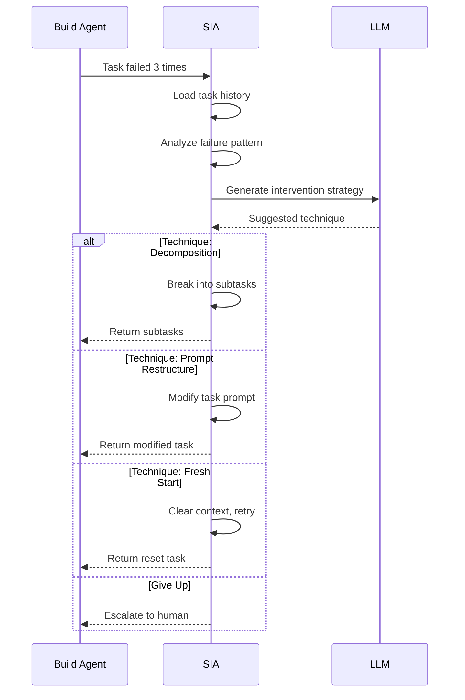

# Self-Improvement Agent (SIA) Integration

> **Status:** ⚠️ 40% — Exists but not wired to build loop
> **Priority:** Medium
> **Estimated Effort:** 3-4 days

---

## Current State

### What Exists

```
agents/sia/
├── [files exist but not fully integrated]
```

The SIA concept is documented in `docs/agentic-loop-framework.md` but the integration with the build agent is incomplete.

### What's Missing

1. **Build agent hook** — SIA isn't called on task failure
2. **Techniques library** — Not all 10 techniques implemented
3. **Memory system** — Per-task history not tracked
4. **Metrics** — No intervention tracking

---

## Part 1: SIA Architecture

### Purpose

SIA intervenes when the build agent fails a task repeatedly. It analyzes the failure and suggests a different approach.



### Techniques Library

| # | Technique | Description | When to Use |
|---|-----------|-------------|-------------|
| 1 | **Decomposition** | Break task into smaller subtasks | Task is too complex |
| 2 | **Tool Change** | Try different tools/libraries | Tool-specific errors |
| 3 | **Prompt Restructure** | Rewrite the task description | Unclear requirements |
| 4 | **Context Pruning** | Remove irrelevant context | Context pollution |
| 5 | **Example Injection** | Add working examples | Pattern unclear |
| 6 | **Constraint Relaxation** | Simplify requirements | Over-constrained |
| 7 | **Dependency Reordering** | Change task order | Missing prerequisites |
| 8 | **Abstraction Shift** | Higher/lower level approach | Wrong abstraction |
| 9 | **Error Pattern Match** | Match known solutions | Seen this before |
| 10 | **Fresh Start** | Clear everything, retry | Corrupted state |

---

## Part 2: Implementation

### 2.1 SIA Agent

**File:** `agents/sia/agent.ts`

```typescript
import { EventEmitter } from 'events';

export interface SIARequest {
  task: TaskDefinition;
  lastError: string | null;
  attempts: number;
  context: TaskContext;
  history?: TaskAttempt[];
}

export interface SIAResult {
  type: 'fixed' | 'decomposed' | 'escalate';
  technique?: string;
  modifiedTask?: TaskDefinition;
  subtasks?: TaskDefinition[];
  reason?: string;
}

export class SIAAgent extends EventEmitter {
  private techniqueLibrary: Map<string, Technique> = new Map();
  private taskMemory: Map<string, TaskMemory> = new Map();
  
  constructor(
    private llm: LLMClient,
    private db: Database
  ) {
    super();
    this.initializeTechniques();
  }
  
  /**
   * Initialize all techniques
   */
  private initializeTechniques(): void {
    this.techniqueLibrary.set('decomposition', new DecompositionTechnique(this.llm));
    this.techniqueLibrary.set('prompt_restructure', new PromptRestructureTechnique(this.llm));
    this.techniqueLibrary.set('context_pruning', new ContextPruningTechnique(this.llm));
    this.techniqueLibrary.set('example_injection', new ExampleInjectionTechnique(this.llm));
    this.techniqueLibrary.set('constraint_relaxation', new ConstraintRelaxationTechnique(this.llm));
    this.techniqueLibrary.set('fresh_start', new FreshStartTechnique(this.llm));
    // ... other techniques
  }
  
  /**
   * Main intervention method
   */
  async intervene(request: SIARequest): Promise<SIAResult> {
    const { task, lastError, attempts, context } = request;
    
    // Load task memory
    const memory = await this.loadTaskMemory(task.id);
    
    // Analyze failure pattern
    const analysis = await this.analyzeFailure(task, lastError, memory);
    
    // Select technique
    const technique = await this.selectTechnique(analysis, memory);
    
    if (!technique) {
      // No technique works - escalate
      return {
        type: 'escalate',
        reason: `SIA exhausted all techniques. Last error: ${lastError}`,
      };
    }
    
    // Apply technique
    const result = await this.applyTechnique(technique, task, context, analysis);
    
    // Record attempt
    await this.recordAttempt(task.id, technique, result);
    
    // Emit event
    this.emit('intervention', {
      taskId: task.id,
      technique: technique.name,
      result: result.type,
    });
    
    return result;
  }
  
  /**
   * Analyze the failure pattern
   */
  private async analyzeFailure(
    task: TaskDefinition,
    lastError: string | null,
    memory: TaskMemory
  ): Promise<FailureAnalysis> {
    const prompt = `
      Analyze this task failure:
      
      Task: ${task.name}
      Description: ${task.description}
      Type: ${task.type}
      
      Last Error: ${lastError || 'Unknown'}
      
      Previous Attempts: ${memory.attempts.length}
      Previous Techniques Tried: ${memory.attempts.map(a => a.technique).join(', ') || 'None'}
      
      Analyze:
      1. What is the root cause of failure?
      2. Is this a complexity issue, clarity issue, or environment issue?
      3. What approaches haven't been tried yet?
      
      Respond in JSON:
      {
        "rootCause": "string",
        "issueType": "complexity" | "clarity" | "environment" | "unknown",
        "suggestedApproaches": ["string"],
        "confidence": 0.0-1.0
      }
    `;
    
    const response = await this.llm.complete({
      model: 'claude-sonnet-4-20250514',
      messages: [
        { role: 'system', content: SIA_ANALYSIS_PROMPT },
        { role: 'user', content: prompt }
      ],
      responseFormat: { type: 'json_object' }
    });
    
    return JSON.parse(response.content);
  }
  
  /**
   * Select the best technique for this failure
   */
  private async selectTechnique(
    analysis: FailureAnalysis,
    memory: TaskMemory
  ): Promise<Technique | null> {
    // Filter out already-tried techniques
    const triedTechniques = new Set(memory.attempts.map(a => a.technique));
    
    // Rank techniques by suitability
    const rankings = Array.from(this.techniqueLibrary.entries())
      .filter(([name]) => !triedTechniques.has(name))
      .map(([name, technique]) => ({
        name,
        technique,
        score: technique.scoreSuitability(analysis),
      }))
      .sort((a, b) => b.score - a.score);
    
    if (rankings.length === 0 || rankings[0].score < 0.3) {
      return null; // No suitable technique
    }
    
    return rankings[0].technique;
  }
  
  /**
   * Apply a technique to the task
   */
  private async applyTechnique(
    technique: Technique,
    task: TaskDefinition,
    context: TaskContext,
    analysis: FailureAnalysis
  ): Promise<SIAResult> {
    return technique.apply(task, context, analysis);
  }
  
  /**
   * Record intervention attempt
   */
  private async recordAttempt(
    taskId: string,
    technique: Technique,
    result: SIAResult
  ): Promise<void> {
    await this.db.siaAttempts.create({
      data: {
        taskId,
        technique: technique.name,
        resultType: result.type,
        timestamp: new Date(),
      }
    });
  }
}
```

### 2.2 Technique Interface

**File:** `agents/sia/techniques/base.ts`

```typescript
export interface Technique {
  name: string;
  description: string;
  
  /**
   * Score how suitable this technique is for the failure
   */
  scoreSuitability(analysis: FailureAnalysis): number;
  
  /**
   * Apply the technique to the task
   */
  apply(
    task: TaskDefinition,
    context: TaskContext,
    analysis: FailureAnalysis
  ): Promise<SIAResult>;
}
```

### 2.3 Decomposition Technique

**File:** `agents/sia/techniques/decomposition.ts`

```typescript
export class DecompositionTechnique implements Technique {
  name = 'decomposition';
  description = 'Break complex task into smaller subtasks';
  
  constructor(private llm: LLMClient) {}
  
  scoreSuitability(analysis: FailureAnalysis): number {
    if (analysis.issueType === 'complexity') return 0.9;
    if (analysis.rootCause.includes('too large')) return 0.8;
    if (analysis.rootCause.includes('multiple')) return 0.7;
    return 0.3;
  }
  
  async apply(
    task: TaskDefinition,
    context: TaskContext,
    analysis: FailureAnalysis
  ): Promise<SIAResult> {
    const prompt = `
      This task is too complex to complete in one step.
      Break it into smaller, independent subtasks.
      
      Original Task: ${task.name}
      Description: ${task.description}
      Technical Details: ${task.technicalDetails}
      
      Error Analysis: ${analysis.rootCause}
      
      Create 2-5 subtasks that together accomplish the original goal.
      Each subtask should be:
      1. Small enough to complete in one attempt
      2. Clearly defined with acceptance criteria
      3. Properly ordered (dependencies considered)
      
      Respond in JSON:
      {
        "subtasks": [
          {
            "name": "string",
            "description": "string",
            "type": "setup" | "database" | "api" | "ui" | "test",
            "technicalDetails": "string",
            "testCriteria": ["string"],
            "estimatedMinutes": number
          }
        ]
      }
    `;
    
    const response = await this.llm.complete({
      model: 'claude-sonnet-4-20250514',
      messages: [
        { role: 'system', content: DECOMPOSITION_PROMPT },
        { role: 'user', content: prompt }
      ],
      responseFormat: { type: 'json_object' }
    });
    
    const { subtasks } = JSON.parse(response.content);
    
    // Add IDs and link to original
    const fullSubtasks = subtasks.map((st: any, i: number) => ({
      ...st,
      id: `${task.id}-sub-${i + 1}`,
      specId: task.specId,
      featureId: task.featureId,
      dependencies: i > 0 ? [`${task.id}-sub-${i}`] : task.dependencies,
    }));
    
    return {
      type: 'decomposed',
      technique: this.name,
      subtasks: fullSubtasks,
    };
  }
}
```

### 2.4 Prompt Restructure Technique

**File:** `agents/sia/techniques/prompt-restructure.ts`

```typescript
export class PromptRestructureTechnique implements Technique {
  name = 'prompt_restructure';
  description = 'Rewrite task description for clarity';
  
  constructor(private llm: LLMClient) {}
  
  scoreSuitability(analysis: FailureAnalysis): number {
    if (analysis.issueType === 'clarity') return 0.9;
    if (analysis.rootCause.includes('unclear')) return 0.8;
    if (analysis.rootCause.includes('ambiguous')) return 0.8;
    return 0.4;
  }
  
  async apply(
    task: TaskDefinition,
    context: TaskContext,
    analysis: FailureAnalysis
  ): Promise<SIAResult> {
    const prompt = `
      This task description is unclear and causing execution failures.
      Rewrite it to be more precise and actionable.
      
      Original Task: ${task.name}
      Original Description: ${task.description}
      Technical Details: ${task.technicalDetails}
      
      Error Analysis: ${analysis.rootCause}
      
      Rewrite the task to be:
      1. Specific about what needs to be created
      2. Clear about inputs and outputs
      3. Explicit about technologies to use
      4. Include concrete examples if helpful
      
      Respond in JSON:
      {
        "name": "string (can be same)",
        "description": "improved description",
        "technicalDetails": "improved technical details",
        "testCriteria": ["more specific test criteria"]
      }
    `;
    
    const response = await this.llm.complete({
      model: 'claude-sonnet-4-20250514',
      messages: [
        { role: 'system', content: RESTRUCTURE_PROMPT },
        { role: 'user', content: prompt }
      ],
      responseFormat: { type: 'json_object' }
    });
    
    const improved = JSON.parse(response.content);
    
    return {
      type: 'fixed',
      technique: this.name,
      modifiedTask: {
        ...task,
        ...improved,
      },
    };
  }
}
```

---

## Part 3: Integration with Build Agent

### 3.1 Build Agent Hook

**File:** `agents/build/core.ts` (add to existing)

```typescript
// In BuildAgent class

/**
 * Trigger SIA intervention
 */
private async triggerSIA(
  session: BuildSession,
  task: TaskDefinition,
  lastResult: TaskResult
): Promise<boolean> {
  session.siaInterventions++;
  
  this.emit('siaTriggered', {
    sessionId: session.id,
    taskId: task.id,
    interventionNumber: session.siaInterventions,
  });
  
  // Build history for this task
  const history = await this.getTaskAttemptHistory(session.id, task.id);
  
  // Call SIA
  const siaResult = await this.siaAgent.intervene({
    task,
    lastError: lastResult.error,
    attempts: session.currentAttempt,
    context: await this.buildTaskContext(session, task),
    history,
  });
  
  if (siaResult.type === 'fixed') {
    // SIA modified the task
    session.tasks[session.currentTaskIndex] = siaResult.modifiedTask!;
    session.currentAttempt = 0;
    
    this.emit('siaSuccess', { 
      sessionId: session.id, 
      taskId: task.id,
      technique: siaResult.technique,
    });
    return true;
  }
  
  if (siaResult.type === 'decomposed') {
    // SIA broke task into subtasks
    const newTasks = siaResult.subtasks!;
    session.tasks.splice(session.currentTaskIndex, 1, ...newTasks);
    session.currentAttempt = 0;
    
    this.emit('siaDecomposed', { 
      sessionId: session.id, 
      originalTaskId: task.id,
      newTaskCount: newTasks.length,
      technique: siaResult.technique,
    });
    return true;
  }
  
  // SIA gives up
  session.status = 'human_needed';
  session.failedTasks.push(task.id);
  
  this.emit('humanNeeded', {
    sessionId: session.id,
    taskId: task.id,
    taskName: task.name,
    reason: siaResult.reason || 'SIA could not resolve the issue',
    attemptedTechniques: history.map(h => h.technique),
  });
  
  return false;
}
```

---

## Part 4: Metrics & Dashboard

### 4.1 SIA Metrics

**File:** `server/routes/sia-metrics.ts`

```typescript
router.get('/metrics', async (req, res) => {
  const metrics = await db.$queryRaw`
    SELECT 
      technique,
      COUNT(*) as total_attempts,
      SUM(CASE WHEN result_type = 'fixed' THEN 1 ELSE 0 END) as fixed_count,
      SUM(CASE WHEN result_type = 'decomposed' THEN 1 ELSE 0 END) as decomposed_count,
      SUM(CASE WHEN result_type = 'escalate' THEN 1 ELSE 0 END) as escalate_count
    FROM sia_attempts
    GROUP BY technique
  `;
  
  const summary = {
    totalInterventions: await db.siaAttempts.count(),
    successRate: await calculateSuccessRate(),
    mostEffectiveTechnique: findMostEffective(metrics),
    techniqueBreakdown: metrics,
  };
  
  res.json(summary);
});
```

---

## Part 5: Implementation Tasks

### Task SIA-001: Create SIA Database Schema

```sql
CREATE TABLE sia_attempts (
  id TEXT PRIMARY KEY,
  task_id TEXT NOT NULL,
  technique TEXT NOT NULL,
  result_type TEXT NOT NULL,  -- 'fixed' | 'decomposed' | 'escalate'
  details TEXT,  -- JSON
  timestamp TIMESTAMP DEFAULT CURRENT_TIMESTAMP
);

CREATE TABLE sia_task_memory (
  task_id TEXT PRIMARY KEY,
  attempts TEXT NOT NULL,  -- JSON array of attempts
  created_at TIMESTAMP DEFAULT CURRENT_TIMESTAMP,
  updated_at TIMESTAMP DEFAULT CURRENT_TIMESTAMP
);

CREATE INDEX idx_sia_attempts_task ON sia_attempts(task_id);
CREATE INDEX idx_sia_attempts_technique ON sia_attempts(technique);
```

**Test:**
```typescript
describe('SIA Schema', () => {
  it('records intervention attempts', async () => {
    await db.siaAttempts.create({
      data: {
        taskId: 'task-1',
        technique: 'decomposition',
        resultType: 'decomposed',
      }
    });
    
    const attempts = await db.siaAttempts.findMany({ where: { taskId: 'task-1' } });
    expect(attempts).toHaveLength(1);
  });
});
```

---

### Task SIA-002: Implement Core SIA Agent

**File:** `agents/sia/agent.ts`

**Acceptance Criteria:**
- [ ] Analyzes failure patterns
- [ ] Selects appropriate technique
- [ ] Applies technique to task
- [ ] Records attempt history

**Test:**
```typescript
describe('SIAAgent', () => {
  it('selects decomposition for complex tasks', async () => {
    const result = await siaAgent.intervene({
      task: { name: 'Build entire feature', description: 'Very complex...' },
      lastError: 'Task too large to complete',
      attempts: 3,
      context: {},
    });
    
    expect(result.technique).toBe('decomposition');
    expect(result.subtasks?.length).toBeGreaterThan(1);
  });
  
  it('escalates after all techniques exhausted', async () => {
    // Setup: all techniques already tried
    await createTaskMemory('task-1', {
      attempts: [
        { technique: 'decomposition', result: 'failed' },
        { technique: 'prompt_restructure', result: 'failed' },
        // ... all techniques
      ]
    });
    
    const result = await siaAgent.intervene({
      task: { id: 'task-1', name: 'Impossible task' },
      lastError: 'Still failing',
      attempts: 10,
      context: {},
    });
    
    expect(result.type).toBe('escalate');
  });
});
```

---

### Task SIA-003: Implement Key Techniques

**Files:**
- `agents/sia/techniques/decomposition.ts`
- `agents/sia/techniques/prompt-restructure.ts`
- `agents/sia/techniques/fresh-start.ts`

**Acceptance Criteria:**
- [ ] Decomposition creates valid subtasks
- [ ] Prompt restructure improves clarity
- [ ] Fresh start clears context

**Test:**
```typescript
describe('DecompositionTechnique', () => {
  it('breaks task into subtasks', async () => {
    const technique = new DecompositionTechnique(mockLlm);
    
    const result = await technique.apply(
      { name: 'Build user auth', description: 'Full auth system' },
      {},
      { issueType: 'complexity' }
    );
    
    expect(result.type).toBe('decomposed');
    expect(result.subtasks).toBeDefined();
    expect(result.subtasks!.length).toBeGreaterThan(1);
    expect(result.subtasks![0].testCriteria).toBeDefined();
  });
});
```

---

### Task SIA-004: Wire to Build Agent

**File:** `agents/build/core.ts`

**Acceptance Criteria:**
- [ ] SIA called after 3 failures
- [ ] Modified task used on retry
- [ ] Subtasks inserted into queue
- [ ] Events emitted correctly

**Test:**
```typescript
describe('Build Agent SIA Integration', () => {
  it('triggers SIA after 3 failures', async () => {
    const siaIntervene = jest.spyOn(siaAgent, 'intervene');
    mockTaskExecutor.execute.mockRejectedValue(new Error('Fails'));
    
    await buildAgent.startBuild('idea-1');
    
    // Wait for 3 attempts + SIA trigger
    await waitFor(() => {
      expect(siaIntervene).toHaveBeenCalled();
    });
  });
  
  it('uses modified task from SIA', async () => {
    siaAgent.intervene.mockResolvedValue({
      type: 'fixed',
      modifiedTask: { ...originalTask, description: 'Improved' },
    });
    
    // ... trigger SIA scenario
    
    const session = await buildAgent.getSession(sessionId);
    expect(session.tasks[0].description).toBe('Improved');
  });
});
```

---

## Summary

SIA integration requires:

1. **Database schema** — Store attempts and memory
2. **Core agent** — Analyze failures, select techniques
3. **Techniques** — Decomposition, restructure, fresh start
4. **Build agent hook** — Call SIA after 3 failures
5. **Metrics** — Track effectiveness

**Implementation order:**
1. SIA-001: Database schema
2. SIA-002: Core agent
3. SIA-003: Key techniques (start with 3)
4. SIA-004: Build agent wiring

**Key insight:** Start with 3 techniques (decomposition, prompt restructure, fresh start). Add others as needed based on actual failure patterns.

---

*Next: [06-TESTING-CRITERIA.md](./06-TESTING-CRITERIA.md) — Verification tests for all tasks*
