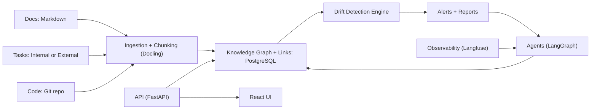
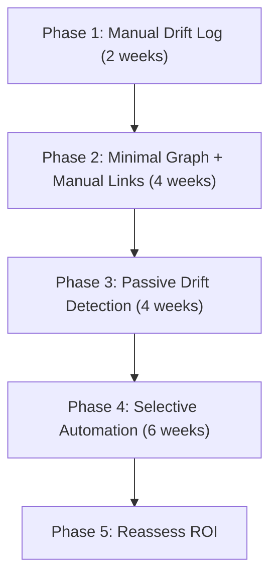

# Knowledge Sync System: Internal Viability, Stack Fit, and Go/No-Go

_Context: Internal system for continuous agent loop / ideation for the Vibe platform (not a product initially)._  
_Date: 2026-02-05_

This doc delivers three things:

1. **Executive summary** (one-page view).
2. **Scoring rubric + go/no-go thresholds.**
3. **Stack-specific analysis** based on `tech_stack_options.txt`, including a table of components/features you can reuse.

---

**Executive Summary**

**Decision framing:** Build a narrow internal system that reduces doc/task/code drift in your continuous agent loop. This is viable _only_ if drift is frequent enough to justify ongoing maintenance and the system can be trusted with low-noise signals.

**Recommendation (internal use):**

- **Proceed with a phased build** focused on a minimal knowledge graph, manual linking, and passive drift detection.
- **Avoid heavy automation** until precision is proven and the team trusts the alerts.
- **Use your existing stack options** (PostgreSQL, FastAPI, LangGraph, Langfuse, Docling, React) to reduce integration overhead.

**Key risks (internal):**

- False positives erode trust and create alert fatigue.
- Over-automation turns the system into a blocker.
- If agents do not reliably write updates, the graph becomes another stale artifact.

**Go/No-Go (simple rule):**

- **Go** if you can document **4+ meaningful drift incidents in 2 weeks** OR **>5 hours of rework** directly attributable to drift.
- **No-Go** if drift is rare or low-cost, or if manual linking cannot be kept under ~5 minutes per change.

---

## 1) Viability Scorecard (Rubric + Threshold)

Use this after 2-4 weeks of manual drift logging.

| Factor             | Weight   | Score (0-5) | Weighted Score | Evidence Required                     | Notes |
| ------------------ | -------- | ----------- | -------------- | ------------------------------------- | ----- |
| Drift Frequency    | 0.20     |             |                | Count of meaningful drift incidents   |       |
| Drift Cost         | 0.20     |             |                | Time lost + bug impact                |       |
| Signal Clarity     | 0.15     |             |                | Clear, objective drift rules exist    |       |
| Process Fit        | 0.15     |             |                | Can link with <5 min overhead         |       |
| Agent Reliability  | 0.10     |             |                | Agents can write updates consistently |       |
| Integration Cost   | 0.10     |             |                | Minimal friction with chosen tools    |       |
| Trust & Governance | 0.10     |             |                | Auditable changes + human review      |       |
| **Total**          | **1.00** |             |                |                                       |       |

**Thresholds:**

- **Go**: Weighted score >= **3.6 / 5.0**
- **Hold**: 3.0 - 3.59 (continue manual logging, tighten rules)
- **No-Go**: < 3.0

---

## 2) Tailored Stack for Vibe (From `tech_stack_options.txt`)

**Target stack choice for internal build:**

- **Core data**: PostgreSQL (primary store + vector support if needed)
- **API**: FastAPI
- **Agent orchestration**: LangGraph + Pedantic AI
- **Observability**: Langfuse
- **Doc ingestion**: Docling
- **UI**: React + Tailwind + ShadCN
- **Automation**: N8N (optional for scheduled drift scans)

Mermaid: High-level flow

---

## 3) Component Reuse Table (Critical Fit Analysis)

This table maps your **system needs** to **existing stack options**, with a critical assessment of fitness and caveats.

| System Need                     | Stack Option(s)                    | Use It For                                       | Fit (High/Med/Low) | Critical Caveats                          | Decision                |
| ------------------------------- | ---------------------------------- | ------------------------------------------------ | ------------------ | ----------------------------------------- | ----------------------- |
| Primary knowledge store + links | PostgreSQL                         | Graph + link tables, structured metadata         | High               | Graph queries less ergonomic than Neo4j   | **Use now**             |
| Graph-native relationships      | Neo4j                              | Explicit graph traversal, relationship analytics | Med                | Adds another system + sync complexity     | **Defer**               |
| Vector/RAG storage              | PostgreSQL                         | Embeddings + retrieval                           | High               | Needs tuning for recall/latency           | **Use if RAG needed**   |
| Agent orchestration             | LangGraph                          | Multi-agent flow, human-in-loop nodes            | High               | Requires disciplined state design         | **Use now**             |
| Agent framework                 | Pedantic AI                        | Core agent runtime, tool routing                 | High               | Ensure compatibility with LangGraph state | **Use now**             |
| Agent observability             | Langfuse                           | Tool call tracing, cost, latency                 | High               | Adds instrumentation overhead             | **Use now**             |
| Doc ingestion                   | Docling                            | Extract + chunk markdown/PDF/HTML                | High               | Chunking quality affects drift precision  | **Use now**             |
| Web data extraction             | Crawl4AI / Website Data Extraction | Web sources for ideas/specs                      | Med                | Web content noise can pollute KB          | **Use selectively**     |
| Agent auth                      | Arcade + MCP SDK                   | Secure tool access                               | Med                | Adds integration surface area             | **Defer unless needed** |
| Prototyping automation          | N8N                                | Scheduled scans, data pulls                      | Med                | Can become a separate source of truth     | **Optional**            |
| API layer                       | FastAPI                            | CRUD + query endpoints                           | High               | Keep surface small to avoid sprawl        | **Use now**             |
| UI                              | React + Tailwind + ShadCN          | Internal dashboards + review UI                  | High               | Avoid building heavy UI early             | **Minimal UI**          |
| Auth                            | Supabase / Auth0                   | Internal access control                          | Low                | Overkill for internal tool                | **Defer**               |
| Deployment                      | Render                             | Internal service deployment                      | Med                | Might be unnecessary at prototype stage   | **Optional**            |
| Self-host LLM                   | Ollama                             | Local inference                                  | Low                | Not critical for drift detection          | **Defer**               |
| Local search                    | SearXNG / Brave                    | Web retrieval                                    | Low                | Not core to internal loop                 | **Defer**               |
| Code review                     | CodeRabbit                         | PR analysis                                      | Med                | Not drift detection, but useful QA        | **Optional**            |

---

## 4) Minimal Viable Internal Stack (Recommendation)

| Layer               | Recommended Choice        | Why It Fits                                 | Limitations                         |
| ------------------- | ------------------------- | ------------------------------------------- | ----------------------------------- |
| Storage             | PostgreSQL                | Single source of truth for structured links | Graph queries are manual            |
| API                 | FastAPI                   | Quick CRUD + agent endpoints                | Needs schema discipline             |
| Agent Orchestration | LangGraph                 | State + human review nodes                  | Requires careful routing            |
| Agent Framework     | Pedantic AI               | Flexible tooling integration                | Ensure consistent context writeback |
| Observability       | Langfuse                  | Debug drift signals + agent reliability     | Extra instrumentation work          |
| Doc Ingestion       | Docling                   | Reliable extraction                         | Chunking rules must be tuned        |
| UI                  | React + Tailwind + ShadCN | Lightweight internal UI                     | Avoid building heavy admin UI       |

---

## 5) Internal Build Plan (Phased)

Mermaid: Viability ladder

---

## 6) Risks and Mitigations (Internal Use)

| Risk                                | Impact | Mitigation                                           |
| ----------------------------------- | ------ | ---------------------------------------------------- |
| False positives cause alert fatigue | High   | Start with narrow rules; require manual confirmation |
| Agents fail to write back updates   | High   | Enforce end-of-run writeback + audit trail           |
| Link discipline becomes overhead    | Med    | Automate link suggestions; keep manual confirmation  |
| Graph becomes stale                 | Med    | Daily drift scan + owner assignment                  |
| Over-automation blocks shipping     | High   | Keep system advisory until trust is proven           |

---

## 7) Go/No-Go Checklist (Operational)

**Go if all true:**

- 4+ meaningful drift incidents in 2 weeks
- > = 5 hours rework caused by drift
- Manual linking can be done in < 5 min per change
- At least 70% of alerts are accurate in pilot

**No-Go if any true:**

- Drift incidents are rare or low-cost
- Alert precision below 50% after tuning
- Team bypasses the system consistently

---

## Bottom Line

For your continuous agent loop, a **small, opinionated internal system is viable** if drift is frequent and you can keep noise low. Use the existing stack options to minimize integration overhead and focus on a **single reliable knowledge graph** with conservative drift detection. Build only enough UI and automation to keep the system trustworthy and maintainable.

---

_Appendix: Source of stack options: `docs/tech_stack_options.txt`_
