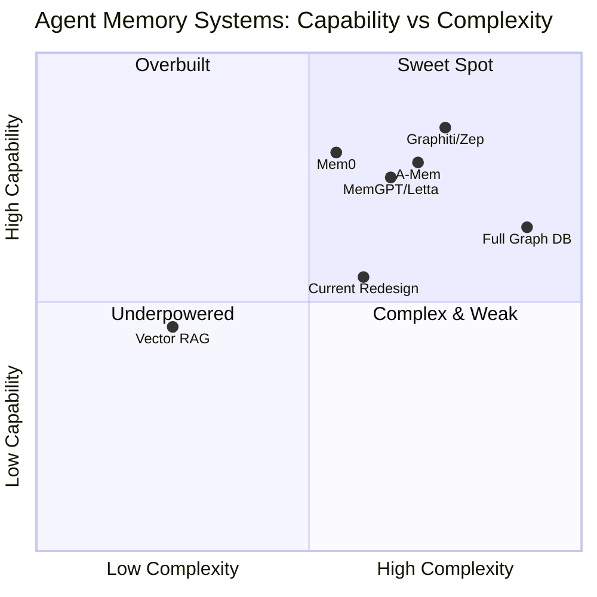
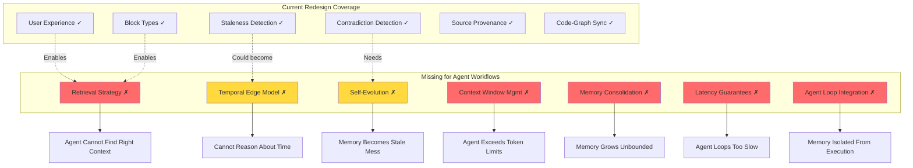
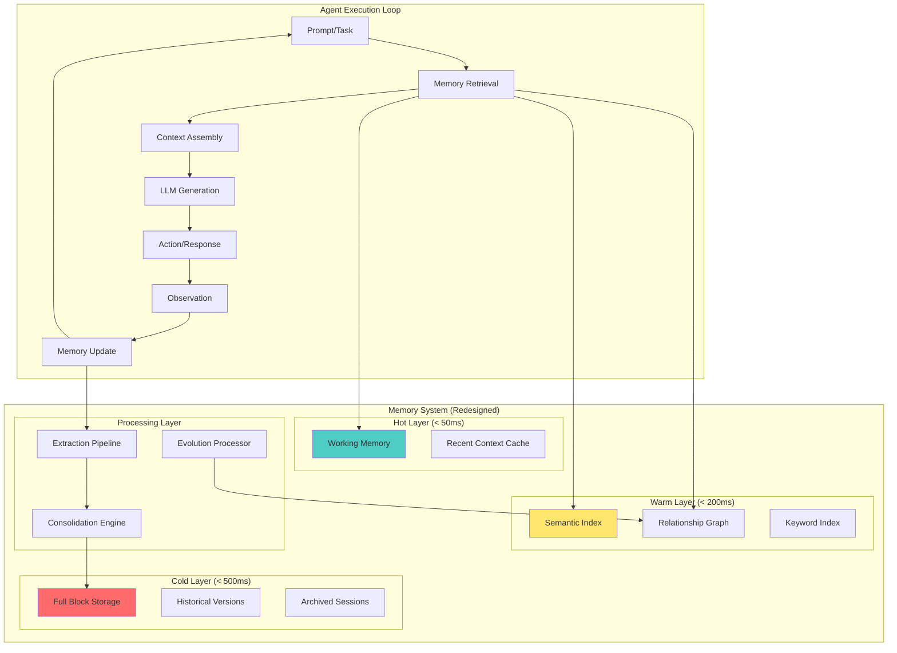
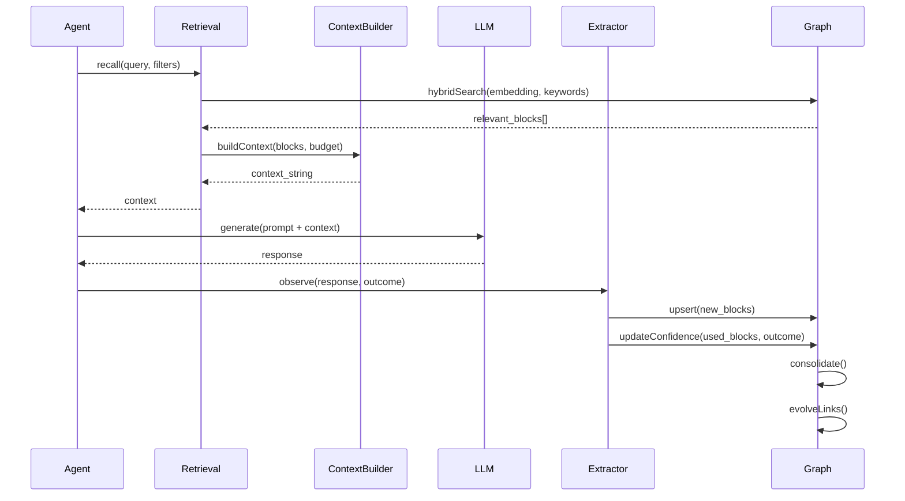
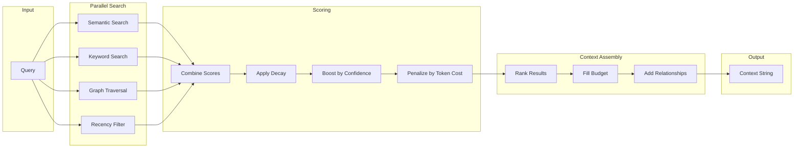
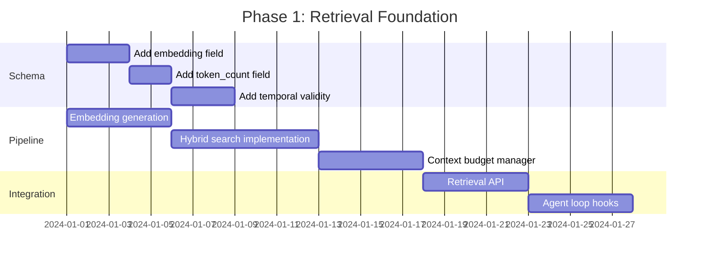
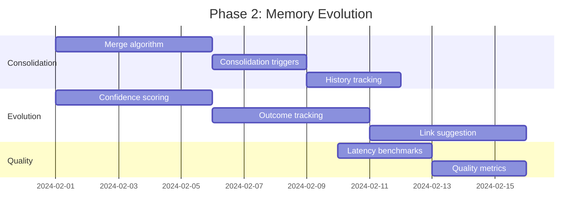

# Memory Graph Architecture: Agent Workflow Optimization Analysis

## First Principles Evaluation of the Memory Graph Redesign

---

## Executive Summary

This analysis applies first principles reasoning to evaluate whether the proposed memory graph architecture (from `memory-graph-architecture-redesign.md`) is optimized for **agent workflows**.

**Key Finding**: The redesign document is **user-experience-centric** but lacks critical **agent-execution primitives**. While it correctly identifies what humans need from a memory system, it doesn't address how an AI agent efficiently retrieves, updates, and reasons over memory during execution loops.

| Dimension              | Current Redesign    | Agent-Optimized   | Gap Severity |
| ---------------------- | ------------------- | ----------------- | ------------ |
| User Experience        | Strong              | N/A               | -            |
| Retrieval Latency      | Not addressed       | P95 < 300ms       | Critical     |
| Memory Consolidation   | Partially addressed | Continuous        | High         |
| Context Window Mgmt    | Not addressed       | Core requirement  | Critical     |
| Temporal Reasoning     | Staleness only      | Bi-temporal edges | High         |
| Relationship Traversal | Abstraction levels  | Multi-hop graph   | Medium       |
| Memory Evolution       | Passive storage     | Self-organizing   | High         |

---

## Part 1: First Principles Analysis

### 1.1 Problem Statement

**What problem are we actually solving?**

From the **user's perspective** (what the redesign addresses):

> "Help me build something real, don't let me forget important things, and tell me when I'm wrong."

From the **agent's perspective** (what's missing):

> "Given a prompt, retrieve precisely the relevant context from potentially thousands of memories, within latency constraints, without exceeding context window limits."

These are **complementary but distinct problems**.

### 1.2 Assumptions Identified

The redesign document makes several implicit assumptions:

| #   | Assumption                                      | Source                | Valid?                               |
| --- | ----------------------------------------------- | --------------------- | ------------------------------------ |
| 1   | Memory is primarily for user reference          | Part 1.2 User Journey | Partial                              |
| 2   | The graph is a "tab" users occasionally look at | Part 3.4              | False for agents                     |
| 3   | Extraction happens per-conversation             | Part 2.2              | True but incomplete                  |
| 4   | Staleness = technical versioning only           | Part 2.1              | True for tech, false for agent cache |
| 5   | Contradictions are user-resolved                | Part 4.4              | Problematic for autonomy             |
| 6   | Block types are semantic categories             | Part 3.2              | Misses retrieval patterns            |
| 7   | Three-layer model solves surfacing              | Part 4.2              | Lacks retrieval mechanics            |
| 8   | Proactive surfacing "just works"                | Part 3.3              | Handwaves the hard problem           |

### 1.3 Assumptions Challenged

| Assumption                         | Challenge                                                                   | Verdict                          |
| ---------------------------------- | --------------------------------------------------------------------------- | -------------------------------- |
| "Memory is for user reference"     | Agents need memory during every generation loop, not just when users browse | **Expand scope**                 |
| "Graph is a tab"                   | For agents, the graph IS the context—not a visual UI                        | **Redesign mental model**        |
| "Contradictions are user-resolved" | Autonomous agents can't pause for human input on every contradiction        | **Add auto-resolution policies** |
| "Block types are semantic"         | For retrieval, what matters is HOW to find blocks, not WHAT they mean       | **Add retrieval metadata**       |
| "Proactive surfacing works"        | This is the core retrieval problem—it needs explicit algorithms             | **Define retrieval strategy**    |

### 1.4 Fundamentals (Undeniable Truths)

1. **LLM context windows are finite** — No matter how large, you cannot fit all memories
2. **Retrieval is the bottleneck** — The hard problem is finding the RIGHT information, not storing it
3. **Latency compounds** — Each retrieval in an agent loop adds latency; 10 retrievals × 500ms = 5 seconds
4. **Memory must evolve** — Static memory becomes stale; dynamic memory requires update mechanics
5. **Agents operate in loops** — Plan → Act → Observe → Update; memory must integrate at each step
6. **Relationships matter more than nodes** — What connects ideas is often more valuable than ideas themselves

---

## Part 2: Comparative Analysis of Agent Memory Systems

### 2.1 System Comparison Matrix



### 2.2 Feature Comparison Table

| Feature                   | Graphiti/Zep                           | Mem0                 | MemGPT/Letta         | A-Mem                | Current Redesign       |
| ------------------------- | -------------------------------------- | -------------------- | -------------------- | -------------------- | ---------------------- |
| **Temporal awareness**    | Bi-temporal edges (t_valid, t_invalid) | Decay scoring        | Session-based        | Evolving connections | Staleness flags only   |
| **Retrieval latency**     | P95 < 300ms                            | Optimized            | Variable             | Not specified        | Not addressed          |
| **Memory hierarchy**      | Single graph                           | Flat + graph variant | Core/Archival/Recall | Self-organizing      | Three-layer conceptual |
| **Relationship modeling** | Typed edges with validity              | Entity relationships | Self-editing links   | Zettelkasten links   | Abstraction levels     |
| **Conflict resolution**   | Temporal invalidation                  | Not explicit         | Manual               | Autonomous evolution | User workflow          |
| **Context window mgmt**   | Hybrid search                          | Automatic extraction | Explicit pagination  | Not specified        | Not addressed          |
| **Benchmark (LOCOMO)**    | 94.8% (DMR)                            | 68.5%                | 74.0%                | Not reported         | N/A                    |
| **Self-evolution**        | Graph updates                          | Memory decay         | Self-editing         | Autonomous           | Passive                |

### 2.3 Key Insights from State-of-Art

#### Graphiti/Zep (Highest Performing)

- **Key innovation**: Bi-temporal model tracking both event time AND ingestion time
- **Why it matters**: Agents can ask "what did I know at time T?" not just "what do I know now?"
- **Critical feature**: Edges have validity intervals, enabling historical queries without recomputation

#### Mem0 (Production-Ready)

- **Key innovation**: Memory decay—forgetting is a feature, not a bug
- **Why it matters**: Prevents memory bloat that slows retrieval
- **Critical feature**: Graph variant adds 2% improvement via relational structure

#### MemGPT/Letta (Transparent Memory)

- **Key innovation**: Treats context window like OS memory with explicit paging
- **Why it matters**: Agent can introspect what's in "RAM" vs "disk"
- **Critical feature**: Self-editing memory allows personality evolution

#### A-Mem (Zettelkasten-Inspired)

- **Key innovation**: Memories generate their own descriptions and connections
- **Why it matters**: Memory structure evolves without explicit commands
- **Critical feature**: Each memory is atomic, self-contained, and linked

---

## Part 3: Gap Analysis

### 3.1 Critical Gaps



### 3.2 Gap Details with Recommendations

#### Gap 1: No Retrieval Strategy

**Current State**: "Proactive surfacing" mentioned but not specified
**Problem**: How does the agent find relevant memories from thousands of blocks?
**What Others Do**:

- Graphiti: Hybrid search (semantic + BM25 + graph traversal)
- Mem0: Embedding similarity + relevance decay
  **Recommendation**:
  | Action | Priority | Implementation |
  |--------|----------|----------------|
  | Add embedding field to blocks | P0 | `embedding: vector(1536)` |
  | Implement hybrid search | P0 | Semantic + keyword + relationship traversal |
  | Add retrieval scoring | P1 | Combine recency, relevance, relationship distance |
  | Define retrieval API | P0 | `retrieve(query, limit, filters, depth)` |

#### Gap 2: No Context Window Management

**Current State**: Not addressed
**Problem**: When agent has 50 relevant memories but only 4k tokens of budget, what gets included?
**What Others Do**:

- MemGPT: Explicit core/archival split with paging
- Letta: "Memory blocks" that compress older context
  **Recommendation**:
  | Action | Priority | Implementation |
  |--------|----------|----------------|
  | Add token_count to blocks | P0 | Track token cost per block |
  | Implement context budget | P0 | `buildContext(query, maxTokens)` |
  | Add summarization layer | P1 | Compress distant memories automatically |
  | Define priority scoring | P0 | Which memories get "evicted" first |

#### Gap 3: No Memory Consolidation

**Current State**: "Duplicate detection" via Jaccard similarity
**Problem**: Near-duplicates accumulate; 10 mentions of "mobile-first" become 10 blocks
**What Others Do**:

- Mem0: Extraction + update phases merge new info
- A-Mem: Memories actively generate connections and consolidate
  **Recommendation**:
  | Action | Priority | Implementation |
  |--------|----------|----------------|
  | Implement merge operation | P0 | Consolidate similar blocks with source tracking |
  | Add consolidation triggers | P1 | After N new blocks, run consolidation |
  | Track merge history | P1 | `mergedFrom: [blockIds]` for provenance |
  | Define similarity threshold | P0 | When is something "the same idea"? |

#### Gap 4: No Temporal Edge Model

**Current State**: Staleness is a boolean flag on blocks
**Problem**: Cannot answer "What did I believe about X in January?" or "When did this become true?"
**What Others Do**:

- Graphiti: Edges have `(t_valid, t_invalid)` intervals
- Zep: Bi-temporal model (event time + ingestion time)
  **Recommendation**:
  | Action | Priority | Implementation |
  |--------|----------|----------------|
  | Add validity intervals to relationships | P1 | `validFrom`, `validUntil` on edges |
  | Track ingestion time | P0 | `ingestedAt` separate from `createdAt` |
  | Enable historical queries | P2 | `getGraphAsOf(timestamp)` |
  | Add temporal reasoning | P2 | "This contradicts what you believed on [date]" |

#### Gap 5: No Latency Guarantees

**Current State**: Not addressed
**Problem**: Agent loops multiply latency; 5 tool calls × 500ms retrieval = 2.5s overhead
**What Others Do**:

- Zep: P95 < 300ms via hybrid search without LLM calls
- Mem0: Optimized extraction pipeline
  **Recommendation**:
  | Action | Priority | Implementation |
  |--------|----------|----------------|
  | Define latency SLOs | P0 | Retrieval < 200ms P95, extraction < 500ms |
  | Avoid LLM in retrieval path | P0 | Use embeddings + graph traversal only |
  | Add caching layer | P1 | Cache frequent queries and recent context |
  | Benchmark retrieval | P0 | Track and alert on latency regression |

#### Gap 6: No Self-Evolution Mechanism

**Current State**: Passive storage; corrections are user-initiated
**Problem**: Memory doesn't learn from agent's experiences
**What Others Do**:

- A-Mem: Memories generate their own links and descriptions
- MemGPT: Self-editing memory updates personality and facts
  **Recommendation**:
  | Action | Priority | Implementation |
  |--------|----------|----------------|
  | Add confidence scoring | P1 | Blocks gain/lose confidence based on outcomes |
  | Implement outcome tracking | P1 | Did using this memory lead to success/failure? |
  | Enable autonomous correction | P2 | Agent can flag and correct its own memories |
  | Add link suggestion | P1 | "This block might relate to [others]" |

#### Gap 7: No Agent Loop Integration

**Current State**: Graph is "a tab" users browse
**Problem**: Memory needs to integrate into Plan → Act → Observe → Update cycle
**What Others Do**:

- All modern systems: Memory is a tool the agent calls, not a sidebar
  **Recommendation**:
  | Action | Priority | Implementation |
  |--------|----------|----------------|
  | Define memory operations | P0 | `remember(content)`, `recall(query)`, `update(id, delta)` |
  | Add observe hook | P0 | After each action, extract learnings |
  | Create planning integration | P1 | Before planning, retrieve relevant context |
  | Enable reflection | P2 | Periodic "what have I learned?" synthesis |

---

## Part 4: Architectural Recommendations

### 4.1 Proposed Agent-Optimized Architecture



### 4.2 Memory Operation Lifecycle



### 4.3 Recommended Block Schema Additions

```typescript
// Current schema additions needed for agent workflows
interface AgentOptimizedBlock {
  // Existing fields from redesign...
  id: string;
  title: string;
  content: string;
  abstractionLevel: "vision" | "strategy" | "tactic" | "implementation";

  // === NEW: Retrieval Fields ===
  embedding: number[]; // Vector embedding for semantic search
  tokenCount: number; // For context budget management
  keywords: string[]; // BM25-searchable terms

  // === NEW: Temporal Fields ===
  validFrom: Date | null; // When this became true
  validUntil: Date | null; // When this stopped being true
  ingestedAt: Date; // When agent learned this
  lastAccessedAt: Date; // For decay/eviction
  accessCount: number; // Usage frequency

  // === NEW: Evolution Fields ===
  confidence: number; // 0-1 score, updated by outcomes
  consolidatedFrom: string[]; // IDs of merged blocks
  suggestedLinks: string[]; // AI-suggested relationships
  evolutionHistory: EvolutionEvent[];

  // === NEW: Agent Loop Fields ===
  usedInActions: string[]; // Which agent actions used this
  outcomeCorrelation: number; // Did using this help or hurt?
  retrievalScore: number; // Cached relevance score
}

interface EvolutionEvent {
  timestamp: Date;
  type: "created" | "updated" | "merged" | "superseded" | "confidence_changed";
  reason: string;
  previousValue?: any;
}
```

### 4.4 Retrieval Algorithm Recommendation



**Scoring Formula**:

```
score = (semantic_similarity × 0.4)
      + (keyword_match × 0.2)
      + (relationship_proximity × 0.2)
      + (recency_score × 0.1)
      + (confidence × 0.1)
      - (token_cost_penalty)
```

---

## Part 5: Integration with Current Redesign

### 5.1 What to Keep

| Feature                                                          | Reason                                         |
| ---------------------------------------------------------------- | ---------------------------------------------- |
| 5 Dimensions (Problem, Customer, Solution, Viability, Execution) | Good semantic organization for filtering       |
| 5 Block Types (Knowledge, Belief, Decision, Question, Action)    | Useful for agent understanding intent          |
| Three-layer conceptual model                                     | Aligns with memory tiers; needs implementation |
| Staleness detection                                              | Good foundation; extend to temporal edges      |
| Contradiction detection                                          | Critical for consistency; add auto-resolution  |
| Source provenance                                                | Essential for trust; add outcome correlation   |
| Code-graph sync                                                  | Unique differentiator; high value              |

### 5.2 What to Modify

| Feature                  | Current           | Modification                                         |
| ------------------------ | ----------------- | ---------------------------------------------------- |
| Staleness                | Boolean flag      | Temporal validity intervals                          |
| Duplicate detection      | Jaccard 0.8       | Add embedding similarity + consolidation             |
| Contradiction resolution | User workflow     | Add autonomous policies + escalation                 |
| Block structure          | Semantic only     | Add retrieval metadata (embedding, tokens, keywords) |
| Graph visualization      | Primary interface | Secondary; context injection is primary              |

### 5.3 What to Add

| Feature                | Priority | Rationale                       |
| ---------------------- | -------- | ------------------------------- |
| Retrieval API          | P0       | Core requirement for agent loop |
| Context budget manager | P0       | Prevent token overflow          |
| Embedding pipeline     | P0       | Enable semantic search          |
| Latency monitoring     | P0       | Ensure responsiveness           |
| Memory consolidation   | P1       | Prevent unbounded growth        |
| Confidence scoring     | P1       | Enable outcome-based evolution  |
| Temporal edges         | P1       | Enable historical reasoning     |
| Self-evolution hooks   | P2       | Long-term memory improvement    |

---

## Part 6: Implementation Roadmap

### 6.1 Phase 1: Retrieval Foundation (Critical)



### 6.2 Phase 2: Memory Evolution



### 6.3 Success Metrics

| Metric              | Target          | Measurement                                       |
| ------------------- | --------------- | ------------------------------------------------- |
| Retrieval latency   | P95 < 200ms     | Instrumentation                                   |
| Context relevance   | > 80% useful    | LLM-as-judge on samples                           |
| Memory growth       | < 10% bloat     | Unique concepts / total blocks                    |
| Agent loop speed    | < 5s total      | End-to-end timing                                 |
| Contradiction rate  | < 5% unresolved | Automated detection                               |
| Outcome correlation | Positive        | Do high-confidence blocks correlate with success? |

---

## Part 7: Conclusion

### 7.1 Summary

The current memory graph redesign is a **strong user-experience design** but an **incomplete agent system design**. It correctly identifies:

- What users need (don't let me forget, tell me when I'm wrong)
- How to organize knowledge (dimensions, types, abstraction levels)
- What problems exist (staleness, contradictions, code-graph disconnect)

But it doesn't specify:

- How agents retrieve context (the core retrieval problem)
- How memory fits in context windows (the budget problem)
- How memory evolves autonomously (the growth problem)
- How fast it needs to be (the latency problem)

### 7.2 Key Recommendations

1. **Treat retrieval as the core problem** — Not storage, not UI, but finding the right information fast
2. **Add embedding + hybrid search** — The table stakes for modern agent memory
3. **Implement context budgeting** — Prevent token overflow with explicit limits
4. **Define latency SLOs** — Agent loops multiply latency; keep retrieval under 200ms
5. **Enable memory consolidation** — Prevent unbounded growth
6. **Add temporal edges** — Move beyond boolean staleness to validity intervals
7. **Integrate into agent loop** — Memory isn't a tab; it's a tool called every turn

### 7.3 Final Assessment

| Aspect                   | Rating | Notes                                        |
| ------------------------ | ------ | -------------------------------------------- |
| User Value Proposition   | A      | Clear, compelling, well-articulated          |
| Technical Architecture   | B-     | Good concepts, missing retrieval mechanics   |
| Agent Workflow Fit       | C      | Major gaps in retrieval, latency, evolution  |
| Implementation Readiness | C+     | Needs retrieval and context management specs |
| Differentiation          | B+     | Code-graph sync is unique and valuable       |

**Bottom Line**: The redesign needs a companion "Agent Runtime Specification" that addresses retrieval, context management, latency, and evolution. The current document is a great UX spec; it needs an engineering spec to be agent-optimized.

---

## Sources

- [Mem0: Building Production-Ready AI Agents with Scalable Long-Term Memory](https://arxiv.org/html/2504.19413v1)
- [Survey of AI Agent Memory Frameworks | Graphlit](https://www.graphlit.com/blog/survey-of-ai-agent-memory-frameworks)
- [MemGPT | Letta Docs](https://docs.letta.com/concepts/memgpt/)
- [Benchmarking AI Agent Memory | Letta](https://www.letta.com/blog/benchmarking-ai-agent-memory)
- [Zep: A Temporal Knowledge Graph Architecture for Agent Memory](https://arxiv.org/abs/2501.13956)
- [Graphiti: Knowledge Graph Memory for an Agentic World](https://neo4j.com/blog/developer/graphiti-knowledge-graph-memory/)
- [A-Mem: Agentic Memory for LLM Agents](https://arxiv.org/abs/2502.12110)
- [Agent Memory: How to Build Agents that Learn and Remember | Letta](https://www.letta.com/blog/agent-memory)
- [Memory Blocks: The Key to Agentic Context Management | Letta](https://www.letta.com/blog/memory-blocks)
- [KA-RAG: Integrating Knowledge Graphs and Agentic Retrieval](https://www.mdpi.com/2076-3417/15/23/12547)

---

_Document Version: 1.0_
_Created: 2026-02-04_
_Analysis Type: First Principles + Comparative Research_
