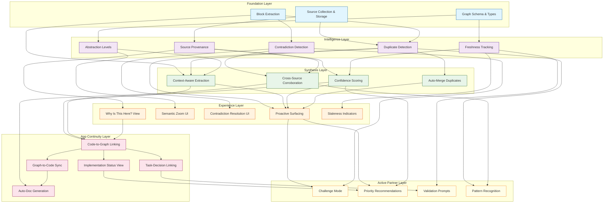

# Memory Graph Architecture Redesign

## A Fundamental Rethinking of Purpose, Synthesis, and Continuity

---

## Executive Summary

This document presents a comprehensive redesign of the memory graph system. However, before diving into technical solutions, we must first answer a fundamental question that the current architecture fails to address:

**What is the memory graph actually for, from the user's perspective?**

The current implementation treats the memory graph as a technical storage layer. This is wrong. The memory graph should be the **externalized thinking partner** that helps users build something real — a product, a business, a solution to a problem they care about.

---

## Part 1: The Missing User Story

### 1.1 Who Is the User?

The Idea Incubator serves **solo founders and small teams** who are:

- Exploring whether an idea is worth pursuing
- Validating assumptions before committing resources
- Building an MVP while learning about their market
- Iterating based on feedback and discoveries

They are NOT:

- Data scientists who want to query a knowledge graph
- Enterprise architects mapping system dependencies
- Researchers cataloging information

**Core User Need**: "Help me build something real, don't let me forget important things, and tell me when I'm wrong."

### 1.2 The User Journey (Currently Ignored)

The memory graph should serve users across these phases:

| Phase             | User Mindset                      | What They Need From Memory Graph                                        |
| ----------------- | --------------------------------- | ----------------------------------------------------------------------- |
| **Exploration**   | "What problem should I solve?"    | Surface patterns in their frustrations, skills, market observations     |
| **Validation**    | "Is this idea worth pursuing?"    | Track assumptions, what's validated vs. hypothetical, critical unknowns |
| **Specification** | "What exactly am I building?"     | Requirements, constraints, decisions made, rationale                    |
| **Building**      | "How do I implement this?"        | What to build next, gotchas to avoid, context for each task             |
| **Iteration**     | "What did I learn? What changes?" | Connect learnings back to assumptions, update decisions                 |

**Critical Gap**: The current architecture doesn't differentiate between these phases. A block is a block, regardless of whether the user is exploring or building.

### 1.3 Use Cases the Architecture Must Support

**UC1: "Don't let me forget"**

> User discusses market size in session 1. In session 47, they're making a pricing decision. The memory graph should surface: "You previously noted TAM of $50B with 15% CAGR. Relevant?"

**UC2: "Tell me when I'm contradicting myself"**

> User says "We're mobile-first" in week 1. In week 8, they're designing a desktop-heavy dashboard. The system should flag: "This conflicts with your mobile-first decision from January."

**UC3: "What should I validate next?"**

> User has 12 assumptions marked. 3 are critical and unvalidated. The memory graph should prioritize: "Before building, consider validating: [list of high-risk assumptions]."

**UC4: "Why did we decide this?"**

> Six months in, user wonders why they chose technology X. Memory graph should show: "Decision made on [date] because [reasons], based on [sources]."

**UC5: "What do I know about X?"**

> User asks "What do we know about our competitors?" Memory graph should synthesize all competitor-related information into a coherent answer.

**UC6: "Is this still true?"**

> User references a market statistic from 8 months ago. Memory graph should flag: "This data is from [source] dated [date]. May be outdated."

**UC7: "What's blocking my build?"**

> User is implementing feature Y. Memory graph should surface: "Depends on decision about [X] which is still unresolved" or "Previous attempt at similar feature failed because [reason]."

---

## Part 2: Diagnosis — What's Wrong Today

### 2.1 The Staleness Problem (Technical Only)

**Scope**: Staleness tracking applies only to technical information with clear versioning — frameworks, languages, modules, APIs. Business assumptions, market observations, and strategy decisions don't have "versions" and aren't subject to staleness tracking.

**Current State**: Staleness indicators exist (`isStale` in useGraphDataWithWebSocket.ts, amber badges, AlertTriangle icons).

**Gap**: The cascade effect when technical dependencies change. When React 18→19, all blocks referencing React 18 patterns should be flagged for review. This cascade logic needs to be deterministic and continuous.

### 2.2 The Synthesis Problem

**User Impact**: The graph fills with near-duplicate blocks. Users can't find what they're looking for.

**Root Cause**: Each extraction happens in isolation. The AI doesn't know what's already in the graph.

**Current State**:

- `corroboratedBy` array exists in schema
- `contradicts` link type exists with red styling
- Duplicate detection uses Jaccard similarity (threshold 0.8)

**Gap**:

- No auto-detection of semantic contradictions (AI can detect these)
- No UI to surface corroboration counts ("3 sources agree")
- No "merge duplicates" UI action

### 2.3 The Abstraction Level Problem

**User Impact**: Users can't zoom out to see big picture or zoom in to details.

**Current State**: Abstraction infrastructure exists (abstractionTraversal.ts, GraphFilters.tsx, WhyIsThisHerePanel.tsx).

**Gap**: The semantic zoom UX isn't intuitive for quick big-picture/detail toggling. The default view doesn't leverage the abstraction hierarchy.

### 2.4 The Source Provenance Problem

**User Impact**: When multiple sources agree, users don't see strengthened confidence.

**Current State**:

- Blocks store `extractedFromMessageId` and `artifactId`
- `sourceWeight` field exists
- Source collector has weight tables for reliability scoring

**Gap**: UI doesn't prominently surface provenance. No "3 sources agree" badge.

### 2.5 The Code-Graph Disconnect

**User Impact**: No connection between "what I decided" and "what's actually built."

**Root Cause**: No bidirectional sync between graph and codebase.

**Gap**: This is genuinely missing. Need:

- Code nodes representing function/logic groups
- Cascade triggers when code changes to revalidate related graph nodes
- Task-to-decision linking that integrates with atomic task decomposition

---

## Part 3: Critical Analysis — Gaps in This Document

### 3.1 The "Too Many Dimensions" Problem

The current architecture proposes 17 graph dimensions:

> problem, solution, market, risk, fit, business, spec, distribution, marketing, manufacturing, user, competition, validation, tasks, timeline, customer, product

**This is overwhelming.** Users don't think in 17 dimensions. They think:

- What problem am I solving?
- Who has this problem?
- How will I solve it?
- Is it viable?
- What do I need to build?

**Proposed Simplification**:
| Dimension | Description |
|-----------|-------------|
| **Problem** | The pain, the gap, the opportunity |
| **Customer** | Who has this problem, their context |
| **Solution** | How we solve it, our approach |
| **Viability** | Can we build it? Can we sell it? Will it work? |
| **Execution** | What to build, decisions, tasks |

Five dimensions, not seventeen. Each maps to how users actually think.

### 3.2 The "Block Type Explosion" Problem

The current architecture has 21+ block types:

> insight, fact, assumption, question, decision, action, requirement, option, pattern, synthesis, meta, constraint, blocker, epic, story, task, bug, persona, milestone, evaluation, learning

**Users don't care about these distinctions.** They care about:

- What do I know? (facts, insights)
- What am I assuming? (assumptions, hypotheses)
- What did I decide? (decisions)
- What do I need to find out? (questions, unknowns)
- What do I need to do? (actions, tasks)

**Proposed Simplification**:
| Block Type | User Question | Examples |
|------------|---------------|----------|
| **Knowledge** | "What do I know?" | Facts, validated insights, research findings |
| **Belief** | "What am I assuming?" | Hypotheses, assumptions, unvalidated claims |
| **Decision** | "What did I decide?" | Choices made, rationale, constraints accepted |
| **Question** | "What do I need to learn?" | Open questions, research needed, unknowns |
| **Action** | "What do I need to do?" | Tasks, next steps, experiments to run |

Five block types, not twenty-one.

### 3.3 Missing: The "Active Partner" Dimension

The entire architecture treats the memory graph as passive storage. But users need an **active thought partner**.

**What's Missing**:

| Passive (Current)     | Active (Needed)                          |
| --------------------- | ---------------------------------------- |
| Store what user said  | Synthesize what it means                 |
| Track blocks          | Surface what's relevant now              |
| Detect contradictions | Prompt resolution                        |
| Mark things stale     | Suggest what to refresh                  |
| Store decisions       | Challenge decisions when context changes |
| Track assumptions     | Push to validate critical ones           |

**The memory graph should behave like a brilliant co-founder** who:

- Remembers everything
- Spots patterns the user missed
- Challenges fuzzy thinking
- Prioritizes what matters
- Keeps the user honest about assumptions

### 3.4 Missing: The Conversation Integration Model

**Critical Gap**: How does the memory graph actually integrate with the conversation?

Current state: Memory graph exists as a separate tab. Users occasionally look at it. It's not woven into the flow.

**What Should Happen**:

| Conversation Event         | Memory Graph Response                                            |
| -------------------------- | ---------------------------------------------------------------- |
| User states a fact         | Check: Is this new? Does it conflict? Who else said this?        |
| User makes a decision      | Record: What was decided, why, what it supersedes                |
| User asks a question       | Search: What do we already know about this?                      |
| User expresses uncertainty | Flag: Add to questions. Link to related assumptions.             |
| User describes a problem   | Connect: Similar problems? Previous attempts? Known constraints? |

**The memory graph should be invisible most of the time**, surfacing only when it has something valuable to add.

### 3.5 Missing: The "What's Important Right Now" Algorithm

The architecture doesn't address **attention management**. Even with perfect staleness tracking, contradiction detection, and source provenance — what should the user actually look at?

**Required**: A prioritization layer that says:

- "These 3 assumptions are critical and unvalidated"
- "This decision is 6 months old and context has changed"
- "These 2 blocks contradict — resolve before building more"
- "You haven't validated anything in the 'customer' dimension"

Without this, users face information overload.

### 3.6 Missing: The Learning Loop

The architecture describes extraction and storage, but not **the learning loop**:

```
Build → Observe → Learn → Update Graph → Inform Next Build
```

What happens when:

- User launches MVP and gets feedback?
- User runs an experiment and gets results?
- User talks to a customer and learns something new?
- Code behaves differently than expected?

**The graph should evolve based on reality, not just based on conversations.**

---

## Part 4: Reframed Architecture

### 4.1 Core Principle: The Graph Serves the Build

Every feature of the memory graph should answer: **"How does this help the user build something real?"**

| Feature                 | How It Helps Build                                                   |
| ----------------------- | -------------------------------------------------------------------- |
| Staleness detection     | Prevents building on outdated assumptions                            |
| Contradiction detection | Prevents building inconsistent features                              |
| Source provenance       | Enables debugging when reality doesn't match expectations            |
| Abstraction levels      | Enables focus — big picture for strategy, details for implementation |
| Code sync               | Ensures what's built matches what was decided                        |

### 4.2 The Three-Layer Model

**Layer 1: Raw Knowledge**

- Everything the user has said, found, or created
- Unprocessed, timestamped, source-linked
- Never deleted, only superseded
- This is the "truth record"

**Layer 2: Synthesized Understanding**

- AI-processed insights, patterns, decisions
- Deduplicated, linked, confidence-scored
- Evolves as new information arrives
- This is what users interact with

**Layer 3: Actionable Surface**

- What's relevant right now
- Prioritized by urgency, phase, and user intent
- Proactively surfaced during conversation
- This is what drives behavior

### 4.3 The Freshness Model (User-Centric)

Instead of technical freshness states, users should see:

| Indicator      | User Meaning                                                            |
| -------------- | ----------------------------------------------------------------------- |
| **Current**    | "This is up to date. You can rely on it."                               |
| **Aging**      | "This is a few months old. Consider refreshing."                        |
| **Stale**      | "This is old. Don't make decisions based on this without verification." |
| **Superseded** | "This was replaced by newer information."                               |
| **Contested**  | "This conflicts with other information. Resolve before using."          |

Visual indicators should be obvious and actionable, not just metadata.

### 4.4 The Contradiction Resolution Workflow

When contradictions are detected:

1. **Surface**: Show user the conflicting blocks, side by side
2. **Context**: Show when each was created, from what source
3. **Suggest**: AI proposes which is more likely correct, with reasoning
4. **Resolve**: User chooses: keep one, merge both, create synthesis
5. **Cascade**: Update all dependent blocks

This should be a first-class UI experience, not a hidden flag.

### 4.5 The "Why Is This Here?" Experience

For every block, users should be able to ask:

- Where did this come from? (Source traceability)
- How confident should I be? (Corroboration count)
- What depends on this? (Downstream impact)
- What does this depend on? (Upstream assumptions)
- When was this last validated? (Freshness)
- Does anything contradict this? (Conflict detection)

One click should answer all of these.

### 4.6 The Build-Graph Connection

**From Graph to Code**:

- Requirements → linked to implementation files
- Decisions → linked to code that implements them
- Constraints → linked to validation/enforcement

**From Code to Graph**:

- File changes → trigger freshness checks on linked blocks
- Tests fail → flag relevant assumptions
- New code → suggest linking to requirements

**The graph should know what's built and what isn't.**

---

## Part 5: Implementation Priorities

Based on user impact, here's the recommended order:

### Priority 1: Don't Let Valuable Insights Disappear

**Problem**: Users forget what they learned. Insights from month 1 don't inform decisions in month 6.

**Solution**:

- Improve extraction quality (context-aware, deduplicated)
- Proactive surfacing during conversation
- "What do we know about X?" query capability

**User Experience**: "The system remembers what I told it and brings up relevant things at the right time."

### Priority 2: Don't Let Me Build on Lies

**Problem**: Users make decisions based on stale or contradictory information.

**Solution**:

- Staleness indicators (visible, actionable)
- Contradiction detection with resolution workflow
- Source provenance for verification

**User Experience**: "The system warns me when I'm about to rely on something uncertain."

### Priority 3: Help Me See the Forest and the Trees

**Problem**: Graph is overwhelming. Everything is flat.

**Solution**:

- Simplified dimension model (5, not 17)
- Semantic zoom (vision → strategy → tactic → detail)
- "What's important right now" prioritization

**User Experience**: "I can get the big picture or the details, depending on what I need."

### Priority 4: Connect What I Decided to What I Built

**Problem**: No link between decisions and implementation.

**Solution**:

- Requirement → code linking
- Change detection (code changes → graph alerts)
- "What's implemented vs. pending" view

**User Experience**: "I know what's built and what's still to do."

### Priority 5: Make It a Thought Partner, Not a Filing Cabinet

**Problem**: Graph is passive. User has to go look at it.

**Solution**:

- Proactive surfacing in conversation
- Challenge prompts ("You're building X, but you never validated Y")
- Pattern recognition ("You've mentioned this 3 times — seems important")

**User Experience**: "The system actively helps me think, not just stores what I said."

---

## Part 6: Design Decisions

### Q1: How Much Automation vs. User Control?

**Decision**: Option 1 (fully automatic) with Option 2 (suggest and confirm) as a toggle.

Default to fully automatic. Users can toggle to "suggest and confirm" mode for specific areas where they want more control.

### Q2: How Visible Should the Graph Be?

**Decision**: Option 2 — Conversation is primary, graph is supporting.

The graph exists as a reference and debugging tool. The real value surfaces through conversation context injection.

### Q3: What Happens When the AI Is Wrong?

**Decision**: Correction is part of the conversation prompt. When decisions change, the user is presented with suggestions to correct/revise affected nodes.

### Q4: How to Handle the "Everything Is Connected" Problem?

**Decision**: AI guides the path, user selects what to improve/update. Balance between proactive suggestions and user agency.

### Q5: What's the Right Granularity?

**Current Definition** (from memory-block.ts):

- `title`: Short 3-5 word summary
- `content`: The full block content
- `abstractionLevel`: vision | strategy | tactic | implementation

**Analysis of Current Block Schema**:

The current schema has structural issues:

1. **Two overlapping type systems**:
   - `memory-block.type`: 15 fixed types (content, link, meta, synthesis, pattern, decision, option, derived, assumption, cycle, placeholder, stakeholder_view, topic, external, action)
   - `memory_block_types` junction table: 21 canonical types (insight, fact, assumption, question, decision, action, requirement, option, pattern, synthesis, meta, constraint, blocker, epic, story, task, bug, persona, milestone, evaluation, learning)
   - Overlap creates confusion: which is authoritative?

2. **Missing fields for discussed features**:
   - No `composableSentence` for documentation puzzle pieces (AI generates this at creation)
   - No version history fields (versioning happens via status changes)
   - No explicit `corroboratedBy`/`contradicts` in block schema (exists in types but not persisted)

3. **Junction tables ARE already a tag system**: Both `memory_block_types` and `memory_graph_memberships` allow many-to-many relationships. The constraint is the fixed enum arrays.

---

## Part 7: Success Criteria (User-Centric)

### 7.1 Utility

| Metric                                                    | Target             |
| --------------------------------------------------------- | ------------------ |
| Users reference graph insights in decisions               | > 50% of decisions |
| Users report "the system reminded me of something useful" | Weekly occurrence  |
| Time to find relevant prior knowledge                     | < 30 seconds       |

### 7.2 Trust

| Metric                                         | Target                                 |
| ---------------------------------------------- | -------------------------------------- |
| Users report confidence in graph accuracy      | > 80%                                  |
| False positive rate for contradictions         | < 10%                                  |
| Users verify graph info before major decisions | Yes (initially), No (once trust built) |

### 7.3 Engagement

| Metric                          | Target                               |
| ------------------------------- | ------------------------------------ |
| Users look at graph proactively | Weekly                               |
| Users correct AI mistakes       | Decreasing over time                 |
| Users create blocks manually    | Occasional (shows graph is valuable) |

### 7.4 Build Acceleration

| Metric                                  | Target            |
| --------------------------------------- | ----------------- |
| Time from idea to validated MVP         | Measurably faster |
| Rework due to forgotten constraints     | Decreasing        |
| Decision quality (subjective, surveyed) | Improving         |

---

## Part 8: What's Actually True

| Claim                       | Status  | Notes                                                   |
| --------------------------- | ------- | ------------------------------------------------------- |
| Staleness tracking missing  | FALSE   | Exists in code, but scoped to technical versioning only |
| Extraction is context-blind | TRUE    | AI doesn't know graph state during extraction           |
| Contradictions undetected   | PARTIAL | Schema exists, needs AI auto-detection                  |
| Source provenance weak      | PARTIAL | Fields exist, needs UI surfacing                        |
| Graph-code disconnect       | TRUE    | Genuinely missing, core gap                             |

The pattern: **infrastructure exists, UI doesn't surface it**. The exception is code-graph linking, which is genuinely missing.

---

## Part 9: Recommended Next Steps

### Immediate (This Week)

1. **User research**: Talk to 3 current users. Ask: "What do you wish the memory graph did?"

2. **Audit current graph**: For one idea, count: blocks, duplicates, contradictions, stale items, orphans

3. **Define "unit of thought"**: What granularity actually helps users?

### Short-Term (This Month)

1. **Simplify dimensions**: Collapse 17 to 5. Migrate existing data.

2. **Add freshness indicators**: Simple visual indicators on blocks.

3. **Build contradiction detection**: Start with obvious cases (numeric, temporal).

### Medium-Term (This Quarter)

1. **Context-aware extraction**: Include graph state in extraction prompts.

2. **Proactive surfacing**: During conversation, surface relevant prior knowledge.

3. **Resolution workflows**: UI for resolving contradictions, confirming merges.

### Long-Term (This Year)

1. **Semantic zoom**: Vision → strategy → tactic → detail navigation.

2. **Code-graph sync**: Bidirectional linking with implementation.

3. **Active partner mode**: System challenges, questions, prioritizes.

---

_Document Version: 2.0_
_Last Updated: 2026-02-01_
_Author: System Architecture Review_

---

## Appendix: Dimension and Type Simplification

### Current → Proposed Graph Dimensions

| Current (17)                                                               | Proposed (5) | Rationale                    |
| -------------------------------------------------------------------------- | ------------ | ---------------------------- |
| problem                                                                    | Problem      | Core                         |
| user, customer                                                             | Customer     | Combined — both are "who"    |
| solution, spec, product                                                    | Solution     | What we're building          |
| market, competition, fit, business, distribution, marketing, manufacturing | Viability    | All answer "will this work?" |
| risk, validation, tasks, timeline                                          | Execution    | All about doing              |

### Current → Proposed Block Types

| Current (21)                                                             | Proposed (5) | Rationale                          |
| ------------------------------------------------------------------------ | ------------ | ---------------------------------- |
| fact, insight, pattern, synthesis                                        | Knowledge    | Things we know                     |
| assumption                                                               | Belief       | Things we think but haven't proven |
| decision, option, constraint, requirement                                | Decision     | Choices and constraints            |
| question, meta, placeholder                                              | Question     | Things we need to learn            |
| action, task, story, epic, bug, milestone, blocker, evaluation, learning | Action       | Things to do                       |

### Key File Reference

| Purpose           | File                                        | Status                           |
| ----------------- | ------------------------------------------- | -------------------------------- |
| Block extraction  | `agents/ideation/block-extractor.ts`        | Needs context-aware rewrite      |
| Source collection | `server/services/graph/source-collector.ts` | Schema exists, needs weaving     |
| Staleness         | Distributed across frontend hooks           | EXISTS                           |
| Contradictions    | `analysis-prompt-builder.ts`                | Schema exists, needs UI          |
| Graph UI          | `frontend/src/components/graph/`            | Semantic zoom + freshness EXISTS |
| Block schema      | `schema/entities/memory-block.ts`           | Core schema, may need extensions |

---

## Part 10: Critical Architecture Decision — Tags vs Fixed Taxonomy

### The Question

If dimensions (17) and block types (21) are primarily used for filtering, why not use a flexible tag system instead? Fixed taxonomies always have outliers.

### Current State

The codebase already uses junction tables that ARE effectively a tag system:

- `memory_block_types`: Many-to-many (block → types)
- `memory_graph_memberships`: Many-to-many (block → dimensions)

The constraint is the fixed enum arrays that limit what tags are allowed.

### Analysis

| Approach                       | Pros                                                                | Cons                                                      |
| ------------------------------ | ------------------------------------------------------------------- | --------------------------------------------------------- |
| **Fixed taxonomy** (current)   | Consistent filtering, predictable queries, AI can classify reliably | Always outliers, requires schema changes to add new types |
| **Open tags**                  | Infinite flexibility, no schema changes needed                      | Tag sprawl, inconsistent naming, harder AI classification |
| **Hybrid: canonical + custom** | Best of both — core tags for filtering + user/AI can add custom     | Complexity, need to handle tag synonyms                   |

### Recommendation

**Hybrid approach**:

1. Keep a small set of canonical tags for core filtering (5-7 dimensions, 5-7 types)
2. Allow arbitrary custom tags for specificity
3. AI suggests canonical tags but can also create contextual tags
4. Custom tags can be "promoted" to canonical if frequently used

This preserves filtering utility while eliminating the outlier problem.

### BUG: Extraction prompt only knows 10/17 dimensions

The extraction prompt at [block-extractor.ts:116](agents/ideation/block-extractor.ts#L116) lists only 10 dimensions:

```
problem, solution, market, risk, fit, business, spec, distribution, marketing, manufacturing
```

Missing: user, competition, validation, tasks, timeline, customer, product

---

## Part 11: Feature Dependency Map

The following diagram shows how features enable or block other capabilities. Arrows indicate dependencies — you can't build the target without the source in place.



### Key Insights from the Dependency Map

1. **Foundation is the bottleneck**: Everything depends on proper source collection, extraction, and schema. Get these wrong, and nothing downstream works.

2. **Duplicate Detection is a keystone**: It enables context-aware extraction, auto-merge, and proactive surfacing. Without it, the graph becomes noisy and untrustworthy.

3. **Proactive Surfacing is the gateway to Active Partner**: You can't have challenge mode, recommendations, or prompts without first being able to surface relevant information at the right time.

4. **Code-Graph linking requires confidence scoring**: You can't link code to decisions without knowing which decisions are reliable.

5. **Auto-Doc Generation requires both synthesis AND app continuity**: It sits at the intersection of corroboration (multiple sources agreeing) and code-graph linking (knowing what's built).

---

## Part 12: Stress Testing the Vision

### 11.1 Stress Test: "Documentation, Code & Tasks in Harmony"

**The Vision**: "The memory graph should be the place where auto-created documentation, code & tasks live in harmony and are synced to each other, eliminating stale documentation, missed tasks, and unresolved bugs."

**Analysis**:

| Aspect                   | Approach                                                                  | Key Mechanism                                                                                    |
| ------------------------ | ------------------------------------------------------------------------- | ------------------------------------------------------------------------------------------------ |
| **Code in graph**        | Function/logic groups as nodes, not raw files                             | Nodes represent semantic code units (a function, a module, a feature)                            |
| **Tasks in graph**       | Task nodes that integrate with atomic task decomposition                  | Need to define how task nodes relate to the existing task decomposition system                   |
| **Synced to each other** | Deterministic logic continuously runs to inform AI about scope of changes | When code/task/decision changes, cascade logic uses relationships + metadata to calculate impact |
| **Auto-docs**            | AI writes composable sentences at node creation time                      | Each node has a `documentationSentence` field generated on create                                |

**Key Insight**: The sync mechanism is NOT bidirectional polling — it's **deterministic cascade calculation** that runs continuously. When any node changes:

1. Traverse relationships to find affected nodes
2. Use metadata to calculate scope of impact
3. Surface this to AI agent as context for next action

### 11.2 Stress Test: "Nodes as Puzzle Pieces for Documentation"

**The Vision**: "Can a memory graph store multiple versions of a title/sentence that can act like puzzle pieces when joined with other nodes to form documentation on the fly without needing AI to synthesize sentences?"

**Analysis**:

This is essentially asking: can we do **compositional documentation** rather than **synthesized documentation**?

| Approach                          | Pros                                                         | Cons                                                                                    |
| --------------------------------- | ------------------------------------------------------------ | --------------------------------------------------------------------------------------- |
| **Compositional (puzzle pieces)** | Fully traceable; no hallucination risk; user controls output | Requires careful node design; may read awkwardly; users must write "composable" content |
| **Synthesized (AI generation)**   | Natural reading; adapts to context; fills gaps               | Hallucination risk; hard to trace; may diverge from truth                               |
| **Hybrid**                        | Best of both; compose structure, synthesize transitions      | Complexity; partial traceability                                                        |

**What the puzzle piece approach requires**:

1. **Canonical phrasing per node**: Each node needs a "documentation sentence" field that's written to be composable
2. **Ordering metadata**: Nodes need sequence/priority info to know what comes first
3. **Transition markers**: Nodes need to know what kind of transition to the next node (contrast, continuation, example, etc.)
4. **Template system**: Pre-defined document structures that pull in node content

**Example**:

```
Node A: "The target customer is solo founders with technical backgrounds."
Node B: "The primary problem is forgetting important insights across sessions."
Node C: "The solution is an AI-powered memory graph that surfaces relevant context."

Template: "Customer Overview"
→ [Insert: customer nodes]
→ [Insert: problem nodes]
→ [Insert: solution nodes]

Output:
"The target customer is solo founders with technical backgrounds.
The primary problem is forgetting important insights across sessions.
The solution is an AI-powered memory graph that surfaces relevant context."
```

**Verdict**: This IS possible, but with constraints:

- Users must write (or approve) composable sentences
- Automated extraction would need to produce composable output (current extraction doesn't)
- You lose the "natural flowing prose" benefit of AI synthesis

**Recommendation**:

- Layer 1: Compositional (traceable, no hallucination)
- Layer 2: AI can optionally "smooth" the output with transitions, clearly marked as AI additions

### 11.3 Updated Framing: "Plan, Build, and Inform"

Based on your clarification, the memory graph's purpose should be reframed as:

**"The memory graph serves to PLAN (decisions, tasks, sequences), BUILD (implementation, code-linking, status), and INFORM (surfacing, context, documentation)."**

This creates three clear modes:

1. **Planning mode**: Focus on decisions, dependencies, what-blocks-what
2. **Building mode**: Focus on tasks, implementation status, what's done vs. pending
3. **Informing mode**: Focus on retrieval, documentation, "what do we know about X?"

Each mode should show different information and prioritize different block types.

### 11.4 Staleness Clarification Applied

You clarified: "I'm not too concerned about 'outdated info' unless it's in relation to a technical framework, codebase, module or something that is clearly and technically defined as outdated because it has a newer version."

**Implication**: Staleness detection should be scoped to:

| Track Staleness                    | Don't Track Staleness                |
| ---------------------------------- | ------------------------------------ |
| Framework versions (React 18 → 19) | Market observations ("users want X") |
| API changes                        | Business hypotheses                  |
| Library compatibility              | Strategy decisions                   |
| Code dependencies                  | User research findings               |
| Technical documentation            | Competitive analysis                 |

**Implementation**: Add a `stale_trackable` boolean to blocks. Only technical/versioned blocks get freshness monitoring.

---

## Part 13: Resolved Design Questions

### Questions 1-10: Answered

| Q#  | Question                                                | Resolution                                                                                                                      |
| --- | ------------------------------------------------------- | ------------------------------------------------------------------------------------------------------------------------------- |
| 1   | What happens when the graph is wrong?                   | Correction workflow already exists in code.                                                                                     |
| 2   | How to handle staleness for non-technical info?         | Only track staleness for technical versioning (frameworks, languages, modules). Business/strategy info doesn't have "versions." |
| 3   | Who writes composable documentation sentences?          | AI writes them when the node is created.                                                                                        |
| 4   | Cost of being wrong at each layer?                      | Acknowledged — higher layers have higher stakes. This informs the iteration approach.                                           |
| 5   | What happens when a decision changes after tasks exist? | Cascade triggers prompt user with suggestions to correct/revise affected tasks.                                                 |
| 6   | When to challenge vs support?                           | AI guides the path, user selects what to improve/update. Balance through iteration.                                             |
| 7   | Three modes = three tools?                              | One tool covering all three modes.                                                                                              |
| 8   | How to prevent graph becoming maintenance burden?       | Code changes at file/function/grouping level trigger cascade to recalculate/revalidate affected graph nodes.                    |
| 9   | What if AI opinions are wrong?                          | Through iteration. Won't get everything right on first go.                                                                      |
| 10  | How to handle versioning without sprawl?                | Only one version displayed at a time. User can view previous via "versions" tab on node.                                        |

### Questions 11-20: Answered

| Q#    | Question                                | Resolution                                                                                                                                                      |
| ----- | --------------------------------------- | --------------------------------------------------------------------------------------------------------------------------------------------------------------- |
| 11-12 | Does 5×5 preserve filtering power?      | Types and dimensions not definitively defined yet. This is brainstorming for what they will eventually be. Consider hybrid tag system (Part 10).                |
| 13    | Cold-start problem?                     | Cold start = conversation hasn't started. Nodes are created automatically when conversation starts.                                                             |
| 14    | Can AI detect semantic contradictions?  | Yes. AI can figure this out.                                                                                                                                    |
| 15    | What triggers freshness update?         | Only for technical terms with clearly defined versions (frameworks, languages, modules).                                                                        |
| 16    | Three-layer architecture details?       | TBD — to be ironed out in implementation.                                                                                                                       |
| 17    | Source collection fragility?            | Brainstorming level. Will be addressed.                                                                                                                         |
| 18    | "What's Important Right Now" algorithm? | TBD — to be defined.                                                                                                                                            |
| 19    | How to link code to implicit decisions? | Core mechanics for synthesis/grouping/linking/abstracting are what we're figuring out. The point is to establish the mechanics, not assume linking is required. |
| 20    | User research vs prescribed solutions?  | Both prescribed solutions and new user insights can merge into new nodes. This isn't the core question.                                                         |

---

## Part 14: First Principles Analysis — Tags vs Fixed Taxonomy

### The Core Question

If the purpose of dimensions and types is filtering, why have fixed enums at all? Why not a flexible tag system?

### Current Architecture

The codebase already uses junction tables (many-to-many):

- `memory_block_types`: block ↔ types
- `memory_graph_memberships`: block ↔ dimensions

This IS a tag system — constrained by fixed enum arrays.

### Analysis: What Purpose Do Categories Serve?

| Purpose                       | Fixed Taxonomy              | Open Tags                   |
| ----------------------------- | --------------------------- | --------------------------- |
| **Filtering**                 | Predictable queries         | Flexible but inconsistent   |
| **AI classification**         | AI knows valid options      | AI might invent duplicates  |
| **2D queries** (WHERE × WHAT) | Works with fixed axes       | Works if tags are organized |
| **Evaluation completeness**   | "Missing problem dimension" | Harder to check coverage    |
| **Outliers**                  | Always exist                | Handled naturally           |

### Recommendation: Hybrid Tag System

1. **Canonical tags** (5-7 each for dimensions and types)
   - Core filtering, evaluation completeness checks
   - AI defaults to these

2. **Custom tags**
   - AI or user can add contextual tags
   - Not constrained by enum
   - Can be "promoted" to canonical if frequently used

3. **Tag synonyms**
   - System recognizes "customer" and "user" as equivalent
   - Prevents tag sprawl through normalization

### The Two Axes Still Matter

Even with flexible tags, the distinction between WHERE (spatial) and WHAT (semantic) is valuable:

- WHERE tags: Problem space, Customer space, Solution space, Execution space
- WHAT tags: Knowledge, Belief, Decision, Question, Action

A block tagged `[customer, assumption]` means: "An assumption about customers."

This 2D structure enables powerful queries that flat tags can't:

- "All assumptions in the customer space"
- "All decisions in the execution space"

### Schema Change Required

```typescript
// Remove enum constraint, keep junction table structure
memoryBlockTypes.blockType: text("block_type").notNull() // No enum
memoryGraphMemberships.graphType: text("graph_type").notNull() // No enum

// Add canonical flag
isCanonical: boolean // TRUE for core tags, FALSE for custom
```

This preserves the junction table architecture while removing the enum constraint.
