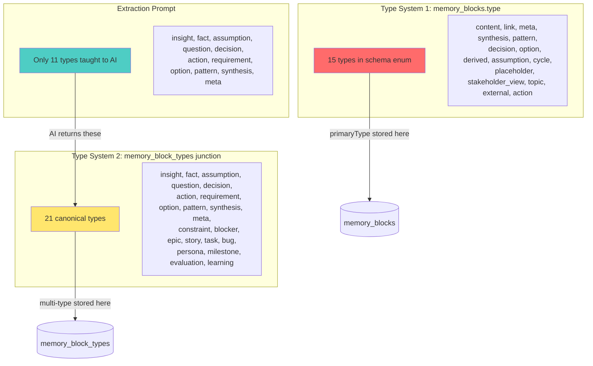
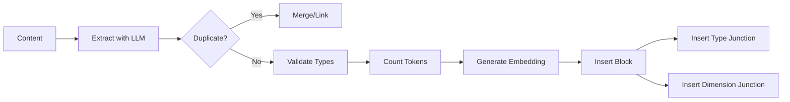

# Memory Graph: Critical Analysis of All Approaches

## Grounding This Analysis in Reality

Before evaluating any proposal, we must understand **what actually exists**.

---

## Part 1: The Current System (Reality Check)

### 1.1 The Dual Type System Problem

The current codebase has **two overlapping type systems** that create confusion:



**The Confusion:**

- `memory_blocks.type` has 15 types, many unused (cycle, placeholder, stakeholder_view)
- `memory_block_types` junction has 21 types, 10 not taught to AI
- AI only knows about 11 types but schema allows 21
- Some types overlap: `assumption` in both, `action` in both, `decision` in both

### 1.2 The Dimension Mismatch

```
Schema defines:        17 dimensions
Extraction prompt:     10 dimensions (missing 7)

Missing from prompt:   user, competition, validation, tasks, timeline, customer, product
```

**Impact**: AI cannot classify blocks into 7 dimensions that the schema supports.

### 1.3 Current Retrieval (No Semantic Search)

```typescript
// From graph-query-service.ts:78-81
if (graphQuery.searchText) {
  conditions.push(`(title LIKE ? OR content LIKE ?)`);  // ← LIKE search only
  const searchPattern = `%${graphQuery.searchText}%`;
```

- **No embeddings** — schema has no vector field
- **No semantic similarity** — uses SQL LIKE pattern matching
- **No token counting** — no way to budget context window
- **Jaccard similarity** for duplicate detection (0.8 threshold, word-level)

### 1.4 What Actually Works

| Component           | Status  | Notes                                    |
| ------------------- | ------- | ---------------------------------------- |
| Block extraction    | Works   | Claude Haiku, ~$0.01/extraction          |
| Junction tables     | Work    | Many-to-many for types and dimensions    |
| Graph query service | Works   | SQL-based filtering, pagination          |
| Duplicate detection | Basic   | Jaccard 0.8, catches exact/near matches  |
| Link creation       | Works   | 21 link types, degree + confidence       |
| Source provenance   | Partial | extractedFromMessageId, artifactId exist |

---

## Part 2: Critical Analysis of the Three Documents

### 2.1 Original Redesign (memory-graph-architecture-redesign.md)

**What It Gets Right:**

- User-centric framing ("Help me build something real")
- Simplification proposal (17→5 dimensions, 21→5 types)
- Focus on contradictions and staleness
- Code-graph sync as differentiator

**What It Gets Wrong:**

| Issue                                | Problem                                                |
| ------------------------------------ | ------------------------------------------------------ |
| Doesn't acknowledge dual type system | Proposes new types without addressing existing overlap |
| No migration path                    | How to go from 17 dimensions to 5?                     |
| Ignores extraction prompt mismatch   | Schema ≠ what AI knows                                 |
| "Proactive surfacing" hand-waved     | No algorithm specified                                 |
| Assumes user browsing is primary     | Agents need retrieval, not browsing                    |

**Verdict**: Good UX vision, disconnected from implementation reality.

### 2.2 Agent Workflow Analysis (memory-graph-agent-workflow-analysis.md)

**What It Gets Right:**

- Identifies retrieval as core problem
- Compares to production systems (Graphiti, Mem0)
- Notes latency and context budgeting gaps
- Proposes embedding + hybrid search

**What It Gets Wrong:**

| Issue                                  | Problem                                          |
| -------------------------------------- | ------------------------------------------------ |
| Proposes 15+ new fields                | Overengineering without validating need          |
| Assumes scale problems                 | How many blocks exist? Is retrieval slow?        |
| Doesn't reference current code         | Gaps identified without checking if they're real |
| Benchmarks irrelevant                  | LOCOMO scores don't apply to this use case       |
| Proposes Graphiti-style temporal edges | Overkill for current needs                       |

**Verdict**: Good research, poor grounding in actual codebase constraints.

### 2.3 Refined Approach (memory-graph-refined-approach.md)

**What It Gets Right:**

- Three-layer model (Knowledge/Access/Execution) is conceptually sound
- "Enabled not automatic" is the right framing
- Build vs integrate distinction is useful
- Proposes concrete APIs

**What It Gets Wrong:**

| Issue                                     | Problem                                    |
| ----------------------------------------- | ------------------------------------------ |
| Doesn't unify type systems                | Proposes new fields, ignores existing mess |
| Hand-waves code-graph sync                | "Novel differentiator" with zero design    |
| Assumes hybrid search is needed           | Current LIKE search may be fine for scale  |
| No cost/benefit analysis                  | What's the actual performance problem?     |
| Proposes complexity before simplification | Clean up existing mess first               |

**Verdict**: Reasonable architecture, but builds on unstable foundation.

---

## Part 3: Is the Refined Approach Sound?

### 3.1 What's Sound

| Proposal                       | Sound?           | Rationale                                        |
| ------------------------------ | ---------------- | ------------------------------------------------ |
| Graph = substrate, not engine  | ✅ Yes           | Correct separation of concerns                   |
| One graph, two access patterns | ✅ Yes           | Avoid duplicating data                           |
| Three-layer model              | ✅ Yes           | Clear responsibility boundaries                  |
| Add embeddings                 | ⚠️ Maybe         | Need to validate retrieval is actually slow      |
| Add token counting             | ✅ Yes           | Required for context budgeting                   |
| Hybrid search                  | ⚠️ Maybe         | LIKE + embedding might be fine                   |
| Bi-temporal edges              | ❌ No            | Overkill; createdAt/updatedAt sufficient for now |
| Confidence evolution           | ⚠️ Maybe         | Nice to have, not blocking                       |
| Code-graph sync                | ✅ Yes (concept) | But needs actual design                          |

### 3.2 What's Unsound

**Problem 1: Building on a Broken Foundation**

The refined approach proposes new features without fixing:

- Dual type system (15 in blocks, 21 in junction)
- Extraction prompt mismatch (knows 11 types, 10 dimensions)
- Unused types cluttering schema

**Recommendation**: Clean up first, then extend.

**Problem 2: Assuming Problems That May Not Exist**

- Is retrieval actually slow? No benchmarks provided.
- Are there enough blocks to need embeddings? Unknown.
- Is Jaccard duplicate detection failing? No evidence.

**Recommendation**: Measure before optimizing.

**Problem 3: Complexity Without Justification**

Proposing:

- 15+ new schema fields
- Multiple search indexes
- Consolidation algorithms
- Self-evolution mechanisms

For a system that:

- May have < 1000 blocks per idea
- Is used by solo founders (one user)
- Doesn't have measured performance problems

**Recommendation**: Start with minimal additions.

---

## Part 4: The Overclassification Problem

### 4.1 Current Overclassification

```
Block Types:    15 (schema) + 21 (junction) = 36 total type slots
Dimensions:     17
Link Types:     21
Statuses:       5
Abstraction:    4

Total classification dimensions: 5 taxonomies, 78 possible values
```

**User mental model**: "I want to capture this insight about my customer."

**System requires**: Pick a type (from 21), dimension (from 17), abstraction level (from 4), optionally a link type (from 21) and status.

This is **cognitive overload for humans and error-prone for AI**.

### 4.2 The Simplification Proposals

| Document          | Block Types | Dimensions | Reduction     |
| ----------------- | ----------- | ---------- | ------------- |
| Current Schema    | 21          | 17         | Baseline      |
| Original Redesign | 5           | 5          | 76% reduction |
| Agent Analysis    | Keeps 21    | Keeps 17   | No reduction  |
| Refined Approach  | Unclear     | Unclear    | Not specified |

### 4.3 My Assessment: The Right Simplification

**Block Types: Reduce from 21 → 7**

Keep only types that answer distinct questions:

| Type            | Question Answered       | Includes Current                  |
| --------------- | ----------------------- | --------------------------------- |
| **knowledge**   | "What do I know?"       | fact, insight, pattern, synthesis |
| **belief**      | "What am I assuming?"   | assumption                        |
| **decision**    | "What did I choose?"    | decision, option, constraint      |
| **question**    | "What don't I know?"    | question                          |
| **requirement** | "What must be true?"    | requirement                       |
| **action**      | "What needs to happen?" | action, task, story, epic, bug    |
| **evaluation**  | "How did it go?"        | evaluation, learning              |

**Why 7 not 5:**

- `requirement` is semantically distinct from `decision` (must vs chose)
- `evaluation` captures outcomes, which are different from actions

**Dimensions: Reduce from 17 → 6**

| Dimension        | Question Answered         | Includes Current                         |
| ---------------- | ------------------------- | ---------------------------------------- |
| **problem**      | "What pain am I solving?" | problem                                  |
| **customer**     | "Who has this pain?"      | customer, user, persona aspects          |
| **solution**     | "How do I solve it?"      | solution, spec, product                  |
| **market**       | "Is this viable?"         | market, competition, business, risk, fit |
| **execution**    | "How do I build it?"      | tasks, timeline, validation              |
| **distribution** | "How do I reach them?"    | distribution, marketing, manufacturing   |

**Why 6 not 5:**

- `distribution` is genuinely different from `market` (how to reach vs size/fit)
- Manufacturing is distribution for physical products

---

## Part 5: Specific Changes Needed

### 5.1 Schema Unification (Priority 1)

**Problem**: Two type systems create confusion.

**Change**: Deprecate `memory_blocks.type`, use only junction table.

```typescript
// BEFORE: Dual system
export const blockTypes = [
  "content",
  "link",
  "meta",
  "synthesis",
  "pattern",
  "decision",
  "option",
  "derived",
  "assumption",
  "cycle",
  "placeholder",
  "stakeholder_view",
  "topic",
  "external",
  "action",
] as const;

// AFTER: Single source of truth
export const blockTypes = [
  "knowledge",
  "belief",
  "decision",
  "question",
  "requirement",
  "action",
  "evaluation",
] as const;

// memory_blocks.type becomes computed from junction table
// or stored as primary_type for quick filtering
```

**Migration**:

```sql
-- Map old types to new
UPDATE memory_blocks SET type = 'knowledge' WHERE type IN ('content', 'synthesis', 'pattern', 'meta');
UPDATE memory_blocks SET type = 'belief' WHERE type = 'assumption';
UPDATE memory_blocks SET type = 'action' WHERE type IN ('action', 'derived', 'external');
-- etc.
```

### 5.2 Dimension Consolidation (Priority 1)

**Problem**: 17 dimensions, only 10 in extraction prompt.

**Change**: Reduce to 6, update extraction prompt.

```typescript
// BEFORE
export const graphTypes = [
  "problem",
  "solution",
  "market",
  "risk",
  "fit",
  "business",
  "spec",
  "distribution",
  "marketing",
  "manufacturing",
  "user",
  "competition",
  "validation",
  "tasks",
  "timeline",
  "customer",
  "product",
] as const;

// AFTER
export const graphTypes = [
  "problem",
  "customer",
  "solution",
  "market",
  "execution",
  "distribution",
] as const;
```

**Migration**:

```sql
UPDATE memory_graph_memberships SET graph_type = 'market'
  WHERE graph_type IN ('risk', 'fit', 'business', 'competition');
UPDATE memory_graph_memberships SET graph_type = 'execution'
  WHERE graph_type IN ('validation', 'tasks', 'timeline');
UPDATE memory_graph_memberships SET graph_type = 'solution'
  WHERE graph_type IN ('spec', 'product');
UPDATE memory_graph_memberships SET graph_type = 'customer'
  WHERE graph_type = 'user';
UPDATE memory_graph_memberships SET graph_type = 'distribution'
  WHERE graph_type IN ('marketing', 'manufacturing');
```

### 5.3 Extraction Prompt Alignment (Priority 1)

**Problem**: AI knows 11 types and 10 dimensions; schema allows more.

**Change**: Update prompt to match new simplified schema.

```typescript
// NEW EXTRACTION PROMPT
const BLOCK_EXTRACTION_PROMPT = `
Analyze this content and extract structured blocks.

BLOCK TYPES (choose one primary, can add secondary):
1. knowledge - Verified facts, data, research findings, patterns
2. belief - Assumptions, hypotheses, unvalidated claims
3. decision - Choices made, options considered, constraints accepted
4. question - Open questions, unknowns, things to investigate
5. requirement - Must-have constraints, specifications, acceptance criteria
6. action - Tasks, next steps, work to be done
7. evaluation - Results, outcomes, learnings from experiments

DIMENSIONS (assign to 1-2):
1. problem - The pain, gap, or opportunity being addressed
2. customer - Who has this problem, their context and needs
3. solution - How we solve it, the approach and product
4. market - Viability, competition, business model, risk
5. execution - Tasks, timeline, validation, implementation
6. distribution - How to reach customers, marketing, channels
`;
```

### 5.4 Add Minimal Retrieval Fields (Priority 2)

**Only add what's genuinely needed:**

```typescript
// Minimal additions to memory_blocks
embedding: blob("embedding"),        // For semantic search when needed
tokenCount: integer("token_count"),  // For context budgeting
```

**Don't add (yet):**

- validFrom/validUntil (createdAt/updatedAt sufficient)
- accessCount/lastAccessedAt (premature optimization)
- outcomeCorrelation (nice to have, not needed)
- suggestedLinks (let AI find links)
- evolutionHistory (status field sufficient)

### 5.5 Node Creation Flow (Priority 2)

**Current Flow:**

```
Message/Artifact → Claude Haiku → JSON → Validate types → Insert to DB
                                        → Insert to junction tables
```

**Problems:**

1. No token counting during insertion
2. No embedding generation
3. Jaccard dedup is crude

**Improved Flow:**



**Key Changes:**

1. Add token counting: `tokenCount = countTokens(content)`
2. Add embedding on creation: `embedding = await embed(content)`
3. Improve duplicate detection: Use embedding similarity (0.9 threshold) before Jaccard

### 5.6 Retrieval Enhancement (Priority 3)

**When to add semantic search:**

- When LIKE search takes > 100ms
- When blocks per idea > 500
- When users report "can't find what I'm looking for"

**Until then**, current LIKE + junction table filtering is sufficient.

---

## Part 6: What NOT to Do

### 6.1 Don't Overengineer

| Proposal                    | Skip Because                            |
| --------------------------- | --------------------------------------- |
| Bi-temporal edges           | createdAt/updatedAt + status sufficient |
| Self-evolution mechanisms   | Manual correction workflow exists       |
| Confidence decay algorithms | Manual confidence updates work          |
| Multi-index hybrid search   | LIKE search works at current scale      |
| Memory consolidation engine | Manual merge can work initially         |

### 6.2 Don't Break Working Code

The current system:

- Extracts blocks from conversations ✓
- Stores with proper schema ✓
- Queries with filtering ✓
- Detects basic duplicates ✓

**Don't rewrite** — extend incrementally.

### 6.3 Don't Add Complexity Before Simplifying

**Wrong order:**

1. Add 15 new fields
2. Build hybrid search
3. Implement self-evolution
4. Eventually clean up types

**Right order:**

1. Unify type systems (cleanup)
2. Consolidate dimensions (cleanup)
3. Align extraction prompt (cleanup)
4. Add token counting (minimal)
5. Add embeddings when needed (minimal)
6. Build hybrid search when slow (if needed)

---

## Part 7: Recommended Action Plan

### Phase 1: Cleanup (Do First)

| Task                            | Effort | Impact   |
| ------------------------------- | ------ | -------- |
| Unify block types (21 → 7)      | Medium | High     |
| Consolidate dimensions (17 → 6) | Medium | High     |
| Update extraction prompt        | Low    | High     |
| Remove unused types from schema | Low    | Medium   |
| Write migration scripts         | Medium | Required |

### Phase 2: Minimal Additions

| Task                            | Effort | Impact                |
| ------------------------------- | ------ | --------------------- |
| Add tokenCount field            | Low    | Medium                |
| Count tokens on block creation  | Low    | Required for context  |
| Add embedding field             | Low    | Medium                |
| Generate embeddings on creation | Medium | Enables future search |

### Phase 3: Conditional Enhancements

| Task                       | Trigger          | Effort |
| -------------------------- | ---------------- | ------ |
| Implement embedding search | LIKE > 100ms     | Medium |
| Add context budgeting API  | Agent needs it   | Medium |
| Build hybrid search        | Scale demands    | High   |
| Design code-graph sync     | Spec agent needs | High   |

---

## Part 8: The Honest Assessment

### What's Sound in the Vision

1. **Graph as knowledge substrate** — Correct mental model
2. **User + Agent access patterns** — Correct separation
3. **Code-graph sync as differentiator** — Genuinely novel value
4. **Simplification of types/dimensions** — Needed and overdue
5. **Adding embeddings eventually** — Will be needed

### What's Unsound

1. **Building before cleaning** — Adds complexity to mess
2. **Assuming scale problems** — No evidence provided
3. **Proposing 15+ new fields** — Overengineering
4. **Bi-temporal everything** — Overkill for use case
5. **Hand-waving code-graph sync** — Core differentiator needs design

### The Bottom Line

**The refined approach is conceptually sound but practically premature.**

Before implementing any new features:

1. Clean up the dual type system
2. Consolidate to manageable dimensions
3. Align extraction prompt with schema
4. Measure actual performance

Then add the minimal enhancements (tokens, embeddings) and evaluate if more is needed.

---

## Summary Table

| Aspect               | Current State           | Proposed (Original) | Proposed (Refined) | Recommended     |
| -------------------- | ----------------------- | ------------------- | ------------------ | --------------- |
| Block types          | 15 + 21 (dual)          | 5                   | Unclear            | 7 (unified)     |
| Dimensions           | 17                      | 5                   | Unclear            | 6               |
| Extraction alignment | 11/21 types, 10/17 dims | Not addressed       | Not addressed      | **Fix first**   |
| Embeddings           | None                    | Not addressed       | Add                | Add (minimal)   |
| Token counting       | None                    | Not addressed       | Add                | Add (minimal)   |
| Temporal edges       | createdAt only          | Staleness tracking  | Bi-temporal        | Keep simple     |
| Retrieval            | LIKE search             | Proactive surfacing | Hybrid search      | Add when needed |
| Code-graph sync      | None                    | Proposed            | "Novel"            | **Design it**   |

---

_Document Version: 1.0_
_Created: 2026-02-04_
_Status: Critical analysis of all three prior documents_
_Purpose: Ground future work in implementation reality_
