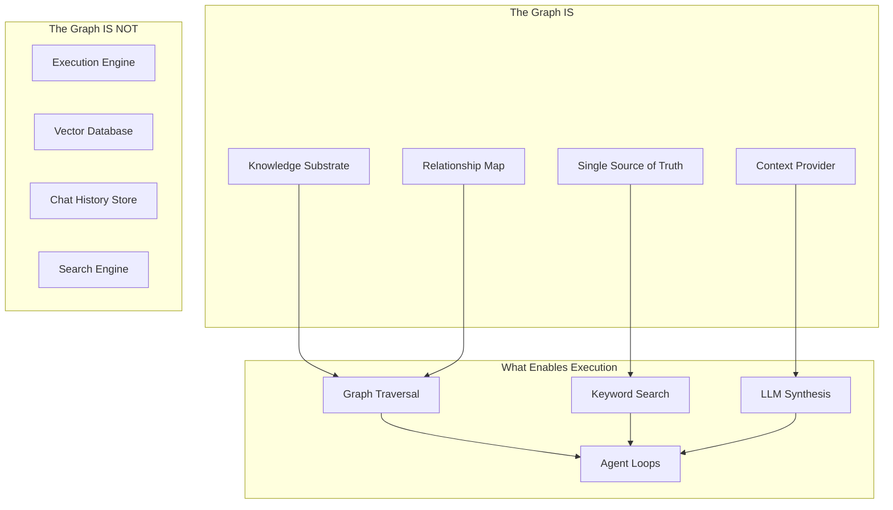
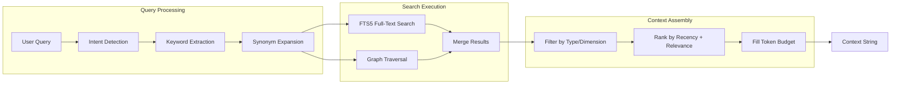
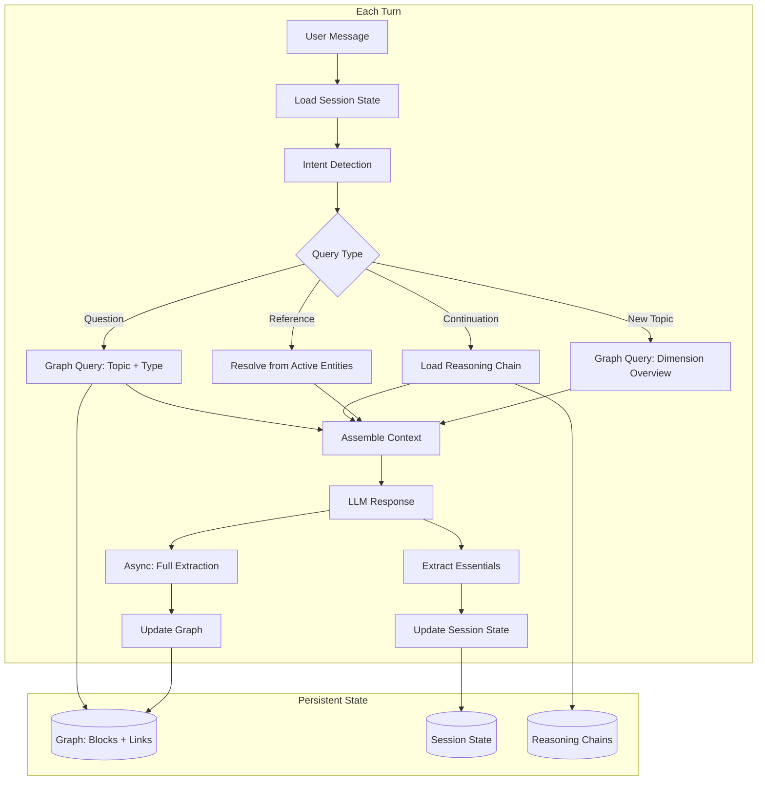
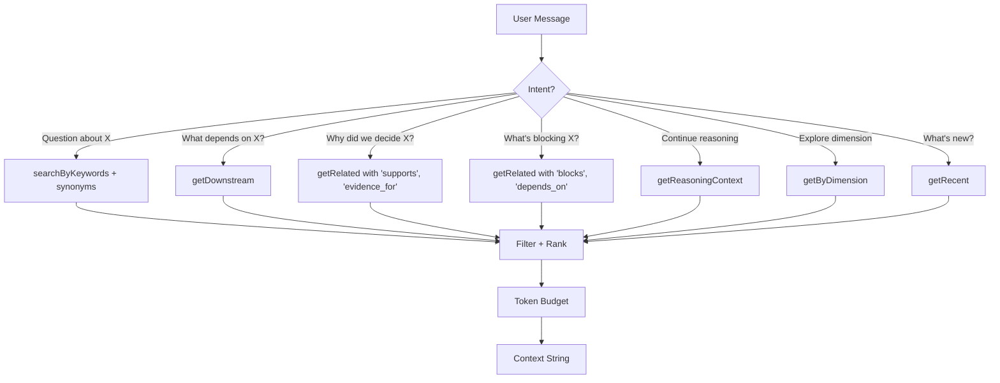
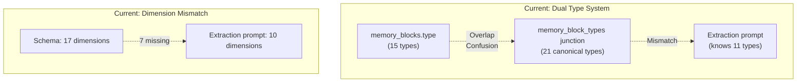
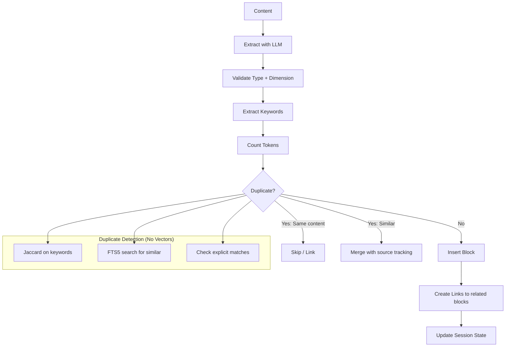
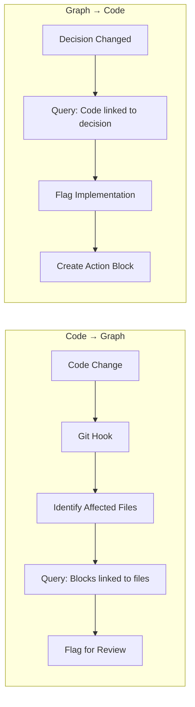
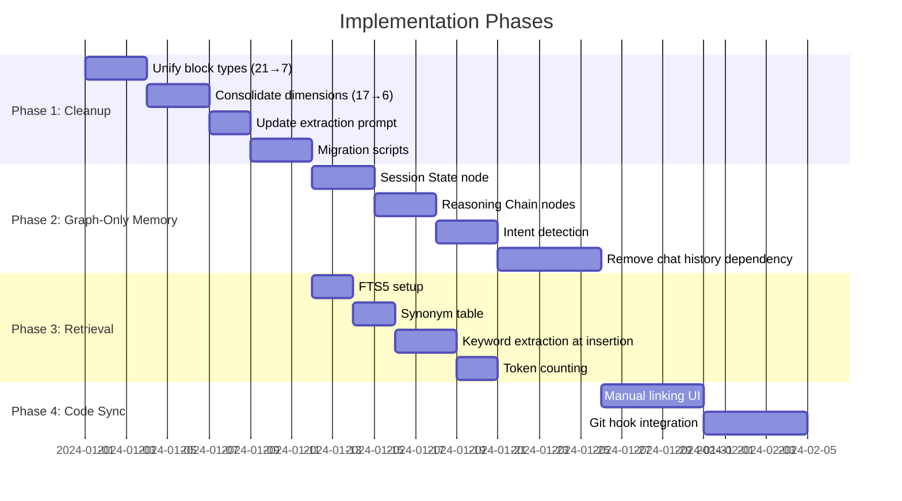
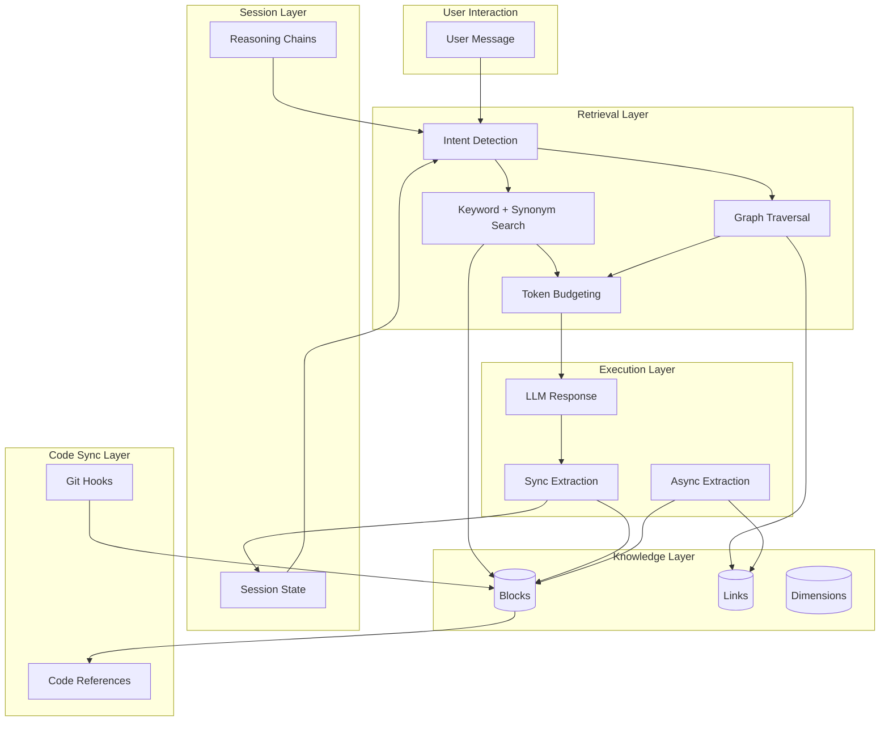

# Memory Graph: Final Approach

## Consolidated Analysis & Implementation Plan

---

## Part 1: The Theory (Refined)

### 1.1 Core Thesis

> **A well-structured memory graph, with graph traversal + keyword search for retrieval, no chat history dependency, and bidirectional code sync, will enable grounded, context-aware assistance for documentation, tasks, and coding.**

### 1.2 What the Graph Is



### 1.3 Key Architectural Decisions

| Decision              | Choice                            | Rationale                                                          |
| --------------------- | --------------------------------- | ------------------------------------------------------------------ |
| **Vector search?**    | No                                | Graph traversal + keywords sufficient; vectors solve wrong problem |
| **Chat history?**     | No                                | Graph-only with session state; bounded context                     |
| **Retrieval method?** | Graph traversal + FTS5 + synonyms | Structural > semantic for explicit relationships                   |
| **Entry point?**      | Intent-based                      | Match query intent to graph query pattern                          |
| **Context budget?**   | Token-counted, fixed per turn     | Prevents unbounded growth                                          |

---

## Part 2: Why Not Vectors?

### 2.1 What Vectors Actually Solve

**Vectors solve:** "I don't know what words to search for."

**Vectors are for:** Fuzzy semantic matching when vocabulary doesn't overlap.

**Vectors are NOT for:** Finding explicitly related concepts in a structured graph.

### 2.2 The "Maybe" Cases Resolved

| Query                                     | Proposed: Vectors         | Actual Solution: Keywords + Graph                                       |
| ----------------------------------------- | ------------------------- | ----------------------------------------------------------------------- |
| "What relates to pricing?"                | Embed query, find similar | Keyword: "pricing" + synonyms ["price", "cost", "fee", "monetization"]  |
| "What did we discuss about scaling?"      | Semantic search           | Keyword: "scaling" + synonyms ["scale", "growth", "expand", "capacity"] |
| "Find ideas similar to Uber"              | Embedding similarity      | Graph: Get "Uber" node → traverse "similar_to" edges                    |
| "What assumptions support this decision?" | N/A                       | Graph: decision_id → "supports" edges → assumption nodes                |

### 2.3 The Retrieval Stack (No Vectors)



### 2.4 When Would You ACTUALLY Need Vectors?

**Specific triggers — not "maybe later":**

| Trigger                                     | Threshold                                          | Why Vectors Help                                       | Likelihood                       |
| ------------------------------------------- | -------------------------------------------------- | ------------------------------------------------------ | -------------------------------- |
| **Keyword search returns too many results** | > 50 results per query                             | Ranking by semantic relevance                          | Low for solo founder             |
| **Keyword search misses relevant content**  | < 50% recall on test queries                       | Semantic matching catches synonyms FTS5 misses         | Low if synonyms maintained       |
| **Cross-idea similarity needed**            | Feature request: "Find similar ideas in portfolio" | Different vocabularies need semantic bridge            | Only if multi-idea feature added |
| **Multi-user with different vocabularies**  | > 1 user contributing content                      | Bridge vocabulary gaps                                 | Only if collaboration added      |
| **Import external knowledge at scale**      | Bulk import > 1000 documents                       | Need to link to existing graph without keyword overlap | Only if import feature added     |

**Bottom line:** For a solo founder with < 1000 blocks per idea using their own vocabulary, vectors are unnecessary. Add them only when a specific trigger fires.

### 2.5 Keyword + Synonym System Design

```typescript
// Synonym table (simple, maintainable)
const synonyms: Record<string, string[]> = {
  pricing: ["price", "cost", "fee", "monetization", "revenue model"],
  scaling: ["scale", "growth", "expand", "capacity", "throughput"],
  customer: ["user", "client", "buyer", "consumer", "audience"],
  problem: ["pain point", "challenge", "issue", "gap", "friction"],
  // ... AI can generate/suggest additions
};

// At insertion: extract keywords, store in keywords field
// At query: expand query with synonyms, FTS5 search
```

---

## Part 3: Graph-Only Memory (No Chat History)

### 3.1 The Paradigm Shift

**Current model (most AI systems):**

```
Context = [System] + [Chat History (unbounded)] + [Message]
```

**Graph-only model:**

```
Context = [System] + [Relevant Graph Nodes (budgeted)] + [Session State] + [Message]
```

Chat history is **ephemeral** — extracted into graph immediately, then discarded.

### 3.2 What Replaces Chat History

| Chat History Provided      | Graph-Only Replacement                          |
| -------------------------- | ----------------------------------------------- |
| What was just discussed    | Session State node: `lastInteraction` summary   |
| Current focus/topic        | Session State node: `currentFocus` array        |
| Multi-turn reasoning chain | Reasoning Chain nodes (linked sequence)         |
| Emotional/tonal context    | Session State node: `emotionalContext` property |
| "That thing" references    | Active entity tracking in session state         |

### 3.3 Session State Node

```typescript
interface SessionState {
  id: string;
  ideaId: string;

  // Conversational coherence
  currentFocus: string[]; // Active topics/dimensions
  lastInteraction: string; // 1-2 sentence summary of last exchange
  pendingQuestions: string[]; // Unanswered questions
  activeEntities: string[]; // Recently referenced entities

  // Reasoning continuity
  activeReasoningChainId?: string; // If multi-turn reasoning in progress

  // Emotional context (optional)
  emotionalContext?: string; // "frustrated", "excited", "exploring"

  // Timestamps
  createdAt: Date;
  updatedAt: Date;
}
```

### 3.4 Reasoning Chain Nodes

For multi-turn reasoning that builds on itself:

```typescript
interface ReasoningChain {
  id: string;
  sessionId: string;
  topic: string; // "Evaluating pricing models"

  steps: ReasoningStep[]; // Ordered reasoning progression
  status: "active" | "concluded" | "abandoned";

  // Links to graph
  relatedBlockIds: string[]; // Decisions, facts referenced
  conclusionBlockId?: string; // If reasoning led to a decision

  createdAt: Date;
  updatedAt: Date;
}

interface ReasoningStep {
  turnNumber: number;
  userInput: string; // Summary of user's contribution
  agentOutput: string; // Summary of agent's response
  entitiesReferenced: string[]; // For "that one" resolution
}
```

### 3.5 The Per-Turn Flow



### 3.6 Trade-offs & Mitigations

| Trade-off                       | Impact                                           | Mitigation                                            |
| ------------------------------- | ------------------------------------------------ | ----------------------------------------------------- |
| Loss of conversational nuance   | Agent may seem less "aware" of conversation flow | Session state captures focus + last interaction       |
| Extraction quality critical     | Bad extraction = lost information                | Sync extraction of essentials; async for full detail  |
| Multi-turn references harder    | "That one" may not resolve                       | Active entity tracking in session state               |
| Real-time extraction latency    | Adds ~100ms per turn                             | Sync only essentials; async full analysis             |
| Some content doesn't graph well | Jokes, rapport, meta-discussion                  | Accept loss; session state captures emotional context |

---

## Part 4: Retrieval Without Vectors

### 4.1 The Retrieval API

```typescript
interface GraphRetrieval {
  // === Entry Point Queries ===

  // Find by topic (uses FTS5 + synonyms)
  searchByKeywords(
    keywords: string[],
    options?: {
      dimensions?: Dimension[];
      types?: BlockType[];
      limit?: number;
    },
  ): Promise<Block[]>;

  // Find by graph position
  getByDimension(dimension: Dimension, type?: BlockType): Promise<Block[]>;
  getByType(type: BlockType, dimension?: Dimension): Promise<Block[]>;

  // === Graph Traversal ===

  // Follow relationships from a node
  getRelated(
    nodeId: string,
    relationTypes: LinkType[],
    direction: "incoming" | "outgoing" | "both",
    maxHops?: number,
  ): Promise<Block[]>;

  // Get dependency chain
  getUpstream(nodeId: string): Promise<Block[]>; // What this depends on
  getDownstream(nodeId: string): Promise<Block[]>; // What depends on this

  // === Session-Aware ===

  // Get context for current session state
  getActiveContext(
    sessionState: SessionState,
    tokenBudget: number,
  ): Promise<{
    blocks: Block[];
    totalTokens: number;
  }>;

  // Get reasoning chain with related blocks
  getReasoningContext(chainId: string): Promise<{
    chain: ReasoningChain;
    relatedBlocks: Block[];
  }>;

  // === Temporal ===

  getRecent(limit: number): Promise<Block[]>;
  getCreatedBetween(start: Date, end: Date): Promise<Block[]>;
}
```

### 4.2 Intent-Based Query Routing



### 4.3 Example: "What about pricing?"

```typescript
// 1. Intent: Question about topic "pricing"
const intent = { type: "question", topic: "pricing" };

// 2. Expand with synonyms
const keywords = expandWithSynonyms("pricing");
// → ["pricing", "price", "cost", "fee", "monetization", "revenue model"]

// 3. FTS5 search
const matches = await searchByKeywords(keywords, {
  dimensions: ["market", "solution"], // likely relevant dimensions
  limit: 20,
});

// 4. Get related via graph
const related = await getRelated(
  matches.map((m) => m.id),
  ["supports", "contradicts", "depends_on"],
  "both",
  1, // 1 hop
);

// 5. Merge, dedupe, rank by recency
const ranked = rankByRecency([...matches, ...related]);

// 6. Fill token budget
const context = fillTokenBudget(ranked, 4000);
```

---

## Part 5: Schema Simplification

### 5.1 Current State (Messy)



### 5.2 Target State (Clean)

| Aspect                           | Current           | Target              | Change                 |
| -------------------------------- | ----------------- | ------------------- | ---------------------- |
| Block types (memory_blocks.type) | 15                | **7**               | Unified, single source |
| Block types (junction)           | 21                | **Removed**         | Use primary type only  |
| Dimensions                       | 17                | **6**               | Consolidated           |
| Extraction prompt                | 11 types, 10 dims | **7 types, 6 dims** | Aligned                |

### 5.3 Target Block Types (7)

| Type            | Question Answered     | Consolidates                      |
| --------------- | --------------------- | --------------------------------- |
| **knowledge**   | "What do I know?"     | fact, insight, pattern, synthesis |
| **belief**      | "What am I assuming?" | assumption                        |
| **decision**    | "What did I choose?"  | decision, option, constraint      |
| **question**    | "What don't I know?"  | question                          |
| **requirement** | "What must be true?"  | requirement                       |
| **action**      | "What needs doing?"   | action, task, story, epic, bug    |
| **evaluation**  | "What happened?"      | evaluation, learning              |

### 5.4 Target Dimensions (6)

| Dimension        | Question Answered         | Consolidates                             |
| ---------------- | ------------------------- | ---------------------------------------- |
| **problem**      | "What pain am I solving?" | problem                                  |
| **customer**     | "Who has this pain?"      | customer, user, persona                  |
| **solution**     | "How do I solve it?"      | solution, spec, product                  |
| **market**       | "Is this viable?"         | market, competition, business, risk, fit |
| **execution**    | "How do I build it?"      | tasks, timeline, validation              |
| **distribution** | "How do I reach them?"    | distribution, marketing, manufacturing   |

### 5.5 Target Schema

```typescript
// memory-block.ts (simplified)
export const blockTypes = [
  "knowledge",
  "belief",
  "decision",
  "question",
  "requirement",
  "action",
  "evaluation",
] as const;

export const graphTypes = [
  "problem",
  "customer",
  "solution",
  "market",
  "execution",
  "distribution",
] as const;

export const memoryBlocks = sqliteTable("memory_blocks", {
  id: text("id").primaryKey(),
  sessionId: text("session_id").notNull(),
  ideaId: text("idea_id"),

  // Single type (no junction table)
  type: text("type", { enum: blockTypes }).notNull(),

  // Single dimension (no junction table for most blocks)
  dimension: text("dimension", { enum: graphTypes }),

  title: text("title"),
  content: text("content").notNull(),

  // Retrieval support
  keywords: text("keywords"), // JSON array of extracted keywords
  tokenCount: integer("token_count"),

  // Standard fields
  confidence: real("confidence"),
  abstractionLevel: text("abstraction_level"),
  status: text("status").default("active"),

  createdAt: text("created_at"),
  updatedAt: text("updated_at"),

  // Provenance
  extractedFromMessageId: text("extracted_from_message_id"),
});
```

### 5.6 Migration Plan

```sql
-- Phase 1: Consolidate types
UPDATE memory_blocks SET type = 'knowledge'
  WHERE type IN ('content', 'synthesis', 'pattern', 'meta', 'topic');
UPDATE memory_blocks SET type = 'belief'
  WHERE type = 'assumption';
UPDATE memory_blocks SET type = 'decision'
  WHERE type IN ('decision', 'option', 'derived');
UPDATE memory_blocks SET type = 'action'
  WHERE type IN ('action', 'external', 'placeholder');
UPDATE memory_blocks SET type = 'evaluation'
  WHERE type IN ('stakeholder_view', 'cycle');

-- Phase 2: Consolidate dimensions (via junction table → single column)
-- First: pick primary dimension for each block
-- Then: migrate to new dimension column

-- Phase 3: Drop junction tables (or keep for multi-dimension edge cases)

-- Phase 4: Update extraction prompt to match new schema
```

---

## Part 6: Node Creation Flow

### 6.1 Current Flow

```
Message → Claude Haiku → JSON → Validate → Insert
                                         → Insert junction tables
```

**Problems:**

- No keyword extraction
- No token counting
- Jaccard-only dedup
- Types/dimensions don't match prompt

### 6.2 Target Flow



### 6.3 Extraction Prompt (Aligned)

```typescript
const EXTRACTION_PROMPT = `
Extract structured blocks from this content.

BLOCK TYPES (choose exactly one):
- knowledge: Verified facts, data, patterns, research findings
- belief: Assumptions, hypotheses, unvalidated claims
- decision: Choices made, options considered, constraints accepted
- question: Open questions, unknowns, things to investigate
- requirement: Must-have constraints, specifications, acceptance criteria
- action: Tasks, next steps, work items
- evaluation: Results, outcomes, learnings from experiments

DIMENSIONS (choose exactly one):
- problem: The pain, gap, or opportunity
- customer: Who has this problem, their context
- solution: How we solve it, the product
- market: Viability, competition, business model
- execution: Tasks, timeline, implementation
- distribution: Reaching customers, channels, marketing

For each block, provide:
{
  "type": "knowledge",
  "dimension": "market",
  "content": "Legal tech TAM is $50B with 15% CAGR",
  "keywords": ["legal tech", "TAM", "market size", "$50B"],
  "confidence": 0.85,
  "abstraction_level": "strategy"
}

IMPORTANT:
- Extract specific, atomic pieces of information
- Each block should be self-contained
- Include source attribution in content when known
`;
```

---

## Part 7: Code-Graph Sync (The Novel Part)

### 7.1 What This Actually Means

**The vision:** Every piece of code traces back to a decision in the graph. When decisions change, affected code is flagged. When code changes, related graph nodes are surfaced.

### 7.2 The Simplest Implementation



### 7.3 Link Types for Code Sync

```typescript
// New link types for code-graph connection
const codeGraphLinkTypes = [
  "implemented_in", // Decision → Code file
  "implements", // Code file → Requirement
  "tested_by", // Requirement → Test file
  "documents", // Code → Documentation block
] as const;

// Code reference in block properties
interface CodeReference {
  filePath: string;
  lineStart?: number;
  lineEnd?: number;
  commitHash?: string;
  lastVerified: Date;
}
```

### 7.4 Implementation Phases

| Phase                              | Scope                                           | Trigger                   |
| ---------------------------------- | ----------------------------------------------- | ------------------------- |
| **1: Manual linking**              | User/agent explicitly links blocks to files     | MVP                       |
| **2: One-way sync (code → graph)** | Git hooks detect changes, query affected blocks | When Phase 1 validated    |
| **3: Bidirectional**               | Graph changes create code review tasks          | When Phase 2 stable       |
| **4: Automated verification**      | CI checks decision→code alignment               | When confident in linking |

---

## Part 8: What to Build

### 8.1 Priority Order



### 8.2 What to Build vs Skip

| Build                 | Skip                       | Rationale                                          |
| --------------------- | -------------------------- | -------------------------------------------------- |
| FTS5 full-text search | Vector embeddings          | Keywords + synonyms sufficient for scale           |
| Session State node    | Chat history storage       | Bounded context, cleaner model                     |
| Reasoning Chain nodes | Complex memory hierarchies | Explicit structure for multi-turn                  |
| Token counting        | Summarization layer        | Budget can hard-cut; summarization is optimization |
| Keyword extraction    | BM25 indexing              | SQLite FTS5 handles this                           |
| Synonym table         | Word2Vec/embeddings        | Simple lookup sufficient                           |
| Manual code linking   | Automated code analysis    | Validate concept before automation                 |
| Git hooks (one-way)   | Bidirectional sync         | Crawl before walk                                  |

### 8.3 Minimal Schema Additions

```typescript
// Only add what's actually needed

// 1. Keywords for FTS5 search
keywords: text("keywords"),  // JSON array

// 2. Token count for budget
tokenCount: integer("token_count"),

// 3. Session state (new table)
sessionState: sqliteTable("session_state", {
  id: text("id").primaryKey(),
  ideaId: text("idea_id").notNull(),
  currentFocus: text("current_focus"),      // JSON array
  lastInteraction: text("last_interaction"),
  pendingQuestions: text("pending_questions"), // JSON array
  activeEntities: text("active_entities"),   // JSON array
  activeReasoningChainId: text("active_reasoning_chain_id"),
  emotionalContext: text("emotional_context"),
  updatedAt: text("updated_at"),
});

// 4. Reasoning chains (new table)
reasoningChains: sqliteTable("reasoning_chains", {
  id: text("id").primaryKey(),
  sessionId: text("session_id").notNull(),
  topic: text("topic").notNull(),
  steps: text("steps"),           // JSON array of ReasoningStep
  status: text("status").default("active"),
  relatedBlockIds: text("related_block_ids"), // JSON array
  conclusionBlockId: text("conclusion_block_id"),
  createdAt: text("created_at"),
  updatedAt: text("updated_at"),
});
```

---

## Part 9: Summary

### 9.1 The Final Architecture



### 9.2 Key Decisions Summary

| Decision                    | Choice                            | Why                                         |
| --------------------------- | --------------------------------- | ------------------------------------------- |
| **No vectors**              | Graph traversal + FTS5 + synonyms | Structured relationships > fuzzy similarity |
| **No chat history**         | Session state + reasoning chains  | Bounded context, explicit structure         |
| **7 block types**           | Unified from 36                   | Cognitive simplicity, AI reliability        |
| **6 dimensions**            | Consolidated from 17              | Manageable scope, meaningful distinctions   |
| **Keywords at insertion**   | Extract and store                 | Enable FTS5 search                          |
| **Token counting**          | Required field                    | Enable context budgeting                    |
| **Code sync: manual first** | Then git hooks                    | Validate before automating                  |

### 9.3 What Success Looks Like

| Metric                         | Target                 | Measurement       |
| ------------------------------ | ---------------------- | ----------------- |
| Context always bounded         | ≤ 8K tokens            | Instrumentation   |
| Retrieval finds relevant       | > 80% useful           | Sample audits     |
| No chat history needed         | 0 messages stored      | Architecture      |
| Extraction captures essentials | < 5% info loss         | User feedback     |
| Multi-turn reasoning works     | References resolve     | Test scenarios    |
| Code-graph links exist         | > 50% decisions linked | Coverage tracking |

---

## Part 10: When to Revisit Vectors

### 10.1 Specific Triggers (Not "Maybe Later")

| Trigger                             | Detection                          | Response                               |
| ----------------------------------- | ---------------------------------- | -------------------------------------- |
| **FTS5 returns > 50 results often** | Query logs show high result counts | Add embedding-based re-ranking         |
| **Users report "can't find X"**     | Feedback shows recall issues       | Evaluate if synonyms insufficient      |
| **Cross-idea similarity requested** | Feature request for portfolio view | Add embeddings for inter-idea search   |
| **External import at scale**        | Need to ingest > 1000 docs         | Add embeddings for vocabulary bridging |
| **Keyword extraction unreliable**   | AI produces poor keywords          | Use embeddings as fallback             |

### 10.2 If Vectors Are Added

```typescript
// Minimal addition: just one field
embedding: blob("embedding"),  // Float32 array, 1536 dims

// Generation: on block create/update
const embedding = await openai.embeddings.create({
  model: "text-embedding-3-small",
  input: block.content,
});

// Search: cosine similarity via SQLite extension or simple scan
// For < 10K blocks, brute force scan is fine
```

---

_Document Version: 1.0_
_Created: 2026-02-04_
_Status: Final consolidated approach_
_Supersedes: All previous memory graph documents_
