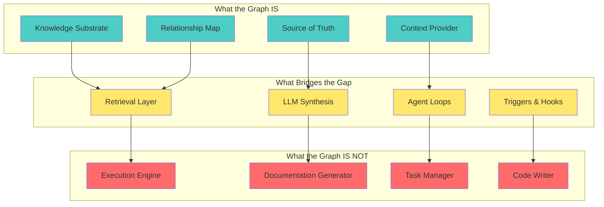
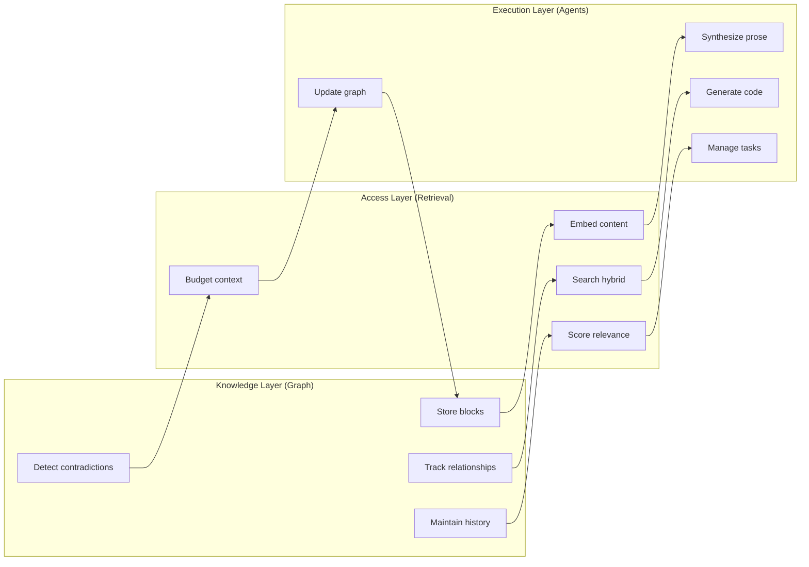
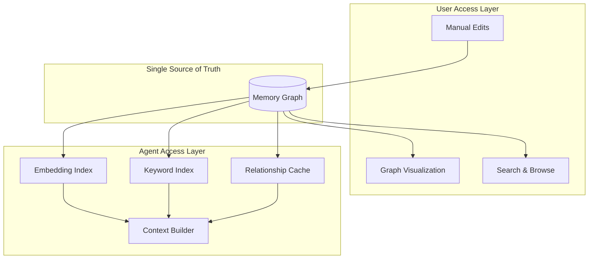

# Memory Graph: Refined Approach

## The Theory

> **A well-structured memory graph, combined with retrieval-optimized access patterns, LLM synthesis, and bidirectional code sync, will enable more coherent documentation, context-aware task management, and grounded coding assistance.**

This is not "the graph accomplishes X" — it's "the graph **enables** X when combined with the right execution layers."

---

## What the Graph Is (and Isn't)



---

## The Three-Layer Architecture

| Layer               | Purpose                  | Components                                  | Owner            |
| ------------------- | ------------------------ | ------------------------------------------- | ---------------- |
| **Knowledge Layer** | Store, structure, relate | Graph schema, blocks, edges, dimensions     | Memory Graph     |
| **Access Layer**    | Retrieve, filter, budget | Embeddings, hybrid search, context assembly | Retrieval System |
| **Execution Layer** | Synthesize, act, update  | LLM, agents, triggers, code sync            | Agent Runtime    |

### Layer Responsibilities



---

## Unified Data, Separate Access Patterns

One graph serves both users and agents, but with different projections:

| Aspect                | User Access                   | Agent Access                              |
| --------------------- | ----------------------------- | ----------------------------------------- |
| **Interface**         | Visual graph, browsing        | API calls, context injection              |
| **Optimization**      | Comprehension, navigation     | Speed, relevance, token budget            |
| **Lifecycle**         | Persistent, long-term         | Session-scoped caching                    |
| **Query pattern**     | "Show me what I know about X" | "What's relevant to this task RIGHT NOW?" |
| **Latency tolerance** | 1-2 seconds acceptable        | < 200ms required                          |



---

## What Each Outcome Actually Requires

### Documentation (Enabled, Not Automatic)

```
Graph provides: Facts, decisions, relationships, sources
Retrieval provides: Relevant subset for document scope
LLM provides: Prose synthesis, narrative flow
Triggers provide: Update when source blocks change
Human provides: Scope decisions ("document THIS, not that")
```

**Result**: Semi-automatic documentation that stays grounded in graph facts.

### Task Management (Enabled, Not Replaced)

```
Graph provides: Decision context, dependency relationships, blockers
Retrieval provides: Relevant context for each task
Agent provides: Decomposition, prioritization suggestions
Task system provides: Status tracking, execution, completion
Human provides: Approval, prioritization overrides
```

**Result**: Context-aware task system where agents understand WHY tasks exist.

### Coding Assistance (Enabled, Not Autonomous)

```
Graph provides: Requirements, decisions, constraints, rationale
Retrieval provides: Relevant context for current file/function
Code analysis provides: AST, dependencies, call graphs
Agent provides: Code generation, suggestions
Sync layer provides: Bidirectional updates (code ↔ graph)
Human provides: Approval, corrections
```

**Result**: Grounded coding where generated code traces back to decisions.

---

## The Genuinely Novel Parts

| Capability                                 | Why It's Novel                                                  | Existing Alternatives                     |
| ------------------------------------------ | --------------------------------------------------------------- | ----------------------------------------- |
| **Bidirectional code-graph sync**          | No system automatically links prose decisions to implementation | Manual documentation (Notion, Confluence) |
| **Contradiction detection as first-class** | Most systems ignore conflicts                                   | None do this well                         |
| **"Don't build on lies" principle**        | Proactive staleness/conflict surfacing                          | Reactive systems only                     |
| **Solo founder focus**                     | Existing tools assume teams                                     | Enterprise-focused alternatives           |
| **Integrated knowledge + execution**       | Pieces exist but aren't connected                               | Separate tools (Mem0 + Linear + Cursor)   |

---

## Minimum Viable Architecture

### Phase 1: Knowledge + Retrieval (Foundation)

```typescript
// Core operations the system MUST support
interface MemorySystem {
  // Knowledge Layer
  store(block: Block): Promise<BlockId>;
  relate(from: BlockId, to: BlockId, type: RelationType): Promise<void>;
  getBlock(id: BlockId): Promise<Block>;

  // Access Layer (CRITICAL - currently missing)
  recall(query: string, options: RecallOptions): Promise<Block[]>;
  buildContext(query: string, tokenBudget: number): Promise<string>;

  // Evolution (Phase 2)
  consolidate(ids: BlockId[]): Promise<BlockId>;
  updateConfidence(id: BlockId, outcome: Outcome): Promise<void>;
}

interface RecallOptions {
  limit: number;
  filters?: {
    dimensions?: Dimension[];
    types?: BlockType[];
    minConfidence?: number;
    validAt?: Date;
  };
  includeRelated?: boolean;
  maxHops?: number;
}
```

### Phase 2: Execution Layer (Agent Integration)

```typescript
// Agent loop integration
interface AgentMemoryHooks {
  // Before planning: inject relevant context
  onPlanStart(task: Task): Promise<Context>;

  // After action: extract learnings
  onActionComplete(action: Action, result: Result): Promise<void>;

  // On observation: update beliefs
  onObservation(observation: Observation): Promise<void>;

  // Periodic: consolidate and evolve
  onReflect(): Promise<void>;
}
```

### Phase 3: Code Sync (Differentiation)

```typescript
// Bidirectional sync
interface CodeGraphSync {
  // Code → Graph
  onCodeChange(file: string, diff: Diff): Promise<AffectedBlocks>;

  // Graph → Code
  onDecisionChange(block: Block): Promise<AffectedFiles>;

  // Queries
  getImplementationStatus(requirementId: BlockId): Promise<Status>;
  getDecisionRationale(file: string, line: number): Promise<Block[]>;
}
```

---

## Success Criteria (Revised)

| Outcome                           | Metric                      | Target             | How Graph Contributes                     |
| --------------------------------- | --------------------------- | ------------------ | ----------------------------------------- |
| **Documentation stays current**   | Stale doc rate              | < 10%              | Triggers update when source blocks change |
| **Tasks have context**            | "Why this task?" answerable | 100%               | Decision-to-task linking                  |
| **Code traces to decisions**      | Traceability coverage       | > 80% of core code | Bidirectional sync                        |
| **Agent finds relevant context**  | Retrieval relevance         | > 80% useful       | Embedding + relationship search           |
| **No building on contradictions** | Unresolved conflicts        | < 5%               | Proactive detection + surfacing           |

---

## What to Build vs What to Integrate

| Capability            | Build Custom | Integrate Existing | Rationale                    |
| --------------------- | ------------ | ------------------ | ---------------------------- |
| Block storage         | ✓            |                    | Core domain, specific schema |
| Relationship tracking | ✓            |                    | Core domain                  |
| Embedding generation  |              | OpenAI/local       | Commodity                    |
| Vector search         |              | pgvector/Pinecone  | Commodity                    |
| Keyword search        |              | PostgreSQL FTS     | Commodity                    |
| LLM synthesis         |              | Claude/GPT         | Commodity                    |
| Task execution        | ✓ (existing) |                    | Already built                |
| Code analysis         |              | Tree-sitter/LSP    | Commodity                    |
| Code-graph sync       | ✓            |                    | Novel, core differentiator   |

---

## Open Questions (Require Decision)

| Question                                | Options                           | Recommendation                            |
| --------------------------------------- | --------------------------------- | ----------------------------------------- |
| Where to store embeddings?              | pgvector vs external (Pinecone)   | pgvector (simpler, co-located)            |
| How to trigger code sync?               | File watchers vs git hooks vs CI  | Git hooks (explicit, auditable)           |
| What's the consolidation threshold?     | Similarity > 0.9? Manual?         | Start with 0.85, tune based on noise      |
| Who resolves contradictions?            | Always user? Auto for low-stakes? | Auto for low confidence, escalate high    |
| How to handle agent cache invalidation? | TTL? Event-driven?                | Event-driven (graph changes → cache bust) |

---

## Summary

### The Old Framing (Problematic)

> "The memory graph will accomplish automatic documentation, task management, and coding."

### The New Framing (Accurate)

> "The memory graph is the **knowledge substrate** that, when combined with a **retrieval layer** (for efficient access), an **execution layer** (agents + LLMs), and a **sync layer** (code ↔ graph), enables grounded, context-aware assistance for documentation, tasks, and coding."

### What This Changes

| Aspect       | Old Thinking                     | New Thinking                                |
| ------------ | -------------------------------- | ------------------------------------------- |
| Graph role   | Does everything                  | Stores and relates knowledge                |
| Retrieval    | Implicit ("proactive surfacing") | Explicit API with latency SLOs              |
| Execution    | Assumed                          | Separate layer with defined hooks           |
| Automation   | "Automatic"                      | "Enabled" / "Assisted"                      |
| Architecture | Monolithic                       | Three distinct layers with clear interfaces |

---

## Next Steps

1. **Specify the retrieval API** — Define `recall()` and `buildContext()` contracts
2. **Add embedding pipeline** — Generate embeddings on block create/update
3. **Implement context budgeting** — Token-aware context assembly
4. **Define agent hooks** — `onPlanStart`, `onActionComplete`, `onObservation`
5. **Prototype code-graph sync** — Start with one-way (code → graph affects)

---

_Document Version: 1.0_
_Created: 2026-02-04_
_Status: Refined theory and approach_
_Supersedes: Initial redesign assumptions_
