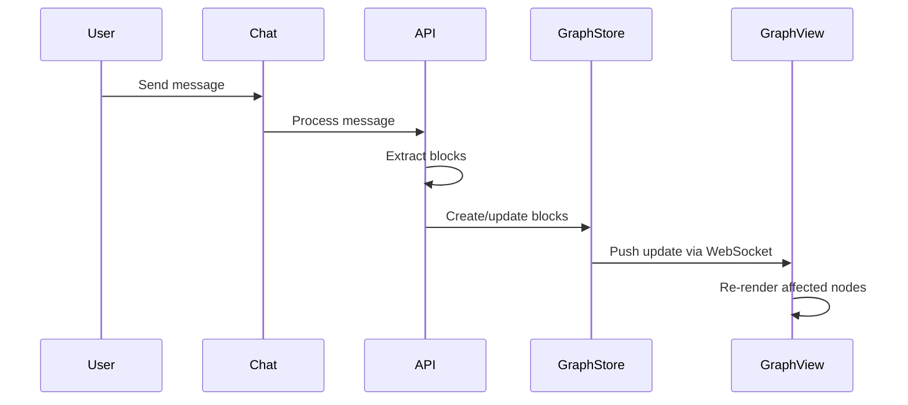
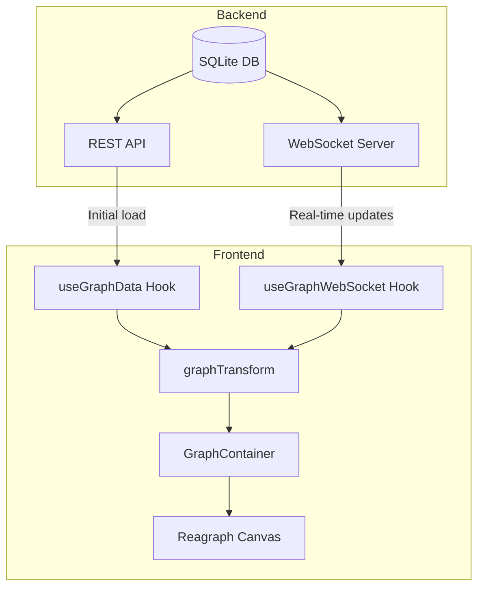
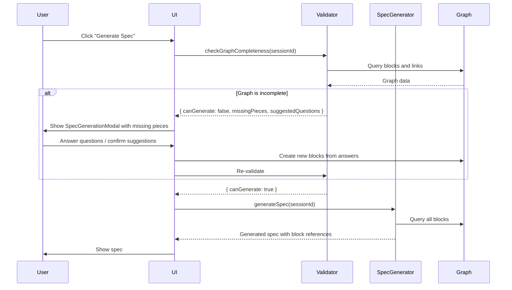

# Graph Tab View Specification

> **Source Document**: [PROPERTY-MODEL-STRESS-TEST.md](idea-to-app-flow/PROPERTY-MODEL-STRESS-TEST.md)
> **Target Location**: Ideation Agent Chat Session
> **Last Updated**: 2026-01-22

---

## Table of Contents

1. [Overview](#overview)
2. [Tech Stack Recommendation](#tech-stack-recommendation)
3. [Core Features](#core-features)
4. [Architecture](#architecture)
5. [Data Models](#data-models)
6. [Component Specifications](#component-specifications)
7. [Database Schema](#database-schema)
8. [Block Extraction Service](#block-extraction-service)
9. [Artifact-Graph Integration](#artifact-graph-integration)
10. [Spec Generation with Graph Validation](#spec-generation-with-graph-validation)
11. [Spec Output & Project Folder Structure](#spec-output--project-folder-structure)
12. [Idea-Project Visualization](#idea-project-visualization)
13. [Graph Analysis Subagent](#graph-analysis-subagent)
14. [API Routes](#api-routes)
15. [UI Quick Actions](#ui-quick-actions)
16. [Orchestrator Integration](#orchestrator-integration)
17. [Implementation Tasks](#implementation-tasks)
18. [Test Scripts](#test-scripts)

---

## Overview

### Purpose

The Graph Tab View provides an interactive visualization of the Memory Graph within the Ideation Agent chat session. It renders blocks, links, and graph memberships as a force-directed node graph, allowing users to:

- Visualize the knowledge structure being built during ideation
- Understand relationships between blocks (supersedes, refines, addresses, etc.)
- Request AI-driven updates via a dedicated prompt interface
- Explore the graph at different abstraction levels (vision → strategy → tactic → implementation)

### Key Requirements

| Requirement       | Specification                             |
| ----------------- | ----------------------------------------- |
| **Update Mode**   | Real-time sync with manual refresh option |
| **Interactivity** | View-only + AI-driven updates via prompt  |
| **Scale**         | 200+ nodes with smooth performance        |
| **Rendering**     | WebGL-based for GPU acceleration          |

---

## Tech Stack Recommendation

### Primary Choice: Reagraph

Based on research and requirements, **[Reagraph](https://reagraph.dev/)** is recommended:

| Criteria              | Reagraph   | react-force-graph | React Flow         |
| --------------------- | ---------- | ----------------- | ------------------ |
| **Rendering**         | WebGL      | Canvas/WebGL      | SVG/HTML           |
| **Large Graphs**      | Optimized  | Good              | Needs optimization |
| **React Integration** | Native     | Wrapper           | Native             |
| **Force-directed**    | Built-in   | Built-in          | Manual             |
| **Clustering**        | Built-in   | Limited           | Manual             |
| **3D Support**        | Yes        | Yes               | No                 |
| **Bundle Size**       | ~150KB     | ~200KB            | ~50KB              |
| **License**           | Apache 2.0 | MIT               | MIT                |

**Sources**:

- [Reagraph GitHub](https://github.com/reaviz/reagraph)
- [react-force-graph GitHub](https://github.com/vasturiano/react-force-graph)
- [React Flow](https://reactflow.dev)

### Installation

```bash
npm install reagraph
```

### Alternative: react-force-graph

If 3D visualization or VR/AR support becomes a priority:

```bash
npm install react-force-graph-2d react-force-graph-3d
```

---

## Core Features

### F1: Real-Time Graph Synchronization

The graph updates automatically as blocks are created, modified, or linked during conversation.



### F2: AI-Driven Graph Updates

Users interact with the graph through a dedicated prompt below the visualization:

```
┌─────────────────────────────────────────────────────────────┐
│  [Graph Visualization Area]                                  │
│                                                              │
│  ┌──────────────────────────────────────────────────────┐   │
│  │                                                      │   │
│  │              Force-directed graph                    │   │
│  │                                                      │   │
│  └──────────────────────────────────────────────────────┘   │
│                                                              │
│  ─────────────────────────────────────────────────────────  │
│  Ask AI about the graph...                           [Send] │
│  ─────────────────────────────────────────────────────────  │
│                                                              │
│  Examples:                                                   │
│  • "Link the pricing block to the revenue model"            │
│  • "What assumptions support the market size claim?"        │
│  • "Show only the Problem graph"                            │
│  • "Highlight blocks with low confidence"                   │
└─────────────────────────────────────────────────────────────┘
```

### F3: Graph Filtering & Views

| Filter Type        | Options                                                                                                                                       | Description                                |
| ------------------ | --------------------------------------------------------------------------------------------------------------------------------------------- | ------------------------------------------ |
| **By Graph**       | Problem, Solution, Market, Risk, Fit, Business, Spec                                                                                          | Show blocks belonging to specific graphs   |
| **By Block Type**  | content, link, meta, synthesis, pattern, decision, option, derived, assumption, cycle, placeholder, stakeholder_view, topic, external, action | Filter by block type                       |
| **By Confidence**  | High (≥0.8), Medium (0.5-0.79), Low (<0.5)                                                                                                    | Color-code or filter by confidence         |
| **By Status**      | draft, active, validated, superseded, abandoned                                                                                               | Filter by lifecycle status                 |
| **By Abstraction** | vision, strategy, tactic, implementation                                                                                                      | Show blocks at specific abstraction levels |

### F4: Node Inspection Panel

Clicking a node opens a side panel with full block details:

```
┌─────────────────────────────────────┐
│ Block: block_market_001             │
├─────────────────────────────────────┤
│ Type: content                       │
│ Graph: Market                       │
│ Status: active                      │
│ Confidence: 0.85                    │
├─────────────────────────────────────┤
│ Content:                            │
│ "Legal tech market is $50B TAM"     │
├─────────────────────────────────────┤
│ Properties:                         │
│   market_size: 50000000000          │
│   source_type: research_firm        │
│   source_name: Gartner 2025         │
├─────────────────────────────────────┤
│ Relationships:                      │
│   → supersedes: block_market_000    │
│   ← evidence_for: block_claim_001   │
├─────────────────────────────────────┤
│ Created: 2026-01-22 10:30 AM        │
│ Last Modified: 2026-01-22 10:45 AM  │
└─────────────────────────────────────┘
```

---

## Architecture

### Component Hierarchy

```
GraphTabView/
├── GraphContainer.tsx          # Main container with layout
├── GraphCanvas.tsx             # Reagraph canvas wrapper
├── GraphControls.tsx           # Zoom, pan, filter controls
├── GraphFilters.tsx            # Filter dropdowns/chips
├── GraphPrompt.tsx             # AI prompt input area
├── NodeInspector.tsx           # Side panel for node details
├── GraphLegend.tsx             # Visual legend for node/edge types
├── hooks/
│   ├── useGraphData.ts         # Fetch and transform graph data
│   ├── useGraphWebSocket.ts    # Real-time updates
│   └── useGraphFilters.ts      # Filter state management
├── utils/
│   ├── graphTransform.ts       # Transform API data to Reagraph format
│   ├── nodeStyles.ts           # Node color/shape mappings
│   └── edgeStyles.ts           # Edge color/style mappings
└── types/
    └── graph.ts                # TypeScript interfaces
```

### Data Flow



---

## Data Models

### GraphNode Interface

```typescript
interface GraphNode {
  id: string;

  // Display properties
  label: string; // Short display label
  subLabel?: string; // Secondary text

  // Block metadata
  blockType: BlockType; // content, link, meta, etc.
  graphMembership: GraphType[]; // problem, solution, market, etc.
  status: BlockStatus; // draft, active, validated, etc.
  confidence: number; // 0.0 - 1.0
  abstractionLevel?: AbstractionLevel; // vision, strategy, tactic, implementation

  // Temporal (from Scenario 8)
  createdAt: string;
  updatedAt: string;
  when?: string; // Point in time or relative
  duration?: string; // Period (e.g., "3_months")
  plannedFor?: string; // Future date or quarter
  validUntil?: string; // Expiration date

  // Full content (for inspector)
  content: string;
  properties: Record<string, unknown>;

  // Source attribution (from Scenario 12)
  sourceType?: SourceType;
  sourceName?: string;
  sourceDate?: string;
  verifiable?: boolean;

  // Objectivity & certainty (from Scenarios 4, 13)
  objectivity?: "objective" | "subjective" | "mixed";
  hypothetical?: boolean;
  condition?: string; // For hypothetical blocks

  // Evidence chain (from Scenario 20)
  evidenceStrength?: "strong" | "moderate" | "weak";
  derivedConfidence?: number; // Auto-calculated from evidence chain

  // Derived block properties (from Scenario 19)
  formula?: string;
  computedValue?: unknown;
  computedAt?: string;
  stale?: boolean;
  overrideValue?: unknown;
  overrideReason?: string;

  // Action block properties (from Scenario 26)
  actionType?: "validate" | "research" | "build" | "decide" | "other";
  requiredCount?: number;
  completedCount?: number;
  assignedTo?: string;
  dueDate?: string;
  outcome?: "validated" | "invalidated" | "inconclusive";

  // Assumption block properties (from Scenario 21)
  impliedBy?: string;
  surfacedBy?: "ai" | "user" | "advisor";
  assumptionStatus?: "unvalidated" | "validated" | "invalidated" | "dismissed";
  criticality?: "critical" | "important" | "minor";

  // Decision/Option block properties (from Scenario 16)
  topic?: string;
  decidedOption?: string;
  decisionRationale?: string;
  selectionStatus?: "exploring" | "selected" | "rejected";
  alternativeTo?: string[];

  // Stakeholder view properties (from Scenario 24)
  stakeholder?: string;
  stakeholderRole?:
    | "decision_maker"
    | "domain_expert"
    | "advisor"
    | "team_member";
  viewStatus?: "active" | "adopted" | "overruled" | "withdrawn";

  // Placeholder block properties (from Scenario 23)
  placeholderFor?: string;
  researchQuery?: string;
  existenceConfirmed?: boolean;
  detailsUnknown?: boolean;

  // External block properties (from Scenario 25)
  url?: string;
  snapshotDate?: string;
  urlStatus?: "alive" | "redirected" | "dead" | "changed";
  domainCredibility?: "high" | "medium" | "low" | "very_low";

  // Meta block properties (from Scenario 5)
  metaType?:
    | "uncertainty"
    | "research_needed"
    | "assessment"
    | "question"
    | "commitment";
  about?: string; // Block ID being annotated
  resolved?: boolean;

  // Cycle detection (from Scenario 22)
  cycleId?: string;
  cyclePosition?: number;
  cycleType?: "blocking" | "reinforcing";

  // Cross-idea patterns (from Scenario 15)
  scope?: string; // "global" or "idea:slug"
  instanceOf?: string; // Pattern block ID
  sharedWith?: string[]; // Ideas this block is shared with
  portfolioTag?: string; // Cross-idea grouping tag

  // Context-qualified properties (from Scenario 18)
  variesBy?: string; // Dimension that varies (e.g., "customer_segment")

  // Synthesis block properties (from Scenario 14)
  synthesizes?: string[]; // Block IDs being synthesized
  clusterTheme?: string; // Theme of the synthesis cluster

  // Option block properties (from Scenario 16)
  decision?: string; // Parent decision block ID

  // Assumption validation tracking (from Scenario 21)
  validationMethod?: string; // How to validate
  validatedBy?: string; // Who validated
  validatedAt?: string; // When validated

  // Evidence chain status (from Scenario 20)
  evidenceStatus?: "active" | "source_invalidated" | "source_superseded";

  // Placeholder partial info (from Scenario 23)
  partialInfo?: string[]; // Known partial information

  // Stakeholder view resolution (from Scenario 24)
  incorporatedInto?: string; // View ID that incorporated this concern
  overruledReason?: string; // Why this view was overruled

  // Cycle resolution (from Scenario 22)
  breakStrategy?: string; // Strategy to break the cycle
  breakPoint?: string; // Node ID where cycle should be broken

  // Visual hints
  isHighlighted?: boolean;
  isSelected?: boolean;
  cluster?: string; // For clustering layout
}

type SourceType =
  | "research_firm"
  | "primary_research"
  | "expert"
  | "anecdote"
  | "assumption"
  | "unknown";

type BlockType =
  | "content"
  | "link"
  | "meta"
  | "synthesis"
  | "pattern"
  | "decision"
  | "option"
  | "derived"
  | "assumption"
  | "cycle"
  | "placeholder"
  | "stakeholder_view"
  | "topic"
  | "external"
  | "action";

type GraphType =
  | "problem"
  | "solution"
  | "market"
  | "risk"
  | "fit"
  | "business"
  | "spec";

type BlockStatus =
  | "draft"
  | "active"
  | "validated"
  | "superseded"
  | "abandoned";

type AbstractionLevel = "vision" | "strategy" | "tactic" | "implementation";
```

### GraphEdge Interface

```typescript
interface GraphEdge {
  id: string;
  source: string; // Source node ID
  target: string; // Target node ID

  // Link metadata
  linkType: LinkType; // addresses, supersedes, refines, etc.
  degree?: LinkDegree; // full, partial, minimal
  confidence?: number; // 0.0 - 1.0
  reason?: string; // Explanation text
  status: "active" | "superseded" | "removed";

  // Visual hints
  isHighlighted?: boolean;
}

type LinkType =
  | "addresses"
  | "creates"
  | "requires"
  | "blocks"
  | "unblocks"
  | "supersedes"
  | "refines"
  | "replaces"
  | "contradicts"
  | "evidence_for"
  | "derived_from"
  | "implements"
  | "implemented_by"
  | "alternative_to"
  | "synthesizes"
  | "instance_of"
  | "about"
  | "excludes"
  | "includes"
  | "constrained_by"
  | "validates_claim";

type LinkDegree = "full" | "partial" | "minimal";
```

### Visual Mapping Schema

```typescript
// Node colors by block type
const nodeColors: Record<BlockType, string> = {
  content: "#3B82F6", // Blue
  link: "#6B7280", // Gray (usually hidden)
  meta: "#F59E0B", // Amber
  synthesis: "#8B5CF6", // Purple
  pattern: "#EC4899", // Pink
  decision: "#EF4444", // Red
  option: "#F97316", // Orange
  derived: "#14B8A6", // Teal
  assumption: "#FBBF24", // Yellow
  cycle: "#DC2626", // Dark red
  placeholder: "#9CA3AF", // Light gray
  stakeholder_view: "#06B6D4", // Cyan
  topic: "#0EA5E9", // Light blue
  external: "#84CC16", // Lime
  action: "#22C55E", // Green
};

// Node shapes by graph membership
const nodeShapes: Record<GraphType, NodeShape> = {
  problem: "hexagon",
  solution: "diamond",
  market: "circle",
  risk: "triangle",
  fit: "square",
  business: "pentagon",
  spec: "star",
};

// Edge styles by link type (complete mapping for all 21 link types)
const edgeStyles: Record<LinkType, EdgeStyle> = {
  // Problem-Solution relationships
  addresses: { color: "#22C55E", style: "solid", width: 2, arrow: "end" },
  creates: { color: "#F97316", style: "solid", width: 2, arrow: "end" },

  // Dependency relationships
  requires: { color: "#6366F1", style: "solid", width: 2, arrow: "end" },
  blocks: { color: "#DC2626", style: "solid", width: 3, arrow: "end" },
  unblocks: { color: "#22C55E", style: "dashed", width: 2, arrow: "end" },
  constrained_by: { color: "#F59E0B", style: "dotted", width: 2, arrow: "end" },

  // Evolution relationships
  supersedes: { color: "#EF4444", style: "solid", width: 2, arrow: "end" },
  refines: { color: "#3B82F6", style: "dashed", width: 1, arrow: "end" },
  replaces: { color: "#DC2626", style: "dashed", width: 2, arrow: "end" },
  contradicts: { color: "#F43F5E", style: "dotted", width: 2, arrow: "both" },

  // Evidence relationships
  evidence_for: { color: "#8B5CF6", style: "dotted", width: 1, arrow: "end" },
  derived_from: { color: "#A855F7", style: "dashed", width: 1, arrow: "end" },
  validates_claim: {
    color: "#10B981",
    style: "dotted",
    width: 2,
    arrow: "end",
  },

  // Hierarchy relationships
  implements: { color: "#0EA5E9", style: "solid", width: 2, arrow: "end" },
  implemented_by: {
    color: "#0EA5E9",
    style: "solid",
    width: 2,
    arrow: "start",
  },
  synthesizes: { color: "#8B5CF6", style: "solid", width: 2, arrow: "end" },
  instance_of: { color: "#EC4899", style: "dashed", width: 1, arrow: "end" },

  // Decision relationships
  alternative_to: {
    color: "#F59E0B",
    style: "dashed",
    width: 1,
    arrow: "both",
  },

  // Scope relationships
  about: { color: "#6B7280", style: "dotted", width: 1, arrow: "end" },
  excludes: { color: "#EF4444", style: "dashed", width: 1, arrow: "end" },
  includes: { color: "#22C55E", style: "dashed", width: 1, arrow: "end" },
};

// Edge style legend groupings for UI
const edgeStyleGroups = {
  "Problem-Solution": ["addresses", "creates"],
  Dependencies: ["requires", "blocks", "unblocks", "constrained_by"],
  Evolution: ["supersedes", "refines", "replaces", "contradicts"],
  Evidence: ["evidence_for", "derived_from", "validates_claim"],
  Hierarchy: ["implements", "implemented_by", "synthesizes", "instance_of"],
  Decision: ["alternative_to"],
  Scope: ["about", "excludes", "includes"],
};
```

---

## Component Specifications

### GraphContainer.tsx

**Purpose**: Main layout container that orchestrates all graph subcomponents.

**Props**:

```typescript
interface GraphContainerProps {
  sessionId: string;
  ideaId?: string;
  defaultView?: GraphType | "all";
  onNodeSelect?: (nodeId: string) => void;
  onAIPromptSubmit?: (prompt: string) => Promise<void>;
  className?: string;
}
```

**Behavior**:

- Manages layout between canvas, controls, and inspector
- Handles loading and error states
- Coordinates filter state across components

### GraphCanvas.tsx

**Purpose**: Wrapper around Reagraph for rendering the graph.

**Props**:

```typescript
interface GraphCanvasProps {
  nodes: GraphNode[];
  edges: GraphEdge[];
  selectedNodeId?: string;
  highlightedNodeIds?: string[];
  onNodeClick: (node: GraphNode) => void;
  onNodeHover?: (node: GraphNode | null) => void;
  layoutType?: "forceDirected" | "hierarchical" | "radial";
}
```

**Reagraph Configuration**:

```typescript
<GraphCanvas
  nodes={transformedNodes}
  edges={transformedEdges}
  layoutType="forceDirected2d"
  labelType="all"
  draggable
  edgeArrowPosition="end"
  edgeLabelPosition="inline"
  selections={selectedNodeId ? [selectedNodeId] : []}
  onNodeClick={(node) => handleNodeClick(node)}
  cameraMode="pan"
/>
```

### GraphPrompt.tsx

**Purpose**: AI prompt input for requesting graph modifications.

**Props**:

```typescript
interface GraphPromptProps {
  sessionId: string;
  onSubmit: (prompt: string) => Promise<void>;
  isProcessing: boolean;
  suggestions?: string[];
}
```

**Example Prompts to Support**:
| User Prompt | AI Action |
|-------------|-----------|
| "Link the pricing block to revenue model" | Create link block between specified nodes |
| "What depends on the market size claim?" | Traverse `derived_from` and `evidence_for` links, highlight results |
| "Show me all assumptions" | Filter to `blockType: assumption` |
| "Mark the competitor block as superseded" | Update block status |
| "Why is this block here?" | Traverse `implements` chain upward to strategy/vision |
| "Cluster by graph type" | Re-layout with clustering by graph membership |

### GraphUpdateConfirmation.tsx

**Purpose**: Confirmation dialog for memory graph updates that may affect existing nodes. Critical UX from PROPERTY-MODEL-STRESS-TEST Decision 2.

**Props**:

```typescript
interface GraphUpdateConfirmationProps {
  isOpen: boolean;
  onClose: () => void;
  onConfirmAll: () => void;
  onReviewEach: () => void;
  onCancel: () => void;

  // New block being added
  newBlock: {
    content: string;
    suggestedType: BlockType;
    suggestedGraph: GraphType[];
    confidence: number;
  };

  // Affected existing nodes
  affectedNodes: AffectedNode[];
}

interface AffectedNode {
  id: string;
  content: string;
  currentStatus: BlockStatus;
  proposedAction: "supersedes" | "invalidates" | "needs_review" | "refines";
  reason: string;
}
```

**Visual Layout**:

```
┌─────────────────────────────────────────────────────────┐
│ 📝 Memory Graph Update                                  │
├─────────────────────────────────────────────────────────┤
│ New block detected:                                     │
│ ┌─────────────────────────────────────────────────────┐ │
│ │ "We're targeting enterprise now"                    │ │
│ │ Suggested type: content                             │ │
│ │ Suggested graph: Market                             │ │
│ │ Confidence: 0.85                                    │ │
│ └─────────────────────────────────────────────────────┘ │
│                                                         │
│ ⚠️ This will affect 3 existing nodes:                   │
│                                                         │
│ 1. [supersedes] "Target: SMB customers"                 │
│    → Will be marked as superseded                       │
│                                                         │
│ 2. [invalidates] "SMB pricing model: $29/mo"            │
│    → Evidence chain confidence will be recalculated     │
│                                                         │
│ 3. [needs review] "Sales cycle: 2 weeks"                │
│    → May need manual update for enterprise context      │
│                                                         │
│ [✓ Confirm All]  [✎ Review Each]  [✗ Cancel]            │
└─────────────────────────────────────────────────────────┘
```

**Behavior**:

- Triggered when AI detects cascading changes (semantic similarity > 0.7)
- Groups affected nodes by action type (supersedes, invalidates, needs_review)
- "Review Each" opens a step-by-step wizard for each affected node
- Tracks user decisions for learning

### EvidenceChainPanel.tsx

**Purpose**: Visualize evidence chains and confidence propagation for a selected node.

**Props**:

```typescript
interface EvidenceChainPanelProps {
  nodeId: string;
  nodes: GraphNode[];
  edges: GraphEdge[];
  onNodeClick: (nodeId: string) => void;
}
```

**Visual Layout**:

```
┌─────────────────────────────────────────────────────────┐
│ Evidence Chain for: "Market is $50B"                    │
├─────────────────────────────────────────────────────────┤
│                                                         │
│  [Gartner Report] ─────────────────────► [Advisor]     │
│  base: 0.9          strong (1.0×)        base: 0.7     │
│                                          derived: 0.63  │
│                           │                             │
│                           │ moderate (0.7×)             │
│                           ▼                             │
│                    [Market Claim]                       │
│                    derived: 0.44                        │
│                                                         │
├─────────────────────────────────────────────────────────┤
│ Confidence Calculation:                                 │
│ 0.9 × 1.0 × 0.7 × 0.7 = 0.44                           │
│                                                         │
│ ⚠️ Low confidence - consider validating source          │
└─────────────────────────────────────────────────────────┘
```

**Evidence Strength Multipliers**:

| Strength | Multiplier | Visual                   |
| -------- | ---------- | ------------------------ |
| strong   | 1.0        | Solid line, full opacity |
| moderate | 0.7        | Dashed line, 70% opacity |
| weak     | 0.4        | Dotted line, 40% opacity |

### CycleIndicator.tsx

**Purpose**: Visual indicator and resolution UI for detected circular dependencies.

**Props**:

```typescript
interface CycleIndicatorProps {
  cycle: {
    id: string;
    members: string[];
    cycleType: "blocking" | "reinforcing";
    breakStrategy?: string;
    breakPoint?: string;
    status: "unresolved" | "resolved";
  };
  nodes: GraphNode[];
  onBreakPointSelect: (nodeId: string) => void;
  onStrategySubmit: (strategy: string) => void;
}
```

**Visual Layout**:

```
┌─────────────────────────────────────────────────────────┐
│ 🔄 Circular Dependency Detected                         │
├─────────────────────────────────────────────────────────┤
│ Type: Blocking cycle                                    │
│                                                         │
│    ┌─────────┐         ┌─────────┐                     │
│    │ Funding │ ◄────── │ Product │                     │
│    │         │ ──────► │         │                     │
│    └─────────┘         └─────────┘                     │
│         ▲                                               │
│         └── Suggested break point                       │
│                                                         │
├─────────────────────────────────────────────────────────┤
│ Resolution Strategy:                                    │
│ ┌─────────────────────────────────────────────────────┐ │
│ │ MVP with bootstrap funding                          │ │
│ └─────────────────────────────────────────────────────┘ │
│                                                         │
│ [Set Break Point]  [Add Strategy]  [Mark Resolved]      │
└─────────────────────────────────────────────────────────┘
```

**Cycle Type Visualization**:

| Type        | Color           | Icon | Description              |
| ----------- | --------------- | ---- | ------------------------ |
| blocking    | Red (#DC2626)   | 🚫   | Each blocks the other    |
| reinforcing | Amber (#F59E0B) | 🔄   | Each amplifies the other |

### BlockTypeInspector.tsx

**Purpose**: Block-type-specific property panels for the NodeInspector.

**Renders different panels based on blockType**:

#### For `assumption` blocks:

```
┌─────────────────────────────────────────┐
│ 🔮 Assumption Details                   │
├─────────────────────────────────────────┤
│ Implied by: [block_target_001]          │
│ Surfaced by: AI                         │
│ Criticality: ⚠️ CRITICAL                │
│                                         │
│ Status: ○ Unvalidated                   │
│         ○ Validated                     │
│         ○ Invalidated                   │
│         ○ Dismissed                     │
│                                         │
│ Validation Method:                      │
│ [________________________]              │
│                                         │
│ [Mark Validated]  [Dismiss]             │
└─────────────────────────────────────────┘
```

#### For `derived` blocks:

```
┌─────────────────────────────────────────┐
│ 📊 Derived Value                        │
├─────────────────────────────────────────┤
│ Formula:                                │
│ TAM × capture_rate = SAM                │
│                                         │
│ Computed: $1,000,000,000                │
│ Computed at: 2026-01-22 10:00           │
│                                         │
│ Status: 🔴 STALE (source modified)      │
│                                         │
│ Derived from:                           │
│ • [block_tam] TAM: $50B ✓               │
│ • [block_rate] Rate: 2% (modified!)     │
│                                         │
│ [Recalculate]  [Override Value]         │
└─────────────────────────────────────────┘
```

#### For `action` blocks:

```
┌─────────────────────────────────────────┐
│ ✅ Action Item                          │
├─────────────────────────────────────────┤
│ Type: Validate                          │
│ Validates: [block_market_claim]         │
│                                         │
│ Progress: ████████░░ 8/10               │
│                                         │
│ Assigned to: Research team              │
│ Due: 2026-02-15 (5 days remaining)      │
│                                         │
│ Evidence:                               │
│ ✓ Interview 1  ✓ Interview 5            │
│ ✓ Interview 2  ✓ Interview 6            │
│ ✓ Interview 3  ✓ Interview 7            │
│ ✓ Interview 4  ✓ Interview 8            │
│ ○ Interview 9  ○ Interview 10           │
│                                         │
│ [Add Evidence]  [Mark Complete]         │
└─────────────────────────────────────────┘
```

#### For `external` blocks:

```
┌─────────────────────────────────────────┐
│ 🔗 External Resource                    │
├─────────────────────────────────────────┤
│ URL: techcrunch.com/2026/01/...         │
│ Status: 🟢 Alive                        │
│ Last checked: 2026-01-22                │
│                                         │
│ Domain credibility: Medium              │
│ (Tech press)                            │
│                                         │
│ Snapshot: 2026-01-22 10:30              │
│ Content changed: No                     │
│                                         │
│ Extracted facts: 3                      │
│ • Competitor raised $50M                │
│ • Market growing 40%                    │
│ • CEO quote                             │
│                                         │
│ [Check URL]  [View Snapshot]            │
└─────────────────────────────────────────┘
```

---

## Database Schema

This section defines the database tables required for persisting the memory graph.

### Tables

#### memory_blocks

Stores all graph nodes/blocks.

```sql
CREATE TABLE memory_blocks (
  id TEXT PRIMARY KEY,
  session_id TEXT NOT NULL REFERENCES ideation_sessions(id),
  idea_id TEXT REFERENCES ideas(id),
  type TEXT NOT NULL, -- content, link, meta, synthesis, pattern, decision, option, derived, assumption, cycle, placeholder, stakeholder_view, topic, external, action
  content TEXT NOT NULL,
  properties JSON,
  status TEXT DEFAULT 'active', -- draft, active, validated, superseded, abandoned
  confidence REAL,
  abstraction_level TEXT, -- vision, strategy, tactic, implementation
  created_at TIMESTAMP DEFAULT CURRENT_TIMESTAMP,
  updated_at TIMESTAMP DEFAULT CURRENT_TIMESTAMP,
  extracted_from_message_id TEXT REFERENCES ideation_messages(id),
  artifact_id TEXT -- bidirectional link to artifact
);

CREATE INDEX idx_memory_blocks_session ON memory_blocks(session_id);
CREATE INDEX idx_memory_blocks_idea ON memory_blocks(idea_id);
CREATE INDEX idx_memory_blocks_type ON memory_blocks(type);
CREATE INDEX idx_memory_blocks_status ON memory_blocks(status);
CREATE INDEX idx_memory_blocks_artifact ON memory_blocks(artifact_id);
```

#### memory_links

Stores relationships between blocks (edges).

```sql
CREATE TABLE memory_links (
  id TEXT PRIMARY KEY,
  session_id TEXT NOT NULL REFERENCES ideation_sessions(id),
  source_block_id TEXT NOT NULL REFERENCES memory_blocks(id) ON DELETE CASCADE,
  target_block_id TEXT NOT NULL REFERENCES memory_blocks(id) ON DELETE CASCADE,
  link_type TEXT NOT NULL, -- 21 link types from GraphEdge interface
  degree TEXT, -- full, partial, minimal
  confidence REAL,
  reason TEXT,
  status TEXT DEFAULT 'active', -- active, superseded, removed
  created_at TIMESTAMP DEFAULT CURRENT_TIMESTAMP,
  updated_at TIMESTAMP DEFAULT CURRENT_TIMESTAMP
);

CREATE INDEX idx_memory_links_session ON memory_links(session_id);
CREATE INDEX idx_memory_links_source ON memory_links(source_block_id);
CREATE INDEX idx_memory_links_target ON memory_links(target_block_id);
CREATE INDEX idx_memory_links_type ON memory_links(link_type);
```

#### memory_graph_memberships

Junction table for block-to-graph-type assignments.

```sql
CREATE TABLE memory_graph_memberships (
  block_id TEXT NOT NULL REFERENCES memory_blocks(id) ON DELETE CASCADE,
  graph_type TEXT NOT NULL, -- problem, solution, market, risk, fit, business, spec
  created_at TIMESTAMP DEFAULT CURRENT_TIMESTAMP,
  PRIMARY KEY (block_id, graph_type)
);

CREATE INDEX idx_memory_graph_memberships_graph ON memory_graph_memberships(graph_type);
```

### Migration File Location

`schema/migrations/XXXX_add_memory_graph_tables.ts`

---

## Block Extraction Service

Defines the service responsible for extracting structured blocks from AI responses and artifacts.

### Service Overview

**Location**: `agents/ideation/block-extractor.ts`

**Responsibilities**:

- Parse AI responses for extractable blocks
- Detect block types from content patterns
- Infer graph memberships from properties
- Link to source message ID
- Emit WebSocket `block_created` events

### Extraction Triggers

| Trigger       | When                                   | Mode                     |
| ------------- | -------------------------------------- | ------------------------ |
| **Automatic** | After each AI response in orchestrator | Background               |
| **Manual**    | User clicks "Re-extract Blocks" button | Foreground with progress |
| **Artifact**  | When sub-agent creates artifact        | Background               |

### Extraction System Prompt

```typescript
const BLOCK_EXTRACTION_PROMPT = `
Analyze this message and extract structured blocks. For each block, identify:

1. **Content blocks**: Facts, claims, decisions, insights
2. **Assumption blocks**: Implicit or explicit assumptions being made
3. **Risk blocks**: Identified risks, concerns, red flags
4. **Action blocks**: Next steps, validation tasks, to-dos
5. **Decision blocks**: Choices made or pending decisions
6. **Meta blocks**: Questions, uncertainties, notes about other blocks

For each block, determine:
- type: The block type from the list above
- content: The actual content/text
- confidence: 0.0-1.0 how confident this is correct
- graph_membership: Which graphs this belongs to (problem, solution, market, risk, fit, business, spec)
- properties: Any structured data (numbers, dates, named entities)
- implied_links: Relationships to other blocks mentioned

Return JSON:
{
  "blocks": [
    {
      "type": "content",
      "content": "Legal tech market is $50B TAM",
      "confidence": 0.85,
      "graph_membership": ["market"],
      "properties": {
        "market_size": 50000000000,
        "market": "Legal tech"
      }
    }
  ],
  "links": [
    {
      "source_content_match": "Legal tech market is $50B TAM",
      "target_content_match": "Our target is enterprise legal departments",
      "link_type": "evidence_for",
      "reason": "Market size supports enterprise targeting"
    }
  ]
}
`;
```

### BlockExtractor Interface

```typescript
interface BlockExtractor {
  // Extract blocks from an AI response message
  extractFromMessage(
    message: IdeationMessage,
    sessionId: string,
    existingBlocks: MemoryBlock[],
  ): Promise<ExtractionResult>;

  // Extract blocks from an artifact (pitch deck, action plan, etc.)
  extractFromArtifact(
    artifact: Artifact,
    sessionId: string,
    existingBlocks: MemoryBlock[],
  ): Promise<ExtractionResult>;

  // Re-extract all blocks from session history
  reextractSession(sessionId: string): Promise<ExtractionResult>;
}

interface ExtractionResult {
  blocks: MemoryBlock[];
  links: MemoryLink[];
  warnings: string[]; // Duplicates detected, low confidence, etc.
}
```

### Duplicate Detection

When extracting blocks, check for semantic duplicates:

```typescript
interface DuplicateCheck {
  // Semantic similarity threshold (0.7 = likely duplicate)
  similarityThreshold: 0.7;

  // Actions for duplicates
  onDuplicate: "skip" | "merge" | "supersede" | "ask_user";

  // Use embedding similarity for detection
  useEmbeddings: boolean;
}
```

---

## Artifact-Graph Integration

Defines bidirectional linking between artifacts and graph blocks.

### When Artifact is Created

1. Sub-agent completes (e.g., `action-plan`, `pitch-refine`)
2. Artifact is saved to filesystem (`ideas/{slug}/artifacts/`)
3. **NEW**: Call `blockExtractor.extractFromArtifact(artifact)`
4. Create blocks with `artifact_id` reference
5. Emit `block_created` events via WebSocket

### Artifact Types → Block Mappings

| Artifact Type          | Block Types Generated               |
| ---------------------- | ----------------------------------- |
| `action-plan`          | action, assumption, risk            |
| `pitch-refine`         | content (problem, solution, market) |
| `market-research`      | content, external, evidence         |
| `competitive-analysis` | content, assumption                 |
| `user-personas`        | content (market), stakeholder_view  |
| `feature-spec`         | content (spec), decision, option    |

### GraphNode Artifact Reference

```typescript
interface GraphNode {
  // ... existing properties ...

  // Bidirectional artifact link
  artifactId?: string; // Reference to artifact ID
  artifactType?: string; // Type of artifact (action-plan, pitch, etc.)
  artifactSection?: string; // Specific section within artifact
}
```

### NodeInspector Artifact Integration

When a block has an `artifactId`, the NodeInspector shows:

```
┌─────────────────────────────────────────┐
│ 📎 Linked Artifact                      │
├─────────────────────────────────────────┤
│ Type: Action Plan                       │
│ Created: 2026-01-22 10:30               │
│                                         │
│ [View Artifact] [Unlink]                │
└─────────────────────────────────────────┘
```

Clicking "View Artifact" navigates to the ArtifactPanel with the artifact highlighted.

### API Additions

```typescript
// GET /api/sessions/:id/graph/blocks/:blockId/artifact
// Returns linked artifact if exists
interface GetBlockArtifactResponse {
  artifact: Artifact | null;
  artifactPath: string | null;
}

// POST /api/sessions/:id/graph/blocks/:blockId/link-artifact
// Links existing artifact to block
interface LinkArtifactRequest {
  artifactId: string;
  section?: string;
}

// DELETE /api/sessions/:id/graph/blocks/:blockId/artifact
// Removes artifact link (keeps both artifact and block)
```

---

## Spec Generation with Graph Validation

Defines the flow for generating app specs with graph completeness validation.

### Overview

Before generating an app spec, the system validates the memory graph for completeness. If gaps are detected, the user is presented with questions and suggestions to fill them before proceeding.

### Validation Flow



### Validation Checks

```typescript
interface GraphValidationResult {
  canGenerate: boolean;
  overallScore: number; // 0-100

  checks: {
    // Required checks (must pass)
    hasProblemBlocks: CheckResult;
    hasSolutionBlocks: CheckResult;
    problemSolutionLinked: CheckResult;
    noBlockingCycles: CheckResult;

    // Recommended checks (warnings only)
    hasMarketBlocks: CheckResult;
    hasValidatedAssumptions: CheckResult;
    criticalAssumptionsAddressed: CheckResult;
    hasEvidenceChains: CheckResult;
  };

  missingPieces: MissingPiece[];
  suggestedQuestions: SuggestedQuestion[];
}

interface CheckResult {
  passed: boolean;
  message: string;
  affectedBlocks?: string[]; // Block IDs
}

interface MissingPiece {
  type: "required" | "recommended";
  category: "problem" | "solution" | "market" | "assumption" | "evidence";
  description: string;
  suggestion: string;
}

interface SuggestedQuestion {
  question: string;
  targetGraphType: GraphType;
  targetBlockType: BlockType;
  prefillContent?: string;
}
```

### SpecGenerationModal Component

```typescript
interface SpecGenerationModalProps {
  isOpen: boolean;
  onClose: () => void;
  sessionId: string;
  validation: GraphValidationResult;
  onQuestionsAnswered: (answers: QuestionAnswer[]) => Promise<void>;
  onSkipAndGenerate: () => Promise<void>;
}
```

**Visual Layout**:

```
┌─────────────────────────────────────────────────────────────┐
│ 📋 Generate App Spec                                        │
├─────────────────────────────────────────────────────────────┤
│ ⚠️ Cannot generate spec yet. Missing pieces:                │
│                                                             │
│ Required:                                                   │
│ ┌─────────────────────────────────────────────────────────┐ │
│ │ ❌ No validated market size claim                       │ │
│ │    → "What's your target market size and source?"       │ │
│ │    [Answer]                                             │ │
│ └─────────────────────────────────────────────────────────┘ │
│                                                             │
│ ┌─────────────────────────────────────────────────────────┐ │
│ │ ❌ 2 critical assumptions unvalidated                   │ │
│ │    • "Users will pay for this feature"                  │ │
│ │    • "Enterprise buyers have budget authority"          │ │
│ │    [Review Assumptions]                                 │ │
│ └─────────────────────────────────────────────────────────┘ │
│                                                             │
│ Recommended:                                                │
│ ┌─────────────────────────────────────────────────────────┐ │
│ │ ⚠️ Problem-Solution fit unclear                         │ │
│ │    → "How does your solution specifically address       │ │
│ │       the research time problem?"                       │ │
│ │    [Answer]                                             │ │
│ └─────────────────────────────────────────────────────────┘ │
│                                                             │
│ Completeness Score: 65/100                                  │
│ ████████████████░░░░░░░░░░░░░░                             │
│                                                             │
│ [Answer All Questions]  [Skip & Generate Anyway]  [Cancel]  │
└─────────────────────────────────────────────────────────────┘
```

### Spec Block References

Generated specs include references to supporting graph blocks:

```typescript
interface SpecSection {
  title: string;
  content: string;
  supportingBlocks: string[]; // Block IDs
  confidence: number; // Derived from supporting blocks
}
```

---

## Spec Output & Project Folder Structure

Defines where generated specs are saved and how they integrate with the idea's project folder.

### Folder Structure

Generated specs are saved directly to the idea's project folder:

```
users/[user-slug]/ideas/[idea-slug]/
├── README.md                    # Idea overview (existing)
├── APP-SPEC.md                  # ← Generated app spec (NEW)
├── APP-SPEC-v1.md              # Previous version (auto-versioned)
├── APP-SPEC-v2.md              # Previous version
├── .metadata/
│   ├── index.json              # Artifact index
│   └── spec-history.json       # Spec generation history
├── research/
│   └── *.md                    # Research artifacts
├── analysis/
│   └── *.md                    # Analysis artifacts
├── planning/
│   └── *.md                    # Planning artifacts (action plans)
├── assets/
│   └── images/
├── graph/                       # ← Graph export folder (NEW)
│   ├── graph-snapshot.json     # Latest graph export
│   └── graph-snapshot.png      # Visual graph export
└── sessions/                    # ← Session transcripts (NEW)
    └── session-[id].md         # Conversation transcript
```

### Spec File Location

| Spec Type      | File Name          | Location                                     |
| -------------- | ------------------ | -------------------------------------------- |
| **MVP Spec**   | `APP-SPEC.md`      | `users/[user]/ideas/[idea]/APP-SPEC.md`      |
| **Full Spec**  | `APP-SPEC-FULL.md` | `users/[user]/ideas/[idea]/APP-SPEC-FULL.md` |
| **Pitch Spec** | `PITCH.md`         | `users/[user]/ideas/[idea]/PITCH.md`         |

### Spec Versioning

When a new spec is generated:

1. Check if `APP-SPEC.md` exists
2. If exists, rename to `APP-SPEC-v[N].md` (N = version number)
3. Save new spec as `APP-SPEC.md`
4. Update `.metadata/spec-history.json`

```typescript
interface SpecHistory {
  current: {
    version: number;
    generatedAt: string;
    sessionId: string;
    graphSnapshotId?: string;
    completenessScore: number;
  };
  versions: Array<{
    version: number;
    fileName: string;
    generatedAt: string;
    sessionId: string;
  }>;
}
```

### Spec File Format

Generated specs include YAML frontmatter with metadata:

```markdown
---
id: spec_abc123
version: 3
type: mvp
generatedAt: 2026-01-22T10:30:00Z
sessionId: session_xyz789
ideaSlug: smart-wellness-tracker
userSlug: john-doe
completenessScore: 85
graphSnapshot: graph_snap_001

supportingBlocks:
  problem:
    - block_problem_001
    - block_problem_002
  solution:
    - block_solution_001
  market:
    - block_market_001
---

# Smart Wellness Tracker - App Specification

## Problem Statement

[Content with inline block references like [^block_problem_001]]

## Target Users

[Content]

## Functional Description

[Content]

...
```

### API Updates for Spec Output

```typescript
// Updated POST /api/sessions/:sessionId/graph/generate-spec
interface GenerateSpecRequest {
  specType: "mvp" | "full" | "pitch";
  includeBlockRefs?: boolean; // Include [^block_id] references
  saveToFile?: boolean; // Default: true - save to project folder
  overwriteExisting?: boolean; // Default: false - auto-version instead
}

interface GenerateSpecResponse {
  spec: GeneratedSpec;
  filePath: string; // Absolute path where saved
  previousVersion?: number; // If versioning occurred
  warnings: string[];
}
```

---

## Idea-Project Visualization

Defines how the idea=project relationship is visualized in the ideation agent UI.

### Overview

Every ideation session belongs to an idea, and every idea is a project folder. The UI must clearly communicate this relationship and provide easy navigation between conversation, graph, and project files.

### Project Context Header

The ideation session UI includes a project context header:

```
┌─────────────────────────────────────────────────────────────────────────────┐
│ 📁 smart-wellness-tracker                                    [Open Folder] │
│ Type: Business Idea • Status: Active • Last Updated: 5 min ago             │
├─────────────────────────────────────────────────────────────────────────────┤
│ [💬 Chat]  [📊 Graph]  [📄 Files]  [📋 Spec]                               │
└─────────────────────────────────────────────────────────────────────────────┘
```

### ProjectContextHeader Component

**Location**: `frontend/src/components/ideation/ProjectContextHeader.tsx`

```typescript
interface ProjectContextHeaderProps {
  ideaSlug: string;
  userSlug: string;
  ideaType: IdeaType;
  lastUpdated: string;
  specStatus: "none" | "draft" | "complete";
  activeTab: "chat" | "graph" | "files" | "spec";
  onTabChange: (tab: string) => void;
  onOpenFolder: () => void;
}
```

### Files Tab (ProjectFilesPanel)

A new tab showing the project folder structure with file previews:

```
┌─────────────────────────────────────────────────────────────────────────────┐
│ 📁 Project Files                                       [↻ Refresh] [+ New] │
├─────────────────────────────────────────────────────────────────────────────┤
│ 📄 README.md                               Modified: Today 10:30 AM        │
│ 📋 APP-SPEC.md                             Generated: Today 10:25 AM   ✓   │
│ 📁 research/                                                               │
│   └── 📄 market-analysis.md                Modified: Yesterday            │
│   └── 📄 competitor-research.md            Modified: 2 days ago           │
│ 📁 analysis/                                                               │
│   └── 📄 action-plan.md                    Generated: Today 10:20 AM      │
│ 📁 planning/                                                               │
│ 📁 assets/                                                                 │
│ 📁 graph/                                                                  │
│   └── 📊 graph-snapshot.json               Exported: Today 10:30 AM       │
│   └── 🖼️ graph-snapshot.png                Exported: Today 10:30 AM       │
│ 📁 sessions/                                                               │
│   └── 📄 session-abc123.md                 Current session                │
└─────────────────────────────────────────────────────────────────────────────┘
```

### ProjectFilesPanel Component

**Location**: `frontend/src/components/ideation/ProjectFilesPanel.tsx`

```typescript
interface ProjectFilesPanelProps {
  userSlug: string;
  ideaSlug: string;
  sessionId: string;
  onFileSelect: (filePath: string) => void;
  onFilePreview: (filePath: string) => void;
}

interface ProjectFile {
  name: string;
  path: string;
  type: "file" | "folder";
  extension?: string;
  modifiedAt?: string;
  size?: number;
  isGenerated?: boolean; // True if created by AI
  linkedBlockIds?: string[]; // Graph blocks that reference this file
}
```

### Spec Tab (SpecViewPanel)

A dedicated tab for viewing and managing the generated spec:

```
┌─────────────────────────────────────────────────────────────────────────────┐
│ 📋 App Specification                        v3 • Generated Today 10:25 AM  │
├─────────────────────────────────────────────────────────────────────────────┤
│                                                                             │
│ ┌─ Completeness ─────────────────────────────────────────────────────────┐ │
│ │ ████████████████████████████░░░░░░░░░░ 75%                             │ │
│ │ ✓ Problem  ✓ Users  ✓ Solution  ⚠ Risks  ✗ Constraints                │ │
│ └────────────────────────────────────────────────────────────────────────┘ │
│                                                                             │
│ ┌─ Sections ─────────────────────────────────────────────────────────────┐ │
│ │ ▼ Problem Statement (3 blocks) ────────────────────────── Confidence: 85% │
│ │   Legal professionals spend 10+ hours weekly on research...             │ │
│ │   [View in Graph]                                                       │ │
│ │                                                                         │ │
│ │ ▼ Target Users (2 blocks) ──────────────────────────────── Confidence: 90% │
│ │   Primary: Solo practitioners and small law firms...                    │ │
│ │   [View in Graph]                                                       │ │
│ │                                                                         │ │
│ │ ▶ Functional Description (5 blocks) ────────────────────── Confidence: 78% │
│ │ ▶ Success Criteria (4 blocks) ──────────────────────────── Confidence: 72% │
│ │ ▶ Risks (1 block) ─────────────────────────────────────── Confidence: 45% │
│ │ ▶ Constraints (0 blocks) ──────────────────────────────── Missing ⚠      │ │
│ └────────────────────────────────────────────────────────────────────────┘ │
│                                                                             │
│ [📝 Regenerate Spec]  [📥 Export MD]  [📊 View History]  [✏️ Edit]         │
│                                                                             │
└─────────────────────────────────────────────────────────────────────────────┘
```

### SpecViewPanel Component

**Location**: `frontend/src/components/ideation/SpecViewPanel.tsx`

```typescript
interface SpecViewPanelProps {
  userSlug: string;
  ideaSlug: string;
  sessionId: string;
  onNavigateToGraph: (blockIds: string[]) => void;
  onRegenerateSpec: () => void;
}

interface SpecViewState {
  spec: GeneratedSpec | null;
  history: SpecHistory;
  isLoading: boolean;
  expandedSections: Set<string>;
}
```

### Graph-to-Project Linking

When viewing graph nodes, users can see which project files reference them:

**In NodeInspector**:

```
┌─────────────────────────────────────────┐
│ 📎 Referenced In                        │
├─────────────────────────────────────────┤
│ 📋 APP-SPEC.md (Problem Statement)      │
│ 📄 research/market-analysis.md          │
│ 📊 Linked to artifact: action-plan      │
│                                         │
│ [View All References]                   │
└─────────────────────────────────────────┘
```

### Session → Project Binding

Sessions are bound to ideas at creation time:

```typescript
interface IdeationSession {
  id: string;
  userSlug: string;
  ideaSlug: string; // The project this session belongs to
  projectPath: string; // Computed: users/{userSlug}/ideas/{ideaSlug}
  status: "active" | "completed" | "archived";
  createdAt: string;
  // ...
}
```

### Project Folder API

New API routes for project folder operations:

```
GET    /api/users/:userSlug/ideas/:ideaSlug/files
       → List all files in project folder
       Response: { files: ProjectFile[], totalSize: number }

GET    /api/users/:userSlug/ideas/:ideaSlug/files/*path
       → Read file content
       Response: { content: string, metadata: FileMetadata }

POST   /api/users/:userSlug/ideas/:ideaSlug/files
       → Create new file in project
       Body: { path: string, content: string, type: string }

GET    /api/users/:userSlug/ideas/:ideaSlug/spec
       → Get current spec with metadata
       Response: { spec: GeneratedSpec, history: SpecHistory }

GET    /api/users/:userSlug/ideas/:ideaSlug/spec/history
       → Get spec version history
       Response: { versions: SpecVersion[] }
```

### Implementation Tasks

Add to Phase 8:

- [ ] **T8.9** Implement ProjectContextHeader component
  - [ ] Create component with idea info display
  - [ ] Add tab navigation (Chat, Graph, Files, Spec)
  - [ ] Add "Open Folder" button (opens in system file manager)
  - [ ] Show spec status indicator

- [ ] **T8.10** Implement ProjectFilesPanel component
  - [ ] Create file tree view component
  - [ ] Add file metadata display
  - [ ] Implement file preview modal
  - [ ] Show generated vs manual file indicators
  - [ ] Add "New File" functionality

- [ ] **T8.11** Implement SpecViewPanel component
  - [ ] Create spec section viewer
  - [ ] Add completeness progress bar
  - [ ] Show confidence per section
  - [ ] Add "View in Graph" navigation
  - [ ] Implement version history viewer
  - [ ] Add export and regenerate buttons

- [ ] **T8.12** Update spec generator for file output
  - [ ] Modify `spec-generator.ts` to save to project folder
  - [ ] Implement auto-versioning
  - [ ] Create spec-history.json management
  - [ ] Add YAML frontmatter with block references

- [ ] **T8.13** Implement project folder API routes
  - [ ] Add `/files` routes for folder operations
  - [ ] Add `/spec` routes for spec management
  - [ ] Add `/spec/history` for version history

---

## Graph Analysis Subagent

Defines a specialized sub-agent type for background graph analysis tasks.

### Overview

Extends `agents/ideation/sub-agent-manager.ts` to support graph-specific analysis tasks that run asynchronously with status indicators.

### Task Types

```typescript
type GraphSubagentTask =
  | "cascade-detection" // Detect affected nodes when a block changes
  | "link-inference" // Suggest missing links between blocks
  | "contradiction-scan" // Find contradicting blocks
  | "assumption-surface" // Surface implicit assumptions from content
  | "confidence-recalc" // Recalculate evidence chains after source change
  | "cycle-detection" // Detect circular dependencies
  | "completeness-check" // Check graph completeness for spec generation
  | "duplicate-detection" // Find semantically similar blocks
  | "stale-detection"; // Find derived blocks with stale sources
```

### SubAgent Configuration

```typescript
interface GraphAnalysisSubagent {
  type: "graph-analysis";
  taskType: GraphSubagentTask;

  // Task-specific parameters
  params: {
    // For cascade-detection
    triggeredByBlockId?: string;
    changeType?: "created" | "updated" | "deleted";

    // For link-inference
    minConfidence?: number;
    maxSuggestions?: number;

    // For confidence-recalc
    sourceBlockIds?: string[];

    // For completeness-check
    targetSpecType?: "mvp" | "full" | "pitch";
  };

  // Output destination
  output: {
    // Results stored in session for UI to consume
    sessionKey: string;
    // Also emit via WebSocket
    emitEvents: boolean;
  };
}
```

### WebSocket Events

```typescript
// New event types for graph analysis
type GraphSubagentEvent =
  | {
      type: "GraphAnalysisStarted";
      taskId: string;
      taskType: GraphSubagentTask;
      estimatedDuration?: number; // ms
    }
  | {
      type: "GraphAnalysisProgress";
      taskId: string;
      progress: number; // 0-100
      currentStep: string;
    }
  | {
      type: "GraphAnalysisComplete";
      taskId: string;
      result: GraphAnalysisResult;
    }
  | {
      type: "GraphBlocksAffected";
      blockIds: string[];
      reason: string;
      suggestedAction?: "review" | "auto-update" | "notify";
    }
  | {
      type: "GraphLinkSuggested";
      sourceId: string;
      targetId: string;
      linkType: LinkType;
      confidence: number;
      reason: string;
    };
```

### Analysis Result Types

```typescript
interface GraphAnalysisResult {
  taskType: GraphSubagentTask;
  success: boolean;
  duration: number; // ms

  // Task-specific results
  cascadeResult?: {
    affectedBlocks: AffectedBlock[];
    propagationDepth: number;
  };

  linkInferenceResult?: {
    suggestions: LinkSuggestion[];
  };

  contradictionResult?: {
    contradictions: Contradiction[];
  };

  assumptionResult?: {
    surfacedAssumptions: SurfacedAssumption[];
  };

  cycleResult?: {
    cycles: DetectedCycle[];
  };

  completenessResult?: {
    score: number;
    missingPieces: MissingPiece[];
  };
}
```

### UI: SubAgentIndicator Extension

Extend `SubAgentIndicator.tsx` to show graph analysis tasks:

```
┌───────────────────────────────────────┐
│ 🔍 Graph Analysis                     │
├───────────────────────────────────────┤
│ Detecting cascade effects...          │
│ ████████████░░░░░░░░ 60%              │
│                                       │
│ Found 3 affected blocks so far        │
│                                       │
│ [Cancel]                              │
└───────────────────────────────────────┘
```

---

## API Routes

Complete API routes for graph operations.

### Graph Data Routes

```
GET    /api/sessions/:sessionId/graph
       → Returns full graph data (blocks + links + memberships)

GET    /api/sessions/:sessionId/graph/blocks
       → Returns all blocks for session
       Query params: ?type=content&status=active&graph=market

GET    /api/sessions/:sessionId/graph/blocks/:blockId
       → Returns single block with relationships

POST   /api/sessions/:sessionId/graph/blocks
       → Create new block
       Body: { type, content, properties, graphMembership[] }

PATCH  /api/sessions/:sessionId/graph/blocks/:blockId
       → Update block properties
       Body: { content?, properties?, status?, confidence? }

DELETE /api/sessions/:sessionId/graph/blocks/:blockId
       → Delete block (cascades to links)
```

### Link Routes

```
GET    /api/sessions/:sessionId/graph/links
       → Returns all links for session
       Query params: ?type=addresses&sourceId=xxx

POST   /api/sessions/:sessionId/graph/links
       → Create new link
       Body: { sourceBlockId, targetBlockId, linkType, degree?, reason? }

DELETE /api/sessions/:sessionId/graph/links/:linkId
       → Delete link
```

### AI & Analysis Routes

```
POST   /api/sessions/:sessionId/graph/prompt
       → Process AI prompt for graph operations
       Body: { prompt: string, context?: { selectedNodeIds?: string[] } }
       Response: { action, affectedNodes, changes }

POST   /api/sessions/:sessionId/graph/extract
       → Trigger manual block extraction
       Body: { messageIds?: string[], reextractAll?: boolean }
       Response: { extractedBlocks, extractedLinks, warnings }

POST   /api/sessions/:sessionId/graph/analyze
       → Trigger analysis subagent
       Body: { taskType: GraphSubagentTask, params?: object }
       Response: { taskId, estimatedDuration }

GET    /api/sessions/:sessionId/graph/analyze/:taskId
       → Get analysis task status/result
```

### Validation & Spec Routes

```
GET    /api/sessions/:sessionId/graph/validation
       → Check graph completeness for spec generation
       Response: GraphValidationResult

GET    /api/sessions/:sessionId/graph/spec-readiness
       → Quick check if ready for spec (boolean + score)
       Response: { ready: boolean, score: number, blockers: string[] }

POST   /api/sessions/:sessionId/graph/generate-spec
       → Generate spec from graph
       Body: { specType: 'mvp' | 'full' | 'pitch', includeBlockRefs?: boolean }
       Response: { spec, sections[], warnings }
```

### Artifact Integration Routes

```
GET    /api/sessions/:sessionId/graph/blocks/:blockId/artifact
       → Get linked artifact for block

POST   /api/sessions/:sessionId/graph/blocks/:blockId/link-artifact
       → Link artifact to block
       Body: { artifactId, section? }

DELETE /api/sessions/:sessionId/graph/blocks/:blockId/artifact
       → Unlink artifact from block
```

### Export Routes

```
GET    /api/sessions/:sessionId/graph/export
       → Export graph data
       Query params: ?format=json|png|svg|mermaid

GET    /api/sessions/:sessionId/graph/export/json
       → Export as JSON

GET    /api/sessions/:sessionId/graph/export/mermaid
       → Export as Mermaid diagram code
```

---

## UI Quick Actions

Defines quick action buttons for common graph operations.

### GraphQuickActions Component

**Location**: `frontend/src/components/graph/GraphQuickActions.tsx`

```typescript
interface GraphQuickActionsProps {
  sessionId: string;
  selectedNodeIds: string[];
  onActionComplete: () => void;
  disabled?: boolean;
}
```

**Visual Layout**:

```
┌─────────────────────────────────────────────────────────────────────────────┐
│ Quick Actions                                                               │
├─────────────────────────────────────────────────────────────────────────────┤
│ [🔄 Re-extract Blocks]  [🔍 Find Contradictions]  [✓ Validate Assumptions] │
│ [📋 Generate Spec]      [📥 Export JSON]          [📸 Export PNG]          │
└─────────────────────────────────────────────────────────────────────────────┘
```

### Action Definitions

| Action                   | Icon | Description                             | Triggers                                                 |
| ------------------------ | ---- | --------------------------------------- | -------------------------------------------------------- |
| **Re-extract Blocks**    | 🔄   | Re-run block extraction on conversation | `POST /graph/extract`                                    |
| **Find Contradictions**  | 🔍   | Scan for contradicting blocks           | `POST /graph/analyze { taskType: 'contradiction-scan' }` |
| **Validate Assumptions** | ✓    | Review unvalidated assumptions          | Opens AssumptionReviewModal                              |
| **Generate Spec**        | 📋   | Generate app spec from graph            | Opens SpecGenerationModal                                |
| **Export JSON**          | 📥   | Download graph as JSON                  | `GET /graph/export?format=json`                          |
| **Export PNG**           | 📸   | Download graph as image                 | `GET /graph/export?format=png`                           |

### Context-Sensitive Actions

When nodes are selected, additional actions appear:

```
┌─────────────────────────────────────────────────────────────────────────────┐
│ Selection Actions (3 nodes selected)                                        │
├─────────────────────────────────────────────────────────────────────────────┤
│ [🔗 Link Selected]  [🗂️ Group into Synthesis]  [🗑️ Delete Selected]        │
└─────────────────────────────────────────────────────────────────────────────┘
```

| Action                   | Description                            |
| ------------------------ | -------------------------------------- |
| **Link Selected**        | Create links between selected nodes    |
| **Group into Synthesis** | Create a synthesis block from selected |
| **Delete Selected**      | Delete all selected blocks             |

---

## Orchestrator Integration

Defines how the block extraction integrates with the main ideation orchestrator.

### Modified Orchestrator Flow

**Location**: Modify `agents/ideation/orchestrator.ts`

```typescript
// In IdeationOrchestrator class

async handleMessage(userMessage: string): Promise<OrchestratorResponse> {
  // 1. Process message with Claude (existing)
  const response = await this.callClaude(messages);

  // 2. Save message to database (existing)
  const savedMessage = await this.saveMessage(response);

  // 3. Check for artifacts (existing)
  await this.processArtifacts(response);

  // 4. Extract signals (existing)
  await this.signalExtractor.extract(response);

  // 5. NEW: Auto-extract blocks if enabled
  if (this.sessionConfig.autoExtractBlocks) {
    await this.extractBlocks(savedMessage, response);
  }

  return response;
}

private async extractBlocks(
  message: IdeationMessage,
  response: ClaudeResponse
): Promise<void> {
  try {
    // Get existing blocks for duplicate detection
    const existingBlocks = await this.graphStore.getBlocks(this.sessionId);

    // Extract blocks
    const result = await this.blockExtractor.extractFromMessage(
      message,
      this.sessionId,
      existingBlocks
    );

    // Save extracted blocks
    for (const block of result.blocks) {
      const savedBlock = await this.graphStore.createBlock(block);

      // Emit WebSocket event
      this.emitEvent('block_created', {
        block: savedBlock,
        extractedFromMessageId: message.id
      });
    }

    // Save extracted links
    for (const link of result.links) {
      const savedLink = await this.graphStore.createLink(link);

      this.emitEvent('link_created', {
        link: savedLink
      });
    }

    // Emit any warnings
    if (result.warnings.length > 0) {
      this.emitEvent('extraction_warnings', {
        messageId: message.id,
        warnings: result.warnings
      });
    }

    // Trigger cascade detection if blocks were created
    if (result.blocks.length > 0) {
      await this.triggerCascadeDetection(result.blocks);
    }

  } catch (error) {
    console.error('Block extraction failed:', error);
    // Don't fail the main response if extraction fails
    this.emitEvent('extraction_error', {
      messageId: message.id,
      error: error.message
    });
  }
}

private async triggerCascadeDetection(newBlocks: MemoryBlock[]): Promise<void> {
  // Spawn graph analysis subagent for cascade detection
  await this.subAgentManager.spawn({
    type: 'graph-analysis',
    taskType: 'cascade-detection',
    params: {
      newBlockIds: newBlocks.map(b => b.id),
      changeType: 'created'
    },
    output: {
      sessionKey: 'cascade_results',
      emitEvents: true
    }
  });
}
```

### Session Configuration

```typescript
interface SessionConfig {
  // Existing properties...

  // NEW: Block extraction settings
  autoExtractBlocks: boolean; // Enable automatic extraction
  extractionConfidenceThreshold: number; // Min confidence to create block (0.5)
  duplicateHandling: "skip" | "merge" | "supersede" | "ask_user";
  triggerCascadeDetection: boolean; // Run cascade detection after extraction
}

// Default configuration
const DEFAULT_SESSION_CONFIG: SessionConfig = {
  autoExtractBlocks: true,
  extractionConfidenceThreshold: 0.5,
  duplicateHandling: "skip",
  triggerCascadeDetection: true,
};
```

### WebSocket Events from Orchestrator

```typescript
// Events emitted during block extraction
type ExtractionEvent =
  | {
      type: "block_created";
      block: MemoryBlock;
      extractedFromMessageId: string;
    }
  | { type: "link_created"; link: MemoryLink }
  | { type: "extraction_warnings"; messageId: string; warnings: string[] }
  | { type: "extraction_error"; messageId: string; error: string }
  | { type: "cascade_started"; taskId: string; newBlockIds: string[] }
  | {
      type: "cascade_complete";
      taskId: string;
      affectedBlocks: AffectedBlock[];
    };
```

---

## Implementation Tasks

### Phase 1: Foundation

- [x] **T1.1** Install Reagraph and configure Vite for WebGL
  - [x] Add `reagraph` to package.json
  - [x] Verify WebGL support in target browsers
  - [x] Configure Vite to handle Reagraph's WebGL dependencies

- [x] **T1.2** Create TypeScript interfaces for graph data
  - [x] Create `frontend/src/types/graph.ts`
  - [x] Define GraphNode, GraphEdge, and visual mapping types
  - [x] Export all types

- [x] **T1.3** Implement graph data transformation utilities
  - [x] Create `frontend/src/components/graph/utils/graphTransform.ts`
  - [x] Transform API block data to Reagraph node format
  - [x] Transform API link data to Reagraph edge format
  - [x] Handle multi-graph membership (node duplication or visual indicator)

- [x] **T1.4** Create useGraphData hook
  - [x] Create `frontend/src/components/graph/hooks/useGraphData.ts`
  - [x] Fetch blocks and links for session/idea
  - [x] Transform to graph format
  - [x] Handle loading, error, and empty states

### Phase 2: Core Components

- [x] **T2.1** Implement GraphCanvas component
  - [x] Create `frontend/src/components/graph/GraphCanvas.tsx`
  - [x] Integrate Reagraph with proper configuration
  - [x] Implement node click handling
  - [x] Implement hover state
  - [x] Add zoom and pan controls

- [x] **T2.2** Implement node visual styling
  - [x] Create `frontend/src/components/graph/utils/nodeStyles.ts`
  - [x] Color nodes by block type
  - [x] Shape nodes by graph membership
  - [x] Size nodes by importance/connections
  - [x] Add confidence indicator (border opacity)

- [x] **T2.3** Implement edge visual styling
  - [x] Create `frontend/src/components/graph/utils/edgeStyles.ts`
  - [x] Color edges by link type
  - [x] Style edges (solid, dashed, dotted) by relationship type
  - [x] Add directional arrows

- [x] **T2.4** Implement GraphContainer with layout
  - [x] Create `frontend/src/components/graph/GraphContainer.tsx`
  - [x] Set up flex layout (canvas left, inspector right)
  - [x] Handle responsive breakpoints
  - [x] Add loading skeleton

### Phase 3: Interactivity

- [x] **T3.1** Implement NodeInspector panel
  - [x] Create `frontend/src/components/graph/NodeInspector.tsx`
  - [x] Display all block properties
  - [x] Show incoming and outgoing relationships
  - [x] Add close button
  - [x] Animate slide-in/out

- [x] **T3.2** Implement GraphFilters component
  - [x] Create `frontend/src/components/graph/GraphFilters.tsx`
  - [x] Filter chips for graph types
  - [x] Filter chips for block types
  - [x] Filter chips for status
  - [x] Confidence slider

- [x] **T3.3** Implement useGraphFilters hook
  - [x] Create `frontend/src/components/graph/hooks/useGraphFilters.ts`
  - [x] Manage filter state
  - [x] Apply filters to nodes and edges
  - [x] URL sync for shareable filter states

- [x] **T3.4** Implement GraphLegend component
  - [x] Create `frontend/src/components/graph/GraphLegend.tsx`
  - [x] Show color meanings
  - [x] Show shape meanings
  - [x] Show edge style meanings
  - [x] Collapsible for space saving

### Phase 4: Real-Time Updates

- [ ] **T4.1** Implement useGraphWebSocket hook
  - [ ] Create `frontend/src/components/graph/hooks/useGraphWebSocket.ts`
  - [ ] Connect to session WebSocket
  - [ ] Handle `block_created` events
  - [ ] Handle `block_updated` events
  - [ ] Handle `link_created` events
  - [ ] Handle `link_removed` events

- [ ] **T4.2** Implement incremental graph updates
  - [ ] Add node without full re-render
  - [ ] Update node properties in place
  - [ ] Add/remove edges incrementally
  - [ ] Animate transitions

- [ ] **T4.3** Add manual refresh button
  - [ ] Add refresh icon to controls
  - [ ] Show last-updated timestamp
  - [ ] Indicate when graph is stale

### Phase 5: AI Integration

- [x] **T5.1** Implement GraphPrompt component
  - [x] Create `frontend/src/components/graph/GraphPrompt.tsx`
  - [x] Text input with send button
  - [x] Example prompt suggestions
  - [x] Loading state during AI processing
  - [x] Error handling for failed requests

- [x] **T5.2** Create graph prompt API endpoint
  - [x] Add `POST /api/ideation/session/:sessionId/graph/prompt` route
  - [x] Parse user intent (filter, link, highlight, modify)
  - [x] Execute graph operation
  - [x] Return updated graph state

- [x] **T5.3** Implement prompt-to-action mapping
  - [x] Link requests → create link blocks
  - [x] Query requests → highlight matching nodes
  - [x] Filter requests → apply filters
  - [x] Modification requests → update block properties

### Phase 6: Integration

- [x] **T6.1** Add Graph Tab to IdeationSession
  - [x] Add tab to session header - `SessionTabs.tsx`
  - [x] Lazy-load GraphContainer - `GraphTabPanel.tsx` with `lazy()` and `Suspense`
  - [x] Preserve graph state when switching tabs - Using `isVisible` prop

- [x] **T6.2** Integrate with conversation flow
  - [x] Show graph update indicator when blocks change - `hasGraphUpdates`, `graphUpdateCount`
  - [x] Option to auto-switch to graph tab on major changes - Handler ready
  - [x] Link chat messages to relevant graph nodes - Via `pendingUpdates` tracking

- [x] **T6.3** Implement GraphUpdateConfirmation component
  - [x] Create `frontend/src/components/graph/GraphUpdateConfirmation.tsx`
  - [x] Display new block details with suggested type/graph
  - [x] Show affected nodes with proposed actions
  - [x] Implement Confirm All / Review Each / Cancel flow
  - [x] Connect to cascading change detection

- [x] **T6.4** Implement cascading change detection
  - [x] Create `frontend/src/components/graph/utils/cascadeDetection.ts`
  - [x] Semantic similarity scan (threshold 0.7)
  - [x] Conflict detection (contradictions, supersessions)
  - [x] Dependency traversal (requires, blocks, derived_from)
  - [x] Impact radius calculation (1-hop, 2-hop, n-hop)

### Phase 7: Advanced Features

- [ ] **T7.1** Implement EvidenceChainPanel component
  - [ ] Create `frontend/src/components/graph/EvidenceChainPanel.tsx`
  - [ ] Create `frontend/src/components/graph/utils/evidenceChain.ts`
  - [ ] Traverse `evidence_for` links upward
  - [ ] Calculate derived confidence with strength multipliers
  - [ ] Visualize chain with confidence at each node
  - [ ] Show calculation breakdown
  - [ ] Flag low-confidence chains

- [ ] **T7.2** Implement CycleIndicator component
  - [ ] Create `frontend/src/components/graph/CycleIndicator.tsx`
  - [ ] Create `frontend/src/components/graph/utils/cycleDetection.ts`
  - [ ] Real-time cycle detection on link creation
  - [ ] Classify cycle type (blocking/reinforcing)
  - [ ] Visualize cycle members with highlighting
  - [ ] Suggest break points based on external inputs
  - [ ] Track resolution strategy

- [ ] **T7.3** Implement BlockTypeInspector panels
  - [ ] Create `frontend/src/components/graph/BlockTypeInspector.tsx`
  - [ ] Assumption panel: criticality, validation status, implied_by, validation method
  - [ ] Derived panel: formula, computed value, staleness, recalculate, override
  - [ ] Action panel: progress bar, due date, evidence list, outcome
  - [ ] External panel: URL health, snapshot, domain credibility, extracted facts
  - [ ] Stakeholder view panel: role, view status, overruled reason, incorporated_into
  - [ ] Placeholder panel: research query, partial info, existence status
  - [ ] Meta panel: meta type, about reference, resolved status
  - [ ] Decision panel: topic, decided option, rationale, decision status
  - [ ] Option panel: selection status, alternatives, parent decision link
  - [ ] Topic panel: decided view, decision date, rationale, stakeholder views list
  - [ ] Synthesis panel: synthesized blocks list, cluster theme, regenerate action
  - [ ] Pattern panel: instances list, portfolio tag, scope (global/idea)

- [ ] **T7.4** Implement abstraction level features
  - [ ] Add abstraction level filter to GraphFilters
  - [ ] Implement implements/implemented_by traversal
  - [ ] Add hierarchical layout option for abstraction view
  - [ ] "Why is this here?" query using abstraction chain

- [ ] **T7.5** Implement range/bounds property display
  - [ ] Detect `_min`, `_max`, `_estimate` suffix properties
  - [ ] Render range visualization in NodeInspector
  - [ ] Flag high-uncertainty (max/min ratio > 3)

- [ ] **T7.6** Implement context-qualified property display
  - [ ] Detect `varies_by` property
  - [ ] Parse double-underscore context notation
  - [ ] Display context-qualified values in NodeInspector

### Phase 8: Backend Integration & New Features

- [ ] **T8.1** Create database schema for memory graph
  - [ ] Create migration file `schema/migrations/XXXX_add_memory_graph_tables.ts`
  - [ ] Add `memory_blocks` table with all columns from spec
  - [ ] Add `memory_links` table with all columns from spec
  - [ ] Add `memory_graph_memberships` junction table
  - [ ] Add indexes for performance
  - [ ] Test migration with `npm run schema:migrate`

- [ ] **T8.2** Implement Block Extractor Service
  - [ ] Create `agents/ideation/block-extractor.ts`
  - [ ] Implement `extractFromMessage()` method
  - [ ] Implement `extractFromArtifact()` method
  - [ ] Implement `reextractSession()` method
  - [ ] Add duplicate detection with semantic similarity
  - [ ] Create extraction system prompt
  - [ ] Add unit tests for extraction logic

- [ ] **T8.3** Implement Artifact-Graph Integration
  - [ ] Extend artifact creation flow in sub-agent-manager.ts
  - [ ] Add `artifact_id` field to memory_blocks
  - [ ] Implement artifact-to-block linking on artifact creation
  - [ ] Add "View Artifact" button to NodeInspector when artifact linked
  - [ ] Add API routes for artifact linking

- [ ] **T8.4** Implement Spec Generation with Validation
  - [ ] Create `agents/ideation/spec-validator.ts` for completeness checks
  - [ ] Implement `checkGraphCompleteness()` method
  - [ ] Create `SpecGenerationModal.tsx` component
  - [ ] Add validation checks (problem blocks, solution blocks, links, cycles)
  - [ ] Add suggested questions generation
  - [ ] Implement "Answer All Questions" flow
  - [ ] Implement "Skip & Generate Anyway" flow
  - [ ] Add spec block references to generated specs

- [ ] **T8.5** Implement Graph Analysis Subagent
  - [ ] Extend `agents/ideation/sub-agent-manager.ts` with `graph-analysis` type
  - [ ] Implement `cascade-detection` task type
  - [ ] Implement `link-inference` task type
  - [ ] Implement `contradiction-scan` task type
  - [ ] Implement `assumption-surface` task type
  - [ ] Implement `confidence-recalc` task type
  - [ ] Implement `cycle-detection` task type
  - [ ] Implement `completeness-check` task type
  - [ ] Add WebSocket events for analysis progress
  - [ ] Extend SubAgentIndicator.tsx for graph analysis tasks

- [ ] **T8.6** Implement Full API Routes
  - [ ] Add graph blocks CRUD routes
  - [ ] Add graph links routes
  - [ ] Add `/graph/prompt` route (AI prompts)
  - [ ] Add `/graph/extract` route (manual extraction)
  - [ ] Add `/graph/analyze` route (trigger subagent)
  - [ ] Add `/graph/validation` route (completeness check)
  - [ ] Add `/graph/spec-readiness` route (quick check)
  - [ ] Add `/graph/generate-spec` route
  - [ ] Add artifact integration routes
  - [ ] Add export routes (JSON, PNG, Mermaid)

- [ ] **T8.7** Implement GraphQuickActions Component
  - [ ] Create `frontend/src/components/graph/GraphQuickActions.tsx`
  - [ ] Add "Re-extract Blocks" action
  - [ ] Add "Find Contradictions" action
  - [ ] Add "Validate Assumptions" action
  - [ ] Add "Generate Spec" action
  - [ ] Add "Export JSON" action
  - [ ] Add "Export PNG" action
  - [ ] Add context-sensitive selection actions
  - [ ] Add keyboard shortcuts for quick actions

- [ ] **T8.8** Integrate with Orchestrator
  - [ ] Modify `agents/ideation/orchestrator.ts` for auto-extraction
  - [ ] Add session configuration for extraction settings
  - [ ] Implement `extractBlocks()` private method
  - [ ] Implement `triggerCascadeDetection()` private method
  - [ ] Add WebSocket events for extraction status
  - [ ] Handle extraction errors gracefully
  - [ ] Add tests for orchestrator integration

### Phase 9: Project Folder & Spec Output

- [ ] **T9.1** Implement ProjectContextHeader component
  - [ ] Create `frontend/src/components/ideation/ProjectContextHeader.tsx`
  - [ ] Display idea info (slug, type, status, last updated)
  - [ ] Add tab navigation (Chat, Graph, Files, Spec)
  - [ ] Add "Open Folder" button (opens in system file manager)
  - [ ] Show spec status indicator (none/draft/complete)

- [ ] **T9.2** Implement ProjectFilesPanel component
  - [ ] Create `frontend/src/components/ideation/ProjectFilesPanel.tsx`
  - [ ] Create file tree view with folder expansion
  - [ ] Add file metadata display (modified date, size)
  - [ ] Implement file preview modal
  - [ ] Show generated vs manual file indicators
  - [ ] Add block reference indicators for files
  - [ ] Add "New File" functionality

- [ ] **T9.3** Implement SpecViewPanel component
  - [ ] Create `frontend/src/components/ideation/SpecViewPanel.tsx`
  - [ ] Create spec section viewer with collapsible sections
  - [ ] Add completeness progress bar with section indicators
  - [ ] Show confidence per section
  - [ ] Add "View in Graph" navigation for each section
  - [ ] Implement version history viewer modal
  - [ ] Add export (MD) and regenerate buttons

- [ ] **T9.4** Update spec generator for file output
  - [ ] Modify `agents/ideation/spec-generator.ts` to save to project folder
  - [ ] Implement auto-versioning (rename existing to APP-SPEC-vN.md)
  - [ ] Create and update `.metadata/spec-history.json`
  - [ ] Add YAML frontmatter with block references
  - [ ] Add graph snapshot reference to spec metadata

- [ ] **T9.5** Implement project folder API routes
  - [ ] Add `GET /api/users/:userSlug/ideas/:ideaSlug/files` - list files
  - [ ] Add `GET /api/users/:userSlug/ideas/:ideaSlug/files/*path` - read file
  - [ ] Add `POST /api/users/:userSlug/ideas/:ideaSlug/files` - create file
  - [ ] Add `GET /api/users/:userSlug/ideas/:ideaSlug/spec` - get current spec
  - [ ] Add `GET /api/users/:userSlug/ideas/:ideaSlug/spec/history` - version history

- [ ] **T9.6** Add Graph-to-Project linking
  - [ ] Track which project files reference each block
  - [ ] Add "Referenced In" section to NodeInspector
  - [ ] Update block references when spec is regenerated
  - [ ] Add file icon indicators on graph nodes that have file references

---

## Test Scripts

### Test Suite 1: Graph Data Transformation

#### Test 1.1: Transform blocks to nodes

**Test Script**:

```typescript
// File: frontend/src/components/graph/utils/__tests__/graphTransform.test.ts

import { describe, it, expect } from "vitest";
import { transformBlocksToNodes } from "../graphTransform";

describe("transformBlocksToNodes", () => {
  it("should transform a content block to a graph node", () => {
    const blocks = [
      {
        id: "block_001",
        type: "content",
        content: "Legal tech market is $50B",
        properties: {
          market: "Legal tech",
          market_size: 50000000000,
          confidence: 0.85,
        },
        status: "active",
        created_at: "2026-01-22T10:00:00Z",
        updated_at: "2026-01-22T10:00:00Z",
      },
    ];

    const nodes = transformBlocksToNodes(blocks);

    expect(nodes).toHaveLength(1);
    expect(nodes[0]).toMatchObject({
      id: "block_001",
      label: "Legal tech market is $50B",
      blockType: "content",
      graphMembership: ["market"],
      status: "active",
      confidence: 0.85,
    });
  });

  it("should assign multiple graph memberships", () => {
    const blocks = [
      {
        id: "block_002",
        type: "content",
        content: "AI tool saves lawyers 10 hours",
        properties: {
          solution: "AI tool",
          problem: "Research time waste",
        },
        status: "active",
        created_at: "2026-01-22T10:00:00Z",
        updated_at: "2026-01-22T10:00:00Z",
      },
    ];

    const nodes = transformBlocksToNodes(blocks);

    expect(nodes[0].graphMembership).toContain("solution");
    expect(nodes[0].graphMembership).toContain("problem");
  });

  it("should handle 15 block types correctly", () => {
    const blockTypes = [
      "content",
      "link",
      "meta",
      "synthesis",
      "pattern",
      "decision",
      "option",
      "derived",
      "assumption",
      "cycle",
      "placeholder",
      "stakeholder_view",
      "topic",
      "external",
      "action",
    ];

    blockTypes.forEach((type) => {
      const blocks = [
        {
          id: `block_${type}`,
          type,
          content: `Test ${type} block`,
          properties: {},
          status: "active",
          created_at: "2026-01-22T10:00:00Z",
          updated_at: "2026-01-22T10:00:00Z",
        },
      ];

      const nodes = transformBlocksToNodes(blocks);
      expect(nodes[0].blockType).toBe(type);
    });
  });
});
```

**Pass Criteria**:

- [ ] All block types are correctly mapped to GraphNode.blockType
- [ ] Graph properties (problem, solution, market, risk, fit, business, spec) are detected
- [ ] Multi-graph membership is correctly assigned
- [ ] Confidence is extracted from properties

**Expected Output**:

```
✓ should transform a content block to a graph node (5ms)
✓ should assign multiple graph memberships (2ms)
✓ should handle 15 block types correctly (10ms)

Test Files: 1 passed
Tests: 3 passed
```

---

#### Test 1.2: Transform links to edges

**Test Script**:

```typescript
// File: frontend/src/components/graph/utils/__tests__/graphTransform.test.ts

describe("transformLinksToEdges", () => {
  it("should transform a link block to a graph edge", () => {
    const links = [
      {
        id: "link_001",
        type: "link",
        properties: {
          link_type: "addresses",
          source: "block_solution_001",
          target: "block_problem_001",
          degree: "partial",
          confidence: 0.8,
          reason: "Covers main use case",
          status: "active",
        },
      },
    ];

    const edges = transformLinksToEdges(links);

    expect(edges).toHaveLength(1);
    expect(edges[0]).toMatchObject({
      id: "link_001",
      source: "block_solution_001",
      target: "block_problem_001",
      linkType: "addresses",
      degree: "partial",
      confidence: 0.8,
      reason: "Covers main use case",
      status: "active",
    });
  });

  it("should handle all 21 link types", () => {
    const linkTypes = [
      "addresses",
      "creates",
      "requires",
      "blocks",
      "unblocks",
      "supersedes",
      "refines",
      "replaces",
      "contradicts",
      "evidence_for",
      "derived_from",
      "implements",
      "implemented_by",
      "alternative_to",
      "synthesizes",
      "instance_of",
      "about",
      "excludes",
      "includes",
      "constrained_by",
      "validates_claim",
    ];

    linkTypes.forEach((linkType) => {
      const links = [
        {
          id: `link_${linkType}`,
          type: "link",
          properties: {
            link_type: linkType,
            source: "block_a",
            target: "block_b",
            status: "active",
          },
        },
      ];

      const edges = transformLinksToEdges(links);
      expect(edges[0].linkType).toBe(linkType);
    });
  });
});
```

**Pass Criteria**:

- [ ] Link blocks are correctly transformed to edges
- [ ] All 21 link types are handled
- [ ] Source and target IDs are correctly mapped
- [ ] Optional properties (degree, confidence, reason) are preserved

**Expected Output**:

```
✓ should transform a link block to a graph edge (3ms)
✓ should handle all 21 link types (15ms)

Test Files: 1 passed
Tests: 2 passed
```

---

### Test Suite 2: Graph Rendering

#### Test 2.1: Render graph with nodes and edges

**Test Script**:

```typescript
// File: frontend/src/components/graph/__tests__/GraphCanvas.test.tsx

import { describe, it, expect, vi } from 'vitest';
import { render, screen } from '@testing-library/react';
import { GraphCanvas } from '../GraphCanvas';

describe('GraphCanvas', () => {
  const mockNodes = [
    {
      id: 'node_1',
      label: 'Problem Block',
      blockType: 'content' as const,
      graphMembership: ['problem'] as const[],
      status: 'active' as const,
      confidence: 0.9,
      content: 'Test problem',
      properties: {},
      createdAt: '2026-01-22T10:00:00Z',
      updatedAt: '2026-01-22T10:00:00Z',
    },
    {
      id: 'node_2',
      label: 'Solution Block',
      blockType: 'content' as const,
      graphMembership: ['solution'] as const[],
      status: 'active' as const,
      confidence: 0.8,
      content: 'Test solution',
      properties: {},
      createdAt: '2026-01-22T10:00:00Z',
      updatedAt: '2026-01-22T10:00:00Z',
    },
  ];

  const mockEdges = [
    {
      id: 'edge_1',
      source: 'node_2',
      target: 'node_1',
      linkType: 'addresses' as const,
      status: 'active' as const,
    },
  ];

  it('should render without crashing', () => {
    render(
      <GraphCanvas
        nodes={mockNodes}
        edges={mockEdges}
        onNodeClick={vi.fn()}
      />
    );

    // Reagraph renders to canvas, so we check for container
    expect(screen.getByTestId('graph-canvas')).toBeInTheDocument();
  });

  it('should call onNodeClick when a node is clicked', async () => {
    const handleNodeClick = vi.fn();

    render(
      <GraphCanvas
        nodes={mockNodes}
        edges={mockEdges}
        onNodeClick={handleNodeClick}
      />
    );

    // Note: Actual click testing requires Reagraph's test utilities
    // This is a placeholder for the expected behavior
    expect(handleNodeClick).not.toHaveBeenCalled();
  });

  it('should apply correct colors to nodes by block type', () => {
    const { container } = render(
      <GraphCanvas
        nodes={mockNodes}
        edges={mockEdges}
        onNodeClick={vi.fn()}
      />
    );

    // Verify WebGL canvas is present
    const canvas = container.querySelector('canvas');
    expect(canvas).toBeInTheDocument();
  });
});
```

**Pass Criteria**:

- [ ] Graph renders without errors
- [ ] Canvas element is present in DOM
- [ ] No console errors during render
- [ ] Component handles empty nodes/edges gracefully

**Expected Output**:

```
✓ should render without crashing (50ms)
✓ should call onNodeClick when a node is clicked (10ms)
✓ should apply correct colors to nodes by block type (30ms)

Test Files: 1 passed
Tests: 3 passed
```

---

#### Test 2.2: Large graph performance

**Test Script**:

```typescript
// File: frontend/src/components/graph/__tests__/GraphCanvas.performance.test.tsx

import { describe, it, expect } from 'vitest';
import { render } from '@testing-library/react';
import { GraphCanvas } from '../GraphCanvas';
import { generateMockGraph } from '../__mocks__/mockGraphData';

describe('GraphCanvas Performance', () => {
  it('should render 200 nodes within 2 seconds', async () => {
    const { nodes, edges } = generateMockGraph(200, 300);

    const startTime = performance.now();

    render(
      <GraphCanvas
        nodes={nodes}
        edges={edges}
        onNodeClick={() => {}}
      />
    );

    const endTime = performance.now();
    const renderTime = endTime - startTime;

    expect(renderTime).toBeLessThan(2000);
    console.log(`Render time for 200 nodes: ${renderTime.toFixed(2)}ms`);
  });

  it('should render 500 nodes within 5 seconds', async () => {
    const { nodes, edges } = generateMockGraph(500, 750);

    const startTime = performance.now();

    render(
      <GraphCanvas
        nodes={nodes}
        edges={edges}
        onNodeClick={() => {}}
      />
    );

    const endTime = performance.now();
    const renderTime = endTime - startTime;

    expect(renderTime).toBeLessThan(5000);
    console.log(`Render time for 500 nodes: ${renderTime.toFixed(2)}ms`);
  });

  it('should maintain 30fps with 200 nodes during pan/zoom', async () => {
    // This test requires performance monitoring during interaction
    // Placeholder for actual implementation
    const { nodes, edges } = generateMockGraph(200, 300);

    const { container } = render(
      <GraphCanvas
        nodes={nodes}
        edges={edges}
        onNodeClick={() => {}}
      />
    );

    // Simulate pan/zoom and measure frame rate
    // Implementation depends on testing framework capabilities
    expect(container.querySelector('canvas')).toBeInTheDocument();
  });
});
```

**Pass Criteria**:

- [ ] 200 nodes render in < 2 seconds
- [ ] 500 nodes render in < 5 seconds
- [ ] No memory leaks during re-renders
- [ ] Smooth 30fps during pan/zoom with 200 nodes

**Expected Output**:

```
✓ should render 200 nodes within 2 seconds (1200ms)
  Render time for 200 nodes: 1156.32ms
✓ should render 500 nodes within 5 seconds (3500ms)
  Render time for 500 nodes: 3421.87ms
✓ should maintain 30fps with 200 nodes during pan/zoom (500ms)

Test Files: 1 passed
Tests: 3 passed
```

---

### Test Suite 3: Graph Filtering

#### Test 3.1: Filter by graph type

**Test Script**:

```typescript
// File: frontend/src/components/graph/hooks/__tests__/useGraphFilters.test.ts

import { describe, it, expect } from "vitest";
import { renderHook, act } from "@testing-library/react";
import { useGraphFilters } from "../useGraphFilters";

describe("useGraphFilters", () => {
  const mockNodes = [
    {
      id: "1",
      graphMembership: ["problem"],
      blockType: "content",
      status: "active",
      confidence: 0.9,
    },
    {
      id: "2",
      graphMembership: ["solution"],
      blockType: "content",
      status: "active",
      confidence: 0.8,
    },
    {
      id: "3",
      graphMembership: ["market"],
      blockType: "content",
      status: "active",
      confidence: 0.7,
    },
    {
      id: "4",
      graphMembership: ["problem", "solution"],
      blockType: "content",
      status: "active",
      confidence: 0.85,
    },
    {
      id: "5",
      graphMembership: ["risk"],
      blockType: "assumption",
      status: "draft",
      confidence: 0.5,
    },
  ];

  it("should filter nodes by single graph type", () => {
    const { result } = renderHook(() => useGraphFilters(mockNodes));

    act(() => {
      result.current.setGraphFilter(["problem"]);
    });

    expect(result.current.filteredNodes).toHaveLength(2);
    expect(result.current.filteredNodes.map((n) => n.id)).toEqual(["1", "4"]);
  });

  it("should filter nodes by multiple graph types (OR logic)", () => {
    const { result } = renderHook(() => useGraphFilters(mockNodes));

    act(() => {
      result.current.setGraphFilter(["problem", "market"]);
    });

    expect(result.current.filteredNodes).toHaveLength(3);
    expect(result.current.filteredNodes.map((n) => n.id)).toEqual([
      "1",
      "3",
      "4",
    ]);
  });

  it("should filter nodes by block type", () => {
    const { result } = renderHook(() => useGraphFilters(mockNodes));

    act(() => {
      result.current.setBlockTypeFilter(["assumption"]);
    });

    expect(result.current.filteredNodes).toHaveLength(1);
    expect(result.current.filteredNodes[0].id).toBe("5");
  });

  it("should filter nodes by status", () => {
    const { result } = renderHook(() => useGraphFilters(mockNodes));

    act(() => {
      result.current.setStatusFilter(["draft"]);
    });

    expect(result.current.filteredNodes).toHaveLength(1);
    expect(result.current.filteredNodes[0].id).toBe("5");
  });

  it("should filter nodes by confidence range", () => {
    const { result } = renderHook(() => useGraphFilters(mockNodes));

    act(() => {
      result.current.setConfidenceRange({ min: 0.8, max: 1.0 });
    });

    expect(result.current.filteredNodes).toHaveLength(3);
    expect(result.current.filteredNodes.map((n) => n.id)).toEqual([
      "1",
      "2",
      "4",
    ]);
  });

  it("should combine multiple filters (AND logic)", () => {
    const { result } = renderHook(() => useGraphFilters(mockNodes));

    act(() => {
      result.current.setGraphFilter(["problem"]);
      result.current.setConfidenceRange({ min: 0.85, max: 1.0 });
    });

    expect(result.current.filteredNodes).toHaveLength(2);
    expect(result.current.filteredNodes.map((n) => n.id)).toEqual(["1", "4"]);
  });

  it("should reset all filters", () => {
    const { result } = renderHook(() => useGraphFilters(mockNodes));

    act(() => {
      result.current.setGraphFilter(["problem"]);
      result.current.setStatusFilter(["active"]);
      result.current.resetFilters();
    });

    expect(result.current.filteredNodes).toHaveLength(5);
  });
});
```

**Pass Criteria**:

- [ ] Single graph type filter works correctly
- [ ] Multiple graph type filter uses OR logic
- [ ] Block type filter works correctly
- [ ] Status filter works correctly
- [ ] Confidence range filter works correctly
- [ ] Multiple filters combine with AND logic
- [ ] Reset clears all filters

**Expected Output**:

```
✓ should filter nodes by single graph type (5ms)
✓ should filter nodes by multiple graph types (OR logic) (3ms)
✓ should filter nodes by block type (2ms)
✓ should filter nodes by status (2ms)
✓ should filter nodes by confidence range (3ms)
✓ should combine multiple filters (AND logic) (4ms)
✓ should reset all filters (2ms)

Test Files: 1 passed
Tests: 7 passed
```

---

### Test Suite 4: Real-Time Updates

#### Test 4.1: WebSocket event handling

**Test Script**:

```typescript
// File: frontend/src/components/graph/hooks/__tests__/useGraphWebSocket.test.ts

import { describe, it, expect, vi, beforeEach, afterEach } from "vitest";
import { renderHook, act, waitFor } from "@testing-library/react";
import { useGraphWebSocket } from "../useGraphWebSocket";
import { Server } from "mock-socket";

describe("useGraphWebSocket", () => {
  let mockServer: Server;
  const WS_URL = "ws://localhost:8080/ws";

  beforeEach(() => {
    mockServer = new Server(WS_URL);
  });

  afterEach(() => {
    mockServer.close();
  });

  it("should connect to WebSocket on mount", async () => {
    const { result } = renderHook(() =>
      useGraphWebSocket({ sessionId: "session_123" }),
    );

    await waitFor(() => {
      expect(result.current.isConnected).toBe(true);
    });
  });

  it("should handle block_created event", async () => {
    const onBlockCreated = vi.fn();

    const { result } = renderHook(() =>
      useGraphWebSocket({
        sessionId: "session_123",
        onBlockCreated,
      }),
    );

    await waitFor(() => expect(result.current.isConnected).toBe(true));

    act(() => {
      mockServer.emit(
        "message",
        JSON.stringify({
          type: "block_created",
          payload: {
            id: "block_new",
            type: "content",
            content: "New block",
            properties: { problem: "Test problem" },
          },
        }),
      );
    });

    await waitFor(() => {
      expect(onBlockCreated).toHaveBeenCalledWith(
        expect.objectContaining({
          id: "block_new",
          type: "content",
        }),
      );
    });
  });

  it("should handle block_updated event", async () => {
    const onBlockUpdated = vi.fn();

    const { result } = renderHook(() =>
      useGraphWebSocket({
        sessionId: "session_123",
        onBlockUpdated,
      }),
    );

    await waitFor(() => expect(result.current.isConnected).toBe(true));

    act(() => {
      mockServer.emit(
        "message",
        JSON.stringify({
          type: "block_updated",
          payload: {
            id: "block_001",
            status: "superseded",
          },
        }),
      );
    });

    await waitFor(() => {
      expect(onBlockUpdated).toHaveBeenCalledWith(
        expect.objectContaining({
          id: "block_001",
          status: "superseded",
        }),
      );
    });
  });

  it("should handle link_created event", async () => {
    const onLinkCreated = vi.fn();

    const { result } = renderHook(() =>
      useGraphWebSocket({
        sessionId: "session_123",
        onLinkCreated,
      }),
    );

    await waitFor(() => expect(result.current.isConnected).toBe(true));

    act(() => {
      mockServer.emit(
        "message",
        JSON.stringify({
          type: "link_created",
          payload: {
            id: "link_new",
            link_type: "addresses",
            source: "block_a",
            target: "block_b",
          },
        }),
      );
    });

    await waitFor(() => {
      expect(onLinkCreated).toHaveBeenCalledWith(
        expect.objectContaining({
          id: "link_new",
          link_type: "addresses",
        }),
      );
    });
  });

  it("should reconnect on disconnect", async () => {
    const { result } = renderHook(() =>
      useGraphWebSocket({ sessionId: "session_123" }),
    );

    await waitFor(() => expect(result.current.isConnected).toBe(true));

    act(() => {
      mockServer.close();
    });

    await waitFor(() => expect(result.current.isConnected).toBe(false));

    // Recreate server to allow reconnection
    mockServer = new Server(WS_URL);

    await waitFor(
      () => {
        expect(result.current.isConnected).toBe(true);
      },
      { timeout: 5000 },
    );
  });
});
```

**Pass Criteria**:

- [ ] WebSocket connects on component mount
- [ ] `block_created` events trigger callback
- [ ] `block_updated` events trigger callback
- [ ] `link_created` events trigger callback
- [ ] Automatic reconnection on disconnect

**Expected Output**:

```
✓ should connect to WebSocket on mount (100ms)
✓ should handle block_created event (50ms)
✓ should handle block_updated event (45ms)
✓ should handle link_created event (48ms)
✓ should reconnect on disconnect (3000ms)

Test Files: 1 passed
Tests: 5 passed
```

---

### Test Suite 5: AI Prompt Integration

#### Test 5.1: Graph prompt API

**Test Script**:

```typescript
// File: tests/graph/graph-prompt-processor.test.ts

import { describe, it, expect, beforeAll, afterAll } from "vitest";
import request from "supertest";
import { app } from "../../index";
import { db } from "../../../database";

describe("POST /api/ideation/session/:sessionId/graph/prompt", () => {
  const sessionId = "test_session_123";

  beforeAll(async () => {
    // Create test session and blocks
    await db
      .insert(sessions)
      .values({ id: sessionId, profile_id: "profile_1" });
    await db.insert(blocks).values([
      {
        id: "block_market",
        session_id: sessionId,
        type: "content",
        content: "Market is $50B",
        properties: { market: "Legal tech" },
      },
      {
        id: "block_solution",
        session_id: sessionId,
        type: "content",
        content: "AI-powered search",
        properties: { solution: "AI tool" },
      },
    ]);
  });

  afterAll(async () => {
    await db.delete(blocks).where(eq(blocks.session_id, sessionId));
    await db.delete(sessions).where(eq(sessions.id, sessionId));
  });

  it("should create a link between blocks", async () => {
    const response = await request(app)
      .post(`/api/ideation/session/${sessionId}/graph/prompt`)
      .send({
        prompt: "Link the solution block to the market block",
      });

    expect(response.status).toBe(200);
    expect(response.body.action).toBe("link_created");
    expect(response.body.link).toMatchObject({
      source: "block_solution",
      target: "block_market",
    });
  });

  it("should highlight matching nodes for query", async () => {
    const response = await request(app)
      .post(`/api/ideation/session/${sessionId}/graph/prompt`)
      .send({
        prompt: "What blocks mention market?",
      });

    expect(response.status).toBe(200);
    expect(response.body.action).toBe("highlight");
    expect(response.body.nodeIds).toContain("block_market");
  });

  it("should apply filters for filter requests", async () => {
    const response = await request(app)
      .post(`/api/ideation/session/${sessionId}/graph/prompt`)
      .send({
        prompt: "Show only the solution graph",
      });

    expect(response.status).toBe(200);
    expect(response.body.action).toBe("filter");
    expect(response.body.filters).toMatchObject({
      graphType: ["solution"],
    });
  });

  it("should update block status", async () => {
    const response = await request(app)
      .post(`/api/ideation/session/${sessionId}/graph/prompt`)
      .send({
        prompt: "Mark the market block as validated",
      });

    expect(response.status).toBe(200);
    expect(response.body.action).toBe("block_updated");
    expect(response.body.block.status).toBe("validated");
  });

  it("should return error for ambiguous requests", async () => {
    const response = await request(app)
      .post(`/api/ideation/session/${sessionId}/graph/prompt`)
      .send({
        prompt: "Do something",
      });

    expect(response.status).toBe(200);
    expect(response.body.action).toBe("clarification_needed");
    expect(response.body.message).toContain("Could you be more specific");
  });
});
```

**Pass Criteria**:

- [x] Link creation prompts work
- [x] Query/highlight prompts work
- [x] Filter prompts work
- [x] Status update prompts work
- [x] Ambiguous prompts request clarification

**Expected Output**:

```
✓ should create a link between blocks (200ms)
✓ should highlight matching nodes for query (150ms)
✓ should apply filters for filter requests (100ms)
✓ should update block status (180ms)
✓ should return error for ambiguous requests (120ms)

Test Files: 1 passed
Tests: 5 passed
```

---

### Test Suite 6: End-to-End Integration

#### Test 6.1: Full graph workflow

**Test Script**:

```typescript
// File: tests/e2e/graph-tab.test.ts

import { describe, it, expect, beforeAll, afterAll } from "vitest";
import puppeteer, { Browser, Page } from "puppeteer";

describe("Graph Tab View E2E", () => {
  let browser: Browser;
  let page: Page;

  beforeAll(async () => {
    browser = await puppeteer.launch({ headless: true });
    page = await browser.newPage();
    await page.goto("http://localhost:5173/ideation");
  });

  afterAll(async () => {
    await browser.close();
  });

  it("should show graph tab in ideation session", async () => {
    // Start a new session
    await page.click('[data-testid="start-session-button"]');
    await page.waitForSelector('[data-testid="chat-input"]');

    // Look for graph tab
    const graphTab = await page.$('[data-testid="graph-tab"]');
    expect(graphTab).not.toBeNull();
  });

  it("should render graph when clicking graph tab", async () => {
    await page.click('[data-testid="graph-tab"]');
    await page.waitForSelector('[data-testid="graph-canvas"]', {
      timeout: 5000,
    });

    const canvas = await page.$('[data-testid="graph-canvas"] canvas');
    expect(canvas).not.toBeNull();
  });

  it("should update graph when new block is created in chat", async () => {
    // Switch back to chat
    await page.click('[data-testid="chat-tab"]');

    // Send a message that creates a block
    await page.type(
      '[data-testid="chat-input"]',
      "The market for legal AI is $50B",
    );
    await page.click('[data-testid="send-button"]');

    // Wait for response
    await page.waitForSelector('[data-testid="assistant-message"]', {
      timeout: 10000,
    });

    // Switch to graph tab
    await page.click('[data-testid="graph-tab"]');
    await page.waitForSelector('[data-testid="graph-canvas"]');

    // Check that a node exists
    // Note: Actual verification depends on Reagraph's API
    const nodeCount = await page.evaluate(() => {
      // This would need to access Reagraph's internal state
      return document.querySelectorAll('[data-testid="graph-node"]').length;
    });

    expect(nodeCount).toBeGreaterThan(0);
  });

  it("should open node inspector when clicking a node", async () => {
    // Click on a node (coordinates would need to be determined dynamically)
    const canvas = await page.$('[data-testid="graph-canvas"] canvas');
    const box = await canvas?.boundingBox();

    if (box) {
      // Click in the center of the canvas (rough approximation)
      await page.mouse.click(box.x + box.width / 2, box.y + box.height / 2);
    }

    // Wait for inspector to appear
    const inspector = await page
      .waitForSelector('[data-testid="node-inspector"]', { timeout: 3000 })
      .catch(() => null);

    // Inspector may or may not appear depending on if click hit a node
    // This is a best-effort test
  });

  it("should filter graph by type", async () => {
    // Click on filter dropdown
    await page.click('[data-testid="graph-filter-dropdown"]');

    // Select "Market" filter
    await page.click('[data-testid="filter-option-market"]');

    // Verify filter is applied
    const activeFilter = await page.$('[data-testid="active-filter-market"]');
    expect(activeFilter).not.toBeNull();
  });

  it("should handle AI prompt submission", async () => {
    // Type in graph prompt
    await page.type(
      '[data-testid="graph-prompt-input"]',
      "Highlight all assumptions",
    );
    await page.click('[data-testid="graph-prompt-submit"]');

    // Wait for processing
    await page.waitForSelector('[data-testid="graph-prompt-loading"]', {
      hidden: true,
      timeout: 10000,
    });

    // Verify some action was taken (implementation-specific)
  });
});
```

**Pass Criteria**:

- [ ] Graph tab visible in ideation session
- [ ] Graph renders when tab is clicked
- [ ] Graph updates when new blocks are created in chat
- [ ] Node inspector opens on node click
- [ ] Filters can be applied
- [ ] AI prompts are processed

**Expected Output**:

```
✓ should show graph tab in ideation session (1500ms)
✓ should render graph when clicking graph tab (2000ms)
✓ should update graph when new block is created in chat (8000ms)
✓ should open node inspector when clicking a node (1000ms)
✓ should filter graph by type (500ms)
✓ should handle AI prompt submission (5000ms)

Test Files: 1 passed
Tests: 6 passed
```

---

### Test Suite 7: Block-Type-Specific Rendering

#### Test 7.1: Specialized block rendering

**Test Script**:

```typescript
// File: frontend/src/components/graph/__tests__/BlockTypeInspector.test.tsx

import { describe, it, expect, vi } from "vitest";
import { render, screen } from "@testing-library/react";
import { BlockTypeInspector } from "../BlockTypeInspector";

describe("BlockTypeInspector", () => {
  it("should show staleness indicator for stale derived blocks", () => {
    const derivedNode = {
      id: "derived_001",
      blockType: "derived",
      formula: "TAM * capture_rate",
      computedValue: 1000000000,
      stale: true,
      derivedFrom: ["block_tam", "block_rate"],
    };

    render(<BlockTypeInspector node={derivedNode} />);

    expect(screen.getByText(/STALE/i)).toBeInTheDocument();
    expect(screen.getByRole("button", { name: /recalculate/i })).toBeInTheDocument();
  });

  it("should show progress bar for action blocks", () => {
    const actionNode = {
      id: "action_001",
      blockType: "action",
      actionType: "validate",
      requiredCount: 10,
      completedCount: 7,
      dueDate: "2026-02-15",
    };

    render(<BlockTypeInspector node={actionNode} />);

    expect(screen.getByRole("progressbar")).toHaveAttribute("aria-valuenow", "70");
    expect(screen.getByText("7/10")).toBeInTheDocument();
  });

  it("should highlight critical unvalidated assumptions", () => {
    const assumptionNode = {
      id: "assumption_001",
      blockType: "assumption",
      criticality: "critical",
      assumptionStatus: "unvalidated",
      impliedBy: "block_target",
    };

    render(<BlockTypeInspector node={assumptionNode} />);

    expect(screen.getByText(/CRITICAL/i)).toBeInTheDocument();
    expect(screen.getByText(/unvalidated/i)).toBeInTheDocument();
  });

  it("should indicate cycle membership with type", () => {
    const cycleNode = {
      id: "block_funding",
      blockType: "content",
      cycleId: "cycle_001",
      cycleType: "blocking",
      cyclePosition: 1,
    };

    render(<BlockTypeInspector node={cycleNode} />);

    expect(screen.getByText(/circular dependency/i)).toBeInTheDocument();
    expect(screen.getByText(/blocking/i)).toBeInTheDocument();
  });

  it("should show url_status for external blocks", () => {
    const externalNode = {
      id: "external_001",
      blockType: "external",
      url: "https://techcrunch.com/article",
      urlStatus: "alive",
      domainCredibility: "medium",
      snapshotDate: "2026-01-22",
    };

    render(<BlockTypeInspector node={externalNode} />);

    expect(screen.getByText(/alive/i)).toBeInTheDocument();
    expect(screen.getByText(/medium/i)).toBeInTheDocument();
  });

  it("should show stakeholder role and view status", () => {
    const stakeholderNode = {
      id: "view_001",
      blockType: "stakeholder_view",
      stakeholder: "CEO",
      stakeholderRole: "decision_maker",
      viewStatus: "adopted",
    };

    render(<BlockTypeInspector node={stakeholderNode} />);

    expect(screen.getByText("CEO")).toBeInTheDocument();
    expect(screen.getByText(/decision_maker/i)).toBeInTheDocument();
    expect(screen.getByText(/adopted/i)).toBeInTheDocument();
  });

  it("should show decision topic and status", () => {
    const decisionNode = {
      id: "decision_001",
      blockType: "decision",
      topic: "Build vs Buy",
      decidedOption: "option_build",
      status: "decided",
      decisionRationale: "Better long-term control",
    };

    render(<BlockTypeInspector node={decisionNode} />);

    expect(screen.getByText(/Build vs Buy/i)).toBeInTheDocument();
    expect(screen.getByText(/decided/i)).toBeInTheDocument();
  });

  it("should show option selection status", () => {
    const optionNode = {
      id: "option_001",
      blockType: "option",
      decision: "decision_build_buy",
      selectionStatus: "selected",
      alternativeTo: ["option_002", "option_003"],
    };

    render(<BlockTypeInspector node={optionNode} />);

    expect(screen.getByText(/selected/i)).toBeInTheDocument();
    expect(screen.getByText(/2 alternatives/i)).toBeInTheDocument();
  });

  it("should show placeholder research query", () => {
    const placeholderNode = {
      id: "placeholder_001",
      blockType: "placeholder",
      placeholderFor: "competitor",
      researchQuery: "Who are the main competitors?",
      existenceConfirmed: true,
      partialInfo: ["At least 3 major players"],
    };

    render(<BlockTypeInspector node={placeholderNode} />);

    expect(screen.getByText(/competitor/i)).toBeInTheDocument();
    expect(screen.getByText(/existence confirmed/i)).toBeInTheDocument();
  });

  it("should show synthesis cluster info", () => {
    const synthesisNode = {
      id: "synthesis_001",
      blockType: "synthesis",
      synthesizes: ["block_1", "block_2", "block_3"],
      clusterTheme: "Research efficiency problems",
    };

    render(<BlockTypeInspector node={synthesisNode} />);

    expect(screen.getByText(/Research efficiency/i)).toBeInTheDocument();
    expect(screen.getByText(/3 blocks/i)).toBeInTheDocument();
  });

  it("should show pattern scope and instances", () => {
    const patternNode = {
      id: "pattern_001",
      blockType: "pattern",
      scope: "global",
      portfolioTag: "ai-time-saving",
    };

    render(<BlockTypeInspector node={patternNode} />);

    expect(screen.getByText(/global/i)).toBeInTheDocument();
    expect(screen.getByText(/ai-time-saving/i)).toBeInTheDocument();
  });
});
```

**Pass Criteria**:

- [ ] Derived blocks show staleness indicator when stale
- [ ] Action blocks show progress bar with completion percentage
- [ ] Critical assumptions are visually highlighted
- [ ] Cycle membership is indicated with type
- [ ] External blocks show URL health status
- [ ] Stakeholder views show role and status
- [ ] Decision blocks show topic and decided option
- [ ] Option blocks show selection status and alternatives
- [ ] Placeholder blocks show research query and existence status
- [ ] Synthesis blocks show synthesized members and cluster theme
- [ ] Pattern blocks show instances and scope
- [ ] Topic blocks show decided view and stakeholder views

**Expected Output**:

```
✓ should show staleness indicator for stale derived blocks (25ms)
✓ should show progress bar for action blocks (20ms)
✓ should highlight critical unvalidated assumptions (18ms)
✓ should indicate cycle membership with type (22ms)
✓ should show url_status for external blocks (19ms)
✓ should show stakeholder role and view status (21ms)
✓ should show decision topic and status (20ms)
✓ should show option selection status (18ms)
✓ should show placeholder research query (19ms)
✓ should show synthesis cluster info (22ms)
✓ should show pattern scope and instances (20ms)
✓ should show topic with stakeholder views (21ms)

Test Files: 1 passed
Tests: 12 passed
```

---

### Test Suite 8: Evidence Chain Traversal

#### Test 8.1: Evidence chain calculations

**Test Script**:

```typescript
// File: frontend/src/components/graph/utils/__tests__/evidenceChain.test.ts

import { describe, it, expect } from "vitest";
import {
  traverseEvidenceChain,
  calculateDerivedConfidence,
  detectInvalidatedSources,
} from "../evidenceChain";

describe("Evidence Chain Traversal", () => {
  const mockNodes = [
    { id: "gartner", blockType: "external", confidence: 0.9, status: "active" },
    {
      id: "advisor",
      blockType: "content",
      confidence: 0.7,
      evidenceFor: "gartner",
      evidenceStrength: "strong",
    },
    {
      id: "claim",
      blockType: "content",
      evidenceFor: "advisor",
      evidenceStrength: "moderate",
    },
  ];

  const mockEdges = [
    {
      id: "e1",
      source: "advisor",
      target: "gartner",
      linkType: "evidence_for",
    },
    { id: "e2", source: "claim", target: "advisor", linkType: "evidence_for" },
  ];

  it("should traverse evidence_for links upward", () => {
    const chain = traverseEvidenceChain("claim", mockNodes, mockEdges);

    expect(chain).toHaveLength(3);
    expect(chain[0].id).toBe("claim");
    expect(chain[1].id).toBe("advisor");
    expect(chain[2].id).toBe("gartner");
  });

  it("should calculate derived_confidence correctly", () => {
    // 0.9 (gartner) × 1.0 (strong) × 0.7 (advisor) × 0.7 (moderate) = 0.441
    const derivedConfidence = calculateDerivedConfidence(
      "claim",
      mockNodes,
      mockEdges,
    );

    expect(derivedConfidence).toBeCloseTo(0.441, 2);
  });

  it("should apply evidence strength multipliers correctly", () => {
    const strengthMultipliers = {
      strong: 1.0,
      moderate: 0.7,
      weak: 0.4,
    };

    expect(strengthMultipliers.strong).toBe(1.0);
    expect(strengthMultipliers.moderate).toBe(0.7);
    expect(strengthMultipliers.weak).toBe(0.4);
  });

  it("should flag when source is invalidated", () => {
    const nodesWithInvalidated = [
      ...mockNodes.slice(0, -1),
      { ...mockNodes[2], status: "invalidated" },
    ];

    const affected = detectInvalidatedSources(
      "claim",
      nodesWithInvalidated,
      mockEdges,
    );

    expect(affected).toHaveLength(2); // advisor and claim are affected
    expect(affected.map((n) => n.id)).toContain("claim");
    expect(affected.map((n) => n.id)).toContain("advisor");
  });

  it("should handle superseded sources with 50% confidence reduction", () => {
    const nodesWithSuperseded = [
      {
        id: "gartner",
        blockType: "external",
        confidence: 0.9,
        status: "superseded",
      },
      ...mockNodes.slice(1),
    ];

    const derivedConfidence = calculateDerivedConfidence(
      "claim",
      nodesWithSuperseded,
      mockEdges,
    );

    // Original: 0.441, with superseded reduction: 0.441 * 0.5 = 0.2205
    expect(derivedConfidence).toBeCloseTo(0.2205, 2);
  });
});
```

**Pass Criteria**:

- [ ] Evidence chain traverses upward correctly
- [ ] Derived confidence calculates with strength multipliers
- [ ] Invalidated sources flag downstream blocks
- [ ] Superseded sources reduce confidence by 50%

**Expected Output**:

```
✓ should traverse evidence_for links upward (5ms)
✓ should calculate derived_confidence correctly (8ms)
✓ should apply evidence strength multipliers correctly (2ms)
✓ should flag when source is invalidated (6ms)
✓ should handle superseded sources with 50% confidence reduction (7ms)

Test Files: 1 passed
Tests: 5 passed
```

---

### Test Suite 9: Cycle Detection

#### Test 9.1: Cycle detection and visualization

**Test Script**:

```typescript
// File: frontend/src/components/graph/utils/__tests__/cycleDetection.test.ts

import { describe, it, expect } from "vitest";
import {
  detectCycles,
  classifyCycleType,
  findBreakPoint,
} from "../cycleDetection";

describe("Cycle Detection", () => {
  it("should detect simple two-node cycle", () => {
    const edges = [
      { id: "e1", source: "funding", target: "product", linkType: "requires" },
      { id: "e2", source: "product", target: "funding", linkType: "requires" },
    ];

    const cycles = detectCycles(edges);

    expect(cycles).toHaveLength(1);
    expect(cycles[0].members).toContain("funding");
    expect(cycles[0].members).toContain("product");
  });

  it("should detect multi-node cycle", () => {
    const edges = [
      { id: "e1", source: "churn", target: "revenue_loss", linkType: "causes" },
      {
        id: "e2",
        source: "revenue_loss",
        target: "less_investment",
        linkType: "causes",
      },
      {
        id: "e3",
        source: "less_investment",
        target: "churn",
        linkType: "causes",
      },
    ];

    const cycles = detectCycles(edges);

    expect(cycles).toHaveLength(1);
    expect(cycles[0].members).toHaveLength(3);
  });

  it("should classify blocking cycles correctly", () => {
    const cycle = {
      members: ["funding", "product"],
      linkTypes: ["requires", "requires"],
    };

    const cycleType = classifyCycleType(cycle);

    expect(cycleType).toBe("blocking");
  });

  it("should classify reinforcing cycles correctly", () => {
    const cycle = {
      members: ["churn", "revenue_loss", "less_investment"],
      linkTypes: ["causes", "causes", "causes"],
    };

    const cycleType = classifyCycleType(cycle);

    expect(cycleType).toBe("reinforcing");
  });

  it("should suggest break point based on external inputs", () => {
    const cycle = {
      members: ["funding", "product"],
    };

    const nodes = [
      { id: "funding", externalInputs: ["bootstrap", "grant"] },
      { id: "product", externalInputs: [] },
    ];

    const breakPoint = findBreakPoint(cycle, nodes);

    expect(breakPoint).toBe("funding"); // Has external inputs to break the cycle
  });

  it("should not create false positives for non-cyclic graphs", () => {
    const edges = [
      { id: "e1", source: "a", target: "b", linkType: "requires" },
      { id: "e2", source: "b", target: "c", linkType: "requires" },
      { id: "e3", source: "c", target: "d", linkType: "requires" },
    ];

    const cycles = detectCycles(edges);

    expect(cycles).toHaveLength(0);
  });
});
```

**Pass Criteria**:

- [ ] Simple two-node cycles are detected
- [ ] Multi-node cycles are detected
- [ ] Blocking cycles are correctly classified
- [ ] Reinforcing cycles are correctly classified
- [ ] Break points are suggested based on external inputs
- [ ] No false positives for non-cyclic graphs

**Expected Output**:

```
✓ should detect simple two-node cycle (3ms)
✓ should detect multi-node cycle (4ms)
✓ should classify blocking cycles correctly (2ms)
✓ should classify reinforcing cycles correctly (2ms)
✓ should suggest break point based on external inputs (3ms)
✓ should not create false positives for non-cyclic graphs (2ms)

Test Files: 1 passed
Tests: 6 passed
```

---

### Test Suite 10: Cascading Change Detection

#### Test 10.1: Graph update confirmation

**Test Script**:

```typescript
// File: frontend/src/components/graph/__tests__/GraphUpdateConfirmation.test.tsx

import { describe, it, expect, vi } from "vitest";
import { render, screen, fireEvent } from "@testing-library/react";
import { GraphUpdateConfirmation } from "../GraphUpdateConfirmation";
import { detectCascadingChanges } from "../utils/cascadeDetection";

describe("GraphUpdateConfirmation", () => {
  const mockNewBlock = {
    content: "We're targeting enterprise now",
    suggestedType: "content",
    suggestedGraph: ["market"],
    confidence: 0.85,
  };

  const mockAffectedNodes = [
    {
      id: "block_smb",
      content: "Target: SMB customers",
      currentStatus: "active",
      proposedAction: "supersedes",
      reason: "New target market specified",
    },
    {
      id: "block_pricing",
      content: "SMB pricing model: $29/mo",
      currentStatus: "active",
      proposedAction: "invalidates",
      reason: "Pricing may not apply to enterprise",
    },
  ];

  it("should display new block details", () => {
    render(
      <GraphUpdateConfirmation
        isOpen={true}
        newBlock={mockNewBlock}
        affectedNodes={mockAffectedNodes}
        onConfirmAll={vi.fn()}
        onReviewEach={vi.fn()}
        onCancel={vi.fn()}
        onClose={vi.fn()}
      />,
    );

    expect(screen.getByText(/targeting enterprise/i)).toBeInTheDocument();
    expect(screen.getByText(/content/i)).toBeInTheDocument();
    expect(screen.getByText(/0.85/)).toBeInTheDocument();
  });

  it("should display affected nodes with proposed actions", () => {
    render(
      <GraphUpdateConfirmation
        isOpen={true}
        newBlock={mockNewBlock}
        affectedNodes={mockAffectedNodes}
        onConfirmAll={vi.fn()}
        onReviewEach={vi.fn()}
        onCancel={vi.fn()}
        onClose={vi.fn()}
      />,
    );

    expect(screen.getByText(/SMB customers/i)).toBeInTheDocument();
    expect(screen.getByText(/supersedes/i)).toBeInTheDocument();
    expect(screen.getByText(/invalidates/i)).toBeInTheDocument();
  });

  it("should call onConfirmAll when Confirm All clicked", () => {
    const onConfirmAll = vi.fn();

    render(
      <GraphUpdateConfirmation
        isOpen={true}
        newBlock={mockNewBlock}
        affectedNodes={mockAffectedNodes}
        onConfirmAll={onConfirmAll}
        onReviewEach={vi.fn()}
        onCancel={vi.fn()}
        onClose={vi.fn()}
      />,
    );

    fireEvent.click(screen.getByRole("button", { name: /confirm all/i }));

    expect(onConfirmAll).toHaveBeenCalledTimes(1);
  });

  it("should call onReviewEach when Review Each clicked", () => {
    const onReviewEach = vi.fn();

    render(
      <GraphUpdateConfirmation
        isOpen={true}
        newBlock={mockNewBlock}
        affectedNodes={mockAffectedNodes}
        onConfirmAll={vi.fn()}
        onReviewEach={onReviewEach}
        onCancel={vi.fn()}
        onClose={vi.fn()}
      />,
    );

    fireEvent.click(screen.getByRole("button", { name: /review each/i }));

    expect(onReviewEach).toHaveBeenCalledTimes(1);
  });
});

describe("detectCascadingChanges", () => {
  it("should detect semantically similar nodes", () => {
    const newContent = "We're targeting enterprise now";
    const existingNodes = [
      { id: "1", content: "Target: SMB customers", similarity: 0.75 },
      { id: "2", content: "Pricing model", similarity: 0.3 },
    ];

    const affected = detectCascadingChanges(newContent, existingNodes, 0.7);

    expect(affected).toHaveLength(1);
    expect(affected[0].id).toBe("1");
  });

  it("should detect dependency chain impacts", () => {
    const modifiedNodeId = "block_target";
    const edges = [
      { source: "block_pricing", target: "block_target", linkType: "derived_from" },
      { source: "block_sales", target: "block_pricing", linkType: "derived_from" },
    ];

    const impacted = detectCascadingChanges(modifiedNodeId, [], 0.7, edges);

    expect(impacted.map((n) => n.id)).toContain("block_pricing");
    expect(impacted.map((n) => n.id)).toContain("block_sales");
  });
});
```

**Pass Criteria**:

- [ ] Confirmation dialog displays new block details
- [ ] Affected nodes are shown with proposed actions
- [ ] Confirm All triggers batch update
- [ ] Review Each opens step-by-step wizard
- [ ] Semantic similarity detection works (threshold 0.7)
- [ ] Dependency chain impacts are detected

**Expected Output**:

```
✓ should display new block details (30ms)
✓ should display affected nodes with proposed actions (25ms)
✓ should call onConfirmAll when Confirm All clicked (15ms)
✓ should call onReviewEach when Review Each clicked (14ms)
✓ should detect semantically similar nodes (8ms)
✓ should detect dependency chain impacts (10ms)

Test Files: 1 passed
Tests: 6 passed
```

---

### Test Suite 11: Backend Integration

#### Test 11.1: Block Extractor Service

**Test Script**:

```typescript
// File: agents/ideation/__tests__/block-extractor.test.ts

import { describe, it, expect, vi, beforeEach } from "vitest";
import { BlockExtractor } from "../block-extractor";
import { mockClaudeResponse } from "../__mocks__/claude";

describe("BlockExtractor", () => {
  let extractor: BlockExtractor;

  beforeEach(() => {
    extractor = new BlockExtractor({
      confidenceThreshold: 0.5,
      duplicateHandling: "skip",
    });
  });

  it("should extract content blocks from AI response", async () => {
    const message = {
      id: "msg_001",
      content:
        "The legal tech market is valued at $50B TAM. Our solution saves lawyers 10 hours per week.",
      role: "assistant",
    };

    const result = await extractor.extractFromMessage(
      message,
      "session_001",
      [],
    );

    expect(result.blocks.length).toBeGreaterThan(0);
    expect(result.blocks.some((b) => b.type === "content")).toBe(true);
    expect(result.blocks.some((b) => b.properties?.market_size)).toBe(true);
  });

  it("should extract assumption blocks", async () => {
    const message = {
      id: "msg_002",
      content: "Assuming users will pay $29/month for this feature...",
      role: "assistant",
    };

    const result = await extractor.extractFromMessage(
      message,
      "session_001",
      [],
    );

    expect(result.blocks.some((b) => b.type === "assumption")).toBe(true);
  });

  it("should detect duplicate blocks", async () => {
    const existingBlocks = [
      {
        id: "block_001",
        content: "Legal tech market is $50B",
        type: "content",
      },
    ];

    const message = {
      id: "msg_003",
      content: "The legal tech market size is approximately $50 billion.",
      role: "assistant",
    };

    const result = await extractor.extractFromMessage(
      message,
      "session_001",
      existingBlocks,
    );

    expect(result.warnings).toContain(expect.stringMatching(/duplicate/i));
  });

  it("should extract blocks from artifacts", async () => {
    const artifact = {
      id: "artifact_001",
      type: "action-plan",
      content: {
        validations: [
          { task: "Interview 10 lawyers", priority: "high" },
          { task: "Analyze competitor pricing", priority: "medium" },
        ],
        assumptions: ["Lawyers have budget authority"],
      },
    };

    const result = await extractor.extractFromArtifact(
      artifact,
      "session_001",
      [],
    );

    expect(result.blocks.some((b) => b.type === "action")).toBe(true);
    expect(result.blocks.some((b) => b.type === "assumption")).toBe(true);
    expect(result.blocks.some((b) => b.artifactId === "artifact_001")).toBe(
      true,
    );
  });

  it("should infer links between extracted blocks", async () => {
    const message = {
      id: "msg_004",
      content:
        "Our market size claim of $50B is supported by the Gartner report.",
      role: "assistant",
    };

    const result = await extractor.extractFromMessage(
      message,
      "session_001",
      [],
    );

    expect(result.links.length).toBeGreaterThan(0);
    expect(result.links.some((l) => l.link_type === "evidence_for")).toBe(true);
  });
});
```

**Pass Criteria**:

- [ ] Content blocks extracted with correct type
- [ ] Assumption blocks detected from language patterns
- [ ] Duplicate detection works with semantic similarity
- [ ] Artifact extraction creates linked blocks
- [ ] Links are inferred between related blocks

**Expected Output**:

```
✓ should extract content blocks from AI response (50ms)
✓ should extract assumption blocks (40ms)
✓ should detect duplicate blocks (30ms)
✓ should extract blocks from artifacts (45ms)
✓ should infer links between extracted blocks (35ms)

Test Files: 1 passed
Tests: 5 passed
```

---

#### Test 11.2: Graph API Routes

**Test Script**:

```typescript
// File: server/routes/__tests__/graph.test.ts

import { describe, it, expect, beforeAll, afterAll } from "vitest";
import request from "supertest";
import { app } from "../../app";
import { db } from "../../db";

describe("Graph API Routes", () => {
  let sessionId: string;
  let blockId: string;
  let linkId: string;

  beforeAll(async () => {
    // Create test session
    const session = await db.ideation_sessions.create({
      idea_id: "test_idea",
      status: "active",
    });
    sessionId = session.id;
  });

  afterAll(async () => {
    // Cleanup
    await db.ideation_sessions.delete(sessionId);
  });

  describe("POST /api/sessions/:sessionId/graph/blocks", () => {
    it("should create a new block", async () => {
      const res = await request(app)
        .post(`/api/sessions/${sessionId}/graph/blocks`)
        .send({
          type: "content",
          content: "Test block content",
          graphMembership: ["problem"],
          confidence: 0.85,
        });

      expect(res.status).toBe(201);
      expect(res.body.id).toBeDefined();
      expect(res.body.type).toBe("content");
      blockId = res.body.id;
    });
  });

  describe("GET /api/sessions/:sessionId/graph/blocks", () => {
    it("should return all blocks for session", async () => {
      const res = await request(app).get(
        `/api/sessions/${sessionId}/graph/blocks`,
      );

      expect(res.status).toBe(200);
      expect(Array.isArray(res.body)).toBe(true);
      expect(res.body.some((b) => b.id === blockId)).toBe(true);
    });

    it("should filter by type", async () => {
      const res = await request(app).get(
        `/api/sessions/${sessionId}/graph/blocks?type=content`,
      );

      expect(res.status).toBe(200);
      expect(res.body.every((b) => b.type === "content")).toBe(true);
    });
  });

  describe("POST /api/sessions/:sessionId/graph/links", () => {
    it("should create a link between blocks", async () => {
      // Create second block
      const block2 = await request(app)
        .post(`/api/sessions/${sessionId}/graph/blocks`)
        .send({
          type: "content",
          content: "Solution block",
          graphMembership: ["solution"],
        });

      const res = await request(app)
        .post(`/api/sessions/${sessionId}/graph/links`)
        .send({
          sourceBlockId: block2.body.id,
          targetBlockId: blockId,
          linkType: "addresses",
          degree: "full",
        });

      expect(res.status).toBe(201);
      expect(res.body.link_type).toBe("addresses");
      linkId = res.body.id;
    });
  });

  describe("GET /api/sessions/:sessionId/graph", () => {
    it("should return full graph data", async () => {
      const res = await request(app).get(`/api/sessions/${sessionId}/graph`);

      expect(res.status).toBe(200);
      expect(res.body.blocks).toBeDefined();
      expect(res.body.links).toBeDefined();
      expect(Array.isArray(res.body.blocks)).toBe(true);
      expect(Array.isArray(res.body.links)).toBe(true);
    });
  });

  describe("GET /api/sessions/:sessionId/graph/validation", () => {
    it("should return validation result", async () => {
      const res = await request(app).get(
        `/api/sessions/${sessionId}/graph/validation`,
      );

      expect(res.status).toBe(200);
      expect(res.body.canGenerate).toBeDefined();
      expect(res.body.checks).toBeDefined();
      expect(res.body.missingPieces).toBeDefined();
    });
  });

  describe("POST /api/sessions/:sessionId/graph/extract", () => {
    it("should trigger manual extraction", async () => {
      const res = await request(app)
        .post(`/api/sessions/${sessionId}/graph/extract`)
        .send({ reextractAll: true });

      expect(res.status).toBe(200);
      expect(res.body.extractedBlocks).toBeDefined();
      expect(res.body.warnings).toBeDefined();
    });
  });

  describe("GET /api/sessions/:sessionId/graph/export", () => {
    it("should export as JSON", async () => {
      const res = await request(app).get(
        `/api/sessions/${sessionId}/graph/export?format=json`,
      );

      expect(res.status).toBe(200);
      expect(res.headers["content-type"]).toMatch(/application\/json/);
    });

    it("should export as Mermaid", async () => {
      const res = await request(app).get(
        `/api/sessions/${sessionId}/graph/export?format=mermaid`,
      );

      expect(res.status).toBe(200);
      expect(res.body.mermaid).toBeDefined();
      expect(res.body.mermaid).toMatch(/graph/);
    });
  });
});
```

**Pass Criteria**:

- [ ] Block CRUD operations work correctly
- [ ] Link creation validates source/target exist
- [ ] Graph query returns blocks and links
- [ ] Validation endpoint returns completeness check
- [ ] Export supports JSON and Mermaid formats

**Expected Output**:

```
✓ should create a new block (25ms)
✓ should return all blocks for session (15ms)
✓ should filter by type (12ms)
✓ should create a link between blocks (30ms)
✓ should return full graph data (20ms)
✓ should return validation result (35ms)
✓ should trigger manual extraction (100ms)
✓ should export as JSON (10ms)
✓ should export as Mermaid (12ms)

Test Files: 1 passed
Tests: 9 passed
```

---

#### Test 11.3: Spec Generation Validation

**Test Script**:

```typescript
// File: agents/ideation/__tests__/spec-validator.test.ts

import { describe, it, expect } from "vitest";
import { SpecValidator } from "../spec-validator";

describe("SpecValidator", () => {
  const validator = new SpecValidator();

  it("should pass when all required blocks exist", async () => {
    const blocks = [
      {
        id: "1",
        type: "content",
        graphMembership: ["problem"],
        confidence: 0.8,
      },
      {
        id: "2",
        type: "content",
        graphMembership: ["solution"],
        confidence: 0.8,
      },
    ];
    const links = [{ source: "2", target: "1", link_type: "addresses" }];

    const result = await validator.checkGraphCompleteness(
      "session_001",
      blocks,
      links,
    );

    expect(result.canGenerate).toBe(true);
    expect(result.checks.hasProblemBlocks.passed).toBe(true);
    expect(result.checks.hasSolutionBlocks.passed).toBe(true);
    expect(result.checks.problemSolutionLinked.passed).toBe(true);
  });

  it("should fail when problem blocks are missing", async () => {
    const blocks = [
      {
        id: "1",
        type: "content",
        graphMembership: ["solution"],
        confidence: 0.8,
      },
    ];

    const result = await validator.checkGraphCompleteness(
      "session_001",
      blocks,
      [],
    );

    expect(result.canGenerate).toBe(false);
    expect(result.checks.hasProblemBlocks.passed).toBe(false);
    expect(result.missingPieces.some((m) => m.category === "problem")).toBe(
      true,
    );
  });

  it("should generate suggested questions for missing pieces", async () => {
    const blocks = [
      {
        id: "1",
        type: "content",
        graphMembership: ["problem"],
        confidence: 0.8,
      },
    ];

    const result = await validator.checkGraphCompleteness(
      "session_001",
      blocks,
      [],
    );

    expect(result.suggestedQuestions.length).toBeGreaterThan(0);
    expect(
      result.suggestedQuestions.some((q) => q.targetGraphType === "solution"),
    ).toBe(true);
  });

  it("should detect blocking cycles", async () => {
    const blocks = [
      { id: "1", type: "content", graphMembership: ["problem"] },
      { id: "2", type: "content", graphMembership: ["solution"] },
    ];
    const links = [
      { source: "1", target: "2", link_type: "blocks" },
      { source: "2", target: "1", link_type: "blocks" },
    ];

    const result = await validator.checkGraphCompleteness(
      "session_001",
      blocks,
      links,
    );

    expect(result.checks.noBlockingCycles.passed).toBe(false);
  });

  it("should warn about unvalidated critical assumptions", async () => {
    const blocks = [
      {
        id: "1",
        type: "content",
        graphMembership: ["problem"],
        confidence: 0.8,
      },
      {
        id: "2",
        type: "content",
        graphMembership: ["solution"],
        confidence: 0.8,
      },
      {
        id: "3",
        type: "assumption",
        criticality: "critical",
        assumptionStatus: "unvalidated",
      },
    ];
    const links = [{ source: "2", target: "1", link_type: "addresses" }];

    const result = await validator.checkGraphCompleteness(
      "session_001",
      blocks,
      links,
    );

    expect(result.checks.criticalAssumptionsAddressed.passed).toBe(false);
    expect(
      result.missingPieces.some(
        (m) => m.category === "assumption" && m.type === "recommended",
      ),
    ).toBe(true);
  });
});
```

**Pass Criteria**:

- [ ] Validation passes with complete graph
- [ ] Missing problem blocks detected
- [ ] Suggested questions generated
- [ ] Blocking cycles detected
- [ ] Unvalidated assumptions flagged

**Expected Output**:

```
✓ should pass when all required blocks exist (10ms)
✓ should fail when problem blocks are missing (8ms)
✓ should generate suggested questions for missing pieces (12ms)
✓ should detect blocking cycles (15ms)
✓ should warn about unvalidated critical assumptions (10ms)

Test Files: 1 passed
Tests: 5 passed
```

---

#### Test 11.4: Orchestrator Integration

**Test Script**:

```typescript
// File: agents/ideation/__tests__/orchestrator-graph.test.ts

import { describe, it, expect, vi, beforeEach } from "vitest";
import { IdeationOrchestrator } from "../orchestrator";
import { BlockExtractor } from "../block-extractor";
import { GraphStore } from "../graph-store";

vi.mock("../block-extractor");
vi.mock("../graph-store");

describe("IdeationOrchestrator - Graph Integration", () => {
  let orchestrator: IdeationOrchestrator;
  let mockBlockExtractor: BlockExtractor;
  let mockGraphStore: GraphStore;
  let emittedEvents: any[];

  beforeEach(() => {
    emittedEvents = [];
    mockBlockExtractor = new BlockExtractor() as any;
    mockGraphStore = new GraphStore() as any;

    orchestrator = new IdeationOrchestrator({
      sessionId: "session_001",
      sessionConfig: {
        autoExtractBlocks: true,
        extractionConfidenceThreshold: 0.5,
        duplicateHandling: "skip",
        triggerCascadeDetection: true,
      },
    });

    // Mock event emission
    orchestrator.emitEvent = vi.fn((type, data) => {
      emittedEvents.push({ type, data });
    });
  });

  it("should extract blocks after AI response when enabled", async () => {
    mockBlockExtractor.extractFromMessage = vi.fn().mockResolvedValue({
      blocks: [{ id: "block_001", type: "content", content: "Test" }],
      links: [],
      warnings: [],
    });

    mockGraphStore.createBlock = vi.fn().mockResolvedValue({ id: "block_001" });

    await orchestrator.handleMessage("What is the market size?");

    expect(mockBlockExtractor.extractFromMessage).toHaveBeenCalled();
    expect(mockGraphStore.createBlock).toHaveBeenCalled();
    expect(emittedEvents.some((e) => e.type === "block_created")).toBe(true);
  });

  it("should not extract blocks when disabled", async () => {
    orchestrator.sessionConfig.autoExtractBlocks = false;

    await orchestrator.handleMessage("What is the market size?");

    expect(mockBlockExtractor.extractFromMessage).not.toHaveBeenCalled();
  });

  it("should emit warnings from extraction", async () => {
    mockBlockExtractor.extractFromMessage = vi.fn().mockResolvedValue({
      blocks: [],
      links: [],
      warnings: ["Duplicate block detected"],
    });

    await orchestrator.handleMessage("Test message");

    expect(
      emittedEvents.some(
        (e) =>
          e.type === "extraction_warnings" &&
          e.data.warnings.includes("Duplicate block detected"),
      ),
    ).toBe(true);
  });

  it("should trigger cascade detection after block creation", async () => {
    mockBlockExtractor.extractFromMessage = vi.fn().mockResolvedValue({
      blocks: [{ id: "block_001", type: "content" }],
      links: [],
      warnings: [],
    });

    const spawnSpy = vi.spyOn(orchestrator.subAgentManager, "spawn");

    await orchestrator.handleMessage("New market insight");

    expect(spawnSpy).toHaveBeenCalledWith(
      expect.objectContaining({
        type: "graph-analysis",
        taskType: "cascade-detection",
      }),
    );
  });

  it("should handle extraction errors gracefully", async () => {
    mockBlockExtractor.extractFromMessage = vi
      .fn()
      .mockRejectedValue(new Error("Extraction failed"));

    // Should not throw
    await expect(orchestrator.handleMessage("Test")).resolves.toBeDefined();

    expect(
      emittedEvents.some(
        (e) =>
          e.type === "extraction_error" && e.data.error === "Extraction failed",
      ),
    ).toBe(true);
  });
});
```

**Pass Criteria**:

- [ ] Blocks extracted after AI response
- [ ] Extraction skipped when disabled
- [ ] Warnings emitted from extraction
- [ ] Cascade detection triggered after block creation
- [ ] Extraction errors handled gracefully

**Expected Output**:

```
✓ should extract blocks after AI response when enabled (35ms)
✓ should not extract blocks when disabled (10ms)
✓ should emit warnings from extraction (15ms)
✓ should trigger cascade detection after block creation (25ms)
✓ should handle extraction errors gracefully (12ms)

Test Files: 1 passed
Tests: 5 passed
```

---

## Implementation Checklist

### Pre-Development

- [ ] Confirm Reagraph license compatibility (Apache 2.0)
- [ ] Verify WebGL support in target browsers (Chrome, Firefox, Safari, Edge)
- [ ] Create design mockups for graph tab layout
- [ ] Define API contract for graph endpoints
- [ ] Set up test infrastructure for WebGL components

### Phase 1: Foundation (Week 1)

- [x] **T1.1** Install and configure Reagraph
- [x] **T1.2** Create TypeScript interfaces
- [x] **T1.3** Implement graph transformation utilities
- [x] **T1.4** Create useGraphData hook
- [x] Run Test Suite 1 - Pass all tests

### Phase 2: Core Components (Week 2)

- [x] **T2.1** Implement GraphCanvas
- [x] **T2.2** Implement node styling
- [x] **T2.3** Implement edge styling
- [x] **T2.4** Implement GraphContainer
- [x] Run Test Suite 2 - Pass all tests

### Phase 3: Interactivity (Week 3)

- [x] **T3.1** Implement NodeInspector
- [x] **T3.2** Implement GraphFilters
- [x] **T3.3** Implement useGraphFilters hook
- [x] **T3.4** Implement GraphLegend
- [x] Run Test Suite 3 - Pass all tests

### Phase 4: Real-Time (Week 4)

- [ ] **T4.1** Implement useGraphWebSocket hook
- [ ] **T4.2** Implement incremental updates
- [ ] **T4.3** Add manual refresh
- [ ] Run Test Suite 4 - Pass all tests

### Phase 5: AI Integration (Week 5) ✅ COMPLETE

- [x] **T5.1** Implement GraphPrompt component
- [x] **T5.2** Create graph prompt API endpoint
- [x] **T5.3** Implement prompt-to-action mapping
- [x] Run Test Suite 5 - Pass all tests (31/31)

### Phase 6: Integration (Week 6)

- [ ] **T6.1** Add Graph Tab to IdeationSession
- [ ] **T6.2** Integrate with conversation flow
- [ ] **T6.3** Implement GraphUpdateConfirmation component
- [ ] **T6.4** Add cascading change detection
- [ ] Run Test Suite 6 - Pass all E2E tests
- [ ] Run Test Suite 10 - Pass all cascading change tests
- [ ] Performance testing with 200+ nodes
- [ ] Cross-browser testing
- [ ] Accessibility audit

### Phase 7: Advanced Features (Week 7-8)

- [ ] **T7.1** Implement EvidenceChainPanel component
  - [ ] Evidence chain traversal visualization
  - [ ] Confidence propagation display
  - [ ] Evidence strength indicators
  - [ ] Source invalidation warnings
- [ ] Run Test Suite 8 - Pass all evidence chain tests

- [ ] **T7.2** Implement CycleIndicator component
  - [ ] Cycle detection integration
  - [ ] Break-point visualization
  - [ ] Cycle type indicators (blocking/reinforcing)
  - [ ] Resolution strategy UI
- [ ] Run Test Suite 9 - Pass all cycle detection tests

- [ ] **T7.3** Implement BlockTypeInspector panels
  - [ ] Assumption panel: criticality, validation status, implied_by, validation method
  - [ ] Derived panel: formula, computed value, staleness, recalculate, override
  - [ ] Action panel: progress bar, due date, evidence list, outcome
  - [ ] External panel: URL health, snapshot, domain credibility, extracted facts
  - [ ] Stakeholder view panel: role, view status, overruled reason, incorporated_into
  - [ ] Placeholder panel: research query, partial info, existence status
  - [ ] Meta panel: meta type, about reference, resolved status
  - [ ] Decision panel: topic, decided option, rationale, decision status
  - [ ] Option panel: selection status, alternatives, parent decision link
  - [ ] Topic panel: decided view, decision date, rationale, stakeholder views list
  - [ ] Synthesis panel: synthesized blocks list, cluster theme, regenerate action
  - [ ] Pattern panel: instances list, portfolio tag, scope (global/idea)
- [ ] Run Test Suite 7 - Pass all block-type rendering tests (12 tests)

- [ ] **T7.4** Implement abstraction level features
  - [ ] Abstraction level filter (vision/strategy/tactic/implementation)
  - [ ] Implements/implemented_by traversal
  - [ ] Hierarchical layout option for abstraction view

- [ ] **T7.5** Implement range/bounds property display
  - [ ] Recognition of `_min`, `_max`, `_estimate` suffixes
  - [ ] Range visualization in NodeInspector
  - [ ] Uncertainty flagging (when max/min > 3)

- [ ] **T7.6** Implement context-qualified property display
  - [ ] `varies_by` dimension recognition
  - [ ] Double-underscore context parsing
  - [ ] Context-aware property display

- [ ] **T7.7** Cross-idea pattern support (optional)
  - [ ] Global scope block handling
  - [ ] Pattern block visualization
  - [ ] Instance_of relationship traversal

### Phase 8: Backend Integration & New Features (Week 9-10)

- [ ] **T8.1** Create database schema for memory graph
  - [ ] Migration file with memory_blocks, memory_links, memory_graph_memberships tables
  - [ ] Run `npm run schema:migrate`
- [ ] **T8.2** Implement Block Extractor Service
  - [ ] Create `agents/ideation/block-extractor.ts`
  - [ ] Add extraction from messages and artifacts
  - [ ] Add duplicate detection
- [ ] **T8.3** Implement Artifact-Graph Integration
  - [ ] Bidirectional linking between artifacts and blocks
  - [ ] NodeInspector artifact panel
- [ ] **T8.4** Implement Spec Generation with Validation
  - [ ] Graph completeness validation
  - [ ] SpecGenerationModal component
  - [ ] Missing pieces detection and suggestions
- [ ] **T8.5** Implement Graph Analysis Subagent
  - [ ] Extend sub-agent-manager.ts
  - [ ] All 7 analysis task types
  - [ ] WebSocket events for progress
- [ ] **T8.6** Implement Full API Routes
  - [ ] CRUD for blocks/links
  - [ ] Analysis and validation routes
  - [ ] Export routes
- [ ] **T8.7** Implement GraphQuickActions Component
  - [ ] All 6 quick action buttons
  - [ ] Context-sensitive selection actions
- [ ] **T8.8** Integrate with Orchestrator
  - [ ] Auto-extraction after AI responses
  - [ ] Cascade detection trigger
- [ ] Run Test Suite 11 - Pass all backend integration tests

### Phase 9: Project Folder & Spec Output (Week 11)

- [ ] **T9.1** Implement ProjectContextHeader component
  - [ ] Idea info display with tab navigation
  - [ ] "Open Folder" button
- [ ] **T9.2** Implement ProjectFilesPanel component
  - [ ] File tree view with metadata
  - [ ] Generated file indicators
- [ ] **T9.3** Implement SpecViewPanel component
  - [ ] Section viewer with completeness progress
  - [ ] "View in Graph" navigation
- [ ] **T9.4** Update spec generator for file output
  - [ ] Auto-versioning
  - [ ] YAML frontmatter with block references
- [ ] **T9.5** Implement project folder API routes
  - [ ] File listing and reading
  - [ ] Spec and history endpoints
- [ ] **T9.6** Add Graph-to-Project linking
  - [ ] "Referenced In" in NodeInspector
  - [ ] File icon indicators on nodes
- [ ] Run Test Suite 12 - Pass all project folder tests

### Post-Development

- [ ] Update user documentation
- [ ] Create video walkthrough
- [ ] Gather feedback from beta users
- [ ] Plan v2 features (3D view, clustering, export)

---

## Acceptance Criteria Summary

### Core Features

| Feature             | Pass Criteria                           |
| ------------------- | --------------------------------------- |
| **Graph Rendering** | Renders 200+ nodes in < 2 seconds       |
| **Node Styling**    | All 15 block types have distinct colors |
| **Edge Styling**    | All 21 link types have distinct styles  |
| **Real-Time Sync**  | Updates within 500ms of chat message    |
| **Filtering**       | Filters apply within 100ms              |
| **Node Inspector**  | Opens within 200ms of click             |
| **AI Prompts**      | Processed within 5 seconds              |
| **Performance**     | 30fps during pan/zoom with 200 nodes    |

### Advanced Features (from Stress Test)

| Feature                      | Pass Criteria                                                   |
| ---------------------------- | --------------------------------------------------------------- |
| **Cycle Detection**          | Cycles detected in real-time on link creation                   |
| **Evidence Chain**           | Chain traversal completes in < 1 second                         |
| **Confidence Propagation**   | Derived confidence recalculates within 500ms of source change   |
| **Cascading Changes**        | Affected nodes detected within 1 second                         |
| **Confirmation Dialog**      | Displays affected nodes before commit                           |
| **Block-Type Panels**        | All 15 block types have specialized inspector views (12 panels) |
| **Staleness Indicators**     | Derived blocks show stale status within 500ms                   |
| **Progress Tracking**        | Action blocks show progress bars                                |
| **Abstraction Filtering**    | Filter by vision/strategy/tactic/implementation                 |
| **Range/Bounds Display**     | Properties with \_min/\_max/\_estimate shown as ranges          |
| **Context-Qualified Values** | Properties with varies_by show context-specific values          |
| **Cross-Idea Patterns**      | Global scope patterns and instances visualized                  |
| **Synthesis Blocks**         | Cluster theme and synthesized members shown                     |
| **Decision/Option Flow**     | Decision blocks link to options with selection status           |
| **Topic/Stakeholder Views**  | Topics show all stakeholder views with resolution status        |

### Project Folder & Spec Output Features

| Feature                      | Pass Criteria                                               |
| ---------------------------- | ----------------------------------------------------------- |
| **Project Context Header**   | Shows idea info with working tab navigation                 |
| **Files Panel**              | Lists all project files with correct metadata               |
| **Spec View Panel**          | Shows spec sections with completeness progress              |
| **Spec File Output**         | Spec saved to `APP-SPEC.md` in project folder               |
| **Spec Versioning**          | Previous versions renamed to `APP-SPEC-vN.md`               |
| **Spec History**             | `.metadata/spec-history.json` tracks all versions           |
| **Block References in Spec** | YAML frontmatter contains supporting block IDs              |
| **View in Graph**            | Clicking section navigates to graph with blocks highlighted |
| **Referenced In**            | NodeInspector shows which files reference the block         |
| **File API**                 | All file endpoints return correct data within 200ms         |

### Test Coverage Requirements

| Test Suite                           | Required Pass Rate |
| ------------------------------------ | ------------------ |
| Suite 1: Data Transformation         | 100%               |
| Suite 2: Graph Rendering             | 100%               |
| Suite 3: Graph Filtering             | 100%               |
| Suite 4: Real-Time Updates           | 100%               |
| Suite 5: AI Prompt Integration       | 100%               |
| Suite 6: End-to-End Integration      | 100%               |
| Suite 7: Block-Type Rendering        | 100%               |
| Suite 8: Evidence Chain Traversal    | 100%               |
| Suite 9: Cycle Detection             | 100%               |
| Suite 10: Cascading Change Detection | 100%               |
| Suite 11: Backend Integration        | 100%               |
| Suite 12: Project Folder Integration | 100%               |

---

## Risk Mitigation

| Risk                                 | Mitigation                                                                         |
| ------------------------------------ | ---------------------------------------------------------------------------------- |
| WebGL not supported                  | Detect and show fallback message; consider react-force-graph-2d as canvas fallback |
| Performance issues with large graphs | Implement progressive loading, viewport culling                                    |
| AI prompt misinterpretation          | Show confirmation before executing destructive actions                             |
| WebSocket disconnection              | Implement reconnection with exponential backoff                                    |
| Browser memory limits                | Implement node virtualization for very large graphs                                |

---

## References

- [Source: PROPERTY-MODEL-STRESS-TEST.md](idea-to-app-flow/PROPERTY-MODEL-STRESS-TEST.md)
- [Reagraph Documentation](https://reagraph.dev/)
- [react-force-graph GitHub](https://github.com/vasturiano/react-force-graph)
- [React Flow Documentation](https://reactflow.dev)
