# Task Atomic Anatomy

**Created:** 2026-01-14
**Status:** Canonical Reference
**Purpose:** Definitive specification for task structure, relationships, and agent consumption
**Audience:** Developers implementing the system + AI agents consuming tasks

---

## Table of Contents

1. [First Principles](#1-first-principles)
2. [Core Task Schema](#2-core-task-schema)
3. [Task Impact Model](#3-task-impact-model)
4. [Task Relationships](#4-task-relationships)
5. [Task Appendices](#5-task-appendices)
6. [PRD Integration](#6-prd-integration)
7. [Task Creation Pipeline](#7-task-creation-pipeline)
8. [Effort & Priority Model](#8-effort--priority-model)
9. [Testing Integration](#9-testing-integration)
10. [Task Agent Decision Interfaces](#10-task-agent-decision-interfaces)

**Appendices:**
- [Appendix A: Standard Appendix Templates](#appendix-a-standard-appendix-templates)
- [Appendix B: Category Reference](#appendix-b-category-reference)
- [Appendix C: SQL Migrations](#appendix-c-sql-migrations)
- [Appendix D: Mermaid Diagram Source](#appendix-d-mermaid-diagram-source)

---

## 1. First Principles

### 1.1 What is a Task?

A **Task** is the atomic unit of executable work in the Idea Incubator system. It represents a single, independently testable change that an agent (Build Agent) can execute without human intervention.

```
┌─────────────────────────────────────────────────────────────────────────────┐
│                           TASK DEFINITION                                    │
├─────────────────────────────────────────────────────────────────────────────┤
│                                                                              │
│  A Task is:                                                                  │
│  ✓ Atomic         - Cannot be meaningfully subdivided                       │
│  ✓ Testable       - Has validation criteria that can pass/fail              │
│  ✓ Isolated       - Can execute independently (respecting dependencies)     │
│  ✓ Traceable      - Links to PRD, spec, and other tasks                     │
│  ✓ Versioned      - Changes create new versions, not overwrites             │
│                                                                              │
│  A Task is NOT:                                                              │
│  ✗ A file         - Tasks live in the DATABASE, not filesystem              │
│  ✗ User-created   - Users provide instructions, Task Agent creates tasks    │
│  ✗ Static         - Tasks evolve through versions as requirements change    │
│                                                                              │
└─────────────────────────────────────────────────────────────────────────────┘
```

### 1.2 Task Agent's Role

Users **never** create tasks directly. The workflow is:

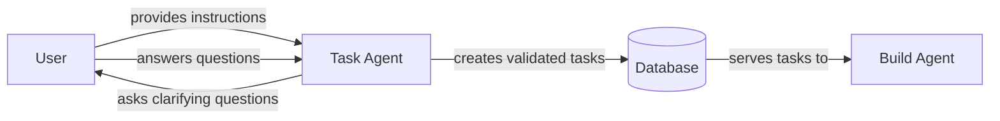

**Why this matters:**
- Ensures all tasks are correctly formatted
- Guarantees independent testability
- Removes cognitive burden from users
- Maintains consistency across the system

### 1.3 Database as Single Source of Truth

Tasks and all their appendices live in the **database**, not in markdown files.

| Entity | Storage | Rationale |
|--------|---------|-----------|
| Tasks | `tasks` table | Queryable, relational, versionable |
| Appendices | `task_appendices` table | Linked to tasks, typed, flexible |
| Relationships | `task_relationships` table | Graph structure, bidirectional |
| Impacts | `task_impacts` table | CRUD operations, conflict detection |
| PRDs | `prds` table | Container for task lists |
| Test Results | `task_test_results` table | Execution history |

---

## 2. Core Task Schema

### 2.1 Entity Relationship Diagram

> **Legend:** Entities marked with `[NEW]` are additions to the existing schema and require implementation.

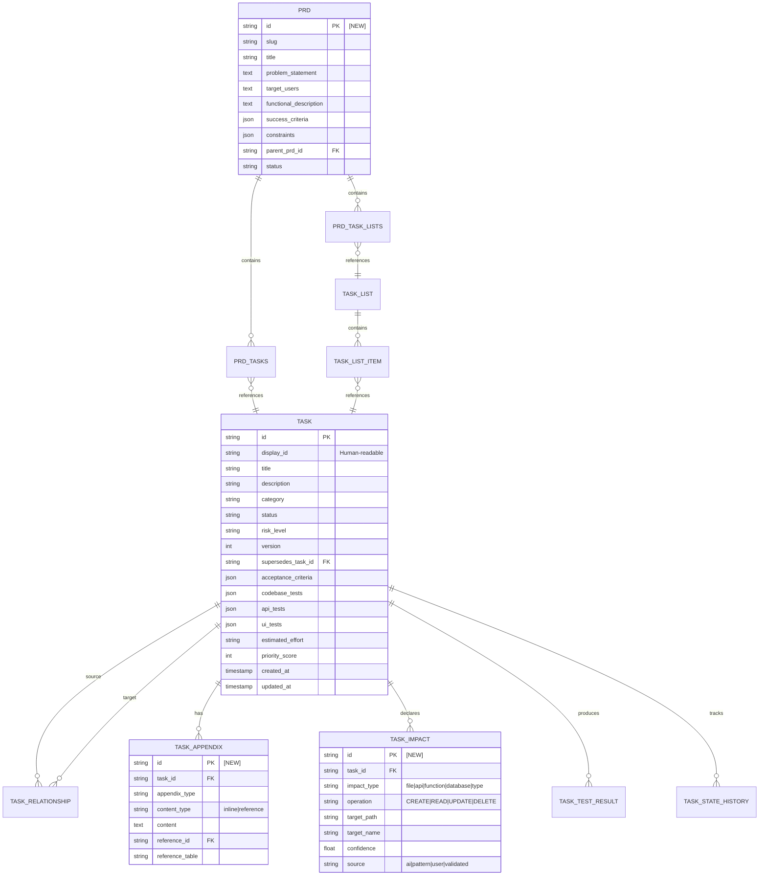

### 2.1.1 Implementation Status

| Entity | Status | Notes |
|--------|--------|-------|
| TASK | ✅ Exists | Core schema implemented |
| TASK_LIST | ✅ Exists | `task_lists_v2` table |
| TASK_LIST_ITEM | ✅ Exists | Junction table |
| TASK_RELATIONSHIP | ✅ Exists | `task_relationships` table |
| TASK_IMPACT | 🆕 NEW | Requires migration |
| TASK_APPENDIX | 🆕 NEW | Requires migration |
| PRD | 🆕 NEW | Requires migration |
| PRD_TASK_LISTS | 🆕 NEW | Junction table |
| PRD_TASKS | 🆕 NEW | Junction table |
| TASK_TEST_RESULT | 🆕 NEW | Requires migration |
| TASK_STATE_HISTORY | 🆕 NEW | Requires migration |

### 2.2 TypeScript Interface

```typescript
// types/task.ts

/**
 * Core Task entity - the atomic unit of work
 */
interface Task {
  // === IDENTITY ===
  id: string;                        // UUID primary key
  displayId: string;                 // Human-readable: TU-PROJ-CAT-###

  // === SCOPE ===
  userId: string;                    // Owner
  projectId?: string;                // Optional project scope
  ideaId?: string;                   // Optional idea scope
  parentTaskId?: string;             // For subtask hierarchy

  // === CONTENT ===
  title: string;                     // Short, action-oriented title
  description: string;               // Full description with context
  category: TaskCategory;            // feature, bug, etc.

  // === STATUS ===
  status: TaskStatus;
  riskLevel: 'low' | 'medium' | 'high';

  // === VERSIONING ===
  version: number;                   // Increments on edit
  supersedesTaskId?: string;         // Previous version

  // === ACCEPTANCE ===
  acceptanceCriteria: AcceptanceCriterion[];

  // === TESTING (3-level) ===
  codebaseTests: CodebaseTest[];     // tsc, lint, unit
  apiTests: ApiTest[];               // HTTP endpoint tests
  uiTests: UiTest[];                 // Puppeteer tests

  // === EFFORT & PRIORITY ===
  estimatedEffort: EffortBucket;
  priorityScore: number;             // Computed by Task Agent
  blocksCount: number;               // How many tasks this blocks
  isQuickWin: boolean;               // < 30 min effort
  deadline?: string;                 // Optional deadline

  // === EXECUTION ===
  assignedAgent?: string;
  actualEffortMinutes?: number;

  // === TIMESTAMPS ===
  createdAt: string;
  updatedAt: string;
  startedAt?: string;
  completedAt?: string;
}

/**
 * Task Impact - what the task touches (CRUD operations)
 */
interface TaskImpact {
  id: string;
  taskId: string;

  impactType: 'file' | 'api' | 'function' | 'database' | 'type';
  operation: 'CREATE' | 'READ' | 'UPDATE' | 'DELETE';

  // Target identification
  targetPath: string;                // File path, API route, table name
  targetName?: string;               // Function name, column name, type name
  targetSignature?: string;          // For functions: parameter types

  // Confidence tracking
  confidence: number;                // 0.0 - 1.0
  source: 'ai' | 'pattern' | 'user' | 'validated';

  createdAt: string;
  validatedAt?: string;              // Set after execution confirms impact
}

/**
 * Task Appendix - optional attachments to brief the agent
 */
interface TaskAppendix {
  id: string;
  taskId: string;

  appendixType: AppendixType;
  contentType: 'inline' | 'reference';

  // For inline content
  content?: string;

  // For references
  referenceId?: string;
  referenceTable?: string;           // 'prds', 'knowledge', 'tasks', etc.

  // Metadata
  title?: string;
  description?: string;

  createdAt: string;
  updatedAt: string;
}

// === ENUMS ===

type TaskStatus =
  | 'draft'           // Created but not validated
  | 'pending'         // Validated, ready for execution
  | 'evaluating'      // In Evaluation Queue (listless)
  | 'blocked'         // Cannot proceed (dependency/conflict)
  | 'in_progress'     // Currently being worked on
  | 'validating'      // Running tests
  | 'failed'          // Execution/tests failed
  | 'stale'           // No activity for threshold
  | 'completed'       // All tests passed
  | 'cancelled';      // Explicitly cancelled

type TaskCategory =
  | 'feature'         // FEA - New functionality
  | 'improvement'     // IMP - Enhancement to existing
  | 'bug'             // BUG - Fix broken behavior
  | 'investigation'   // INV - Research/analysis
  | 'technical_debt'  // TED - Code quality
  | 'infrastructure'  // INF - DevOps/tooling
  | 'documentation'   // DOC - Docs only
  | 'refactoring'     // REF - Code restructure
  | 'security'        // SEC - Security fix/feature
  | 'performance'     // PER - Performance improvement
  | 'testing'         // TST - Test coverage
  | 'migration'       // MIG - Data/schema migration
  | 'integration'     // INT - External service integration
  | 'ux_design'       // UXD - UI/UX work
  | 'maintenance'     // MNT - Routine maintenance
  | 'decommissioned'; // DEC - Removal/sunset

type EffortBucket =
  | 'trivial'         // < 15 minutes
  | 'small'           // 15-30 minutes
  | 'medium'          // 30-60 minutes
  | 'large'           // 1-4 hours
  | 'epic';           // > 4 hours (should be decomposed)

type AppendixType =
  | 'prd_reference'       // Links to parent PRD
  | 'code_context'        // Existing code snippets
  | 'research_notes'      // Background information
  | 'design_spec'         // UI/UX specifications
  | 'gotcha_list'         // Injected mistakes to avoid
  | 'decision_log'        // Architectural decisions
  | 'test_data'           // Sample inputs/outputs
  | 'api_contract'        // OpenAPI/schema reference
  | 'migration_script'    // SQL or data migration
  | 'rollback_plan'       // How to undo changes
  | 'custom';             // User-defined type
```

### 2.3 Field Definitions Table

| Field | Type | Required | Description | Example |
|-------|------|----------|-------------|---------|
| `id` | UUID | Yes | Unique identifier | `550e8400-e29b-41d4-a716-446655440000` |
| `displayId` | string | Yes | Human-readable ID | `TU-VIBE-FEA-042` |
| `title` | string | Yes | Action-oriented title | `Add user authentication endpoint` |
| `description` | text | Yes | Full context and requirements | See template below |
| `category` | enum | Yes | Task type classification | `feature` |
| `status` | enum | Yes | Current lifecycle state | `pending` |
| `riskLevel` | enum | Yes | Impact if task fails | `medium` |
| `version` | int | Yes | Increments on edit | `1` |
| `acceptanceCriteria` | JSON | Yes | Measurable success conditions | See template below |
| `codebaseTests` | JSON | Yes | Syntax/type/lint tests | `["tsc --noEmit"]` |
| `apiTests` | JSON | Conditional | HTTP tests (if API task) | See template below |
| `uiTests` | JSON | Conditional | Puppeteer tests (if UI task) | See template below |
| `estimatedEffort` | enum | Yes | Time bucket | `small` |
| `priorityScore` | int | Yes | Computed priority | `75` |

### 2.4 Status Lifecycle

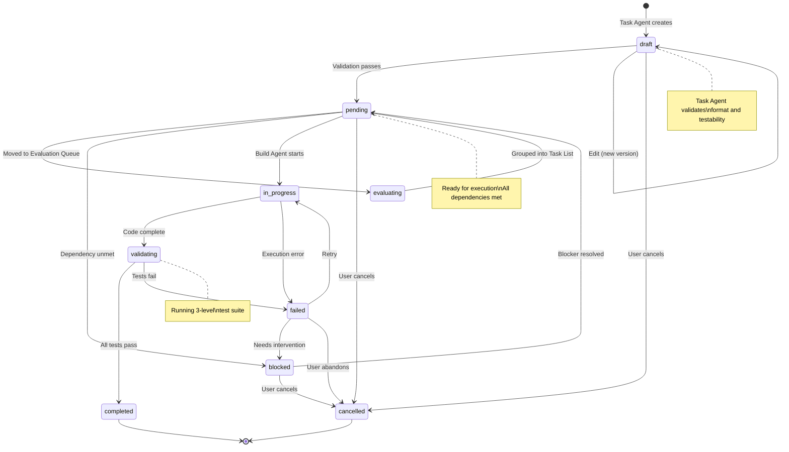

---

## 3. Task Impact Model

### 3.1 Impact Types

Every task must declare its **impacts** - what it touches and how. This enables:
- Conflict detection between parallel tasks
- Cascade detection when tasks are edited
- Dependency inference
- Change tracking

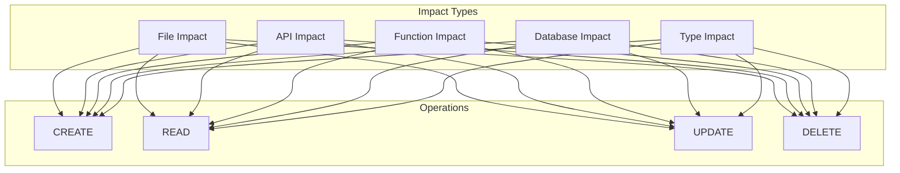

### 3.2 Impact Type Definitions

| Impact Type | Target Path | Target Name | Target Signature | Example |
|-------------|-------------|-------------|------------------|---------|
| `file` | File path | - | - | `src/services/user.ts` |
| `api` | Route path | HTTP method | Request/response types | `/api/users`, `POST` |
| `function` | File path | Function name | Parameter types | `src/utils.ts`, `formatDate`, `(date: Date) => string` |
| `database` | Table name | Column name (optional) | Column type | `users`, `email`, `TEXT` |
| `type` | File path | Type/interface name | - | `types/user.ts`, `User` |

### 3.3 CRUD Operations Matrix

| Operation | Symbol | Meaning | Conflict With |
|-----------|--------|---------|---------------|
| `CREATE` | C | Creates new entity | CREATE (same target) |
| `READ` | R | Reads existing entity | DELETE |
| `UPDATE` | U | Modifies existing entity | UPDATE, DELETE |
| `DELETE` | D | Removes entity | CREATE, READ, UPDATE, DELETE |

**Conflict Matrix (when two tasks touch same target):**

| Task A | Task B | Conflict? | Reason |
|--------|--------|-----------|--------|
| CREATE | CREATE | **YES** | Cannot create same entity twice |
| CREATE | READ | NO | Read happens after create |
| CREATE | UPDATE | NO | Update after create is valid |
| CREATE | DELETE | **YES** | Race condition |
| READ | READ | NO | Safe - no mutation |
| READ | UPDATE | NO | Read before write is safe |
| READ | DELETE | **YES** | Entity may not exist |
| UPDATE | UPDATE | **YES** | Concurrent modification |
| UPDATE | DELETE | **YES** | Entity may not exist |
| DELETE | DELETE | **YES** | Double delete |

### 3.4 Impact Schema

```sql
CREATE TABLE task_impacts (
  id TEXT PRIMARY KEY,
  task_id TEXT NOT NULL REFERENCES tasks(id) ON DELETE CASCADE,

  -- Impact classification
  impact_type TEXT NOT NULL,          -- file, api, function, database, type
  operation TEXT NOT NULL,            -- CREATE, READ, UPDATE, DELETE

  -- Target identification
  target_path TEXT NOT NULL,          -- File path, route, table name
  target_name TEXT,                   -- Function name, column, type name
  target_signature TEXT,              -- For functions: param types

  -- Confidence tracking
  confidence REAL NOT NULL DEFAULT 0.7,  -- 0.0 - 1.0
  source TEXT NOT NULL DEFAULT 'ai',     -- ai, pattern, user, validated

  -- Validation
  validated_at TEXT,                  -- Set after execution confirms
  actual_operation TEXT,              -- What actually happened

  created_at TEXT NOT NULL DEFAULT (datetime('now')),

  -- Composite uniqueness
  UNIQUE(task_id, impact_type, operation, target_path, target_name)
);

CREATE INDEX idx_impacts_task ON task_impacts(task_id);
CREATE INDEX idx_impacts_target ON task_impacts(target_path);
CREATE INDEX idx_impacts_type_op ON task_impacts(impact_type, operation);
```

### 3.5 Impact Examples

**Example 1: API Feature Task**

```json
{
  "taskId": "TU-VIBE-FEA-042",
  "impacts": [
    {
      "impactType": "file",
      "operation": "CREATE",
      "targetPath": "server/routes/auth.ts",
      "confidence": 0.95,
      "source": "ai"
    },
    {
      "impactType": "file",
      "operation": "UPDATE",
      "targetPath": "server/routes/index.ts",
      "confidence": 0.90,
      "source": "ai"
    },
    {
      "impactType": "api",
      "operation": "CREATE",
      "targetPath": "/api/auth/login",
      "targetName": "POST",
      "targetSignature": "{ email: string, password: string } => { token: string }",
      "confidence": 0.95,
      "source": "ai"
    },
    {
      "impactType": "function",
      "operation": "CREATE",
      "targetPath": "server/routes/auth.ts",
      "targetName": "validateCredentials",
      "targetSignature": "(email: string, password: string) => Promise<User | null>",
      "confidence": 0.85,
      "source": "ai"
    },
    {
      "impactType": "type",
      "operation": "UPDATE",
      "targetPath": "types/api.ts",
      "targetName": "ApiRoutes",
      "confidence": 0.80,
      "source": "ai"
    }
  ]
}
```

**Example 2: Database Migration Task**

```json
{
  "taskId": "TU-VIBE-MIG-003",
  "impacts": [
    {
      "impactType": "file",
      "operation": "CREATE",
      "targetPath": "database/migrations/060_add_user_preferences.sql",
      "confidence": 1.0,
      "source": "user"
    },
    {
      "impactType": "database",
      "operation": "UPDATE",
      "targetPath": "users",
      "targetName": "preferences",
      "targetSignature": "TEXT DEFAULT '{}'",
      "confidence": 1.0,
      "source": "user"
    },
    {
      "impactType": "type",
      "operation": "UPDATE",
      "targetPath": "types/database.ts",
      "targetName": "User",
      "confidence": 0.95,
      "source": "ai"
    }
  ]
}
```

---

## 4. Task Relationships

### 4.1 Relationship Types (11)

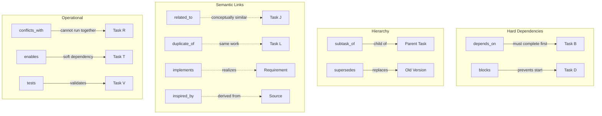

### 4.2 Relationship Definitions

| Type | Direction | Meaning | Blocks Execution? |
|------|-----------|---------|-------------------|
| `depends_on` | A → B | A requires B complete first | Yes |
| `blocks` | A → B | A prevents B from starting | Yes |
| `subtask_of` | A → B | A is a child of B | No |
| `supersedes` | A → B | A replaces B (new version) | No |
| `related_to` | A ↔ B | Conceptual relationship | No |
| `duplicate_of` | A → B | A is duplicate of B | No (merge recommended) |
| `implements` | A → B | A implements spec/requirement B | No |
| `inspired_by` | A → B | A derived from B | No |
| `conflicts_with` | A ↔ B | A and B cannot run in parallel | Yes (parallel only) |
| `enables` | A → B | A makes B easier (soft dep) | No |
| `tests` | A → B | A tests/validates B | No |

### 4.3 Relationship Schema

```sql
CREATE TABLE task_relationships (
  id TEXT PRIMARY KEY,
  source_task_id TEXT NOT NULL REFERENCES tasks(id) ON DELETE CASCADE,
  target_task_id TEXT NOT NULL REFERENCES tasks(id) ON DELETE CASCADE,

  relationship_type TEXT NOT NULL,

  -- Metadata
  strength REAL,                     -- 0-1 for similarity (related_to, duplicate_of)
  notes TEXT,

  created_at TEXT NOT NULL DEFAULT (datetime('now')),
  created_by TEXT REFERENCES users(id),

  UNIQUE(source_task_id, target_task_id, relationship_type),
  CHECK(source_task_id != target_task_id)
);

CREATE INDEX idx_rel_source ON task_relationships(source_task_id);
CREATE INDEX idx_rel_target ON task_relationships(target_task_id);
CREATE INDEX idx_rel_type ON task_relationships(relationship_type);
```

### 4.4 Versioning & Cascade Logic

When Task Agent edits a task, a new version is created and related tasks may need updating.

**Version Creation:**

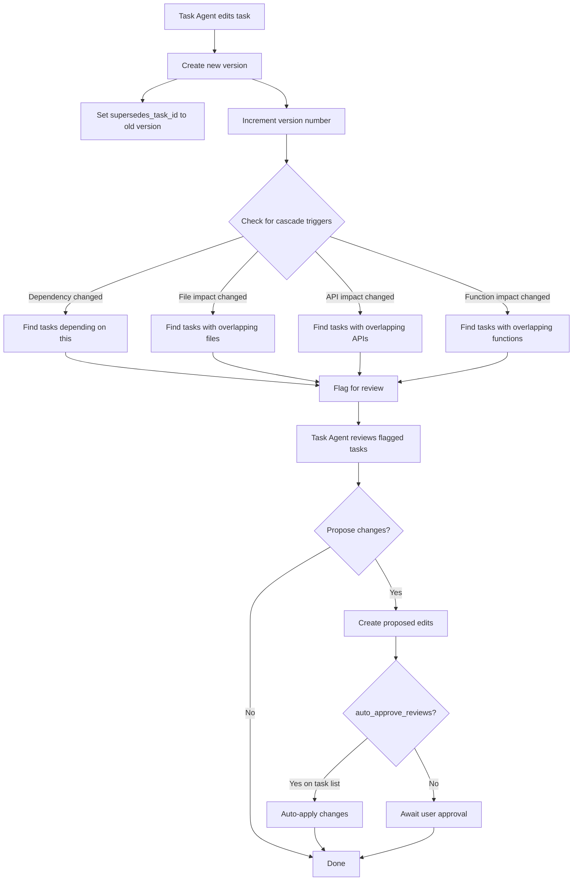

**Cascade Trigger Rules:**

| Change Type | Cascade Behavior | Action |
|-------------|------------------|--------|
| Dependency added/removed | Find all tasks with `depends_on` or `blocks` relationship | Flag for review |
| File impact added/changed | Find all tasks touching same file | Check for conflicts, flag if found |
| API impact added/changed | Find all tasks touching same API route | Flag for review |
| Function impact added/changed | Find all tasks touching same function | Flag for review |
| Acceptance criteria changed | No cascade | Isolated change |
| Title/description changed | No cascade | Isolated change |

**Auto-Approve Flag:**

The `auto_approve_reviews` boolean on `task_lists` controls whether cascade changes are auto-applied:

```sql
ALTER TABLE task_lists ADD COLUMN auto_approve_reviews INTEGER NOT NULL DEFAULT 0;
```

| Flag Value | Behavior |
|------------|----------|
| `0` (default) | Task Agent proposes changes, waits for user approval |
| `1` | Task Agent auto-applies non-destructive changes |

---

## 5. Task Appendices

### 5.1 Appendix Types

Appendices are optional attachments that provide additional context to brief the Build Agent.

| Type | Purpose | Content Type | Example |
|------|---------|--------------|---------|
| `prd_reference` | Links to parent PRD | reference | PRD ID |
| `code_context` | Existing code agent should understand | inline | Function snippets |
| `research_notes` | Background information | inline | Market data |
| `design_spec` | UI/UX specifications | inline or reference | Figma link, component spec |
| `gotcha_list` | Mistakes to avoid (from Knowledge Base) | inline | Injected gotchas |
| `decision_log` | Architectural decisions | reference | ADR IDs |
| `test_data` | Sample inputs/outputs | inline | JSON fixtures |
| `api_contract` | OpenAPI/schema reference | inline or reference | Schema snippet |
| `migration_script` | SQL or data migration | inline | SQL template |
| `rollback_plan` | How to undo changes | inline | Rollback steps |
| `custom` | User-defined | inline | Any content |

### 5.2 Appendix Schema

```sql
CREATE TABLE task_appendices (
  id TEXT PRIMARY KEY,
  task_id TEXT NOT NULL REFERENCES tasks(id) ON DELETE CASCADE,

  -- Classification
  appendix_type TEXT NOT NULL,
  content_type TEXT NOT NULL,         -- 'inline' or 'reference'

  -- For inline content
  content TEXT,

  -- For references
  reference_id TEXT,
  reference_table TEXT,               -- 'prds', 'knowledge', 'tasks', etc.

  -- Metadata
  title TEXT,
  description TEXT,

  -- Ordering
  position INTEGER NOT NULL DEFAULT 0,

  created_at TEXT NOT NULL DEFAULT (datetime('now')),
  updated_at TEXT NOT NULL DEFAULT (datetime('now')),

  -- Validation
  CHECK(
    (content_type = 'inline' AND content IS NOT NULL) OR
    (content_type = 'reference' AND reference_id IS NOT NULL AND reference_table IS NOT NULL)
  )
);

CREATE INDEX idx_appendix_task ON task_appendices(task_id);
CREATE INDEX idx_appendix_type ON task_appendices(appendix_type);
CREATE INDEX idx_appendix_ref ON task_appendices(reference_table, reference_id);
```

### 5.3 Appendix Examples

**Code Context Appendix:**

```json
{
  "appendixType": "code_context",
  "contentType": "inline",
  "title": "Existing User Service",
  "description": "Current implementation to extend",
  "content": "```typescript\n// server/services/user.ts\nexport class UserService {\n  async getUser(id: string): Promise<User | null> {\n    return db.query('SELECT * FROM users WHERE id = ?', [id]);\n  }\n}\n```"
}
```

**PRD Reference Appendix:**

```json
{
  "appendixType": "prd_reference",
  "contentType": "reference",
  "title": "Parent PRD",
  "referenceId": "PRD-VIBE-001",
  "referenceTable": "prds"
}
```

**Gotcha List Appendix:**

```json
{
  "appendixType": "gotcha_list",
  "contentType": "inline",
  "title": "Gotchas from Knowledge Base",
  "content": "## Gotchas for this task:\n\n1. **SQLite dates**: Use TEXT for dates, not DATETIME\n2. **Foreign keys**: Require `PRAGMA foreign_keys = ON`\n3. **Express routes**: Must call `next()` on error"
}
```

---

## 6. PRD Integration

### 6.1 What is a PRD?

A **PRD (Product Requirements Document)** is a product description from a functional perspective. It provides the "why" and "what" that tasks implement.

```
┌─────────────────────────────────────────────────────────────────────────────┐
│                              PRD HIERARCHY                                   │
├─────────────────────────────────────────────────────────────────────────────┤
│                                                                              │
│                          ┌─────────────────┐                                 │
│                          │  Summary PRD    │                                 │
│                          │  (Parent)       │                                 │
│                          └────────┬────────┘                                 │
│                                   │                                          │
│              ┌────────────────────┼────────────────────┐                    │
│              │                    │                    │                    │
│       ┌──────▼──────┐      ┌──────▼──────┐      ┌──────▼──────┐            │
│       │   PRD A     │      │   PRD B     │      │   PRD C     │            │
│       │  (Feature)  │      │  (Feature)  │      │  (Feature)  │            │
│       └──────┬──────┘      └──────┬──────┘      └──────┬──────┘            │
│              │                    │                    │                    │
│       ┌──────▼──────┐      ┌──────▼──────┐      ┌──────▼──────┐            │
│       │ Task Lists  │      │ Task Lists  │      │ Task Lists  │            │
│       └──────┬──────┘      └──────┬──────┘      └──────┬──────┘            │
│              │                    │                    │                    │
│       ┌──────▼──────┐      ┌──────▼──────┐      ┌──────▼──────┐            │
│       │   Tasks     │      │   Tasks     │      │   Tasks     │            │
│       └─────────────┘      └─────────────┘      └─────────────┘            │
│                                                                              │
└─────────────────────────────────────────────────────────────────────────────┘
```

### 6.2 PRD Schema

```sql
CREATE TABLE prds (
  id TEXT PRIMARY KEY,

  -- Identity
  slug TEXT NOT NULL,
  title TEXT NOT NULL,

  -- Scope
  user_id TEXT NOT NULL REFERENCES users(id),
  project_id TEXT REFERENCES projects(id),

  -- Hierarchy
  parent_prd_id TEXT REFERENCES prds(id),  -- For summary/child relationship

  -- Content
  problem_statement TEXT,              -- What problem does this solve?
  target_users TEXT,                   -- Who is this for?
  functional_description TEXT,         -- What does it do (high level)?
  success_criteria TEXT DEFAULT '[]',  -- JSON: measurable outcomes
  constraints TEXT DEFAULT '[]',       -- JSON: limitations/boundaries
  out_of_scope TEXT DEFAULT '[]',      -- JSON: explicit exclusions

  -- Status
  status TEXT NOT NULL DEFAULT 'draft',  -- draft, active, completed, archived

  -- Progress (computed)
  total_task_lists INTEGER DEFAULT 0,
  completed_task_lists INTEGER DEFAULT 0,
  total_tasks INTEGER DEFAULT 0,
  completed_tasks INTEGER DEFAULT 0,

  -- Metadata
  created_by TEXT NOT NULL REFERENCES users(id),
  created_at TEXT NOT NULL DEFAULT (datetime('now')),
  updated_at TEXT NOT NULL DEFAULT (datetime('now')),

  UNIQUE(project_id, slug)
);

CREATE INDEX idx_prds_user ON prds(user_id);
CREATE INDEX idx_prds_project ON prds(project_id);
CREATE INDEX idx_prds_parent ON prds(parent_prd_id);
CREATE INDEX idx_prds_status ON prds(status);

-- PRD → Task Lists junction
CREATE TABLE prd_task_lists (
  id TEXT PRIMARY KEY,
  prd_id TEXT NOT NULL REFERENCES prds(id) ON DELETE CASCADE,
  task_list_id TEXT NOT NULL REFERENCES task_lists(id) ON DELETE CASCADE,

  position INTEGER NOT NULL DEFAULT 0,

  created_at TEXT NOT NULL DEFAULT (datetime('now')),

  UNIQUE(prd_id, task_list_id)
);

CREATE INDEX idx_prd_tl_prd ON prd_task_lists(prd_id);
CREATE INDEX idx_prd_tl_list ON prd_task_lists(task_list_id);

-- PRD → Tasks direct junction (for tasks not in lists)
CREATE TABLE prd_tasks (
  id TEXT PRIMARY KEY,
  prd_id TEXT NOT NULL REFERENCES prds(id) ON DELETE CASCADE,
  task_id TEXT NOT NULL REFERENCES tasks(id) ON DELETE CASCADE,

  position INTEGER NOT NULL DEFAULT 0,

  created_at TEXT NOT NULL DEFAULT (datetime('now')),

  UNIQUE(prd_id, task_id)
);

CREATE INDEX idx_prd_tasks_prd ON prd_tasks(prd_id);
CREATE INDEX idx_prd_tasks_task ON prd_tasks(task_id);
```

### 6.3 PRD TypeScript Interface

```typescript
interface PRD {
  id: string;
  slug: string;
  title: string;

  userId: string;
  projectId?: string;
  parentPrdId?: string;

  // Content
  problemStatement?: string;
  targetUsers?: string;
  functionalDescription?: string;
  successCriteria: SuccessCriterion[];
  constraints: string[];
  outOfScope: string[];

  // Status
  status: 'draft' | 'active' | 'completed' | 'archived';

  // Progress
  totalTaskLists: number;
  completedTaskLists: number;
  totalTasks: number;
  completedTasks: number;

  // Timestamps
  createdBy: string;
  createdAt: string;
  updatedAt: string;
}

interface SuccessCriterion {
  description: string;
  metric?: string;
  target?: string;
  verified: boolean;
}
```

### 6.4 Visualization Model

PRDs enable users to understand what tasks relate to at a high level:

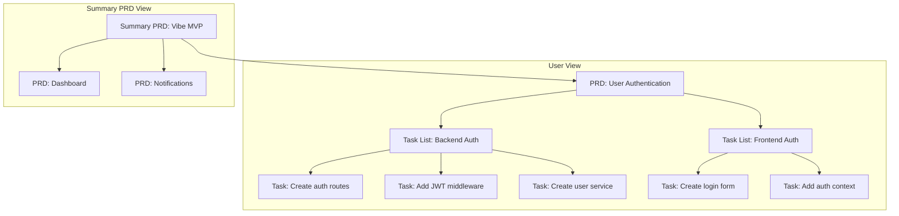

---

## 7. Task Creation Pipeline

### 7.1 Instruction Intake Schema

Users provide instructions through multiple channels. Task Agent normalizes them into a standard schema.

```typescript
/**
 * Raw instruction from user (any channel)
 */
interface UserInstruction {
  // Required
  content: string;                    // What the user said/wrote

  // Channel metadata
  channel: 'telegram' | 'web_ui' | 'voice' | 'api' | 'forwarded';
  timestamp: string;
  userId: string;

  // Optional context
  scope?: {
    projectId?: string;
    ideaId?: string;
    prdId?: string;
  };

  // Attachments
  attachments?: Array<{
    type: 'image' | 'document' | 'voice' | 'code';
    content: string;                  // URL or base64
    transcription?: string;           // For voice
  }>;

  // Conversation context
  replyToMessageId?: string;
  conversationHistory?: Message[];
}

/**
 * Normalized instruction after Task Agent processing
 */
interface NormalizedInstruction {
  // Extracted intent
  intent: string;                     // What the user wants to accomplish

  // Inferred scope
  projectId: string;
  ideaId?: string;
  prdId?: string;

  // Extracted requirements
  requirements: string[];

  // Inferred category
  suggestedCategory: TaskCategory;

  // Confidence
  confidence: number;
  clarificationNeeded: string[];
}
```

### 7.2 Task Agent Questioning Style

Task Agent **extensively** covers all bases before creating a task. There is no "minimum" - every task must be fully specified.

**Questioning Principles:**

1. **Clarify Intent**: Ensure understanding of what user wants
2. **Scope Boundaries**: What's in scope, what's explicitly out
3. **Acceptance Criteria**: How do we know it's done?
4. **Dependencies**: What must exist first?
5. **Impacts**: What files/APIs/functions will change?
6. **Testing**: How do we validate it works?
7. **Risks**: What could go wrong?
8. **Rollback**: How do we undo if needed?

**Question Categories:**

| Category | Example Questions |
|----------|-------------------|
| **Intent** | "You want to add user authentication - should this support OAuth, email/password, or both?" |
| **Scope** | "Should this include password reset functionality, or is that a separate task?" |
| **Target** | "Which users will use this - all users, or specific roles?" |
| **Technical** | "Should we use JWT or session-based authentication?" |
| **Dependencies** | "This requires a users table - is that already in place?" |
| **Testing** | "What should happen if invalid credentials are provided?" |
| **Edge Cases** | "How should we handle rate limiting for failed login attempts?" |
| **Rollback** | "If this breaks, what's the rollback plan?" |

**Questioning Flow:**

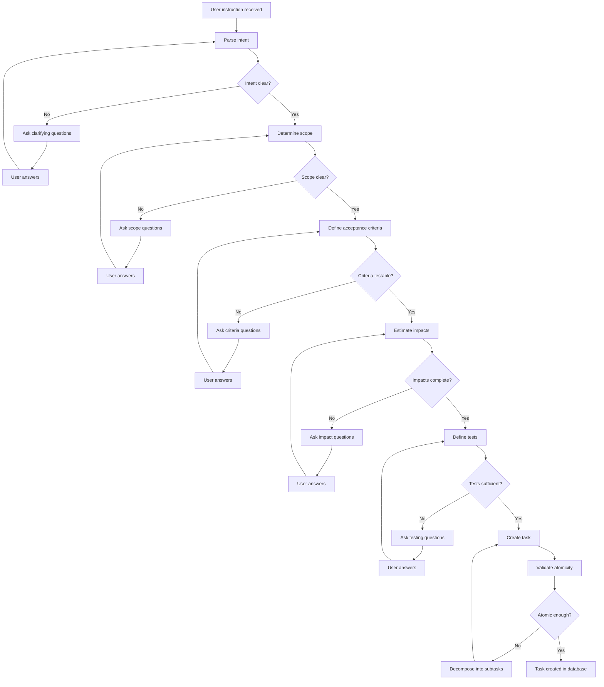

### 7.3 Decomposition Decision Tree

When a task is too large, Task Agent decomposes it:

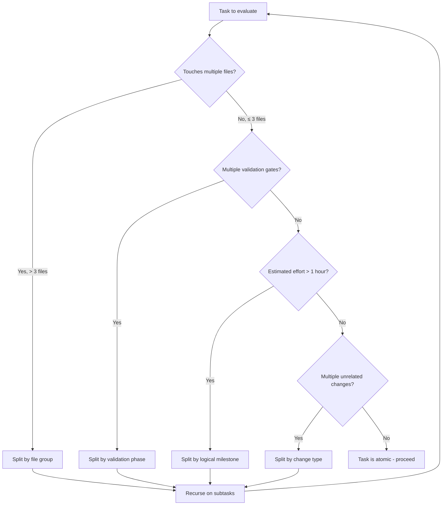

### 7.4 Atomicity Validation Rules

A task passes atomicity validation when ALL of the following are true:

| Rule | Check | Example Pass | Example Fail |
|------|-------|--------------|--------------|
| **Single Concern** | Task has one logical purpose | "Add login endpoint" | "Add login and password reset" |
| **Bounded Files** | ≤ 3 files modified (with exceptions) | `auth.ts`, `types.ts` | 10 files across codebase |
| **Time Bounded** | ≤ 1 hour estimated effort | `small` or `medium` | `epic` |
| **Testable** | Has at least one validation command | `tsc --noEmit` | No tests defined |
| **Independent** | Can be validated without other pending tasks | Tests pass in isolation | Requires other task to pass |
| **Clear Completion** | Binary pass/fail acceptance criteria | "Endpoint returns 200" | "Works well" |

---

## 8. Effort & Priority Model

### 8.1 Effort Bucket Definitions

Task Agent estimates effort using these calibrated buckets:

| Bucket | Time Range | Typical Characteristics |
|--------|------------|------------------------|
| `trivial` | < 15 min | Single-line change, config tweak, typo fix |
| `small` | 15-30 min | Single function, simple endpoint, minor feature |
| `medium` | 30-60 min | Multiple functions, moderate endpoint, standard feature |
| `large` | 1-4 hours | Multiple files, complex feature, significant change |
| `epic` | > 4 hours | **Should be decomposed** - too large for single task |

**Calibration Examples:**

| Task | Bucket | Rationale |
|------|--------|-----------|
| "Fix typo in error message" | `trivial` | One string change |
| "Add validation to email field" | `small` | One function, one test |
| "Create user authentication endpoint" | `medium` | Route + service + tests |
| "Implement WebSocket real-time updates" | `large` | Multiple files, complex testing |
| "Build entire notification system" | `epic` | **Decompose** into smaller tasks |

### 8.2 Priority Calculation

Task Agent computes `priorityScore` using these factors:

```typescript
function calculatePriority(task: Task, context: TaskContext): number {
  let score = 0;

  // Factor 1: Blocking others (+20 per blocked task)
  score += task.blocksCount * 20;

  // Factor 2: Quick win bonus (+15)
  if (task.isQuickWin) {
    score += 15;
  }

  // Factor 3: Deadline urgency
  if (task.deadline) {
    const daysUntilDeadline = daysBetween(now(), task.deadline);
    if (daysUntilDeadline <= 1) score += 50;
    else if (daysUntilDeadline <= 3) score += 30;
    else if (daysUntilDeadline <= 7) score += 10;
  }

  // Factor 4: Risk level
  switch (task.riskLevel) {
    case 'high': score += 5; break;   // Handle risky items sooner
    case 'medium': score += 0; break;
    case 'low': score -= 5; break;    // Can defer low-risk
  }

  // Factor 5: Category urgency
  switch (task.category) {
    case 'security': score += 25; break;
    case 'bug': score += 15; break;
    case 'feature': score += 5; break;
    // Other categories: no adjustment
  }

  return score;
}
```

### 8.3 Task Agent Calibration Rules

Task Agent must use consistent estimation across all tasks:

**Effort Estimation Inputs:**

| Input | Weight | Source |
|-------|--------|--------|
| File count | High | Impact analysis |
| Function count | Medium | Impact analysis |
| Historical similar tasks | High | Knowledge Base patterns |
| Category complexity | Medium | Category defaults |
| Dependency count | Low | Relationship analysis |

**Effort Estimation Formula:**

```typescript
function estimateEffort(task: Task, impacts: TaskImpact[]): EffortBucket {
  // Base score from impacts
  let score = 0;

  // File impacts (most significant)
  const fileImpacts = impacts.filter(i => i.impactType === 'file');
  score += fileImpacts.filter(i => i.operation === 'CREATE').length * 15;
  score += fileImpacts.filter(i => i.operation === 'UPDATE').length * 10;

  // Function impacts
  const fnImpacts = impacts.filter(i => i.impactType === 'function');
  score += fnImpacts.filter(i => i.operation === 'CREATE').length * 10;
  score += fnImpacts.filter(i => i.operation === 'UPDATE').length * 5;

  // API impacts (testing overhead)
  const apiImpacts = impacts.filter(i => i.impactType === 'api');
  score += apiImpacts.length * 8;

  // Database impacts (migration complexity)
  const dbImpacts = impacts.filter(i => i.impactType === 'database');
  score += dbImpacts.length * 12;

  // Historical adjustment
  const similar = findSimilarCompletedTasks(task);
  if (similar.length > 0) {
    const avgActualMinutes = average(similar.map(t => t.actualEffortMinutes));
    // Adjust towards historical average
    score = (score + avgActualMinutes) / 2;
  }

  // Map score to bucket
  if (score < 15) return 'trivial';
  if (score < 30) return 'small';
  if (score < 60) return 'medium';
  if (score < 240) return 'large';
  return 'epic'; // Should decompose
}
```

---

## 9. Testing Integration

### 9.1 Three-Level Test Framework

Every task must have tests at appropriate levels:

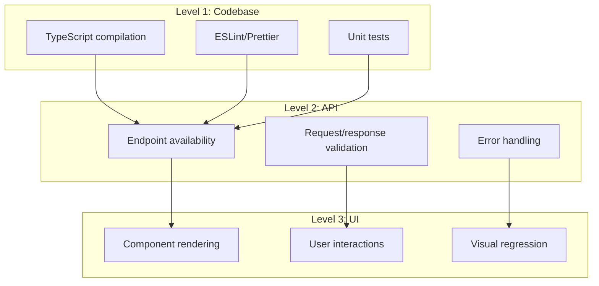

### 9.2 Test Requirements by Category

| Category | Codebase Tests | API Tests | UI Tests |
|----------|---------------|-----------|----------|
| `feature` (backend) | Required | Required | - |
| `feature` (frontend) | Required | - | Required |
| `feature` (fullstack) | Required | Required | Required |
| `bug` | Required | If API affected | If UI affected |
| `infrastructure` | Required | - | - |
| `migration` | Required | - | - |
| `security` | Required | Required | Optional |
| `performance` | Required | Optional | Optional |

### 9.3 Test Schema

```typescript
interface CodebaseTest {
  command: string;          // e.g., "tsc --noEmit"
  expected: string;         // e.g., "exit code 0"
  timeout?: number;         // ms, default 30000
  description?: string;
}

interface ApiTest {
  method: 'GET' | 'POST' | 'PUT' | 'PATCH' | 'DELETE';
  path: string;             // e.g., "/api/auth/login"
  headers?: Record<string, string>;
  body?: unknown;
  expectedStatus: number;
  expectedBodyContains?: string[];
  expectedHeaders?: Record<string, string>;
  timeout?: number;
  description?: string;
}

interface UiTest {
  action: 'navigate' | 'click' | 'fill' | 'assert' | 'screenshot';
  selector?: string;        // CSS selector
  value?: string;           // For 'fill' action
  url?: string;             // For 'navigate' action
  assertion?: {
    type: 'visible' | 'text' | 'count' | 'attribute';
    expected: string | number;
  };
  timeout?: number;
  description?: string;
}
```

### 9.4 Acceptance Criteria → Test Mapping

Task Agent maps acceptance criteria to tests:

| Criteria Pattern | Generated Test Type | Example |
|-----------------|---------------------|---------|
| "Endpoint returns..." | API test | `{ method: 'GET', path: '/api/users', expectedStatus: 200 }` |
| "User can click..." | UI test | `{ action: 'click', selector: '#submit-btn' }` |
| "No TypeScript errors" | Codebase test | `{ command: 'tsc --noEmit', expected: 'exit code 0' }` |
| "Function returns..." | Codebase test (unit) | `{ command: 'npm test -- --grep "functionName"', expected: 'pass' }` |
| "Page displays..." | UI test | `{ action: 'assert', selector: '.message', assertion: { type: 'visible' } }` |

---

## 10. Task Agent Decision Interfaces

### 10.1 Effort Estimation Interface

```typescript
interface EffortEstimationInput {
  task: {
    title: string;
    description: string;
    category: TaskCategory;
    acceptanceCriteria: AcceptanceCriterion[];
  };
  impacts: TaskImpact[];
  historicalSimilar: Task[];  // Past completed tasks
}

interface EffortEstimationOutput {
  bucket: EffortBucket;
  confidenceScore: number;  // 0.0 - 1.0
  reasoning: string;
  shouldDecompose: boolean;
  decompositionSuggestions?: string[];
}
```

### 10.2 Conflict Detection Interface

```typescript
interface ConflictDetectionInput {
  taskA: Task;
  taskAImpacts: TaskImpact[];
  taskB: Task;
  taskBImpacts: TaskImpact[];
}

interface ConflictDetectionOutput {
  hasConflict: boolean;
  conflictType?: 'file' | 'api' | 'function' | 'database' | 'type';
  conflictDetails?: {
    targetPath: string;
    targetName?: string;
    operationA: CrudOperation;
    operationB: CrudOperation;
    severity: 'blocking' | 'warning';
  }[];
  canRunParallel: boolean;
  resolutionSuggestion?: string;
}
```

### 10.3 Atomicity Check Interface

```typescript
interface AtomicityCheckInput {
  task: Task;
  impacts: TaskImpact[];
}

interface AtomicityCheckOutput {
  isAtomic: boolean;
  violations: Array<{
    rule: 'single_concern' | 'bounded_files' | 'time_bounded' | 'testable' | 'independent' | 'clear_completion';
    description: string;
    severity: 'error' | 'warning';
  }>;
  decompositionRequired: boolean;
  suggestedSubtasks?: Array<{
    title: string;
    description: string;
    estimatedImpacts: string[];
  }>;
}
```

### 10.4 Cascade Trigger Interface

```typescript
interface CascadeTriggerInput {
  originalTask: Task;
  editedTask: Task;
  originalImpacts: TaskImpact[];
  editedImpacts: TaskImpact[];
  relatedTasks: Task[];
  relatedImpacts: Map<string, TaskImpact[]>;
}

interface CascadeTriggerOutput {
  tasksToFlag: Array<{
    taskId: string;
    reason: 'dependency_change' | 'file_conflict' | 'api_conflict' | 'function_conflict';
    details: string;
  }>;
  proposedChanges: Array<{
    taskId: string;
    changeType: 'update_dependency' | 'update_impact' | 'flag_conflict';
    proposedEdit: Partial<Task>;
  }>;
  autoApproveEligible: boolean;  // Based on task list setting
}
```

### 10.5 Gotcha Injection Interface

```typescript
interface GotchaInjectionInput {
  task: Task;
  impacts: TaskImpact[];
  knowledgeBaseQuery: {
    filePatterns: string[];
    actionTypes: CrudOperation[];
    minConfidence: number;  // Default 0.6
    limit: number;          // Default 5
  };
}

interface GotchaInjectionOutput {
  gotchas: Array<{
    id: string;
    content: string;
    relevanceScore: number;
    source: 'file_pattern' | 'action_type' | 'category' | 'historical';
  }>;
  appendixCreated: boolean;
  appendixId?: string;
}
```

---

## Appendix A: Standard Appendix Templates

### A.1 PRD Reference Template

```markdown
## PRD Reference

**PRD ID:** {prd_id}
**PRD Title:** {prd_title}

### Relevant Success Criteria
- {criterion_1}
- {criterion_2}

### Constraints from PRD
- {constraint_1}
- {constraint_2}
```

### A.2 Code Context Template

```markdown
## Code Context

### Existing Implementation

**File:** `{file_path}`

```{language}
{code_snippet}
```

### Integration Points
- {integration_point_1}
- {integration_point_2}

### Notes
{additional_context}
```

### A.3 Gotcha List Template

```markdown
## Gotchas for This Task

> These gotchas are injected from the Knowledge Base based on file patterns and operation types.

### High Confidence (≥ 0.9)

1. **{gotcha_title}**
   - Pattern: `{file_pattern}`
   - Action: `{action_type}`
   - Detail: {gotcha_content}

### Medium Confidence (0.7 - 0.9)

1. **{gotcha_title}**
   - Pattern: `{file_pattern}`
   - Action: `{action_type}`
   - Detail: {gotcha_content}
```

### A.4 Test Data Template

```markdown
## Test Data

### Input Fixtures

```json
{
  "validInput": {
    // Valid test case
  },
  "invalidInput": {
    // Invalid test case for error handling
  },
  "edgeCase": {
    // Edge case test
  }
}
```

### Expected Outputs

| Input | Expected Output | Notes |
|-------|-----------------|-------|
| validInput | {expected} | Happy path |
| invalidInput | Error: {message} | Validation error |
| edgeCase | {expected} | Boundary handling |
```

### A.5 Rollback Plan Template

```markdown
## Rollback Plan

### If This Task Fails

1. **Database Rollback**
   ```sql
   -- Revert migration
   {rollback_sql}
   ```

2. **File Revert**
   ```bash
   git checkout HEAD~1 -- {file_paths}
   ```

3. **Verification**
   ```bash
   {verification_command}
   ```

### Dependencies to Notify
- Task {related_task_id}: May need re-execution
```

---

## Appendix B: Category Reference

| Code | Category | Description | Typical Effort | Test Requirements |
|------|----------|-------------|----------------|-------------------|
| `FEA` | feature | New functionality | medium-large | All 3 levels |
| `IMP` | improvement | Enhancement to existing | small-medium | Affected levels |
| `BUG` | bug | Fix broken behavior | trivial-medium | Regression tests |
| `INV` | investigation | Research/analysis | small-medium | Documentation only |
| `TED` | technical_debt | Code quality | small-large | Codebase tests |
| `INF` | infrastructure | DevOps/tooling | small-large | Codebase tests |
| `DOC` | documentation | Docs only | trivial-small | None |
| `REF` | refactoring | Code restructure | medium-large | Full regression |
| `SEC` | security | Security fix/feature | small-large | Security tests |
| `PER` | performance | Performance improvement | medium-large | Benchmark tests |
| `TST` | testing | Test coverage | small-medium | Meta-tests |
| `MIG` | migration | Data/schema migration | medium-large | Migration tests |
| `INT` | integration | External service | medium-large | Integration tests |
| `UXD` | ux_design | UI/UX work | small-large | UI tests |
| `MNT` | maintenance | Routine maintenance | trivial-small | Smoke tests |
| `DEC` | decommissioned | Removal/sunset | small-medium | Removal verification |

---

## Appendix C: SQL Migrations

### Migration: Task Impacts Table

```sql
-- Migration: 070_task_impacts.sql

CREATE TABLE task_impacts (
  id TEXT PRIMARY KEY,
  task_id TEXT NOT NULL REFERENCES tasks(id) ON DELETE CASCADE,

  impact_type TEXT NOT NULL CHECK(impact_type IN ('file', 'api', 'function', 'database', 'type')),
  operation TEXT NOT NULL CHECK(operation IN ('CREATE', 'READ', 'UPDATE', 'DELETE')),

  target_path TEXT NOT NULL,
  target_name TEXT,
  target_signature TEXT,

  confidence REAL NOT NULL DEFAULT 0.7 CHECK(confidence >= 0.0 AND confidence <= 1.0),
  source TEXT NOT NULL DEFAULT 'ai' CHECK(source IN ('ai', 'pattern', 'user', 'validated')),

  validated_at TEXT,
  actual_operation TEXT,

  created_at TEXT NOT NULL DEFAULT (datetime('now')),

  UNIQUE(task_id, impact_type, operation, target_path, COALESCE(target_name, ''))
);

CREATE INDEX idx_impacts_task ON task_impacts(task_id);
CREATE INDEX idx_impacts_target ON task_impacts(target_path);
CREATE INDEX idx_impacts_type_op ON task_impacts(impact_type, operation);
```

### Migration: Task Appendices Table

```sql
-- Migration: 071_task_appendices.sql

CREATE TABLE task_appendices (
  id TEXT PRIMARY KEY,
  task_id TEXT NOT NULL REFERENCES tasks(id) ON DELETE CASCADE,

  appendix_type TEXT NOT NULL,
  content_type TEXT NOT NULL CHECK(content_type IN ('inline', 'reference')),

  content TEXT,

  reference_id TEXT,
  reference_table TEXT,

  title TEXT,
  description TEXT,

  position INTEGER NOT NULL DEFAULT 0,

  created_at TEXT NOT NULL DEFAULT (datetime('now')),
  updated_at TEXT NOT NULL DEFAULT (datetime('now')),

  CHECK(
    (content_type = 'inline' AND content IS NOT NULL) OR
    (content_type = 'reference' AND reference_id IS NOT NULL AND reference_table IS NOT NULL)
  )
);

CREATE INDEX idx_appendix_task ON task_appendices(task_id);
CREATE INDEX idx_appendix_type ON task_appendices(appendix_type);
CREATE INDEX idx_appendix_ref ON task_appendices(reference_table, reference_id);
```

### Migration: PRDs Tables

```sql
-- Migration: 072_prds.sql

CREATE TABLE prds (
  id TEXT PRIMARY KEY,

  slug TEXT NOT NULL,
  title TEXT NOT NULL,

  user_id TEXT NOT NULL REFERENCES users(id),
  project_id TEXT REFERENCES projects(id),

  parent_prd_id TEXT REFERENCES prds(id),

  problem_statement TEXT,
  target_users TEXT,
  functional_description TEXT,
  success_criteria TEXT DEFAULT '[]',
  constraints TEXT DEFAULT '[]',
  out_of_scope TEXT DEFAULT '[]',

  status TEXT NOT NULL DEFAULT 'draft' CHECK(status IN ('draft', 'active', 'completed', 'archived')),

  total_task_lists INTEGER DEFAULT 0,
  completed_task_lists INTEGER DEFAULT 0,
  total_tasks INTEGER DEFAULT 0,
  completed_tasks INTEGER DEFAULT 0,

  created_by TEXT NOT NULL REFERENCES users(id),
  created_at TEXT NOT NULL DEFAULT (datetime('now')),
  updated_at TEXT NOT NULL DEFAULT (datetime('now')),

  UNIQUE(project_id, slug)
);

CREATE INDEX idx_prds_user ON prds(user_id);
CREATE INDEX idx_prds_project ON prds(project_id);
CREATE INDEX idx_prds_parent ON prds(parent_prd_id);
CREATE INDEX idx_prds_status ON prds(status);

CREATE TABLE prd_task_lists (
  id TEXT PRIMARY KEY,
  prd_id TEXT NOT NULL REFERENCES prds(id) ON DELETE CASCADE,
  task_list_id TEXT NOT NULL REFERENCES task_lists(id) ON DELETE CASCADE,

  position INTEGER NOT NULL DEFAULT 0,

  created_at TEXT NOT NULL DEFAULT (datetime('now')),

  UNIQUE(prd_id, task_list_id)
);

CREATE INDEX idx_prd_tl_prd ON prd_task_lists(prd_id);
CREATE INDEX idx_prd_tl_list ON prd_task_lists(task_list_id);

CREATE TABLE prd_tasks (
  id TEXT PRIMARY KEY,
  prd_id TEXT NOT NULL REFERENCES prds(id) ON DELETE CASCADE,
  task_id TEXT NOT NULL REFERENCES tasks(id) ON DELETE CASCADE,

  position INTEGER NOT NULL DEFAULT 0,

  created_at TEXT NOT NULL DEFAULT (datetime('now')),

  UNIQUE(prd_id, task_id)
);

CREATE INDEX idx_prd_tasks_prd ON prd_tasks(prd_id);
CREATE INDEX idx_prd_tasks_task ON prd_tasks(task_id);
```

### Migration: Auto-Approve Flag

```sql
-- Migration: 073_auto_approve_reviews.sql

ALTER TABLE task_lists ADD COLUMN auto_approve_reviews INTEGER NOT NULL DEFAULT 0;
```

---

## Appendix D: Mermaid Diagram Source

All mermaid diagrams in this document can be rendered using any Mermaid-compatible viewer.

### D.1 Full Entity Relationship Diagram

> **Legend:** Entities/relationships marked with `[NEW]` require implementation.

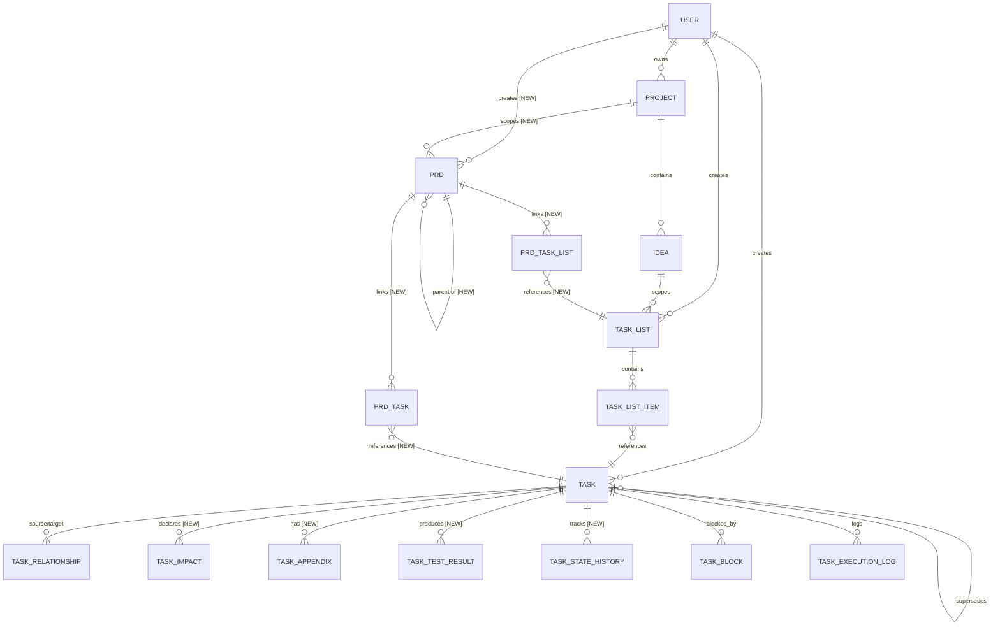

### D.2 Task Lifecycle State Machine

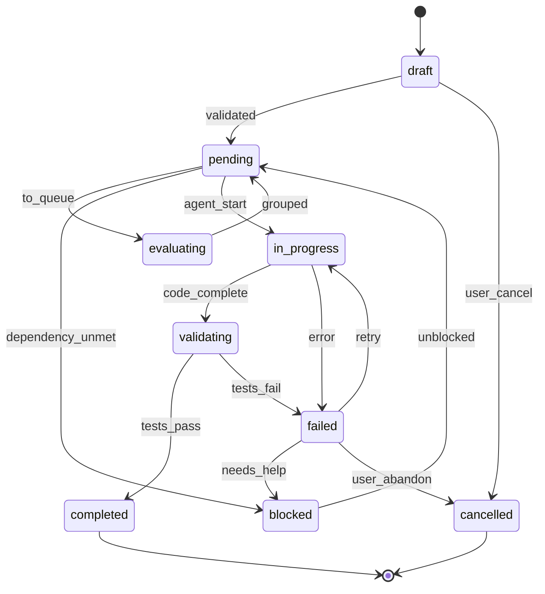

---

## Implementation Checklist

This checklist covers all implementation work required to realize the task system described in this document.

### Phase 1: Database Migrations

- [x] **1.1** Create `task_impacts` table (`database/migrations/078_create_task_impacts.sql`)
  - Columns: id, task_id, impact_type, operation, target_path, target_name, target_signature, confidence, source, created_at
  - Foreign key to tasks(id)
  - Index on (task_id, impact_type)

- [x] **1.2** Create `task_appendices` table (`database/migrations/079_create_task_appendices.sql`)
  - Columns: id, task_id, appendix_type, content_type, content, reference_id, reference_table, position, created_at
  - Foreign key to tasks(id)
  - Index on (task_id, appendix_type)

- [x] **1.3** Create `prds` table (`database/migrations/080_create_prds.sql`)
  - Columns: id, slug, title, user_id, project_id, parent_prd_id, problem_statement, target_users, functional_description, success_criteria (JSON), constraints (JSON), out_of_scope (JSON), status, created_at, updated_at, approved_at, approved_by
  - Self-referential FK for parent_prd_id
  - Unique constraint on slug

- [x] **1.4** Create `prd_task_lists` junction table (`database/migrations/081_create_prd_task_lists.sql`)
  - Columns: id, prd_id, task_list_id, position, created_at
  - Foreign keys to prds(id) and task_lists_v2(id)

- [x] **1.5** Create `prd_tasks` junction table (`database/migrations/082_create_prd_tasks.sql`)
  - Columns: id, prd_id, task_id, requirement_ref, link_type, created_at
  - Foreign keys to prds(id) and tasks(id)

- [x] **1.6** Create `task_test_results` table (`database/migrations/083_create_task_test_results.sql`)
  - Columns: id, task_id, level (1/2/3), command, exit_code, output, duration_ms, passed, created_at
  - Foreign key to tasks(id)

- [x] **1.7** Create `task_state_history` table (`database/migrations/084_create_task_state_history.sql`)
  - Columns: id, task_id, from_status, to_status, changed_by, reason, created_at
  - Foreign key to tasks(id)
  - Index on (task_id, created_at)

- [x] **1.8** Add `auto_approve_reviews` column to `task_lists_v2` (`database/migrations/086_add_auto_approve_reviews.sql`)
  - Type: INTEGER NOT NULL DEFAULT 0

### Phase 2: TypeScript Types

- [x] **2.1** Create `types/task-impact.ts` with TaskImpact interface
- [x] **2.2** Create `types/task-appendix.ts` with TaskAppendix interface
- [x] **2.3** Create `types/prd.ts` with PRD and junction interfaces
- [x] **2.4** Create `types/task-test.ts` with test level interfaces
- [x] **2.5** Update `types/task.ts` with new fields and relationships (via `types/task-agent.ts`)
- [x] **2.6** Create `types/cascade.ts` with cascade effect types

### Phase 3: Core Services

- [x] **3.1** `task-impact-service.ts` - CRUD for task impacts (`server/services/task-agent/task-impact-service.ts`)
- [x] **3.2** `task-appendix-service.ts` - CRUD for appendices (`server/services/task-agent/task-appendix-service.ts`)
- [x] **3.3** `prd-service.ts` - PRD creation and management (`server/services/prd-service.ts`)
- [x] **3.4** `prd-link-service.ts` - Junction table management (`server/services/prd-link-service.ts`)
- [x] **3.5** `prd-coverage-calculator.ts` - Coverage tracking (`server/services/prd-coverage-service.ts`)
- [x] **3.6** `task-version-service.ts` - Versioning and history (`server/services/task-agent/task-version-service.ts`)
- [x] **3.7** `cascade-analyzer.ts` - Cascade effect detection (`server/services/task-agent/cascade-analyzer-service.ts`)
- [x] **3.8** `cascade-executor.ts` - Apply cascade changes (`server/services/task-agent/cascade-executor-service.ts`)
- [x] **3.9** `task-test-service.ts` - Test execution and results (`server/services/task-agent/task-test-service.ts`)

### Phase 4: Task Agent Services

- [x] **4.1** `file-impact-analyzer.ts` - AI-powered impact estimation (`server/services/task-agent/file-impact-analyzer.ts`)
- [x] **4.2** `file-conflict-detector.ts` - Conflict matrix implementation (`server/services/task-agent/file-conflict-detector.ts`)
- [x] **4.3** `atomicity-validator.ts` - 6 atomicity rules (`server/services/task-agent/atomicity-validator.ts`)
- [x] **4.4** `task-decomposer.ts` - Break large tasks into atomic ones (`server/services/task-agent/task-decomposer.ts`)
- [x] **4.5** `nlp-parser.ts` - Natural language task parsing (`server/services/task-agent/natural-language-parser.ts`)
- [x] **4.6** `display-id-generator.ts` - TU-PROJ-CAT-### generation (`server/services/task-agent/display-id-generator.ts`)
- [x] **4.7** `question-engine.ts` - Extensive questioning system (`server/services/task-agent/question-engine.ts`)
- [x] **4.8** `priority-calculator.ts` - Priority formula implementation (`server/services/task-agent/priority-calculator.ts`)

### Phase 5: API Routes

- [x] **5.1** `POST /api/task-agent/tasks/:id/impacts` - Add/update impacts (`server/routes/task-agent/task-impacts.ts`)
- [x] **5.2** `GET /api/task-agent/tasks/:id/impacts` - Get task impacts (`server/routes/task-agent/task-impacts.ts`)
- [x] **5.3** `POST /api/task-agent/tasks/:id/appendices` - Attach appendix (`server/routes/task-agent/task-appendices.ts`)
- [x] **5.4** `GET /api/task-agent/tasks/:id/appendices` - Get appendices (`server/routes/task-agent/task-appendices.ts`)
- [x] **5.5** `POST /api/prds` - Create PRD (`server/routes/prds.ts`)
- [x] **5.6** `GET /api/prds/:id` - Get PRD with linked items (`server/routes/prds.ts`)
- [x] **5.7** `POST /api/prds/:id/link-list` - Link task list (`server/routes/prd-links.ts`)
- [x] **5.8** `POST /api/prds/:id/link-task` - Link task (`server/routes/prd-links.ts`)
- [x] **5.9** `GET /api/prds/:id/coverage` - Get coverage report (`server/routes/prd-coverage.ts`)
- [x] **5.10** `POST /api/prds/:id/decompose` - Extract tasks from PRD (`server/routes/prd-decompose.ts`)
- [x] **5.11** `GET /api/task-agent/tasks/:id/versions` - Get version history (`server/routes/task-agent/task-versions.ts`)
- [x] **5.12** `POST /api/task-agent/tasks/:id/cascade/analyze` - Analyze cascade (`server/routes/task-agent/task-cascade.ts`)
- [x] **5.13** `POST /api/task-agent/tasks/:id/tests/validate` - Run validation (`server/routes/task-agent/task-tests.ts`)

### Phase 6: Telegram Commands

- [x] **6.1** `/prd create` - Create new PRD via Telegram (`server/communication/task-agent-telegram-handler.ts`)
- [x] **6.2** `/prd link` - Link PRD to tasks/lists (`server/communication/task-agent-telegram-handler.ts`)
- [x] **6.3** `/prd status` - Show PRD coverage (`server/communication/task-agent-telegram-handler.ts`)
- [x] **6.4** `/task impact` - Show/manage task impacts (`server/communication/task-agent-telegram-handler.ts`)
- [x] **6.5** Enhanced `/newtask` with impact detection (`server/communication/task-agent-telegram-handler.ts`)

### Phase 7: UI Components

- [x] **7.1** PRD creation form (`frontend/src/components/task-agent/PRDList.tsx`)
- [x] **7.2** PRD detail view with linked tasks (`frontend/src/components/task-agent/PRDDetail.tsx`)
- [x] **7.3** Coverage visualization (`frontend/src/components/task-agent/PRDCoverageChart.tsx`)
- [x] **7.4** Task impact editor (`frontend/src/components/task-agent/TaskImpactViewer.tsx`)
- [x] **7.5** Appendix attachment UI (`frontend/src/components/task-agent/TaskAppendixEditor.tsx`)
- [x] **7.6** Version history timeline (`frontend/src/components/task-agent/TaskVersionViewer.tsx`)
- [x] **7.7** Cascade preview modal (`frontend/src/components/task-agent/CascadeEffectViewer.tsx`)

### Phase 8: Integration & Testing

- [x] **8.1** E2E test: PRD → Task extraction → Execution (`tests/e2e/task-atomic-anatomy.test.ts`)
- [x] **8.2** E2E test: Impact conflict detection (`tests/e2e/task-atomic-anatomy.test.ts`)
- [x] **8.3** E2E test: Cascade propagation (`tests/e2e/task-atomic-anatomy.test.ts`)
- [x] **8.4** E2E test: Versioning and rollback (`tests/e2e/task-atomic-anatomy.test.ts`)
- [x] **8.5** Unit tests for all new services (`tests/task-agent/*.test.ts`)
- [x] **8.6** Integration tests for API routes (`tests/integration/*.test.ts`)

---

*This document is the canonical reference for task structure in the Idea Incubator system. All agents and developers should reference this specification when creating, consuming, or modifying tasks.*

**Related Documents:**
- [task-data-model.md](./task-data-model.md) - Database schema details
- [task-agent-arch.md](./task-agent-arch.md) - Task Agent architecture
- [AGENT-SPECIFICATIONS-PIPELINE.md](./AGENT-SPECIFICATIONS-PIPELINE.md) - Agent specifications
- [PARALLEL-TASK-EXECUTION-IMPLEMENTATION-PLAN.md](./PARALLEL-TASK-EXECUTION-IMPLEMENTATION-PLAN.md) - Parallel execution

---

**Document Version:** 1.1.0
**Last Updated:** 2026-01-15
**Maintainer:** Task Agent System
