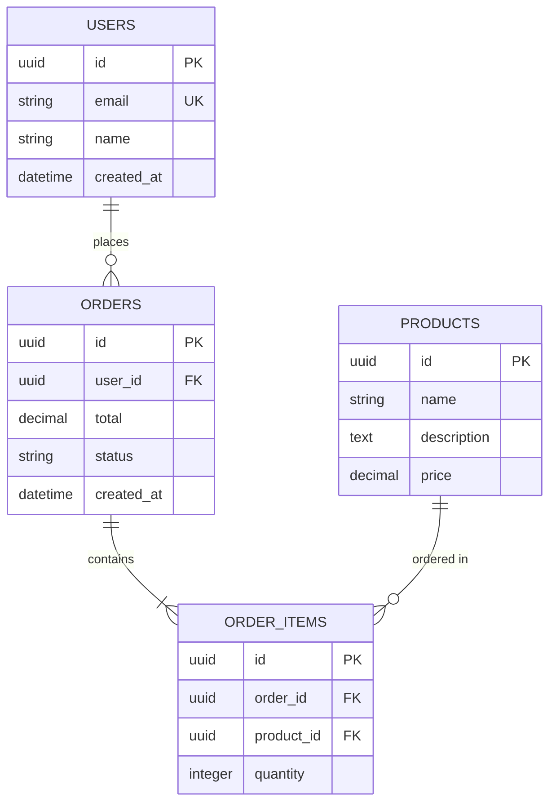

# VIBE-P10-006: Database Schema Generator - Technical Specification

**Status:** SPECIFICATION COMPLETE
**Created:** 2026-02-09
**Priority:** P1 (Phase 10 - Architecture Agent Foundation)
**Effort:** Medium (14-18 hours)
**Model:** Opus
**Agent Type:** build_agent

---

## Overview

Implement a sophisticated database schema generation system within the Architect Agent that transforms entity requirements and architecture specifications into production-ready database schemas. The generator supports multiple output formats including SQL DDL, Prisma schema, and MongoDB collections, with automatic generation of ERD diagrams in Mermaid.js format.

### Problem Statement

**Current State:**

- Architect Agent exists at `agents/architect/architect-agent.ts`
- Type definitions include `DatabaseSchema` interface in `agents/architect/types.ts`
- Architecture generation creates minimal placeholder database schemas
- No specialized generator for transforming entity requirements → SQL/Prisma
- No ERD diagram generation capability
- No support for indexes, constraints, relationships, or migrations
- Database schema field in ArchitectureDoc is underutilized

**Desired State:**

- `DatabaseSchemaGenerator` class at `agents/architect/database-schema-generator.ts`
- Generate normalized relational schemas (PostgreSQL, MySQL, SQLite)
- Generate NoSQL schemas (MongoDB collections with validation)
- Output Mermaid.js ERD diagrams showing entities and relationships
- Generate SQL migration files with proper CREATE TABLE statements
- Generate Prisma schema files as alternative ORM format
- Support indexes, foreign keys, unique constraints, and check constraints
- Generate seed data templates for initial data population
- Integrate seamlessly with Architect Agent workflow

### Value Proposition

The Database Schema Generator is the **"Data Model Architect"** that:

1. **Accelerates Development** - Auto-generate migration files from entity requirements
2. **Ensures Best Practices** - Apply normalization, indexing, and constraint patterns
3. **Multi-Format Support** - Output SQL DDL, Prisma schema, or NoSQL schemas
4. **Visual Documentation** - Auto-generate ERD diagrams for documentation
5. **Type Safety** - Generate schemas that match TypeScript type definitions
6. **Migration Ready** - Produce numbered migration files matching codebase patterns
7. **Seed Data Templates** - Bootstrap applications with initial data structure

---

## Requirements

### Functional Requirements

#### FR-1: DatabaseSchemaGenerator Class

**FR-1.1: Class Structure**

- Create `DatabaseSchemaGenerator` class at `agents/architect/database-schema-generator.ts`
- Class does NOT extend ObservableAgent (utility class, not autonomous agent)
- Constructor accepts configuration: `DatabaseSchemaGeneratorConfig`
- Methods are synchronous (no async/await) for direct invocation
- Stateless design - all inputs passed as method parameters

**FR-1.2: Core Method - generateSchema()**

```typescript
generateSchema(
  entities: EntityDefinition[],
  options: SchemaGenerationOptions
): DatabaseSchemaOutput
```

- **Input**: Array of `EntityDefinition` objects + generation options
- **Output**: `DatabaseSchemaOutput` object containing all generated artifacts
- Validates entity definitions before generation
- Applies normalization rules for relational databases
- Generates appropriate schema for database type (SQL vs NoSQL)
- Returns comprehensive output with all formats requested

**FR-1.3: Entity Definition Input Interface**

```typescript
interface EntityDefinition {
  name: string; // e.g., "User", "Order", "Product"
  description: string;
  fields: FieldDefinition[];
  primaryKey?: string[]; // Defaults to ["id"]
  indexes?: IndexDefinition[];
  uniqueConstraints?: string[][]; // Array of field combinations
  checkConstraints?: CheckConstraint[];
}

interface FieldDefinition {
  name: string;
  type: FieldType; // "string" | "number" | "boolean" | "date" | "json" | "text" | "uuid"
  nullable: boolean;
  unique?: boolean;
  default?: string | number | boolean | null;
  description: string;
  validation?: ValidationRule; // Optional validation (length, range, pattern)
}

interface IndexDefinition {
  name: string;
  fields: string[];
  unique: boolean;
  type?: "btree" | "hash" | "gin" | "gist"; // PostgreSQL-specific
}

interface CheckConstraint {
  name: string;
  expression: string; // SQL expression, e.g., "price > 0"
}

interface ValidationRule {
  minLength?: number;
  maxLength?: number;
  min?: number;
  max?: number;
  pattern?: string; // Regex pattern
  enum?: string[]; // Enum values
}
```

**FR-1.4: Schema Generation Options**

```typescript
interface SchemaGenerationOptions {
  databaseType: "postgresql" | "mysql" | "sqlite" | "mongodb";
  includeTimestamps?: boolean; // Add created_at, updated_at (default: true)
  timestampFormat?: "datetime" | "iso8601" | "unix";
  generateMigration?: boolean; // Generate SQL migration file (default: true)
  generatePrisma?: boolean; // Generate Prisma schema (default: false)
  generateERD?: boolean; // Generate Mermaid ERD (default: true)
  generateSeedTemplate?: boolean; // Generate seed data template (default: true)
  tablePrefix?: string; // Optional prefix for all tables
  namingConvention?: "snake_case" | "camelCase"; // Default: snake_case
}
```

**FR-1.5: Output Interface**

```typescript
interface DatabaseSchemaOutput {
  // SQL DDL
  sqlDDL?: string; // Full CREATE TABLE statements
  sqlMigration?: MigrationFile; // Numbered migration file

  // Prisma
  prismaSchema?: string; // Prisma schema.prisma content

  // NoSQL
  mongoCollections?: MongoCollectionSchema[];

  // Diagrams
  erdDiagram?: string; // Mermaid.js erDiagram syntax

  // Seed data
  seedTemplate?: SeedDataTemplate;

  // Metadata
  metadata: {
    entityCount: number;
    tableCount: number;
    relationshipCount: number;
    indexCount: number;
    generatedAt: string;
    databaseType: string;
  };
}

interface MigrationFile {
  filename: string; // e.g., "134_create_user_product_order.sql"
  content: string;
  description: string;
  entities: string[]; // List of entities in this migration
}

interface MongoCollectionSchema {
  name: string;
  validator: {
    $jsonSchema: Record<string, unknown>;
  };
  indexes: Array<{
    key: Record<string, 1 | -1>;
    unique?: boolean;
    name: string;
  }>;
}

interface SeedDataTemplate {
  format: "sql" | "json" | "typescript";
  content: string;
  description: string;
}
```

#### FR-2: Relationship Detection and Generation

**FR-2.1: Automatic Relationship Detection**

- Detect foreign key relationships from field names (e.g., `user_id` references `users.id`)
- Pattern matching: `{entity}_id` → foreign key to `{entities}(id)`
- Support explicit relationship definitions via `RelationshipDefinition` interface

**FR-2.2: Relationship Types**

```typescript
interface RelationshipDefinition {
  name: string;
  type: "one-to-one" | "one-to-many" | "many-to-many";
  from: string; // Source entity
  to: string; // Target entity
  foreignKey?: string; // Custom foreign key field
  joinTable?: string; // For many-to-many
  onDelete?: "CASCADE" | "SET NULL" | "RESTRICT" | "NO ACTION";
  onUpdate?: "CASCADE" | "SET NULL" | "RESTRICT" | "NO ACTION";
}
```

**FR-2.3: Relationship SQL Generation**

- One-to-One: Add UNIQUE constraint to foreign key
- One-to-Many: Standard foreign key constraint
- Many-to-Many: Generate junction table with composite primary key
- Include ON DELETE and ON UPDATE clauses
- Generate appropriate indexes for foreign keys

#### FR-3: SQL DDL Generation

**FR-3.1: PostgreSQL Support**

- Generate CREATE TABLE statements with proper data types:
  - `string` → `VARCHAR(255)` or `TEXT` (based on length)
  - `number` → `INTEGER` or `NUMERIC` (based on validation)
  - `boolean` → `BOOLEAN`
  - `date` → `TIMESTAMP` or `DATE`
  - `json` → `JSONB`
  - `text` → `TEXT`
  - `uuid` → `UUID`
- Support PostgreSQL-specific features:
  - SERIAL and UUID primary keys
  - JSONB data type
  - Array types
  - Check constraints
  - Partial indexes

**FR-3.2: SQLite Support**

- Map types to SQLite equivalents:
  - All numerics → `INTEGER` or `REAL`
  - Booleans → `INTEGER` (0/1)
  - Dates → `TEXT` (ISO8601) or `INTEGER` (Unix timestamp)
  - JSON → `TEXT`
  - UUID → `TEXT`
- Use `AUTOINCREMENT` for auto-increment primary keys
- Follow existing migration patterns in `database/migrations/`

**FR-3.3: MySQL Support**

- Map to MySQL data types:
  - `string` → `VARCHAR(255)`
  - `number` → `INT` or `DECIMAL`
  - `boolean` → `TINYINT(1)`
  - `date` → `DATETIME`
  - `json` → `JSON` (MySQL 5.7+)
  - `uuid` → `CHAR(36)`
- Use AUTO_INCREMENT for primary keys
- Include ENGINE=InnoDB specification

**FR-3.4: SQL Best Practices**

- Always use `IF NOT EXISTS` in CREATE TABLE statements (matches codebase pattern)
- Add inline comments for complex constraints
- Order fields: primary key first, foreign keys, data fields, timestamps
- Include DEFAULT values where specified
- Add CHECK constraints for validation rules
- Create indexes AFTER table creation (separate statements)

#### FR-4: Mermaid ERD Generation

**FR-4.1: ERD Diagram Format**

- Output valid Mermaid.js `erDiagram` syntax
- Include all entities as nodes
- Show relationships with proper cardinality
- Include key field types in entity definitions
- Add relationship labels with foreign key names

**FR-4.2: ERD Syntax Structure**



**FR-4.3: Cardinality Notation**

- `||--||` : one-to-one
- `||--o{` : one-to-many
- `}o--o{` : many-to-many
- Include relationship verbs (e.g., "places", "contains", "belongs to")

**FR-4.4: Field Annotations**

- PK: Primary Key
- FK: Foreign Key
- UK: Unique Key
- Show data types for all fields
- Mark nullable fields with optional annotation

#### FR-5: Prisma Schema Generation

**FR-5.1: Prisma Schema Format**

- Generate valid `schema.prisma` file
- Include datasource block (postgresql/mysql/sqlite)
- Include generator client block
- Define models matching entities

**FR-5.2: Model Definitions**

```prisma
model User {
  id        String   @id @default(uuid())
  email     String   @unique
  name      String
  orders    Order[]
  createdAt DateTime @default(now()) @map("created_at")
  updatedAt DateTime @updatedAt @map("updated_at")

  @@map("users")
}

model Order {
  id        String      @id @default(uuid())
  userId    String      @map("user_id")
  user      User        @relation(fields: [userId], references: [id])
  total     Decimal
  status    String
  items     OrderItem[]
  createdAt DateTime    @default(now()) @map("created_at")
  updatedAt DateTime    @updatedAt @map("updated_at")

  @@map("orders")
}
```

**FR-5.3: Prisma Features**

- Map field names to snake_case database columns
- Add @relation directives for foreign keys
- Include @default directives for default values
- Add @unique constraints
- Include @@index directives for performance
- Use @map and @@map for table/field name mapping

#### FR-6: MongoDB Schema Generation

**FR-6.1: Collection Schemas**

- Generate MongoDB collection definitions with JSON Schema validation
- Support document embedding for one-to-many relationships
- Support references for many-to-many relationships

**FR-6.2: Validation Schema**

```typescript
{
  validator: {
    $jsonSchema: {
      bsonType: "object",
      required: ["name", "email"],
      properties: {
        name: {
          bsonType: "string",
          description: "User's full name"
        },
        email: {
          bsonType: "string",
          pattern: "^[a-zA-Z0-9._%+-]+@[a-zA-Z0-9.-]+\\.[a-zA-Z]{2,}$",
          description: "User's email address"
        },
        age: {
          bsonType: "int",
          minimum: 0,
          maximum: 150,
          description: "User's age"
        }
      }
    }
  }
}
```

**FR-6.3: Index Definitions**

- Generate index creation commands
- Support compound indexes
- Support unique indexes
- Include index names

#### FR-7: Migration File Generation

**FR-7.1: Migration Numbering**

- Auto-detect next migration number by scanning `database/migrations/`
- Format: `{number}_create_{entities}.sql` (e.g., `134_create_users_orders.sql`)
- Include migration header comment with purpose and entities

**FR-7.2: Migration Structure**

```sql
-- Migration 134: Create users and orders tables
-- Purpose: User authentication and order management
-- Entities: users, orders, order_items

CREATE TABLE IF NOT EXISTS users (
  id TEXT PRIMARY KEY,
  email TEXT UNIQUE NOT NULL,
  name TEXT NOT NULL,
  created_at TEXT NOT NULL DEFAULT (datetime('now')),
  updated_at TEXT NOT NULL DEFAULT (datetime('now'))
);

CREATE INDEX IF NOT EXISTS idx_users_email ON users(email);

CREATE TABLE IF NOT EXISTS orders (
  id TEXT PRIMARY KEY,
  user_id TEXT NOT NULL REFERENCES users(id) ON DELETE CASCADE,
  total REAL NOT NULL CHECK(total >= 0),
  status TEXT NOT NULL CHECK(status IN ('pending', 'completed', 'cancelled')),
  created_at TEXT NOT NULL DEFAULT (datetime('now')),
  updated_at TEXT NOT NULL DEFAULT (datetime('now'))
);

CREATE INDEX IF NOT EXISTS idx_orders_user ON orders(user_id);
CREATE INDEX IF NOT EXISTS idx_orders_status ON orders(status);
```

**FR-7.3: Migration Best Practices**

- Match existing codebase patterns (see `database/migrations/`)
- Use IF NOT EXISTS for idempotency
- Create indexes in separate statements
- Include constraint names
- Add inline comments for complex logic
- Group related tables in same migration

#### FR-8: Seed Data Template Generation

**FR-8.1: SQL Seed Template**

```sql
-- Seed data for users table
INSERT INTO users (id, email, name) VALUES
  ('user-001', 'admin@example.com', 'Admin User'),
  ('user-002', 'test@example.com', 'Test User');

-- Seed data for orders table
INSERT INTO orders (id, user_id, total, status) VALUES
  ('order-001', 'user-001', 99.99, 'completed'),
  ('order-002', 'user-002', 49.99, 'pending');
```

**FR-8.2: TypeScript Seed Template**

```typescript
export const seedUsers = [
  {
    id: "user-001",
    email: "admin@example.com",
    name: "Admin User",
  },
  {
    id: "user-002",
    email: "test@example.com",
    name: "Test User",
  },
];

export const seedOrders = [
  {
    id: "order-001",
    userId: "user-001",
    total: 99.99,
    status: "completed",
  },
];
```

**FR-8.3: JSON Seed Template (MongoDB)**

```json
{
  "users": [
    {
      "_id": "user-001",
      "email": "admin@example.com",
      "name": "Admin User",
      "createdAt": { "$date": "2026-02-09T00:00:00.000Z" }
    }
  ]
}
```

#### FR-9: Validation and Error Handling

**FR-9.1: Input Validation**

- Validate entity names (alphanumeric, no spaces, starts with letter)
- Validate field names follow naming convention
- Check for circular foreign key references
- Validate field types are supported
- Ensure primary keys are defined
- Check for duplicate field names within entity
- Validate index fields reference existing fields

**FR-9.2: Error Messages**

- Descriptive error messages with entity and field context
- Suggestions for fixing validation errors
- Throw typed errors: `SchemaGenerationError`

**FR-9.3: Warnings**

- Warn if no indexes defined for foreign keys
- Warn if large text fields lack indexes
- Warn if many-to-many relationships missing junction table
- Warn if entity names don't follow naming convention

#### FR-10: Integration with Architect Agent

**FR-10.1: Architect Agent Integration**

- Architect Agent calls `DatabaseSchemaGenerator.generateSchema()` during architecture generation
- Pass entity definitions from requirements analysis
- Store generated schemas in `ArchitectureDoc.databaseSchema`
- Save ERD diagram to architecture artifacts
- Optionally write migration file to `database/migrations/`

**FR-10.2: Entity Extraction**

- Architect Agent analyzes requirements to extract entities
- Infer entity fields from requirements text
- Detect relationships from requirement descriptions
- Use LLM to parse entity requirements (future enhancement)

### Non-Functional Requirements

**NFR-1: Code Quality**

- TypeScript strict mode enabled
- Comprehensive JSDoc comments
- Type-safe - no `any` types
- Pure functions - stateless generator methods
- Unit testable - dependency injection for file system operations

**NFR-2: Performance**

- Generate schema for 50 entities in < 1 second
- Mermaid diagram generation in < 500ms
- Minimal memory footprint (streaming for large schemas)

**NFR-3: Compatibility**

- Support PostgreSQL 12+, MySQL 8+, SQLite 3+, MongoDB 4+
- Generate Prisma schema compatible with Prisma 5+
- Mermaid diagrams render correctly in GitHub, VS Code, documentation sites

**NFR-4: Maintainability**

- Modular design - separate concerns (SQL gen, Prisma gen, ERD gen)
- Easy to add new database types
- Template-based generation for extensibility
- Clear separation of concerns

**NFR-5: Documentation**

- README.md in `agents/architect/` with usage examples
- JSDoc for all public methods and interfaces
- Example entity definitions in documentation
- Integration guide for Architect Agent

---

## Technical Design

### Architecture

```
┌─────────────────────────────────────────────────────────────┐
│           DatabaseSchemaGenerator                           │
│                                                             │
│  ┌───────────────────────────────────────────────────────┐ │
│  │  Input Validation                                     │ │
│  │  - Validate entities, fields, relationships           │ │
│  │  - Check naming conventions                           │ │
│  │  - Detect circular references                         │ │
│  └───────────────────────────────────────────────────────┘ │
│                         │                                   │
│  ┌───────────────────────────────────────────────────────┐ │
│  │  Relationship Detection                               │ │
│  │  - Auto-detect foreign keys                           │ │
│  │  - Infer relationship types                           │ │
│  │  - Generate junction tables                           │ │
│  └───────────────────────────────────────────────────────┘ │
│                         │                                   │
│  ┌──────────────┬───────────────┬──────────────┬─────────┐ │
│  │ SQL Generator│ Prisma Gen    │ MongoDB Gen  │ ERD Gen │ │
│  │              │               │              │         │ │
│  │ - PostgreSQL │ - schema.     │ - Collection │ - Mermaid│ │
│  │ - MySQL      │   prisma      │   schemas    │   erDia- │ │
│  │ - SQLite     │ - Relations   │ - Validators │   gram   │ │
│  │ - Migrations │ - Indexes     │ - Indexes    │ - Cardina│ │
│  └──────────────┴───────────────┴──────────────┴─────────┘ │
│                         │                                   │
│  ┌───────────────────────────────────────────────────────┐ │
│  │  Seed Data Template Generator                         │ │
│  │  - SQL INSERT statements                              │ │
│  │  - TypeScript fixtures                                │ │
│  │  - JSON documents                                     │ │
│  └───────────────────────────────────────────────────────┘ │
│                         │                                   │
│  ┌───────────────────────────────────────────────────────┐ │
│  │  Output Assembler                                     │ │
│  │  - Combine all generated artifacts                    │ │
│  │  - Add metadata                                       │ │
│  │  - Return DatabaseSchemaOutput                        │ │
│  └───────────────────────────────────────────────────────┘ │
└─────────────────────────────────────────────────────────────┘
```

### Class Structure

```typescript
/**
 * Database Schema Generator
 *
 * Generates database schemas, migrations, ERD diagrams, and seed templates
 * from entity definitions.
 */
export class DatabaseSchemaGenerator {
  private config: DatabaseSchemaGeneratorConfig;

  constructor(config: DatabaseSchemaGeneratorConfig = {}) {
    this.config = {
      defaultDatabaseType: config.defaultDatabaseType || "postgresql",
      defaultNamingConvention: config.defaultNamingConvention || "snake_case",
      migrationDirectory: config.migrationDirectory || "database/migrations",
      ...config,
    };
  }

  /**
   * Main entry point - generate complete database schema
   */
  generateSchema(
    entities: EntityDefinition[],
    options: SchemaGenerationOptions,
  ): DatabaseSchemaOutput {
    // 1. Validate inputs
    this.validateEntities(entities);

    // 2. Detect relationships
    const relationships = this.detectRelationships(entities);

    // 3. Generate SQL DDL
    const sqlDDL = this.generateSQLDDL(entities, relationships, options);

    // 4. Generate migration file
    const sqlMigration = options.generateMigration
      ? this.generateMigration(entities, sqlDDL, options)
      : undefined;

    // 5. Generate Prisma schema
    const prismaSchema = options.generatePrisma
      ? this.generatePrismaSchema(entities, relationships, options)
      : undefined;

    // 6. Generate MongoDB collections
    const mongoCollections =
      options.databaseType === "mongodb"
        ? this.generateMongoCollections(entities, options)
        : undefined;

    // 7. Generate ERD diagram
    const erdDiagram = options.generateERD
      ? this.generateERD(entities, relationships)
      : undefined;

    // 8. Generate seed template
    const seedTemplate = options.generateSeedTemplate
      ? this.generateSeedTemplate(entities, options)
      : undefined;

    // 9. Assemble output
    return {
      sqlDDL,
      sqlMigration,
      prismaSchema,
      mongoCollections,
      erdDiagram,
      seedTemplate,
      metadata: {
        entityCount: entities.length,
        tableCount:
          entities.length +
          relationships.filter((r) => r.type === "many-to-many").length,
        relationshipCount: relationships.length,
        indexCount: this.countIndexes(entities, relationships),
        generatedAt: new Date().toISOString(),
        databaseType: options.databaseType,
      },
    };
  }

  // Private helper methods
  private validateEntities(entities: EntityDefinition[]): void {}
  private detectRelationships(
    entities: EntityDefinition[],
  ): RelationshipDefinition[] {}
  private generateSQLDDL(
    entities: EntityDefinition[],
    relationships: RelationshipDefinition[],
    options: SchemaGenerationOptions,
  ): string {}
  private generateMigration(
    entities: EntityDefinition[],
    ddl: string,
    options: SchemaGenerationOptions,
  ): MigrationFile {}
  private generatePrismaSchema(
    entities: EntityDefinition[],
    relationships: RelationshipDefinition[],
    options: SchemaGenerationOptions,
  ): string {}
  private generateMongoCollections(
    entities: EntityDefinition[],
    options: SchemaGenerationOptions,
  ): MongoCollectionSchema[] {}
  private generateERD(
    entities: EntityDefinition[],
    relationships: RelationshipDefinition[],
  ): string {}
  private generateSeedTemplate(
    entities: EntityDefinition[],
    options: SchemaGenerationOptions,
  ): SeedDataTemplate {}
  private countIndexes(
    entities: EntityDefinition[],
    relationships: RelationshipDefinition[],
  ): number {}
}
```

### File Organization

```
agents/architect/
├── database-schema-generator.ts    # Main generator class
├── database-schema-types.ts        # Type definitions for generator
├── sql-generator.ts                # SQL DDL generation helpers
├── prisma-generator.ts             # Prisma schema generation helpers
├── mongo-generator.ts              # MongoDB schema generation helpers
├── erd-generator.ts                # Mermaid ERD generation helpers
├── seed-generator.ts               # Seed data template generation
├── relationship-detector.ts        # Relationship detection logic
└── schema-validator.ts             # Input validation logic
```

### Integration Points

**1. Architect Agent**

- Location: `agents/architect/architect-agent.ts`
- Integration: Call `DatabaseSchemaGenerator.generateSchema()` in `designArchitecture()` method
- Pass extracted entities from requirements analysis
- Store output in `ArchitectureDoc.databaseSchema`

**2. Existing Migration System**

- Location: `database/migrations/`
- Pattern: Follow existing numbering scheme (001, 002, ..., 133, 134)
- Format: Match existing SQLite migration format
- Integration: Auto-detect next number, write migration file

**3. Component Diagram Generator**

- Location: `agents/architect/diagram-generator.ts`
- Integration: ERD generation uses similar Mermaid approach
- Coordinate: Include database entities in component diagrams

**4. Architecture Types**

- Location: `agents/architect/types.ts`
- Integration: Use existing `DatabaseSchema` interface
- Extend: Add generator-specific types to `database-schema-types.ts`

---

## Implementation Guide

### Phase 1: Core Foundation (4-6 hours)

**Step 1.1: Type Definitions**

- Create `database-schema-types.ts` with all interfaces
- Define `EntityDefinition`, `FieldDefinition`, `RelationshipDefinition`
- Define `SchemaGenerationOptions`, `DatabaseSchemaOutput`
- Export all types

**Step 1.2: Main Generator Class**

- Create `database-schema-generator.ts`
- Implement `DatabaseSchemaGenerator` class with constructor
- Implement `generateSchema()` method skeleton
- Set up basic structure (validation → generation → output)

**Step 1.3: Input Validation**

- Create `schema-validator.ts`
- Implement `validateEntities()` method
- Validate entity names, field names, types
- Check for duplicate names, invalid characters
- Throw descriptive errors

### Phase 2: SQL Generation (4-6 hours)

**Step 2.1: SQL Generator Setup**

- Create `sql-generator.ts`
- Implement type mapping (TypeScript types → SQL types)
- Support PostgreSQL, MySQL, SQLite
- Handle nullable, unique, default values

**Step 2.2: DDL Generation**

- Implement `generateSQLDDL()` method
- Generate CREATE TABLE statements
- Add primary key constraints
- Add CHECK constraints
- Add indexes

**Step 2.3: Relationship Handling**

- Create `relationship-detector.ts`
- Implement `detectRelationships()` method
- Auto-detect foreign keys from field names
- Generate foreign key constraints
- Generate junction tables for many-to-many

**Step 2.4: Migration File Generation**

- Implement `generateMigration()` method
- Auto-detect next migration number
- Format migration file with header comment
- Match existing migration patterns

### Phase 3: ERD & Prisma (3-4 hours)

**Step 3.1: ERD Generation**

- Create `erd-generator.ts`
- Implement `generateERD()` method
- Output valid Mermaid erDiagram syntax
- Add entities with field types
- Add relationships with cardinality
- Include field annotations (PK, FK, UK)

**Step 3.2: Prisma Schema Generation**

- Create `prisma-generator.ts`
- Implement `generatePrismaSchema()` method
- Generate datasource and generator blocks
- Generate model definitions
- Add @relation directives
- Map field names to database columns

### Phase 4: NoSQL & Seed Data (2-3 hours)

**Step 4.1: MongoDB Schema Generation**

- Create `mongo-generator.ts`
- Implement `generateMongoCollections()` method
- Generate JSON Schema validators
- Generate index definitions
- Handle document embedding vs references

**Step 4.2: Seed Data Templates**

- Create `seed-generator.ts`
- Implement `generateSeedTemplate()` method
- Generate SQL INSERT statements
- Generate TypeScript fixtures
- Generate JSON documents for MongoDB

### Phase 5: Integration & Testing (1-2 hours)

**Step 5.1: Architect Agent Integration**

- Update `agents/architect/architect-agent.ts`
- Call `DatabaseSchemaGenerator.generateSchema()` in architecture generation flow
- Store output in `ArchitectureDoc.databaseSchema`
- Export ERD diagram as separate artifact

**Step 5.2: Unit Tests**

- Create `tests/unit/agents/database-schema-generator.test.ts`
- Test entity validation
- Test relationship detection
- Test SQL generation for each database type
- Test ERD generation
- Test Prisma generation
- Test seed template generation

**Step 5.3: Integration Tests**

- Test full Architect Agent flow with database schema generation
- Verify migration file creation
- Validate ERD diagram syntax
- Test Prisma schema validity

---

## Pass Criteria

### Must Pass (Critical)

1. **PC-1: DatabaseSchemaGenerator Class Exists**
   - ✅ File exists at `agents/architect/database-schema-generator.ts`
   - ✅ Exports `DatabaseSchemaGenerator` class
   - ✅ TypeScript compilation succeeds with no errors
   - ✅ Class has `generateSchema()` method

2. **PC-2: Valid Mermaid ERD Output**
   - ✅ `generateERD()` method returns valid Mermaid erDiagram syntax
   - ✅ Output includes all entities
   - ✅ Output includes relationships with cardinality
   - ✅ ERD validates at https://mermaid.live (manual check)
   - ✅ Field types and annotations (PK, FK, UK) included

3. **PC-3: SQL CREATE TABLE Generation**
   - ✅ `generateSQLDDL()` generates valid SQL CREATE TABLE statements
   - ✅ Supports PostgreSQL, MySQL, SQLite
   - ✅ Includes primary key constraints
   - ✅ Includes foreign key constraints
   - ✅ Includes indexes
   - ✅ Follows codebase pattern (IF NOT EXISTS, proper formatting)

4. **PC-4: Foreign Key Constraints**
   - ✅ Foreign keys generated with REFERENCES clause
   - ✅ ON DELETE and ON UPDATE actions included
   - ✅ Foreign key indexes auto-created
   - ✅ Junction tables created for many-to-many relationships

5. **PC-5: Prisma Schema Generation**
   - ✅ `generatePrismaSchema()` outputs valid Prisma schema
   - ✅ Includes datasource and generator blocks
   - ✅ Generates model definitions with @relation directives
   - ✅ Maps field names correctly (@map and @@map)
   - ✅ Prisma schema passes `prisma validate` (if Prisma CLI available)

### Should Pass (Important)

6. **PC-6: Input Validation**
   - ✅ Validates entity names (alphanumeric, no spaces)
   - ✅ Validates field names follow convention
   - ✅ Detects circular references
   - ✅ Throws descriptive errors with entity/field context

7. **PC-7: Relationship Detection**
   - ✅ Auto-detects foreign keys from `{entity}_id` pattern
   - ✅ Correctly infers one-to-many relationships
   - ✅ Generates junction tables for many-to-many

8. **PC-8: Migration File Format**
   - ✅ Migration file numbered correctly (auto-detect next number)
   - ✅ Filename format: `{number}_create_{entities}.sql`
   - ✅ Includes header comment with purpose and entities
   - ✅ Matches existing migration patterns in `database/migrations/`

9. **PC-9: Seed Data Templates**
   - ✅ Generates SQL INSERT statements
   - ✅ Generates TypeScript fixtures
   - ✅ Proper formatting and escaping

10. **PC-10: Type Definitions**
    - ✅ All types exported from `database-schema-types.ts`
    - ✅ No `any` types used
    - ✅ Comprehensive JSDoc comments

### Nice to Have (Future)

11. **PC-11: MongoDB Schema Generation**
    - Generate MongoDB collection schemas with validators
    - Include index definitions
    - Support document embedding

12. **PC-12: Advanced Validation**
    - Warn about missing indexes on foreign keys
    - Suggest normalization improvements
    - Detect potential performance issues

13. **PC-13: Unit Test Coverage**
    - > 80% code coverage
    - Tests for each database type
    - Tests for edge cases

---

## Dependencies

### Required (Must exist before implementation)

- ✅ Architect Agent base (`agents/architect/architect-agent.ts`) - EXISTS
- ✅ Architect types (`agents/architect/types.ts`) - EXISTS
- ✅ Migration directory (`database/migrations/`) - EXISTS
- ✅ TypeScript compiler - EXISTS

### Optional (Can be integrated later)

- Prisma CLI (for schema validation)
- MongoDB client (for schema testing)
- Mermaid CLI (for ERD validation)

### Blocked By

- None (can be implemented independently)

---

## Testing Strategy

### Unit Tests

**Test File**: `tests/unit/agents/database-schema-generator.test.ts`

**Test Cases**:

1. Entity validation
   - Valid entity definitions pass
   - Invalid names throw errors
   - Duplicate field names detected
2. Relationship detection
   - Foreign keys auto-detected from field names
   - One-to-many relationships inferred correctly
   - Junction tables created for many-to-many
3. SQL generation
   - PostgreSQL types mapped correctly
   - MySQL types mapped correctly
   - SQLite types mapped correctly
   - Foreign key constraints included
   - Indexes generated
4. ERD generation
   - Valid Mermaid syntax
   - All entities included
   - Relationships with cardinality
   - Field annotations (PK, FK, UK)
5. Prisma generation
   - Valid Prisma schema syntax
   - Relations defined correctly
   - Field mapping with @map
6. Seed template generation
   - SQL INSERT statements valid
   - TypeScript fixtures type-safe
   - JSON documents well-formed

### Integration Tests

**Test File**: `tests/integration/architect-agent-database.test.ts`

**Test Cases**:

1. Full architecture generation with database schema
2. Migration file creation in correct directory
3. ERD diagram saved to architecture artifacts
4. Prisma schema optional generation

### Manual Testing

1. Generate schema for sample e-commerce app (Users, Orders, Products)
2. Validate ERD at https://mermaid.live
3. Run generated migration file against SQLite
4. Validate Prisma schema with `prisma validate`
5. Visual inspection of generated files

---

## Examples

### Example 1: Simple Entity Definitions

```typescript
const entities: EntityDefinition[] = [
  {
    name: "User",
    description: "Application users",
    fields: [
      {
        name: "id",
        type: "uuid",
        nullable: false,
        description: "Unique identifier",
      },
      {
        name: "email",
        type: "string",
        nullable: false,
        unique: true,
        description: "Email address",
        validation: { pattern: "^[^@]+@[^@]+\\.[^@]+$" },
      },
      {
        name: "name",
        type: "string",
        nullable: false,
        description: "Full name",
      },
      {
        name: "age",
        type: "number",
        nullable: true,
        description: "User age",
        validation: { min: 0, max: 150 },
      },
    ],
    primaryKey: ["id"],
  },
  {
    name: "Order",
    description: "Customer orders",
    fields: [
      {
        name: "id",
        type: "uuid",
        nullable: false,
        description: "Unique identifier",
      },
      {
        name: "user_id",
        type: "uuid",
        nullable: false,
        description: "User who placed order",
      },
      {
        name: "total",
        type: "number",
        nullable: false,
        description: "Order total",
        validation: { min: 0 },
      },
      {
        name: "status",
        type: "string",
        nullable: false,
        description: "Order status",
        validation: { enum: ["pending", "completed", "cancelled"] },
      },
    ],
    primaryKey: ["id"],
    indexes: [
      { name: "idx_orders_user", fields: ["user_id"], unique: false },
      { name: "idx_orders_status", fields: ["status"], unique: false },
    ],
    checkConstraints: [
      { name: "chk_total_positive", expression: "total >= 0" },
    ],
  },
];

const generator = new DatabaseSchemaGenerator();
const output = generator.generateSchema(entities, {
  databaseType: "sqlite",
  includeTimestamps: true,
  generateMigration: true,
  generateERD: true,
  generateSeedTemplate: true,
});

console.log(output.erdDiagram);
// erDiagram
//   USERS ||--o{ ORDERS : places
//   USERS {
//     uuid id PK
//     string email UK
//     string name
//     number age
//     datetime created_at
//     datetime updated_at
//   }
//   ORDERS {
//     uuid id PK
//     uuid user_id FK
//     number total
//     string status
//     datetime created_at
//     datetime updated_at
//   }
```

### Example 2: Generated SQL Migration

```sql
-- Migration 134: Create users and orders tables
-- Purpose: User management and order tracking
-- Entities: users, orders

CREATE TABLE IF NOT EXISTS users (
  id TEXT PRIMARY KEY,
  email TEXT UNIQUE NOT NULL,
  name TEXT NOT NULL,
  age INTEGER,
  created_at TEXT NOT NULL DEFAULT (datetime('now')),
  updated_at TEXT NOT NULL DEFAULT (datetime('now'))
);

CREATE INDEX IF NOT EXISTS idx_users_email ON users(email);

CREATE TABLE IF NOT EXISTS orders (
  id TEXT PRIMARY KEY,
  user_id TEXT NOT NULL REFERENCES users(id) ON DELETE CASCADE,
  total REAL NOT NULL CHECK(total >= 0),
  status TEXT NOT NULL CHECK(status IN ('pending', 'completed', 'cancelled')),
  created_at TEXT NOT NULL DEFAULT (datetime('now')),
  updated_at TEXT NOT NULL DEFAULT (datetime('now'))
);

CREATE INDEX IF NOT EXISTS idx_orders_user ON orders(user_id);
CREATE INDEX IF NOT EXISTS idx_orders_status ON orders(status);
```

### Example 3: Generated Prisma Schema

```prisma
datasource db {
  provider = "sqlite"
  url      = env("DATABASE_URL")
}

generator client {
  provider = "prisma-client-js"
}

model User {
  id        String   @id @default(uuid())
  email     String   @unique
  name      String
  age       Int?
  orders    Order[]
  createdAt DateTime @default(now()) @map("created_at")
  updatedAt DateTime @updatedAt @map("updated_at")

  @@map("users")
}

model Order {
  id        String   @id @default(uuid())
  userId    String   @map("user_id")
  user      User     @relation(fields: [userId], references: [id], onDelete: Cascade)
  total     Float
  status    String
  createdAt DateTime @default(now()) @map("created_at")
  updatedAt DateTime @updatedAt @map("updated_at")

  @@index([userId], map: "idx_orders_user")
  @@index([status], map: "idx_orders_status")
  @@map("orders")
}
```

---

## Success Metrics

### Implementation Success

- ✅ All 10 "Must Pass" and "Should Pass" criteria verified
- ✅ TypeScript compilation clean with no errors
- ✅ DatabaseSchemaGenerator can be instantiated
- ✅ Valid ERD generated and renders in Mermaid Live
- ✅ Valid SQL generated and executes without errors
- ✅ Valid Prisma schema passes validation

### Usage Success (Post-Implementation)

- Architect Agent successfully generates database schemas
- Generated schemas follow best practices
- Migration files integrate seamlessly into existing migration system
- ERD diagrams accurately represent entity relationships
- Developers use generated schemas as starting point for implementation

---

## References

### Related Tasks

- VIBE-P10-001: Architect Agent Base (parent task)
- VIBE-P10-002: Architecture Template System
- VIBE-P10-004: Component Diagram Generator (similar Mermaid generation)

### Similar Patterns in Codebase

- Migration files (`database/migrations/`) - SQL DDL patterns
- Diagram generator (`agents/architect/diagram-generator.ts`) - Mermaid generation
- Type definitions (`agents/architect/types.ts`) - Architecture type patterns

### External References

- Mermaid.js ERD documentation: https://mermaid.js.org/syntax/entityRelationshipDiagram.html
- Prisma Schema reference: https://www.prisma.io/docs/reference/api-reference/prisma-schema-reference
- PostgreSQL documentation: https://www.postgresql.org/docs/current/ddl.html
- SQLite documentation: https://www.sqlite.org/lang_createtable.html

---

## Future Enhancements

### Phase 2 Additions

- **Index Optimization** - Analyze query patterns and suggest optimal indexes
- **Schema Versioning** - Track schema evolution over time
- **Data Type Inference** - Use LLM to infer field types from descriptions
- **Relationship Extraction** - Use LLM to extract relationships from natural language

### Advanced Features

- **Schema Diff** - Compare schemas and generate ALTER TABLE migrations
- **Reverse Engineering** - Extract entity definitions from existing databases
- **Schema Visualization** - Interactive ERD diagrams with zoom/pan
- **Multi-Tenancy Support** - Generate schemas with tenant isolation
- **Audit Tables** - Auto-generate audit/history tables for entities
- **Soft Deletes** - Add deleted_at columns and handle soft delete patterns

---

**END OF SPECIFICATION**
