# Property-Based Knowledge Model: Stress Test Analysis

This document stress-tests the Obsidian-style key:value property model against real-world scenarios to identify gaps, edge cases, and required refinements.

---

## Executive Summary

The property-based model (`content + properties + tags`) was tested against 27 challenging scenarios. Results reveal that while the model handles 22% of cases elegantly, the remaining 78% require additional architectural mechanisms:

| Category             | Scenarios Tested | Clean Fit | Requires Extension |
| -------------------- | ---------------- | --------- | ------------------ |
| Input Complexity     | 7                | 2         | 5                  |
| Relationship Nuance  | 5                | 1         | 4                  |
| Temporal & Evolution | 5                | 1         | 4                  |
| Meta & Subjective    | 8                | 2         | 6                  |
| Scale & Aggregation  | 3                | 0         | 3                  |
| **Total**            | **27**           | **6**     | **21**             |

---

## Scenario Summary Table

| #   | Scenario                  | Category             | Challenge                                             | Fit | Recommended Solution                                              | New Constructs                                                        |
| --- | ------------------------- | -------------------- | ----------------------------------------------------- | --- | ----------------------------------------------------------------- | --------------------------------------------------------------------- |
| 1   | Compound Statement        | Input Complexity     | Single sentence contains 7+ insights across 5 domains | ✅  | AI atomically extracts each insight into separate blocks          | None (AI responsibility)                                              |
| 2   | Contradiction             | Input Complexity     | User contradicts previous statement                   | ⚠️  | Use `supersedes` link with original preserved for history         | `supersedes`, `status: superseded`                                    |
| 3   | Refinement vs Replacement | Input Complexity     | Distinguishing evolution from pivot                   | ⚠️  | Use `refines` for evolution, `replaces` for pivot + AI + user     | `refines`, `replaces`                                                 |
| 4   | Hypotheticals             | Input Complexity     | Conditional statements that aren't facts              | ⚠️  | Mark blocks with `hypothetical: true` and capture `condition`     | `hypothetical`, `condition`, `status: potential`                      |
| 5   | Meta-Statements           | Meta & Subjective    | Statements about the idea, not of the idea            | ⚠️  | Separate meta blocks with `type: meta` and `about: block_id`      | `type: meta`, `about`, `meta_type`                                    |
| 6   | Questions as Content      | Meta & Subjective    | Questions contain potential directions                | ✅  | Extract as `exploring:` or `considering:` with `status: question` | `exploring`, `considering`, `status: question`                        |
| 7   | Nuanced Relationships     | Relationship Nuance  | Simple links lack degree/severity                     | ⚠️  | First-class link blocks with metadata properties                  | `type: link`, `link_type`, `source`, `target`, `degree`, `confidence` |
| 8   | Temporal Information      | Temporal & Evolution | When things happened, will happen                     | ⚠️  | Add temporal property set with flexible formats                   | `when`, `duration`, `planned_for`, `valid_until`                      |
| 9   | Quantification Spectrum   | Temporal & Evolution | Same concept at varying specificity                   | ✅  | Later blocks `refine` earlier; confidence auto-calculated         | `refines`, auto `confidence`                                          |
| 10  | Negations                 | Relationship Nuance  | Negative information is valuable                      | ✅  | Use `excludes` link type as standard alongside `includes`         | `excludes`, `not_required`, `not_building`                            |
| 11  | Dependency Chains         | Relationship Nuance  | Transitive dependencies across blocks                 | ⚠️  | Add `blocks` and `unblocks` links + graph traversal queries       | `blocks`, `unblocks`, `constrained_by`                                |
| 12  | Source Attribution        | Meta & Subjective    | Varying credibility of sources                        | ⚠️  | Add source property set with auto-confidence mapping              | `source_type`, `source_name`, `source_date`, `verifiable`             |
| 13  | Subjective vs Objective   | Meta & Subjective    | Facts vs opinions need differentiation                | ✅  | Add `objectivity` property; prioritize objective in synthesis     | `objectivity: objective / subjective / mixed`                         |
| 14  | Scale and Aggregation     | Scale & Aggregation  | 47+ blocks need coherent synthesis                    | ⚠️  | Auto-generate synthesis blocks via AI clustering + hierarchy      | `type: synthesis`, `parent`, `synthesizes`                            |
| 15  | Cross-Idea Patterns       | Scale & Aggregation  | Patterns across multiple ideas                        | ⚠️  | Global-scoped pattern blocks with `instance_of` links             | `scope: global`, `pattern`, `instance_of`, `portfolio_tag`            |
| 16  | Branching Alternatives    | Input Complexity     | Mutually exclusive options being explored             | ⚠️  | Decision blocks group alternatives with selection tracking        | `type: decision`, `alternative_to`, `selection_status`                |
| 17  | Ranges and Bounds         | Meta & Subjective    | Values with uncertainty bounds, not point estimates   | ⚠️  | Structured range properties with min/max/estimate                 | `_min`, `_max`, `_estimate` suffixes                                  |
| 18  | Conditional Truth         | Relationship Nuance  | Same property differs by context                      | ⚠️  | Context-qualified properties with dimension tracking              | `context`, `varies_by`, context-qualified values                      |
| 19  | Derived Values            | Temporal & Evolution | Calculated properties that can become stale           | ⚠️  | Derived blocks with formula tracking and staleness detection      | `derived_from`, `formula`, `stale`                                    |
| 20  | Evidence Chains           | Meta & Subjective    | Confidence should propagate through citations         | ⚠️  | Evidence links with strength and confidence propagation           | `evidence_for`, `evidence_strength`, `derived_confidence`             |
| 21  | Implicit Assumptions      | Input Complexity     | Unstated assumptions that should be surfaced          | ⚠️  | AI-extracted assumption blocks requiring validation               | `type: assumption`, `assumption_status`, `criticality`                |
| 22  | Cyclic Relationships      | Relationship Nuance  | Feedback loops and circular dependencies              | ⚠️  | Cycle detection with break-point identification                   | `cycle_id`, `cycle_break_strategy`, `feedback_type`                   |
| 23  | Incomplete Information    | Input Complexity     | Known existence without details                       | ⚠️  | Placeholder blocks with existence confirmation                    | `placeholder: true`, `existence_confirmed`, `details_unknown`         |
| 24  | Stakeholder Conflict      | Meta & Subjective    | Multiple views from different people                  | ⚠️  | Stakeholder-attributed blocks with conflict resolution            | `stakeholder`, `stakeholder_role`, `view_status`                      |
| 25  | External Resources        | Meta & Subjective    | URL references that may change or disappear           | ⚠️  | External resource blocks with snapshots and health tracking       | `type: external`, `snapshot_date`, `url_status`                       |
| 26  | Action Items              | Temporal & Evolution | Research and validation tasks with progress           | ⚠️  | Action blocks with completion tracking                            | `type: action`, `action_type`, `progress`, `validates_claim`          |
| 27  | Abstraction Levels        | Scale & Aggregation  | Strategy vs tactics at different zoom levels          | ⚠️  | Abstraction hierarchy with implements relationships               | `abstraction_level`, `implements`, `implemented_by`                   |

---

## Decision Framework

When the model presents multiple approaches, use this framework to select:

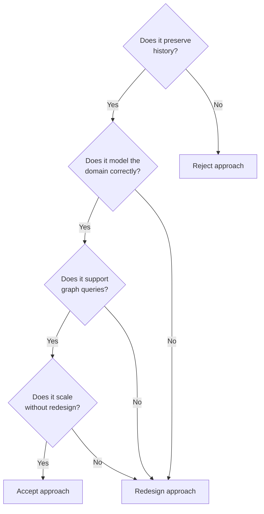

**Selection Criteria (in priority order):**

1. **History preservation** - Never lose information; supersede, don't delete
2. **Domain correctness** - Model relationships as they actually exist
3. **Query support** - Must work with graph traversal and filtering
4. **Scalability** - Architecture should handle 1000+ blocks without redesign
5. **User control** - AI suggests, user confirms for ambiguous cases

---

## Test Scenarios

### Scenario 1: The Compound Statement

**Input**: "Our AI tool saves lawyers 10 hours/week at $500/hr, and we've validated this with 15 interviews, but the market is getting crowded with 3 major competitors entering this year"

**Challenge**: Single sentence contains 7+ distinct insights across 5 domains.

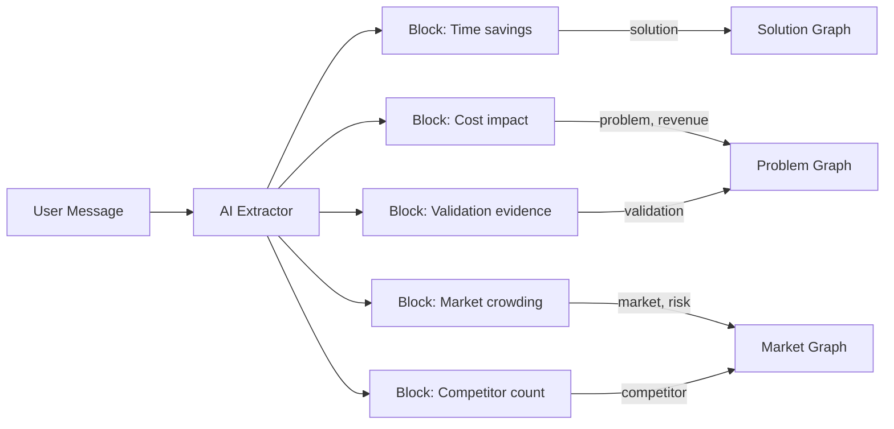

**Extraction Result**:

| Block | Content                                  | Properties                                             |
| ----- | ---------------------------------------- | ------------------------------------------------------ |
| B1    | "AI tool saves lawyers 10 hours/week"    | `solution: AI tool`, `impact: 10 hrs/week`             |
| B2    | "At $500/hr rate"                        | `hourly_rate: $500`, `addresses: B1`                   |
| B3    | "Validated with 15 interviews"           | `validation: user_interviews`, `count: 15`             |
| B4    | "Market getting crowded"                 | `market: Legal tech`, `trend: crowding`                |
| B5    | "3 major competitors entering this year" | `competitor: new_entrants`, `count: 3`, `timing: 2026` |

**Verdict**: ✅ Model handles this through atomic extraction. AI responsibility to split.

---

### Scenario 2: The Contradiction

**Earlier input**: "Target users are enterprise companies"
**Later input**: "Actually, we're focusing on SMBs because they're easier to sell to"

**Challenge**: User contradicts previous statement. Which is true?

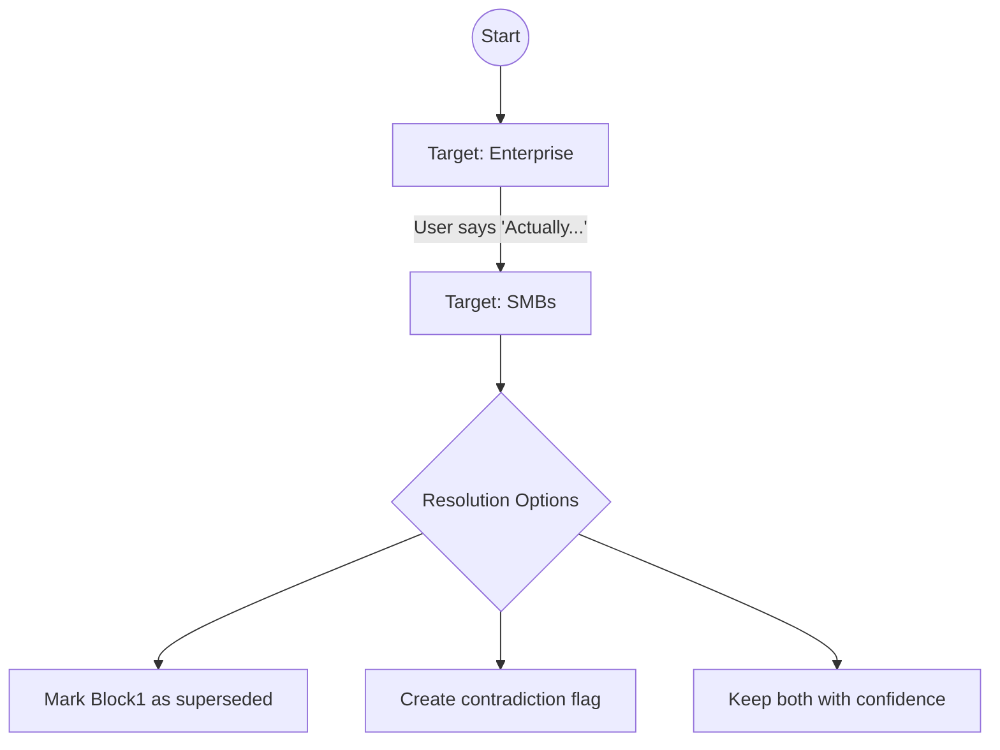

**Proposed Handling**:

| Approach           | Mechanism                                        | Pros               | Cons                | History | Queryable |
| ------------------ | ------------------------------------------------ | ------------------ | ------------------- | ------- | --------- |
| Supersede          | `status: superseded`, `superseded_by: block2_id` | Clean history      | Loses nuance        | ✅      | ✅        |
| Contradiction flag | `contradicts: block1_id`                         | Surfaces conflict  | Requires resolution | ✅      | ✅        |
| Confidence decay   | Block1 gets `confidence: low`                    | Non-destructive    | Ambiguous           | ✅      | ❌        |
| Refinement link    | `refines: block1_id` with explanation            | Captures evolution | Semantically wrong  | ✅      | ✅        |

**Analysis**:

- **Supersede** is best when the user explicitly changes their mind ("Actually, we're focusing on...")
- **Contradiction flag** is best when both might be true in different contexts
- **Confidence decay** doesn't capture the relationship - queries can't find "what replaced this?"
- **Refinement link** is semantically wrong for contradictions (refinement implies building on, not replacing)

**⭐ RECOMMENDATION: Use `supersedes` link**

```yaml
Block2 properties:
  target_user: SMBs
  supersedes: block1_id
  reason: "Easier to sell to"

Block1 properties (auto-updated):
  target_user: Enterprise
  status: superseded
  superseded_by: block2_id
```

This approach:

1. Preserves full history (Block1 remains readable)
2. Makes the relationship explicit and queryable
3. Captures the reason for the change
4. Auto-updates the old block's status

**Verdict**: ⚠️ Requires `supersedes` link type + auto-status update on superseded blocks.

---

### Scenario 3: Refinement vs. Replacement

**Earlier**: "The problem is research takes too long"
**Later**: "The problem isn't actually time, it's that research quality is poor"

**Challenge**: Is this a refinement (same problem, better understanding) or a pivot (different problem)?

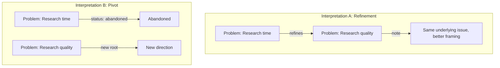

**Signals for Interpretation**:

| Signal                       | Indicates Refinement | Indicates Pivot |
| ---------------------------- | -------------------- | --------------- |
| "Actually"                   | ✓                    |                 |
| "Not X, but Y"               |                      | ✓               |
| "More specifically"          | ✓                    |                 |
| "I was wrong about"          |                      | ✓               |
| "Better way to say it"       | ✓                    |                 |
| "Different problem entirely" |                      | ✓               |

**Analysis of Approaches**:

| Approach    | Use When                                     | Block1 Status       | Block2 Relationship   | Example                                                |
| ----------- | -------------------------------------------- | ------------------- | --------------------- | ------------------------------------------------------ |
| Refinement  | Same underlying concept, better articulation | `status: active`    | `refines: block1_id`  | "Research time" → "Research quality" (same root issue) |
| Replacement | Fundamentally different direction            | `status: abandoned` | `replaces: block1_id` | "B2C" → "B2B" (strategic pivot)                        |

**⭐ RECOMMENDATION: AI classifies + user confirms**

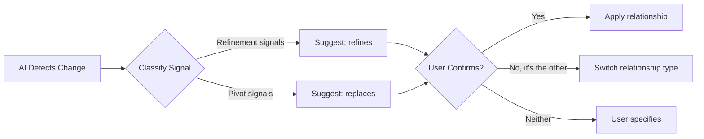

**Implementation**:

1. AI analyzes language signals from the table above
2. AI suggests relationship type with 70%+ confidence threshold
3. User sees: "This looks like a refinement of your earlier problem statement. Is that right?"
4. User can confirm, switch to replacement, or specify custom relationship

This approach:

1. Leverages AI pattern recognition for common cases
2. Keeps user in control for ambiguous situations
3. Uses distinct link types (`refines` vs `replaces`) for clear semantics
4. Maintains history regardless of interpretation

**Verdict**: ⚠️ Requires AI classification + user confirmation. Add `relationship_type: refines | replaces | contradicts`.

---

### Scenario 4: Hypotheticals and Wishes

**Input**: "If we had ML expertise, we could build a much better solution"

**Challenge**: This is a hypothetical, not a fact. Contains:

- Skill gap (we lack ML)
- Potential improvement (better solution possible)
- Conditional dependency

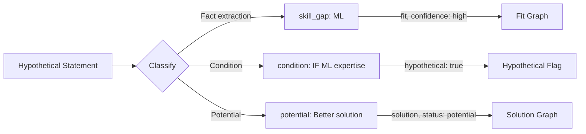

**Property Extensions Needed**:

| Property       | Value             | Purpose                   |
| -------------- | ----------------- | ------------------------- |
| `hypothetical` | `true`            | Marks as non-factual      |
| `condition`    | "IF ML expertise" | Captures dependency       |
| `status`       | `potential`       | Distinguishes from actual |
| `implies`      | `skill_gap:ML`    | Links to derived insight  |

**Verdict**: ⚠️ Requires `hypothetical` flag and `condition` property.

---

### Scenario 5: Meta-Statements

**Inputs**:

- "I'm not sure about the market size"
- "We need to research competitors more"
- "This area feels weak"

**Challenge**: These are statements ABOUT the idea, not OF the idea.

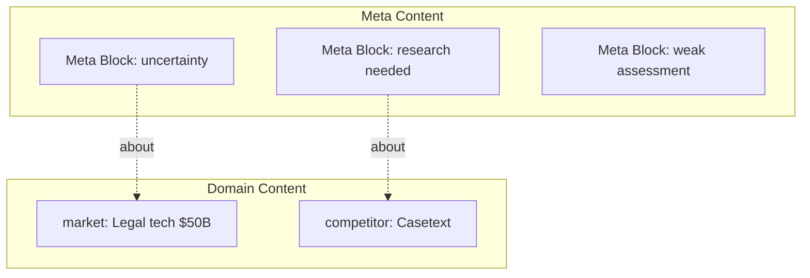

**Meta-Property Taxonomy**:

| Meta-Type        | Example             | Meta Block Properties                                  |
| ---------------- | ------------------- | ------------------------------------------------------ |
| Uncertainty      | "I'm not sure"      | `type: meta`, `meta_type: uncertainty`, `about: block` |
| Research needed  | "Need to look into" | `type: meta`, `meta_type: research_needed`             |
| Self-assessment  | "This feels weak"   | `type: meta`, `meta_type: assessment`, `rating: weak`  |
| Question         | "What if we..."     | `type: meta`, `meta_type: question`                    |
| Commitment level | "We might..."       | `type: meta`, `meta_type: commitment`, `level: low`    |

**Approaches for Handling Meta-Content**:

| Approach          | Mechanism                                   | Pros                | Cons                  | Queryable | Scalable |
| ----------------- | ------------------------------------------- | ------------------- | --------------------- | --------- | -------- |
| Prefix namespace  | `meta:uncertainty_about`                    | No new block types  | Pollutes domain block | ✅        | ❌       |
| Separate blocks   | `type: meta`, `about: block_id`             | Clean separation    | More blocks           | ✅        | ✅       |
| Inline properties | Just use `uncertainty_about` directly       | Simple              | Mixes concerns        | ❌        | ❌       |
| Annotations layer | Separate annotation model linking to blocks | Maximum flexibility | Over-engineered       | ✅        | ✅       |

**⭐ RECOMMENDATION: Separate meta blocks**

```yaml
Domain Block:
  id: block_market_001
  market: Legal tech
  market_size: $50B

Meta Block (separate entity):
  id: meta_001
  type: meta
  meta_type: uncertainty
  about: block_market_001
  property: market_size
  confidence: low
  action_required: true
  note: "Need to validate this claim"
```

**Why separate meta blocks wins**:

1. **Clean separation** - Domain blocks stay focused on domain content
2. **Own lifecycle** - Meta-content can be resolved, dismissed, or escalated independently
3. **Multiple annotations** - One domain block can have many meta blocks attached
4. **Queryable** - "Find all blocks with unresolved uncertainties" is trivial
5. **Standard pattern** - This is how annotation systems work (Hypothesis, Notion comments, etc.)

**Verdict**: ⚠️ Requires `type: meta` blocks as separate entities with `about` references.

---

### Scenario 6: Questions as Content

**Input**: "What if we pivoted to B2B instead of B2C?"

**Challenge**: Questions aren't facts but contain potential directions.

| Question Type           | Example                        | Extraction                       |
| ----------------------- | ------------------------------ | -------------------------------- |
| Alternative exploration | "What if B2B?"                 | `exploring: B2B`, `current: B2C` |
| Validation seeking      | "Is the market big enough?"    | `uncertainty_about: market_size` |
| Feature consideration   | "Should we add payments?"      | `considering: payments_feature`  |
| Risk probing            | "What if competitors copy us?" | `risk: competitive_imitation`    |

**Verdict**: ✅ Questions can be extracted as `exploring:` or `considering:` properties with `status: question`.

---

### Scenario 7: Nuanced Relationships

**Reality**: Solution A:

- Addresses Problem 1 **partially** (60%)
- Addresses Problem 2 **fully** (100%)
- Creates Risk 1 as side effect
- Requires Skills X AND Y
- Works for Market Segment A but NOT B

**Challenge**: Simple `addresses: problem_id` lacks nuance.

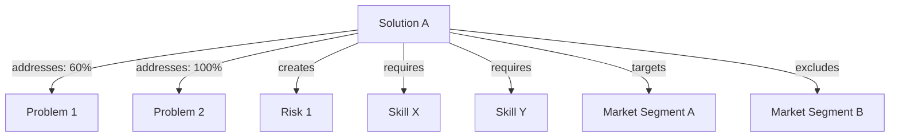

**Extended Link Properties**:

| Link      | Extension     | Example                                       |
| --------- | ------------- | --------------------------------------------- |
| addresses | + degree      | `addresses: P1, degree: partial`              |
| creates   | + severity    | `creates: R1, severity: medium`               |
| requires  | + criticality | `requires: skill_X, critical: true`           |
| targets   | + fit_score   | `targets: segment_A, fit: 0.9`                |
| excludes  | + reason      | `excludes: segment_B, reason: cost_structure` |

**Approaches for Link Metadata**:

| Approach            | Format                                                           | Pros              | Cons                         | Atomic | Queryable | Scalable |
| ------------------- | ---------------------------------------------------------------- | ----------------- | ---------------------------- | ------ | --------- | -------- |
| Inline JSON         | `addresses: {"id": "P1", "degree": "partial"}`                   | Standard format   | Verbose, hard to read        | ✅     | ❌        | ❌       |
| Comma-separated     | `addresses: P1, degree: partial`                                 | Readable          | Non-standard parsing         | ❌     | ❌        | ❌       |
| Separate properties | `addresses: P1` + `addresses_degree: partial`                    | Simple            | Key proliferation            | ❌     | ❌        | ❌       |
| Flattened prefix    | `link:addresses: P1` + `link:addresses:degree: partial`          | Organized         | Still multiple keys per link | ❌     | ⚠️        | ❌       |
| Link blocks         | Separate block with `type: link`, `source`, `target`, `metadata` | First-class edges | More blocks                  | ✅     | ✅        | ✅       |

**⭐ RECOMMENDATION: Link blocks (first-class relationship entities)**

This is the standard pattern in graph databases. Edges are entities with their own properties:

```yaml
Link Block:
  id: link_001
  type: link
  link_type: addresses
  source: block_solution_A
  target: block_problem_1
  degree: partial
  confidence: 0.6
  reason: "Covers main use case but not edge cases"
  created_at: 2026-01-15
  status: active
```

**Why link blocks is the correct long-term architecture**:

| Criterion            | Flattened Prefix                          | Link Blocks                           |
| -------------------- | ----------------------------------------- | ------------------------------------- |
| **Atomicity**        | ❌ One relationship = multiple properties | ✅ One relationship = one block       |
| **CRUD operations**  | ❌ Delete requires coordinated updates    | ✅ Delete one block                   |
| **Queries**          | ❌ Pattern matching across keys           | ✅ Simple filter on `link_type`       |
| **Lifecycle**        | ❌ No versioning, timestamps              | ✅ Full lifecycle tracking            |
| **Bidirectional**    | ❌ Requires inference or duplication      | ✅ Trivial traversal either direction |
| **Extensibility**    | ⚠️ New keys for each attribute            | ✅ Add any property to link block     |
| **Standard pattern** | ❌ Custom workaround                      | ✅ Neo4j, RDF, knowledge graphs       |

**Link Metadata Schema**:

| Property      | Type    | Values                              | Purpose                           |
| ------------- | ------- | ----------------------------------- | --------------------------------- |
| `link_type`   | enum    | `addresses`, `creates`, `requires`  | The relationship type             |
| `source`      | id      | Block ID                            | Origin of the relationship        |
| `target`      | id      | Block ID                            | Destination of the relationship   |
| `degree`      | enum    | `full`, `partial`, `minimal`        | How much the link applies         |
| `confidence`  | float   | 0.0 - 1.0                           | How certain the relationship is   |
| `severity`    | enum    | `critical`, `high`, `medium`, `low` | Impact level                      |
| `reason`      | string  | Free text                           | Why this relationship exists      |
| `conditional` | boolean | true/false                          | Is this relationship conditional? |
| `status`      | enum    | `active`, `superseded`, `removed`   | Lifecycle state                   |

**Verdict**: ⚠️ Relationships need first-class representation. Use link blocks as separate entities.

---

### Scenario 8: Temporal Information

**Inputs**:

- "We validated this last year"
- "The market is changing rapidly"
- "We plan to launch in Q3"
- "Competitors entered 6 months ago"

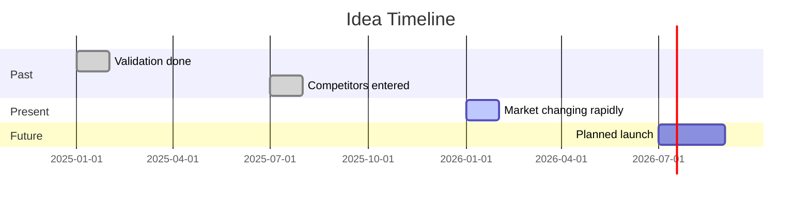

**Temporal Properties**:

| Temporal Type  | Property            | Example                           |
| -------------- | ------------------- | --------------------------------- |
| Point in time  | `when: ISO_date`    | `when: 2025-01-15`                |
| Relative past  | `when: relative`    | `when: -6_months`                 |
| Duration       | `duration: period`  | `duration: 3_months`              |
| Planned future | `planned_for: date` | `planned_for: Q3_2026`            |
| Ongoing        | `status: ongoing`   | `status: ongoing, since: 2025-01` |

**Verdict**: ⚠️ Requires `when` property with flexible date/relative formats.

---

### Scenario 9: Quantification Spectrum

Same concept at different specificity levels:

| Statement                                                | Specificity       | Confidence |
| -------------------------------------------------------- | ----------------- | ---------- |
| "Large market"                                           | Vague             | Low        |
| "Multi-billion dollar market"                            | Moderate          | Medium     |
| "Legal tech is $50B TAM"                                 | Specific          | High       |
| "According to Gartner, legal tech TAM is $47.3B in 2025" | Precise + sourced | Very High  |

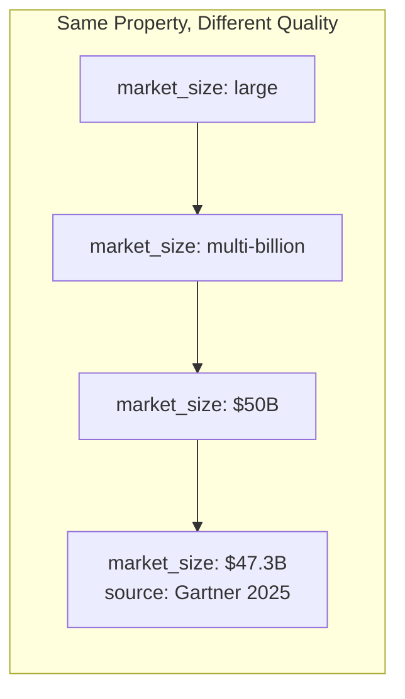

**Handling**: Later, more specific statements should `refine` earlier vague ones. Confidence auto-calculated from specificity + source.

**Verdict**: ✅ Handled by `refines` link + automatic confidence scoring.

---

### Scenario 10: Negations

**Inputs**:

- "We're NOT building a mobile app"
- "This doesn't require ML expertise"
- "We won't target enterprise initially"

**Challenge**: Negative information is as important as positive.

| Positive Pattern       | Negative Equivalent        | Extraction        |
| ---------------------- | -------------------------- | ----------------- |
| `solution: mobile_app` | `not_building: mobile_app` | Separate property |
| `requires: ML`         | `not_required: ML`         | Separate property |
| `targets: enterprise`  | `excludes: enterprise`     | Relationship type |

**Alternative**: Use `excludes:` as standard link type alongside `includes:`.

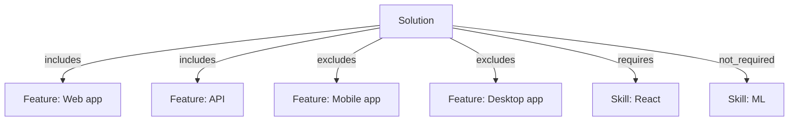

**Verdict**: ✅ Add `excludes`, `not_required`, `not_building` as valid link types.

---

### Scenario 11: Dependency Chains

**Reality**:

- Solution requires Skill A
- We lack Skill A
- We could hire for Skill A
- Hiring requires Budget
- Budget is limited by Runway

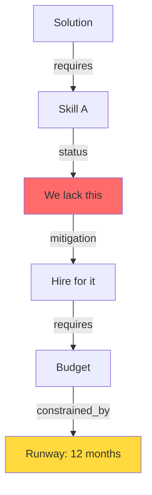

**Challenge**: Properties don't naturally express transitive dependencies.

**Dependency Chain Table**:

| From     | Relationship   | To      | Implication      |
| -------- | -------------- | ------- | ---------------- |
| Solution | requires       | Skill A | Blocking         |
| Skill A  | status         | lacking | Gap identified   |
| Gap      | mitigation     | Hiring  | Option available |
| Hiring   | requires       | Budget  | New dependency   |
| Budget   | constrained_by | Runway  | Constraint       |

**Verdict**: ⚠️ Requires graph traversal queries. Add `blocks` and `unblocks` link types for critical path analysis.

---

### Scenario 12: Source Attribution

**Inputs with varying credibility**:

| Statement                        | Source Type           | Credibility |
| -------------------------------- | --------------------- | ----------- |
| "Market is $50B"                 | Gartner report        | High        |
| "Lawyers hate research"          | Friend who's a lawyer | Medium      |
| "Legal tech is growing 20% YoY"  | "I read somewhere"    | Low         |
| "We can build this in 3 months"  | Founder optimism      | Very Low    |
| "15 users confirmed the problem" | Primary research      | High        |

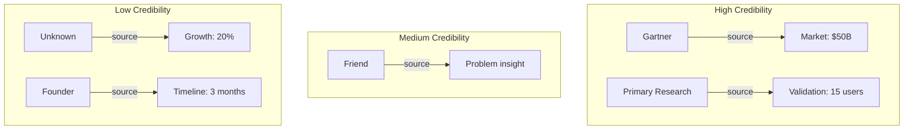

**Source Properties**:

| Property      | Values                                                                             | Auto-Confidence    |
| ------------- | ---------------------------------------------------------------------------------- | ------------------ |
| `source_type` | `research_firm`, `primary_research`, `expert`, `anecdote`, `assumption`, `unknown` | Maps to confidence |
| `source_name` | "Gartner 2025", "User interview #5"                                                | Attribution        |
| `source_date` | ISO date                                                                           | Freshness factor   |
| `verifiable`  | `true`, `false`                                                                    | Can we check this? |

**Verdict**: ⚠️ Requires `source_type`, `source_name`, `source_date` properties with confidence auto-calculation.

---

### Scenario 13: Subjective vs Objective

| Statement                             | Type                         | Handling                                                         |
| ------------------------------------- | ---------------------------- | ---------------------------------------------------------------- |
| "The UX is terrible"                  | Subjective opinion           | `assessment: UX, rating: terrible, type: subjective`             |
| "App Store rating: 2.1 stars"         | Objective fact               | `metric: app_store_rating, value: 2.1, type: objective`          |
| "Users hate the onboarding"           | Subjective claim about users | `claim: users_hate_onboarding, evidence: none, type: subjective` |
| "80% of users drop off at onboarding" | Objective metric             | `metric: onboarding_dropoff, value: 80%, type: objective`        |

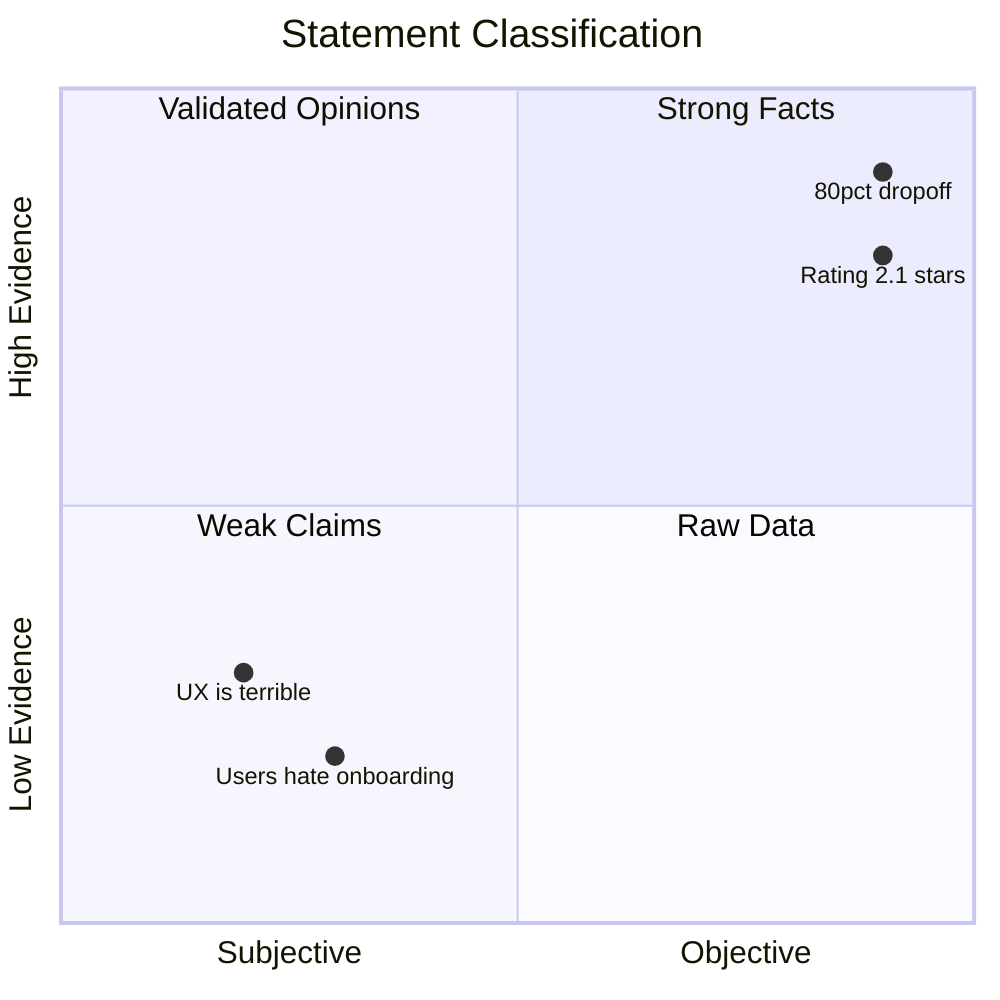

**Verdict**: ✅ Add `objectivity: subjective | objective | mixed` property. Prioritize objective in synthesis.

---

### Scenario 14: Scale and Aggregation

After many conversations, the system has:

- 47 content blocks
- 23 with `problem:` property
- 18 with `solution:` property
- 12 with `market:` property

**Challenge**: How to synthesize into coherent view?

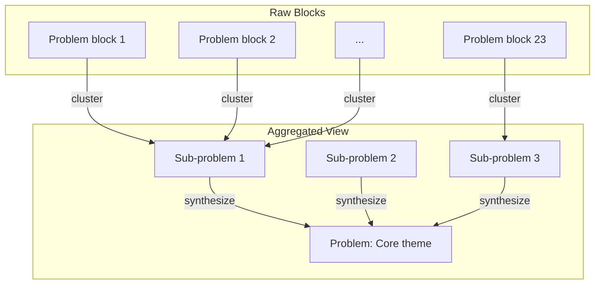

**Aggregation Strategies**:

| Strategy   | Mechanism                        | Output               | Auto | Queryable | Scalable | Preserves Detail |
| ---------- | -------------------------------- | -------------------- | ---- | --------- | -------- | ---------------- |
| Clustering | Group by similar property values | Sub-themes           | ✅   | ✅        | ✅       | ✅               |
| Hierarchy  | Use parent-child relationships   | Tree structure       | ❌   | ✅        | ✅       | ✅               |
| Synthesis  | AI generates summary block       | Master block         | ✅   | ✅        | ✅       | ❌               |
| Voting     | Most-referenced becomes primary  | Primary + supporting | ✅   | ❌        | ❌       | ✅               |
| Timeline   | Order by creation date           | Evolution view       | ✅   | ✅        | ✅       | ✅               |

**Analysis**:

- **Clustering** groups related blocks but doesn't create readable summaries
- **Hierarchy** requires manual organization or complex inference
- **Synthesis** creates human-readable summaries but loses granular detail
- **Voting** doesn't scale well and creates ambiguity in queries
- **Timeline** shows evolution but doesn't reduce cognitive load

**⭐ RECOMMENDATION: Hybrid Clustering + Synthesis**

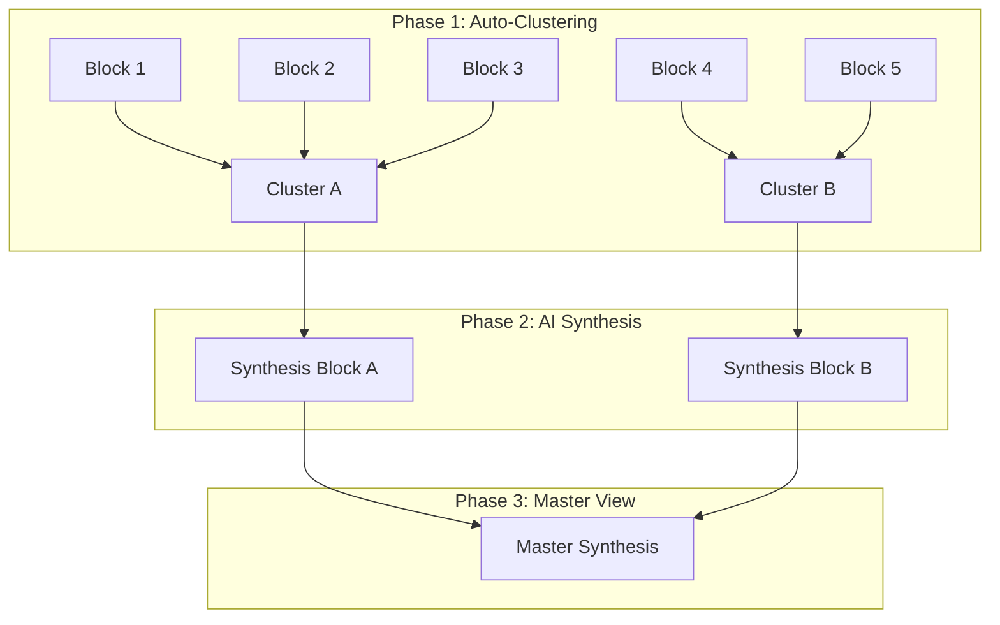

**Implementation**:

1. **Auto-cluster** blocks by embedding similarity (group blocks about "research time", "research quality", "research process" together)
2. **Generate synthesis blocks** for each cluster with `type: synthesis`
3. **Link original blocks** via `synthesized_in: synthesis_block_id`
4. **Create master synthesis** that summarizes all cluster syntheses
5. **Preserve drill-down** - users can always expand synthesis to see original blocks

**Properties Required**:

```yaml
Synthesis Block:
  type: synthesis
  synthesizes: [block1_id, block2_id, block3_id]
  cluster_theme: "Research efficiency problems"
  confidence: 0.85 # How confident is the clustering

Original Block (auto-updated):
  synthesized_in: synthesis_block_id
```

This approach:

1. Automates the heavy lifting (clustering + initial synthesis)
2. Preserves all original detail (nothing is lost)
3. Supports drill-down from summary to specifics
4. Scales to hundreds of blocks
5. Can be regenerated as new blocks are added

**Verdict**: ⚠️ Requires aggregation layer. Use hybrid clustering + AI synthesis with `type: synthesis` blocks.

---

### Scenario 15: Cross-Idea Patterns

User has 3 ideas:

1. Legal AI research tool
2. Medical AI diagnosis assistant
3. Financial AI analysis platform

**Shared patterns**:

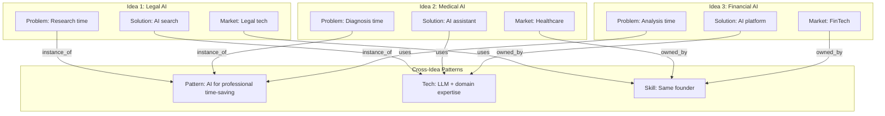

**Cross-Idea Properties**:

| Property         | Scope  | Purpose                      |
| ---------------- | ------ | ---------------------------- |
| `pattern:`       | Global | Identifies reusable patterns |
| `instance_of:`   | Block  | Links to pattern             |
| `shared_with:`   | Block  | Links across ideas           |
| `portfolio_tag:` | Block  | Groups related ideas         |

**Verdict**: ⚠️ Requires global (cross-idea) content blocks and `pattern:` property type.

---

### Scenario 16: Branching Alternatives

**Input**: "Option A: Build it ourselves. Option B: Use a vendor. Option C: Acquire a company with this capability."

**Challenge**: User is explicitly exploring mutually exclusive paths. These aren't refinements or contradictions—they're parallel alternatives under active consideration.

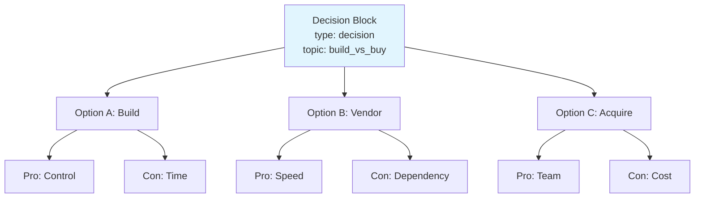

**Why existing constructs don't work**:

| Construct                | Problem                                                           |
| ------------------------ | ----------------------------------------------------------------- |
| `refines`                | Implies improvement, but these are parallel                       |
| `supersedes`             | Implies one replaced another, but all are active                  |
| `contradicts`            | Implies conflict, but these are valid alternatives                |
| Separate unlinked blocks | Loses the relationship that they're options for the same decision |

**⭐ RECOMMENDATION: Decision blocks with alternative grouping**

```yaml
Decision Block:
  id: decision_build_vs_buy
  type: decision
  topic: "Build vs Buy vs Acquire"
  status: exploring # exploring | decided | deferred
  decided_option: null # Set when decision made
  decision_date: null
  decision_rationale: null

Option Block A:
  id: option_build
  type: option
  decision: decision_build_vs_buy
  alternative_to: [option_vendor, option_acquire]
  selection_status: exploring # exploring | selected | rejected

Option Block B:
  id: option_vendor
  type: option
  decision: decision_build_vs_buy
  alternative_to: [option_build, option_acquire]
  selection_status: exploring
```

**Query patterns enabled**:

- "What decisions are we exploring?" → `type: decision AND status: exploring`
- "What options exist for build vs buy?" → `decision: decision_build_vs_buy`
- "What did we decide and why?" → Decision block has `decided_option` and `decision_rationale`

**Verdict**: ⚠️ Requires `type: decision` and `type: option` blocks with `alternative_to` relationships.

---

### Scenario 17: Ranges and Bounds

**Input**: "Market size is somewhere between $30B and $80B"

**Challenge**: Current model expects point values. Real-world estimates have uncertainty bounds.

| Input Pattern                         | Point Value Problem    | What's Actually Needed |
| ------------------------------------- | ---------------------- | ---------------------- |
| "$30B-$80B"                           | Which number to store? | Range with min/max     |
| "3-6 months to build"                 | Duration is uncertain  | Bounds on timeline     |
| "10-50 customers in year 1"           | Wide variance          | Range with confidence  |
| "Best: $10M, Likely: $5M, Worst: $1M" | Multiple scenarios     | Scenario values        |

**⭐ RECOMMENDATION: Structured range properties using suffixes**

```yaml
Block:
  market_size_min: 30000000000
  market_size_max: 80000000000
  market_size_estimate: 50000000000 # Best single estimate
  market_size_confidence: 0.7 # How confident in the range

  timeline_min: 3_months
  timeline_max: 6_months
  timeline_estimate: 4_months

  # For scenario-based estimates
  revenue_best: 10000000
  revenue_likely: 5000000
  revenue_worst: 1000000
```

**Property suffix convention**:

| Suffix        | Purpose               | Example                       |
| ------------- | --------------------- | ----------------------------- |
| `_min`        | Lower bound           | `market_size_min: 30B`        |
| `_max`        | Upper bound           | `market_size_max: 80B`        |
| `_estimate`   | Best single value     | `market_size_estimate: 50B`   |
| `_best`       | Optimistic scenario   | `revenue_best: 10M`           |
| `_likely`     | Expected scenario     | `revenue_likely: 5M`          |
| `_worst`      | Pessimistic scenario  | `revenue_worst: 1M`           |
| `_confidence` | Certainty in estimate | `market_size_confidence: 0.7` |

**Synthesis behavior**: When aggregating, use `_estimate` for point comparisons but preserve full range for display. Flag blocks where `_max / _min > 3` as high-uncertainty.

**Verdict**: ⚠️ Requires range-aware property suffixes (`_min`, `_max`, `_estimate`, `_best`, `_likely`, `_worst`).

---

### Scenario 18: Conditional Truth

**Input**: "For enterprise customers, the sales cycle is 6 months. For SMB, it's 2 weeks."

**Challenge**: The same underlying property (`sales_cycle`) has different values depending on context. Creating separate unrelated blocks loses the semantic connection.

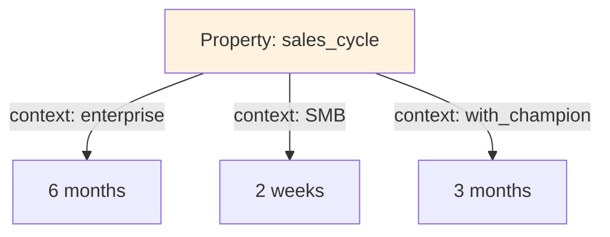

**Why separate blocks are insufficient**:

- Can't query "what's the sales cycle?" without knowing context upfront
- Synthesis can't merge properly without understanding they're the same property
- Relationships to other blocks become fragmented

**⭐ RECOMMENDATION: Context-qualified properties with dimension tracking**

```yaml
Block (single block with context-qualified values):
  id: block_sales_cycle
  content: "Sales cycle varies by customer segment"

  # The property that varies
  varies_by: customer_segment

  # Context-qualified values
  sales_cycle:
    - context: enterprise
      value: 6_months
      confidence: 0.8
    - context: SMB
      value: 2_weeks
      confidence: 0.9
    - context: mid_market
      value: 2_months
      confidence: 0.6

  # Default when context unknown
  sales_cycle_default: 3_months
```

**Alternative flat representation** (if nested values aren't supported):

```yaml
Block:
  varies_by: customer_segment
  sales_cycle__enterprise: 6_months
  sales_cycle__SMB: 2_weeks
  sales_cycle__mid_market: 2_months
  sales_cycle__default: 3_months
  sales_cycle__enterprise__confidence: 0.8
  sales_cycle__SMB__confidence: 0.9
```

**Query patterns enabled**:

- "What varies by customer segment?" → `varies_by: customer_segment`
- "What's sales cycle for enterprise?" → Look up `sales_cycle` with `context: enterprise`
- "Which properties have context-dependent values?" → `varies_by IS NOT NULL`

**Verdict**: ⚠️ Requires `varies_by` dimension tracking and context-qualified property values.

---

### Scenario 19: Derived Values

**Input**:

- "TAM is $50B"
- "We can capture 2% of the market"
- (Implied: SAM = $1B)

**Challenge**: Some values are calculated from other blocks. When inputs change, derived values become stale.

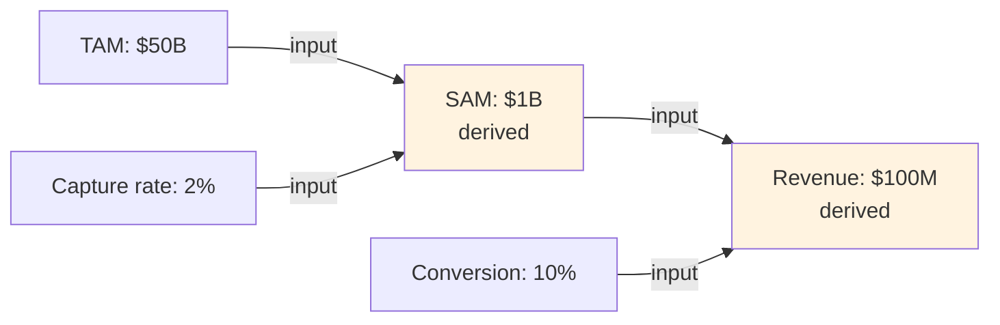

**Problems to solve**:

1. If TAM changes to $40B, SAM should flag as stale
2. If user manually overrides SAM, track that it's an override
3. Circular dependencies must be detected and prevented

**⭐ RECOMMENDATION: Derived blocks with formula tracking and staleness detection**

```yaml
Input Block (TAM):
  id: block_tam
  market_size: 50000000000

Input Block (Capture Rate):
  id: block_capture_rate
  capture_rate: 0.02

Derived Block (SAM):
  id: block_sam
  type: derived
  derived_from: [block_tam, block_capture_rate]
  formula: "block_tam.market_size * block_capture_rate.capture_rate"
  computed_value: 1000000000
  computed_at: 2026-01-22T10:00:00Z
  stale: false

  # If user overrides
  override_value: null # Set if user provides manual value
  override_reason: null
  override_at: null
```

**Staleness detection**:

- When any block in `derived_from` is modified, set `stale: true` on derived block
- UI shows stale derived values with warning
- Recalculation can be triggered manually or automatically

**Override handling**:

- If `override_value` is set, use that instead of `computed_value`
- Track `override_reason` for audit trail
- When inputs change, notify user that override may be outdated

**Circular dependency prevention**:

- Before creating derived block, traverse `derived_from` graph
- If current block appears in any upstream chain, reject with error

**Verdict**: ⚠️ Requires `type: derived` blocks with `derived_from`, `formula`, `stale`, and override tracking.

---

### Scenario 20: Evidence Chains

**Input**: "We think the market is big because our advisor said so, and he read it in a Gartner report."

**Challenge**: Confidence should flow through evidence chains. The claim is only as strong as its weakest link.

```mermaid
graph LR
    GARTNER[Gartner Report<br/>base_confidence: 0.9] --> |evidence_for| ADVISOR[Advisor Statement<br/>base_confidence: 0.7]
    ADVISOR --> |evidence_for| CLAIM[Market Size Claim<br/>derived_confidence: 0.63]

    subgraph "Confidence Propagation"
        CALC[0.9 × 0.7 = 0.63]
    end
```

**Why this matters**:

- If Gartner report is invalidated, everything downstream should be flagged
- Can't just set confidence independently—it depends on sources
- Need to distinguish "strongly supported by" vs "mentioned alongside"

**⭐ RECOMMENDATION: Evidence links with strength and confidence propagation**

```yaml
Source Block (Gartner):
  id: block_gartner
  content: "Legal tech market analysis"
  source_type: research_firm
  base_confidence: 0.9
  status: active

Evidence Block (Advisor):
  id: block_advisor
  content: "Advisor confirms market is large"
  base_confidence: 0.7
  evidence_for: block_gartner
  evidence_strength: strong # strong | moderate | weak
  derived_confidence: 0.63 # Auto-calculated: 0.9 × 0.7

Claim Block:
  id: block_claim
  content: "Market is $50B"
  evidence_for: block_advisor
  evidence_strength: moderate
  derived_confidence: 0.44 # 0.63 × 0.7 (moderate = 0.7 multiplier)
```

**Confidence propagation rules**:

| Evidence Strength | Multiplier | Use When                         |
| ----------------- | ---------- | -------------------------------- |
| `strong`          | 1.0        | Direct citation, primary data    |
| `moderate`        | 0.7        | Interpretation, secondary source |
| `weak`            | 0.4        | Anecdote, vague reference        |

**Calculation**: `derived_confidence = upstream_confidence × strength_multiplier × base_confidence`

**Invalidation cascade**:

- When source block status → `invalidated`, traverse all `evidence_for` links
- Set `evidence_status: source_invalidated` on downstream blocks
- Recalculate `derived_confidence` (may go to 0)

**Verdict**: ⚠️ Requires `evidence_for` links with `evidence_strength` and automatic `derived_confidence` propagation.

---

### Scenario 21: Implicit Assumptions

**Input**: "We'll sell to law firms"

**Implicit assumptions that should surface**:

- Law firms have budget for this
- Law firms can make purchasing decisions quickly enough
- The contact person has authority to buy
- Their tech stack is compatible
- No regulatory blockers exist

**Challenge**: Valuable information is what the user DIDN'T say but assumed. AI should surface these for validation.

```mermaid
graph TD
    EXPLICIT[Explicit Block<br/>target: law_firms] --> |implies| A1[Assumption: Budget exists]
    EXPLICIT --> |implies| A2[Assumption: Tech compatible]
    EXPLICIT --> |implies| A3[Assumption: No regulatory blockers]

    A1 --> |status| S1[unvalidated]
    A2 --> |status| S2[validated ✓]
    A3 --> |status| S3[invalidated ✗]

    style A1 fill:#fff3e0
    style A2 fill:#c8e6c9
    style A3 fill:#ffcdd2
```

**⭐ RECOMMENDATION: AI-extracted assumption blocks requiring validation**

```yaml
Explicit Block:
  id: block_target
  content: "We'll sell to law firms"
  target_customer: law_firms

Assumption Block (AI-generated):
  id: assumption_budget
  type: assumption
  content: "Law firms have budget for AI tools"
  implied_by: block_target
  surfaced_by: ai # ai | user | advisor
  assumption_status: unvalidated # unvalidated | validated | invalidated
  criticality: critical # critical | important | minor
  validation_method: null # How to validate
  validated_by: null # Who validated
  validated_at: null

Assumption Block:
  id: assumption_tech
  type: assumption
  content: "Law firm tech stacks can integrate"
  implied_by: block_target
  surfaced_by: ai
  assumption_status: validated
  criticality: important
  validation_method: "Interviewed 5 IT directors"
  validated_by: "User research"
  validated_at: 2026-01-15
```

**AI extraction triggers**:

- When block contains `target_customer`, `market`, or `solution`, AI generates assumptions
- Assumptions are domain-specific (e.g., B2B → budget authority, procurement process)
- User can dismiss irrelevant assumptions or add custom ones

**Criticality classification**:

| Criticality | Definition          | Example                       |
| ----------- | ------------------- | ----------------------------- |
| `critical`  | Idea fails if wrong | "Customers have budget"       |
| `important` | Significant impact  | "Tech is compatible"          |
| `minor`     | Nice to have        | "They prefer cloud solutions" |

**Synthesis behavior**: Surface unvalidated critical assumptions prominently. Block "validated" status on parent idea until critical assumptions are addressed.

**Verdict**: ⚠️ Requires `type: assumption` blocks with `implied_by`, `assumption_status`, and `criticality`.

---

### Scenario 22: Cyclic Relationships

**Input**:

- "We need funding to build the product"
- "We need a product to get funding"

**Challenge**: Real ideas have circular dependencies and feedback loops. The model must detect and handle these.

```mermaid
graph LR
    A[Need: Funding] --> |requires| B[Need: Product]
    B --> |requires| A

    C[Problem: Churn] --> |causes| D[Problem: Revenue loss]
    D --> |causes| E[Problem: Less investment]
    E --> |causes| C
```

**Problems cycles create**:

- Graph traversal queries infinite loop
- "What's blocking this?" has no terminal answer
- Critical path analysis fails

**⭐ RECOMMENDATION: Cycle detection with break-point identification**

```yaml
Block A:
  id: block_funding
  content: "We need funding"
  requires: block_product
  cycle_id: cycle_chicken_egg # Auto-detected
  cycle_position: 1

Block B:
  id: block_product
  content: "We need to build product"
  requires: block_funding
  cycle_id: cycle_chicken_egg
  cycle_position: 2

Cycle Resolution Block:
  id: cycle_chicken_egg
  type: cycle
  members: [block_funding, block_product]
  cycle_type: blocking # blocking | reinforcing
  break_strategy: "MVP with bootstrap funding"
  break_point: block_funding # Which block to resolve first
  status: unresolved # unresolved | resolved
  resolved_by: null
  resolved_at: null
```

**Cycle detection algorithm**:

1. When creating `requires`, `blocks`, or `causes` link, check if target already has path back to source
2. If cycle detected, create `type: cycle` block grouping members
3. Assign `cycle_position` based on detection order
4. Flag for user attention

**Cycle types**:

| Type          | Definition               | Example                                             | Resolution Approach                 |
| ------------- | ------------------------ | --------------------------------------------------- | ----------------------------------- |
| `blocking`    | Each blocks the other    | Funding ↔ Product                                   | Find external input to break        |
| `reinforcing` | Each amplifies the other | Churn → Revenue loss → Less investment → More churn | Intervene at highest-leverage point |

**Query handling**: When traversing graph and hitting cycle member, stop and return cycle reference instead of infinite loop.

**Verdict**: ⚠️ Requires cycle detection, `type: cycle` blocks, and `break_strategy` tracking.

---

### Scenario 23: Incomplete Information

**Input**: "We know we have competitors, but I don't know who they are yet"

**Challenge**: User is certain something exists but lacks details. This is different from uncertainty—they KNOW competitors exist.

| Pattern                    | Problem with Current Model                                    |
| -------------------------- | ------------------------------------------------------------- |
| "There are competitors"    | `competitor: unknown` can't distinguish from "no competitors" |
| "Someone invested in them" | No way to mark "exists but unknown"                           |
| "Market is growing"        | Can't capture "we know this, just not the number"             |

**⭐ RECOMMENDATION: Placeholder blocks with existence confirmation**

```yaml
Placeholder Block:
  id: block_competitors
  type: placeholder
  content: "Competitors exist in this market"

  # Existence is confirmed, details are not
  existence_confirmed: true
  details_unknown: true

  # What we're trying to find
  placeholder_for: competitor
  research_query: "Who are the main competitors in legal AI?"

  # Partial information if any
  partial_info:
    - "At least 3 major players"
    - "One raised $50M recently"

  # Resolution tracking
  status: placeholder # placeholder | partially_filled | complete
  research_assigned_to: null
  target_completion: 2026-02-01
```

**Placeholder vs Meta block distinction**:

| Aspect     | Placeholder Block              | Meta Block                     |
| ---------- | ------------------------------ | ------------------------------ |
| Purpose    | Represent known-unknown        | Annotate existing block        |
| Existence  | Confirms something exists      | Comments on something          |
| Resolution | Becomes real content block     | Gets resolved/dismissed        |
| Query      | "What do we need to research?" | "What are we uncertain about?" |

**Resolution flow**:

1. Placeholder created with `existence_confirmed: true`
2. Research happens, partial info added
3. When complete, placeholder converts to regular content block
4. Link maintained: `resolved_from: block_competitors_placeholder`

**Verdict**: ⚠️ Requires `type: placeholder` blocks with `existence_confirmed` and `details_unknown`.

---

### Scenario 24: Stakeholder Conflict

**Input**:

- CEO: "We should focus on enterprise"
- CTO: "We should focus on SMB"
- Advisor: "Enterprise is better, but riskier"

**Challenge**: Different stakeholders have different views on the same topic. These aren't contradictions to resolve—they're perspectives to track.

```mermaid
graph TD
    TOPIC[Topic: Target Market] --> CEO[CEO View: Enterprise<br/>weight: decision_maker]
    TOPIC --> CTO[CTO View: SMB<br/>weight: domain_expert]
    TOPIC --> ADV[Advisor View: Enterprise + risk<br/>weight: experienced]

    CEO --> |status| S1[active]
    CTO --> |status| S2[overruled]
    ADV --> |status| S3[acknowledged]
```

**Why this differs from contradiction**:

- All views are legitimate from their perspective
- Need to track who said what and why
- Need to track which view was ultimately adopted
- Historical record of disagreement is valuable

**⭐ RECOMMENDATION: Stakeholder-attributed blocks with conflict resolution**

```yaml
Topic Block:
  id: topic_target_market
  type: topic
  content: "Target market decision"
  status: decided # exploring | decided | deferred
  decided_view: view_ceo_enterprise
  decision_date: 2026-01-20
  decision_rationale: "Enterprise has higher ACV despite longer sales cycle"

Stakeholder View Block (CEO):
  id: view_ceo_enterprise
  type: stakeholder_view
  topic: topic_target_market
  stakeholder: "CEO"
  stakeholder_role: decision_maker # decision_maker | domain_expert | advisor | team_member
  content: "Focus on enterprise for higher ACV"
  view_status: adopted # active | adopted | overruled | withdrawn

Stakeholder View Block (CTO):
  id: view_cto_smb
  type: stakeholder_view
  topic: topic_target_market
  stakeholder: "CTO"
  stakeholder_role: domain_expert
  content: "SMB is easier to build for and faster sales"
  view_status: overruled
  overruled_reason: "Valid technical points but business decision prioritized ACV"

Stakeholder View Block (Advisor):
  id: view_advisor_nuanced
  type: stakeholder_view
  topic: topic_target_market
  stakeholder: "Advisor"
  stakeholder_role: advisor
  content: "Enterprise is better but riskier—need to watch sales cycle"
  view_status: acknowledged
  incorporated_into: view_ceo_enterprise # Their concern was noted
```

**Query patterns enabled**:

- "What does CTO think about target market?" → Filter by stakeholder + topic
- "Where do we have disagreement?" → Topics with multiple active views
- "What was decided and why?" → Topic block with decision_rationale
- "Whose view was adopted?" → view_status: adopted

**Verdict**: ⚠️ Requires `type: stakeholder_view` blocks with `stakeholder`, `stakeholder_role`, and `view_status`.

---

### Scenario 25: External Resources

**Input**: "According to this article: https://techcrunch.com/2026/01/legal-ai-funding"

**Challenge**: External URLs may change, disappear, or contain multiple extractable facts. Need to track provenance.

```mermaid
graph TD
    URL[External Resource<br/>techcrunch.com/...] --> |extracted| F1[Fact: Competitor raised $50M]
    URL --> |extracted| F2[Fact: Market growing 40%]
    URL --> |extracted| F3[Quote: CEO statement]

    URL --> |snapshot| SNAP[Archived: 2026-01-22]
    URL --> |health| HEALTH[Status: alive]
```

**Problems to solve**:

- Link rot—URL might die
- Content might change after we cited it
- Multiple facts extracted from same source need linking
- Source credibility varies by domain

**⭐ RECOMMENDATION: External resource blocks with snapshots and health tracking**

```yaml
External Resource Block:
  id: external_techcrunch_001
  type: external
  url: "https://techcrunch.com/2026/01/legal-ai-funding"
  title: "Legal AI Startup Raises $50M Series B"

  # Snapshot for permanence
  snapshot_date: 2026-01-22T10:30:00Z
  snapshot_hash: "sha256:abc123..." # Hash of content at snapshot time
  snapshot_stored: true # Whether we archived the content

  # Health tracking
  url_status: alive # alive | redirected | dead | changed
  last_checked: 2026-01-22T10:30:00Z
  content_changed: false

  # Source credibility
  domain_credibility: medium # Maps from domain reputation
  source_type: tech_press

Extracted Fact Block:
  id: fact_competitor_funding
  content: "Competitor X raised $50M Series B"
  extracted_from: external_techcrunch_001
  extraction_quote: "X announced today a $50M Series B led by..."
  extraction_date: 2026-01-22

  # Inherits source metadata
  source_type: tech_press
  source_credibility: medium
```

**URL health checking**:

- Periodic background job checks URLs
- If `dead`, flag all `extracted_from` blocks
- If `changed`, compare with snapshot hash, flag if different

**Domain credibility mapping**:

| Domain Pattern                  | Credibility | Rationale         |
| ------------------------------- | ----------- | ----------------- |
| `gartner.com`, `mckinsey.com`   | high        | Research firms    |
| `techcrunch.com`, `reuters.com` | medium      | Established press |
| `medium.com`, `substack.com`    | low         | Individual blogs  |
| `twitter.com`, `linkedin.com`   | very_low    | Social posts      |

**Verdict**: ⚠️ Requires `type: external` blocks with `snapshot_date`, `url_status`, and `extracted_from` relationships.

---

### Scenario 26: Action Items

**Input**: "We need to validate the market size with 10 more user interviews"

**Challenge**: Insights generate action items. Need to track progress and link completion back to the claim being validated.

```mermaid
graph TD
    CLAIM[Claim: Market is $50B<br/>status: unvalidated] --> |generates| ACTION[Action: Validate with interviews]
    ACTION --> |required| COUNT[Required: 10 interviews]
    ACTION --> |progress| DONE[Completed: 3/10]

    INT1[Interview 1] --> |validates| CLAIM
    INT2[Interview 2] --> |validates| CLAIM
    INT3[Interview 3] --> |validates| CLAIM
```

**Why meta blocks aren't enough**:

- Meta blocks capture "research needed" but not task state
- No progress tracking
- No link from completed research back to validated claim

**⭐ RECOMMENDATION: Action blocks with completion tracking**

```yaml
Claim Block:
  id: block_market_claim
  content: "Market size is approximately $50B"
  market_size: 50000000000
  validation_status: in_progress # unvalidated | in_progress | validated | invalidated

Action Block:
  id: action_validate_market
  type: action
  content: "Validate market size with user interviews"

  # What this action is for
  action_type: validate # validate | research | build | decide | other
  validates_claim: block_market_claim

  # Progress tracking
  required_count: 10
  completed_count: 3
  completion_evidence: [block_interview_1, block_interview_2, block_interview_3]

  # Status
  status: in_progress # pending | in_progress | completed | blocked | cancelled
  assigned_to: "Research team"
  due_date: 2026-02-15

  # Outcome
  outcome: null # Set when completed: validated | invalidated | inconclusive
  outcome_summary: null

Interview Block:
  id: block_interview_1
  type: evidence
  content: "Interview with legal tech buyer at BigLaw firm"
  evidence_for: action_validate_market
  supports_claim: true
  key_finding: "Confirmed $40-60B range, sees growth"
```

**Action types**:

| Type       | Purpose                   | Outcome Updates                     |
| ---------- | ------------------------- | ----------------------------------- |
| `validate` | Confirm or refute a claim | Updates claim's `validation_status` |
| `research` | Gather new information    | Creates new content blocks          |
| `build`    | Create something          | Links to deliverable                |
| `decide`   | Make a decision           | Updates decision block status       |

**Completion flow**:

1. Action reaches `required_count` evidence items
2. AI or user reviews evidence, sets `outcome`
3. If `validates_claim` is set, update that block's `validation_status`
4. Action status → `completed`

**Verdict**: ⚠️ Requires `type: action` blocks with `action_type`, `validates_claim`, progress tracking, and outcome linking.

---

### Scenario 27: Abstraction Levels

**Input**:

- Vision: "Transform how lawyers do research"
- Strategy: "AI-powered legal research platform"
- Tactic: "Use RAG with case law embeddings"
- Implementation: "GPT-4 + Pinecone + Next.js"

**Challenge**: Same idea at different zoom levels. Need to connect strategic to tactical without losing hierarchy.

```mermaid
graph TD
    V[Vision<br/>Transform legal research] --> S[Strategy<br/>AI-powered platform]
    S --> T1[Tactic<br/>RAG architecture]
    S --> T2[Tactic<br/>Case law database]
    T1 --> I1[Implementation<br/>GPT-4 API]
    T1 --> I2[Implementation<br/>Pinecone vectors]
    T2 --> I3[Implementation<br/>CourtListener data]
```

**Why this matters**:

- "Why are we using Pinecone?" requires traversing up to strategy
- Properties that matter at vision level (market impact) differ from implementation (API limits)
- Synthesis at wrong level is meaningless

**⭐ RECOMMENDATION: Abstraction hierarchy with implements relationships**

```yaml
Vision Block:
  id: block_vision
  content: "Transform how lawyers conduct legal research"
  abstraction_level: vision
  implemented_by: [block_strategy]

  # Vision-level properties
  market_impact: "10x research efficiency"
  target_outcome: "Lawyers spend time on strategy, not search"

Strategy Block:
  id: block_strategy
  content: "Build AI-powered legal research platform"
  abstraction_level: strategy
  implements: block_vision
  implemented_by: [block_tactic_rag, block_tactic_data]

  # Strategy-level properties
  approach: "AI + domain expertise"
  competitive_advantage: "Legal-specific training"

Tactic Block:
  id: block_tactic_rag
  content: "Use RAG architecture for contextual answers"
  abstraction_level: tactic
  implements: block_strategy
  implemented_by: [block_impl_gpt4, block_impl_pinecone]

  # Tactic-level properties
  pattern: RAG
  tradeoffs: "Accuracy vs latency"

Implementation Block:
  id: block_impl_gpt4
  content: "GPT-4 API for generation"
  abstraction_level: implementation
  implements: block_tactic_rag

  # Implementation-level properties
  technology: "OpenAI GPT-4"
  api_limits: "10K tokens/request"
  cost: "$0.03/1K tokens"
```

**Abstraction levels**:

| Level            | Focus         | Typical Properties              | Changes How Often |
| ---------------- | ------------- | ------------------------------- | ----------------- |
| `vision`         | Why we exist  | market_impact, target_outcome   | Rarely            |
| `strategy`       | How we win    | approach, competitive_advantage | Quarterly         |
| `tactic`         | What approach | pattern, tradeoffs              | Monthly           |
| `implementation` | Specific tech | technology, api_limits, cost    | Weekly            |

**Query patterns enabled**:

- "Why are we using Pinecone?" → Traverse `implements` up to strategy/vision
- "What implements our AI strategy?" → All blocks where `implements` chain leads to strategy block
- "Show me vision-level summary" → Filter by `abstraction_level: vision`

**Synthesis behavior**: Generate summaries at each level separately. Don't mix implementation details into vision-level synthesis.

**Verdict**: ⚠️ Requires `abstraction_level` property with `implements` and `implemented_by` relationships.

---

## Gap Summary and Architecture

```mermaid
graph TD
    subgraph Core_Model[Core Model]
        CM[Content + Properties + Tags]
    end

    subgraph Foundation_Blocks[Foundation Blocks]
        BT1[type: content - Domain blocks]
        BT2[type: placeholder - Known unknowns]
        BT3[type: external - URL references]
    end

    subgraph Relationship_Blocks[Relationship Blocks]
        BT4[type: link - First-class edges]
        BT5[type: cycle - Circular deps]
    end

    subgraph Intelligence_Blocks[Intelligence Blocks]
        BT6[type: meta - Annotations]
        BT7[type: assumption - Implicit beliefs]
        BT8[type: derived - Calculated values]
    end

    subgraph Decision_Blocks[Decision Blocks]
        BT9[type: decision - Decision points]
        BT10[type: option - Alternatives]
        BT11[type: topic - Multi-stakeholder]
        BT12[type: stakeholder_view - Perspectives]
    end

    subgraph Execution_Blocks[Execution Blocks]
        BT13[type: action - Tasks with progress]
        BT14[type: synthesis - Aggregations]
        BT15[type: pattern - Cross-idea]
    end

    subgraph Property_Extensions[Property Extensions]
        PE1[Range suffixes: _min/_max/_estimate]
        PE2[Context qualification: varies_by]
        PE3[Abstraction: vision/strategy/tactic/impl]
        PE4[Evidence: evidence_for + strength]
        PE5[Temporal: when/duration/planned_for]
    end

    CM --> Foundation_Blocks
    CM --> Relationship_Blocks
    CM --> Intelligence_Blocks
    CM --> Decision_Blocks
    CM --> Execution_Blocks
    CM --> Property_Extensions
```

---

## Revised Property Taxonomy

### Block Types

| Type               | Purpose                            | Example                                    |
| ------------------ | ---------------------------------- | ------------------------------------------ |
| `content`          | Domain knowledge (default)         | Problem statements, solutions, market info |
| `link`             | First-class relationships          | "Solution A addresses Problem 1 partially" |
| `meta`             | Annotations about other blocks     | Uncertainties, research needs, assessments |
| `synthesis`        | AI-generated aggregations          | Cluster summaries, master views            |
| `pattern`          | Cross-idea reusable structures     | "AI for professional time-saving"          |
| `decision`         | Decision points with options       | "Build vs Buy decision"                    |
| `option`           | Alternative under a decision       | "Option A: Build in-house"                 |
| `derived`          | Calculated from other blocks       | "SAM = TAM × capture rate"                 |
| `assumption`       | AI-surfaced implicit assumptions   | "Law firms have budget"                    |
| `cycle`            | Detected circular dependencies     | "Funding ↔ Product chicken-egg"            |
| `placeholder`      | Known existence, unknown details   | "Competitors exist but unidentified"       |
| `stakeholder_view` | Stakeholder's perspective on topic | "CEO view: target enterprise"              |
| `topic`            | Decision topic with multiple views | "Target market decision"                   |
| `external`         | External URL with snapshot         | "TechCrunch article reference"             |
| `action`           | Task with progress tracking        | "Validate market with 10 interviews"       |

### Graph Properties (Define Graph Membership)

| Key        | Graph    | Example Value              |
| ---------- | -------- | -------------------------- |
| `problem`  | Problem  | "Research time waste"      |
| `solution` | Solution | "AI-powered search"        |
| `market`   | Market   | "Legal tech"               |
| `risk`     | Risk     | "Competitive imitation"    |
| `fit`      | Fit      | "Founder-market alignment" |
| `business` | Business | "SaaS subscription"        |
| `spec`     | Spec     | "Technical requirements"   |

### Link Block Properties

| Key          | Type   | Purpose                   | Example                          |
| ------------ | ------ | ------------------------- | -------------------------------- |
| `link_type`  | enum   | Relationship type         | `addresses`, `creates`, `blocks` |
| `source`     | id     | Origin block              | `block_solution_001`             |
| `target`     | id     | Destination block         | `block_problem_001`              |
| `degree`     | enum   | Strength of relationship  | `full`, `partial`, `minimal`     |
| `confidence` | float  | Certainty of relationship | `0.8`                            |
| `reason`     | string | Explanation               | "Covers main use case"           |
| `status`     | enum   | Lifecycle state           | `active`, `superseded`           |

### Meta Block Properties

| Key         | Type   | Purpose                      | Example                          |
| ----------- | ------ | ---------------------------- | -------------------------------- |
| `meta_type` | enum   | Type of meta-statement       | `uncertainty`, `research_needed` |
| `about`     | id     | Block being annotated        | `block_market_001`               |
| `property`  | string | Specific property (optional) | `market_size`                    |
| `resolved`  | bool   | Whether addressed            | `false`                          |

### Source Properties (on any block)

| Key           | Values                                                                             | Purpose            |
| ------------- | ---------------------------------------------------------------------------------- | ------------------ |
| `source_type` | `research_firm`, `primary_research`, `expert`, `anecdote`, `assumption`, `unknown` | Credibility signal |
| `source_name` | String                                                                             | Attribution        |
| `source_date` | ISO date                                                                           | Freshness          |
| `verifiable`  | `true`, `false`                                                                    | Can verify?        |

### Temporal Properties (on any block)

| Key           | Format               | Example                     |
| ------------- | -------------------- | --------------------------- |
| `when`        | ISO date or relative | `2025-01-15` or `-6_months` |
| `duration`    | Period               | `3_months`                  |
| `planned_for` | Date or quarter      | `Q3_2026`                   |
| `valid_until` | ISO date             | `2025-12-31`                |

### Status Properties (on any block)

| Key            | Values                                                    | Purpose         |
| -------------- | --------------------------------------------------------- | --------------- |
| `status`       | `draft`, `active`, `validated`, `superseded`, `abandoned` | Lifecycle state |
| `confidence`   | `high`, `medium`, `low` or 0.0-1.0                        | Certainty level |
| `objectivity`  | `objective`, `subjective`, `mixed`                        | Fact vs opinion |
| `hypothetical` | `true`, `false`                                           | Speculative?    |

### Structural Properties

| Key      | Purpose        | Example                                           |
| -------- | -------------- | ------------------------------------------------- |
| `type`   | Block type     | `content`, `link`, `meta`, `synthesis`, `pattern` |
| `scope`  | Idea or global | `idea:legal-ai` or `global`                       |
| `parent` | Hierarchy      | `block_parent_id`                                 |

---

## Architecture Summary

### Consolidated Recommendations

| Scenario                  | Recommendation                   | Implementation                                                             |
| ------------------------- | -------------------------------- | -------------------------------------------------------------------------- |
| Contradictions            | `supersedes` link                | Link block with `link_type: supersedes`, auto-update old status            |
| Refinement vs Replacement | AI classify + user confirm       | `refines` for evolution, `replaces` for pivot                              |
| Meta-Statements           | Separate meta blocks             | `type: meta`, `meta_type`, `about: block_id`                               |
| Nuanced Relationships     | First-class link blocks          | `type: link` with `source`, `target`, `degree`, `confidence`               |
| Scale/Aggregation         | Hybrid clustering + synthesis    | `type: synthesis`, `synthesizes: [ids]`, embedding-based clustering        |
| Cross-Idea Patterns       | Global-scoped pattern blocks     | `scope: global`, `type: pattern`, `instance_of`                            |
| Branching Alternatives    | Decision blocks with options     | `type: decision`, `type: option`, `alternative_to`, `selection_status`     |
| Ranges and Bounds         | Suffix conventions for ranges    | `_min`, `_max`, `_estimate`, `_best`, `_likely`, `_worst` suffixes         |
| Conditional Truth         | Context-qualified properties     | `varies_by` dimension, double-underscore context notation                  |
| Derived Values            | Formula tracking with staleness  | `type: derived`, `derived_from`, `formula`, `stale`, override tracking     |
| Evidence Chains           | Confidence propagation           | `evidence_for`, `evidence_strength`, `derived_confidence` auto-calc        |
| Implicit Assumptions      | AI-extracted assumption blocks   | `type: assumption`, `implied_by`, `assumption_status`, `criticality`       |
| Cyclic Relationships      | Cycle detection and break-points | `type: cycle`, `cycle_id`, `break_strategy`, `cycle_type`                  |
| Incomplete Information    | Placeholder blocks               | `type: placeholder`, `existence_confirmed`, `details_unknown`              |
| Stakeholder Conflict      | Stakeholder-attributed views     | `type: stakeholder_view`, `type: topic`, `stakeholder_role`, `view_status` |
| External Resources        | Snapshots and health tracking    | `type: external`, `snapshot_date`, `url_status`, `extracted_from`          |
| Action Items              | Action blocks with progress      | `type: action`, `action_type`, `validates_claim`, progress tracking        |
| Abstraction Levels        | Hierarchy with implements links  | `abstraction_level`, `implements`, `implemented_by`                        |

### Architectural Layers

The system consists of seven architectural layers, each building on the previous:

```mermaid
graph BT
    L1[Layer 1: Content Blocks<br/>Domain knowledge with properties] --> L2[Layer 2: Link Blocks<br/>First-class relationships with metadata]
    L2 --> L3[Layer 3: Meta & Assumption Blocks<br/>Annotations, uncertainties, assumptions]
    L3 --> L4[Layer 4: Decision & Stakeholder Blocks<br/>Alternatives, views, conflicts]
    L4 --> L5[Layer 5: Action & Derived Blocks<br/>Tasks, calculations, progress]
    L5 --> L6[Layer 6: Synthesis Blocks<br/>AI-generated aggregations]
    L6 --> L7[Layer 7: Pattern & Abstraction Blocks<br/>Cross-idea structures, hierarchy]
```

| Layer | Block Types                                       | Purpose                              | Dependencies |
| ----- | ------------------------------------------------- | ------------------------------------ | ------------ |
| 1     | `content`, `placeholder`, `external`              | Domain knowledge, references         | None         |
| 2     | `link`                                            | Relationships between content        | Layer 1      |
| 3     | `meta`, `assumption`                              | Annotations, AI-surfaced assumptions | Layers 1-2   |
| 4     | `decision`, `option`, `topic`, `stakeholder_view` | Alternatives, perspectives           | Layers 1-3   |
| 5     | `action`, `derived`, `cycle`                      | Tasks, calculations, cycle detection | Layers 1-4   |
| 6     | `synthesis`                                       | Aggregated views                     | Layers 1-5   |
| 7     | `pattern`                                         | Cross-idea patterns, abstraction     | Layers 1-6   |

### Implementation Order

Build in this order to ensure each layer has its dependencies:

**Phase 1: Foundation**

1. **Content blocks** - Basic domain knowledge storage with range suffixes
2. **Placeholder blocks** - Known-unknowns with existence tracking
3. **External blocks** - URL references with snapshots
4. **Link blocks** - Relationships with full metadata
5. **Graph queries** - Traversal and filtering on links
6. **Cycle detection** - Identify circular dependencies

**Phase 2: Intelligence Layer**

7. **Meta blocks** - Uncertainty, research needs, assessments
8. **Assumption blocks** - AI extraction of implicit assumptions
9. **Evidence chains** - Confidence propagation through citations
10. **Temporal properties** - When, duration, planned_for, valid_until
11. **Source attribution** - Provenance and credibility scoring

**Phase 3: Decision Support**

12. **Decision blocks** - Decision points with alternatives
13. **Option blocks** - Mutually exclusive choices
14. **Topic blocks** - Multi-stakeholder decision topics
15. **Stakeholder view blocks** - Attributed perspectives
16. **Context-qualified properties** - Varies-by dimension handling

**Phase 4: Automation Layer**

17. **Derived blocks** - Calculated values with staleness
18. **Action blocks** - Task tracking with progress
19. **Synthesis blocks** - Clustering and aggregation
20. **Abstraction levels** - Vision/strategy/tactic/implementation hierarchy
21. **Pattern blocks** - Cross-idea structures

---

## Pipeline Decision Points

Before implementing the user input → AI processing → graph population pipeline, the following architectural decisions must be locked in.

### Decision 1: Property Value Storage Format

**Question**: How are complex values stored in properties?

**Decision**: **Flat key-value pairs only. No nested objects.**

Rationale: Flat storage enables simple querying, indexing, and portability. Nested objects require schema enforcement and complicate queries.

| Pattern           | Storage Format           | Example                                        |
| ----------------- | ------------------------ | ---------------------------------------------- |
| Context-qualified | Double underscore        | `sales_cycle__enterprise: 6_months`            |
| Ranges            | Suffix convention        | `market_size_min: 30B`, `market_size_max: 80B` |
| Arrays            | JSON string              | `derived_from: ["block_1", "block_2"]`         |
| Timestamps        | ISO 8601                 | `when: 2026-01-22T10:00:00Z`                   |
| Currency          | Integer cents + currency | `amount: 5000000000`, `currency: USD`          |
| Durations         | Underscore convention    | `duration: 3_months`, `duration: 14_days`      |

---

### Decision 2: Block Type Classification

**Question**: How does AI determine which block type to create from user input?

**Decision**: **Multi-context AI classification with immediate user confirmation UI**

Block type classification requires three context sources, not just user input:

```mermaid
graph TD
    INPUT[User Input] --> CONTEXT{Context Assembly}
    NEIGHBOR[Neighboring Nodes] --> CONTEXT
    CONV[Conversation History] --> CONTEXT
    CONTEXT --> AI{AI Classifier}
    AI --> IMPACT{Impact Analysis}
    IMPACT --> |Cascading changes| CASCADE[Identify affected nodes]
    IMPACT --> |No cascade| SIMPLE[Simple addition]
    CASCADE --> CONFIRM[Confirmation Pop-up]
    SIMPLE --> CONFIRM
    CONFIRM --> USER{User Decision}
    USER --> |Confirm| COMMIT[Commit to Memory Graph]
    USER --> |Modify| EDIT[Edit before commit]
    USER --> |Reject| DISCARD[Discard]
```

**Context Sources**:

| Source                   | What It Provides                    | Example                                         |
| ------------------------ | ----------------------------------- | ----------------------------------------------- |
| **User Input**           | Current statement                   | "We're targeting enterprise now"                |
| **Neighboring Nodes**    | Related nodes that may need updates | Existing "target: SMB" node needs superseding   |
| **Conversation History** | Who, what, when, where, how context | Knows this came from CEO in strategy discussion |

**Conversation Context Tracking (5W1H)**:

| Dimension | Tracked From                           | Used For                            |
| --------- | -------------------------------------- | ----------------------------------- |
| **Who**   | Speaker identification in conversation | `stakeholder` attribution           |
| **What**  | Current topic/decision being discussed | Graph membership, block type        |
| **When**  | Temporal markers in conversation       | `when`, `planned_for` properties    |
| **Where** | Market/geography mentions              | Context-qualified properties        |
| **Why**   | Reasoning and evidence cited           | `evidence_for` links                |
| **How**   | Methods and approaches discussed       | `solution`, `tactic` classification |

**Cascading Change Detection**:

When new input may affect existing nodes:

1. **Semantic similarity scan**: Find nodes with similarity > 0.7 to new input
2. **Conflict detection**: Check for contradictions, supersessions, refinements
3. **Dependency traversal**: Follow `requires`, `blocks`, `derived_from` links
4. **Impact radius calculation**: Count affected nodes (1-hop, 2-hop, n-hop)

**Confirmation Pop-up UI** (in Ideation Agent chat):

```
┌─────────────────────────────────────────────────────────┐
│ 📝 Memory Graph Update                                  │
├─────────────────────────────────────────────────────────┤
│ New block detected:                                     │
│ ┌─────────────────────────────────────────────────────┐ │
│ │ "We're targeting enterprise now"                    │ │
│ │ Suggested type: content                             │ │
│ │ Suggested graph: Market                             │ │
│ └─────────────────────────────────────────────────────┘ │
│                                                         │
│ ⚠️ This will affect 3 existing nodes:                   │
│                                                         │
│ 1. [supersedes] "Target: SMB customers"                 │
│ 2. [invalidates] "SMB pricing model: $29/mo"            │
│ 3. [needs review] "Sales cycle: 2 weeks"                │
│                                                         │
│ [✓ Confirm All]  [✎ Review Each]  [✗ Cancel]            │
└─────────────────────────────────────────────────────────┘
```

**Classification signals** (AI-determined, not keyword-based):

| Block Type    | AI Classification Basis                                  |
| ------------- | -------------------------------------------------------- |
| `content`     | Factual statement about the idea domain                  |
| `meta`        | Self-referential statement about confidence/completeness |
| `assumption`  | Implicit belief underlying explicit statements           |
| `decision`    | Choice point with multiple alternatives                  |
| `option`      | One alternative within a decision context                |
| `placeholder` | Confirmed existence with missing details                 |
| `action`      | Task to be completed                                     |
| `external`    | Reference to external resource                           |
| `derived`     | Value calculated from other nodes                        |

**No fallback to keyword matching.** If AI confidence is low, surface immediately for user confirmation rather than guessing.

---

### Decision 3: Relationship Detection & Auto-Linking

**Question**: When does AI auto-create link blocks vs wait for user confirmation?

**Decision**: **Auto-link at >= 0.8 confidence, suggest at 0.5-0.8, ignore below 0.5**

| Confidence | Action                 | User Experience                |
| ---------- | ---------------------- | ------------------------------ |
| >= 0.8     | Auto-create link block | Link appears immediately       |
| 0.5 - 0.79 | Queue suggestion       | "Did you mean X addresses Y?"  |
| < 0.5      | No action              | Silent, but queryable in debug |

**Relationship detection triggers**:

| Link Type      | Detection Pattern                                                 |
| -------------- | ----------------------------------------------------------------- |
| `addresses`    | Solution block + Problem block + semantic similarity > 0.7        |
| `supersedes`   | "actually", "no longer", "instead" + existing block on same topic |
| `refines`      | "more specifically", "to clarify" + existing block on same topic  |
| `contradicts`  | Opposite sentiment + same property key                            |
| `requires`     | "needs", "depends on", "requires" + capability/resource reference |
| `blocks`       | "can't until", "waiting on", "blocked by"                         |
| `evidence_for` | "because", "since", "according to" + reference to another block   |

---

### Decision 4: Graph Membership Assignment

**Question**: How do blocks get assigned to graphs (Problem, Solution, Market, etc.)?

**Decision**: **First matching graph property wins. Blocks can belong to multiple graphs.**

```mermaid
graph LR
    BLOCK[New Block] --> SCAN{Scan for graph properties}
    SCAN --> |has problem:| PG[Problem Graph]
    SCAN --> |has solution:| SG[Solution Graph]
    SCAN --> |has market:| MG[Market Graph]
    SCAN --> |has risk:| RG[Risk Graph]
    SCAN --> |has fit:| FG[Fit Graph]
    SCAN --> |none found| ORPHAN[Orphan - needs classification]
```

**Graph property extraction rules**:

| Graph    | Property Key | Extraction Pattern                               |
| -------- | ------------ | ------------------------------------------------ |
| Problem  | `problem`    | Pain points, frustrations, inefficiencies, costs |
| Solution | `solution`   | Features, capabilities, tools, approaches        |
| Market   | `market`     | Industries, segments, TAM/SAM, geography         |
| Risk     | `risk`       | Threats, uncertainties, failure modes            |
| Fit      | `fit`        | Team capabilities, experience, resources         |
| Business | `business`   | Revenue model, pricing, unit economics           |
| Spec     | `spec`       | Technical requirements, architecture             |

**Multi-graph membership**: A block like "Our AI tool saves lawyers 10 hours" belongs to both Solution (AI tool) and Problem (time waste) graphs.

---

### Decision 5: Confidence Score Calculation

**Question**: How is `confidence` computed for blocks?

**Decision**: **Weighted formula based on source, specificity, and evidence**

```
confidence = (source_weight × 0.4) + (specificity_weight × 0.3) + (evidence_weight × 0.3)
```

**Source weights**:

| Source Type        | Weight |
| ------------------ | ------ |
| `research_firm`    | 0.9    |
| `primary_research` | 0.85   |
| `expert`           | 0.7    |
| `anecdote`         | 0.4    |
| `assumption`       | 0.2    |
| `unknown`          | 0.3    |

**Specificity weights**:

| Specificity       | Weight | Example                   |
| ----------------- | ------ | ------------------------- |
| Precise + sourced | 1.0    | "$47.3B per Gartner 2025" |
| Specific          | 0.8    | "$50B TAM"                |
| Moderate          | 0.5    | "Multi-billion dollar"    |
| Vague             | 0.2    | "Large market"            |

**Evidence weights**:

| Evidence Level                 | Weight |
| ------------------------------ | ------ |
| Multiple corroborating sources | 1.0    |
| Single strong source           | 0.7    |
| Single weak source             | 0.4    |
| No evidence                    | 0.2    |

---

### Decision 6: Conflict Resolution

**Question**: What happens when new input conflicts with existing blocks?

**Decision**: **Never overwrite. Always create new block with relationship to old.**

```mermaid
graph TD
    NEW[New Input] --> DETECT{Conflict Detection}
    DETECT --> |Same topic different value| CONFLICT[Conflict Found]
    CONFLICT --> ANALYZE{Analyze Language}
    ANALYZE --> |Change signals| SUPERSEDE[Create with supersedes link]
    ANALYZE --> |Refinement signals| REFINE[Create with refines link]
    ANALYZE --> |Unclear| SURFACE[Surface for user]
```

**Conflict detection rules**:

1. Same `property_key` with different `value` on same graph
2. Semantic similarity > 0.85 with opposite sentiment
3. Explicit contradiction markers ("not", "no longer", "instead")

**Resolution actions**:

| Scenario          | Action         | Old Block Status     | New Block Relationship |
| ----------------- | -------------- | -------------------- | ---------------------- |
| Explicit change   | Auto-supersede | `status: superseded` | `supersedes: old_id`   |
| Refinement        | Auto-refine    | `status: active`     | `refines: old_id`      |
| Unclear           | Prompt user    | Unchanged pending    | None pending           |
| Different context | Both valid     | `status: active`     | None (parallel truth)  |

---

### Decision 7: Assumption Extraction Triggers

**Question**: When does AI auto-generate assumption blocks?

**Decision**: **Trigger on specific property types with domain-specific assumption templates**

**Trigger properties**:

| Property             | Assumption Template             | Criticality |
| -------------------- | ------------------------------- | ----------- |
| `target_customer: X` | "X has budget for this"         | critical    |
| `target_customer: X` | "X can make purchase decisions" | critical    |
| `target_customer: X` | "X's tech stack is compatible"  | important   |
| `market: X`          | "X market is accessible"        | important   |
| `market: X`          | "No regulatory blockers in X"   | critical    |
| `solution: X`        | "X is technically feasible"     | critical    |
| `solution: X`        | "Team can build X"              | important   |
| `pricing: X`         | "Customers will pay X"          | critical    |

**Generation rules**:

1. On block creation with trigger property, generate assumption blocks
2. Set `assumption_status: unvalidated`
3. Set `surfaced_by: ai`
4. Link via `implied_by: source_block_id`
5. User can dismiss irrelevant assumptions (sets `assumption_status: dismissed`)

---

### Decision 8: Cycle Detection Timing

**Question**: When is cycle detection performed?

**Decision**: **Real-time on link creation, not batch**

```mermaid
graph TD
    CREATE[Create Link Block] --> CHECK{Check for cycle}
    CHECK --> |Cycle found| BLOCK[Create cycle block]
    BLOCK --> FLAG[Flag for user attention]
    CHECK --> |No cycle| COMMIT[Commit link]
```

**Detection algorithm**:

1. Before committing any `requires`, `blocks`, `causes`, or `depends_on` link
2. Traverse from target back toward source using same link types
3. If source found in traversal, cycle exists
4. Create `type: cycle` block grouping all members
5. Do NOT prevent the link creation—cycles are valid, just flagged

---

### Decision 9: Staleness Propagation

**Question**: How does staleness cascade through derived values and evidence chains?

**Decision**: **Immediate propagation on source modification**

```mermaid
graph LR
    MODIFY[Source Block Modified] --> FIND[Find all downstream blocks]
    FIND --> DERIVED[derived_from references]
    FIND --> EVIDENCE[evidence_for references]
    DERIVED --> STALE1[Set stale: true]
    EVIDENCE --> RECALC[Recalculate derived_confidence]
```

**Propagation rules**:

| Upstream Change           | Downstream Effect                                                                   |
| ------------------------- | ----------------------------------------------------------------------------------- |
| Source block modified     | All `derived_from` → `stale: true`                                                  |
| Source block invalidated  | All `evidence_for` → `evidence_status: source_invalidated`, recalc confidence       |
| Source block superseded   | All `evidence_for` → `evidence_status: source_superseded`, reduce confidence by 50% |
| Source confidence changed | All `evidence_for` → recalculate `derived_confidence`                               |

**Recalculation trigger**: Staleness is marked immediately. Recalculation of `computed_value` happens on next read (lazy) or explicit user action.

---

### Decision 10: Abstraction Level Inference

**Question**: How does AI determine `abstraction_level` for new blocks?

**Decision**: **AI contextual classification with user confirmation (no keywords/regex)**

Abstraction level is determined by AI analyzing semantic context, not pattern matching.

**AI Classification Criteria**:

| Level            | AI Evaluates                                                     |
| ---------------- | ---------------------------------------------------------------- |
| `vision`         | Outcome-focused statements about ultimate impact, mission, "why" |
| `strategy`       | Competitive positioning, differentiation, market approach        |
| `tactic`         | Specific methods, patterns, frameworks to achieve strategy       |
| `implementation` | Concrete technologies, tools, code, configurations               |

**Classification flow**:

1. AI analyzes content semantics and conversation context
2. If `implements: parent_id` specified → inherit one level down from parent
3. Always surface in confirmation pop-up for user verification
4. Never silently guess based on keyword matching

**Confirmation UI includes abstraction level selector**:

```
Abstraction Level: [Strategy ▼]
○ Vision         - Why we exist
● Strategy       - How we win
○ Tactic         - What approach
○ Implementation - Specific tech
```

---

### Decision 11: External Resource Snapshot Policy

**Question**: When and how are external URLs snapshotted?

**Decision**: **Snapshot on first reference, re-check manually (no automatic schedule)**

User controls when to refresh external resources. No background cron jobs.

| Event                 | Action                                                           |
| --------------------- | ---------------------------------------------------------------- |
| URL first added       | Fetch content, compute hash, store `snapshot_date`               |
| User clicks "Refresh" | Re-fetch, compare hash, set `content_changed: true` if different |
| URL returns 404       | Set `url_status: dead`, flag all `extracted_from` blocks         |
| URL redirects         | Set `url_status: redirected`, store new URL                      |

**Manual refresh triggers**:

- "Refresh" button on individual external resource block
- "Refresh All External" action in Observability panel
- Prompt before synthesis/export if any external sources > 30 days old

**Storage policy**:

- Store full text content for `domain_credibility: high` sources
- Store first 5000 chars + hash for others
- Never store for `domain_credibility: very_low` (social media)

**Staleness indicator**: Visual warning when `snapshot_date` > 30 days old

---

### Decision 12: Action Block Completion Logic

**Question**: When is an action block marked complete?

**Decision**: **Auto-complete when evidence threshold met, outcome requires user**

```mermaid
graph TD
    ACTION[Action Block] --> CHECK{completed_count >= required_count?}
    CHECK --> |Yes| PROMPT[Prompt user for outcome]
    PROMPT --> OUTCOME{User sets outcome}
    OUTCOME --> |validated| UPDATE1[Update validates_claim.validation_status = validated]
    OUTCOME --> |invalidated| UPDATE2[Update validates_claim.validation_status = invalidated]
    OUTCOME --> |inconclusive| UPDATE3[Create meta block: needs more research]
    CHECK --> |No| WAIT[Keep in_progress]
```

**Completion rules**:

1. Action status auto-changes to `completed` when `completed_count >= required_count`
2. `outcome` must be set by user (never auto-inferred)
3. If `validates_claim` is set, propagate outcome to that block's `validation_status`
4. If `outcome: inconclusive`, create linked meta block with `meta_type: research_needed`

---

### Decision Summary Table

| #   | Decision                  | Choice                                           | Rationale                          |
| --- | ------------------------- | ------------------------------------------------ | ---------------------------------- |
| 1   | Property value format     | Flat key-value only                              | Query simplicity, always parseable |
| 2   | Block type classification | AI + 3 contexts + user confirmation              | No silent guessing, explainable    |
| 3   | Auto-linking              | AI semantic + user confirmation (no thresholds)  | No magic numbers, user in control  |
| 4   | Graph membership          | All matches, multi-graph allowed                 | No order dependence, no data loss  |
| 5   | Confidence calculation    | Transparent factors + user override              | Explainable, adjustable            |
| 6   | Conflict resolution       | Never overwrite, always supersede                | History preservation               |
| 7   | Assumption extraction     | AI contextual + user confirmation (no templates) | Domain-agnostic, context-aware     |
| 8   | Cycle detection           | Real-time on link creation                       | Immediate feedback                 |
| 9   | Staleness propagation     | Immediate mark, lazy recalc, depth limit         | Performance + safety               |
| 10  | Abstraction inference     | AI semantic + user confirmation (no keywords)    | No pattern matching, explainable   |
| 11  | External snapshots        | Manual refresh only (no cron jobs)               | User controls, no surprises        |
| 12  | Action completion         | Auto-detect progress, manual outcome             | User stays in control              |

---

## Long-Term Robustness Analysis

Each decision is evaluated for brittleness, extensibility, and failure modes. Recommendations prioritize systems that degrade gracefully and improve from user feedback.

### Robustness Principles

1. **No magic numbers** - All thresholds configurable and observable
2. **Graceful degradation** - System works (worse) if any AI component fails
3. **Audit everything** - Every automated decision logged and reversible
4. **User corrections feed back** - Wrong classifications improve future accuracy
5. **Schema evolution** - New block types and properties without migrations

---

### Decision 1: Flat Properties ✅ ROBUST

**Why robust**: Flat key-value is the lowest common denominator. Works with any storage backend. No schema migrations for new property types.

**Failure mode**: None significant. Flat is always parseable.

**Evolution path**: If nested objects become necessary later, store as JSON string in value. Parser handles both.

```yaml
# Today
sales_cycle__enterprise: 6_months

# Future (if needed) - JSON string still flat
sales_cycle: '{"enterprise": "6_months", "smb": "2_weeks"}'
```

---

### Decision 2: Block Type Classification ✅ ROBUST

**Why robust**: Multi-context AI classification with mandatory user confirmation.

**Key design elements**:

1. **No silent guessing** - Always surfaces for user confirmation via pop-up
2. **Three context sources** - User input + neighboring nodes + conversation history
3. **Cascading change awareness** - Shows affected nodes before commit
4. **No keyword/regex fallback** - Pure AI semantic understanding
5. **5W1H context tracking** - Who, what, when, where, why, how always known

**Graceful degradation**: If AI confidence is low, asks user directly rather than defaulting silently.

---

### Decision 3: Auto-Linking ✅ ROBUST

**Previous brittleness**: Fixed thresholds and adaptive rules are still magic numbers. Users don't understand why 0.8 vs 0.5, and threshold drift is opaque.

**Fix**: **AI semantic linking with mandatory user confirmation (no thresholds)**

The same pattern that fixed Decision 2 applies here: AI suggests, user confirms, no silent automation.

**Linking Flow**:

```
┌─────────────────────────────────────────────────────────────────────────────┐
│ User Input: "We need to be HIPAA compliant"                                 │
├─────────────────────────────────────────────────────────────────────────────┤
│                                                                             │
│ 🔗 AI Detected Potential Links                                              │
│ ────────────────────────────────────────                                    │
│                                                                             │
│ ☑ LINK TO: "Target customer: Healthcare enterprises"                        │
│   Relationship: [constrains ▼]                                              │
│   Reason: "HIPAA compliance is required for healthcare customers"           │
│                                                                             │
│ ☑ LINK TO: "Solution: AI diagnostic assistant"                              │
│   Relationship: [requires ▼]                                                │
│   Reason: "Medical AI solutions must meet HIPAA requirements"               │
│                                                                             │
│ ☐ LINK TO: "Competitor: HealthTech Inc" (AI less certain)                   │
│   Relationship: [relates_to ▼]                                              │
│   Reason: "Competitor also serves healthcare, may share compliance needs"   │
│                                                                             │
│                              [Skip All]  [Apply Selected Links (2)]         │
└─────────────────────────────────────────────────────────────────────────────┘
```

**Key Design Elements**:

| Element                        | Implementation                                                                     |
| ------------------------------ | ---------------------------------------------------------------------------------- |
| **No thresholds**              | AI suggests all semantically relevant links, sorted by AI confidence (high to low) |
| **Explained reasoning**        | Each suggestion shows WHY the AI thinks they're related                            |
| **Relationship type selector** | User can change `relates_to` → `requires` etc.                                     |
| **Checkbox selection**         | User picks which links to create                                                   |
| **Less certain = unchecked**   | AI pre-checks high-confidence, leaves low-confidence unchecked                     |
| **Skip All option**            | User can dismiss without creating links                                            |

**What "AI confidence" means here**:

AI confidence is NOT a threshold—it's a sort order and default checkbox state:

- High confidence: Pre-checked, shown first
- Medium confidence: Unchecked, shown second
- Low confidence: Collapsed under "Show more suggestions"

User sees ALL suggestions, decides which to accept. No magic cutoff.

**Learning from corrections**:

| User Action                         | System Learning                             |
| ----------------------------------- | ------------------------------------------- |
| User creates link AI didn't suggest | Log as "missed link", feed to AI context    |
| User removes link AI suggested      | Log as "false positive", feed to AI context |
| User changes relationship type      | Learn correct relationship patterns         |

**Audit trail** (unchanged): Every link logs `created_by`, `confidence_at_creation`, `user_action`, `ai_reasoning`.

**Graceful degradation**: If AI fails to suggest links, user can still manually create them via graph UI.

---

### Decision 4: Graph Membership ⚠️ MINOR FIX

**Brittleness**: "First match wins" is order-dependent.

**Fix**: **All matches, not first match.**

```yaml
Block:
  solution: "AI tool"
  problem: "Time waste"
  graphs: ["solution", "problem"] # Both, auto-populated
```

---

### Decision 5: Confidence Calculation ✅ ROBUST

**Previous brittleness**: Hardcoded weights (0.4/0.3/0.3) are opaque. Users can't understand or adjust how confidence is calculated. Domain-specific profiles add complexity without solving the core problem.

**Fix**: **Transparent confidence with user-visible factors and manual override**

Confidence is not a single number—it's a breakdown of factors the user can see and adjust.

**Confidence Display UI**:

```
┌─────────────────────────────────────────────────────────────────────────────┐
│ Block: "TAM is $50B"                                     Confidence: 72%   │
├─────────────────────────────────────────────────────────────────────────────┤
│                                                                             │
│ Confidence Breakdown:                                        [Edit ✏️]     │
│ ─────────────────────────────────────────────────────────────────────────── │
│                                                                             │
│ Source Quality         ████████░░  80%   "Industry report (Gartner)"        │
│ Specificity            ██████░░░░  60%   "Point estimate, no range given"   │
│ Evidence Support       ███████░░░  70%   "2 supporting blocks"              │
│ Recency                ████████░░  80%   "Data from 2025"                   │
│                                                                             │
│ ─────────────────────────────────────────────────────────────────────────── │
│ Combined: 72%  (simple average)                                             │
│                                                                             │
│ 💡 AI Note: "Point estimate without range reduces specificity score.        │
│    Consider adding min/max bounds for higher confidence."                   │
│                                                                             │
└─────────────────────────────────────────────────────────────────────────────┘
```

**Key Design Elements**:

| Element                         | Implementation                                   |
| ------------------------------- | ------------------------------------------------ |
| **Transparent factors**         | User sees exactly what contributes to confidence |
| **Plain language explanations** | Each factor has human-readable reasoning         |
| **AI improvement suggestions**  | System suggests how to increase confidence       |
| **Manual override**             | User can click "Edit" to adjust any factor       |
| **No hidden weights**           | Simple average of factors (no domain profiles)   |

**Confidence Factors** (all visible to user):

| Factor                | What AI Evaluates                                        | Score Range |
| --------------------- | -------------------------------------------------------- | ----------- |
| **Source Quality**    | Who said this? Expert, user guess, AI inference, unknown | 0-100%      |
| **Specificity**       | Vague claim vs precise data with bounds                  | 0-100%      |
| **Evidence Support**  | Number and quality of supporting/contradicting blocks    | 0-100%      |
| **Recency**           | How old is the information?                              | 0-100%      |
| **Validation Status** | Tested assumption vs untested belief                     | 0-100%      |

**Manual Override Flow**:

```
┌─────────────────────────────────────────────────────────────────────────────┐
│ Edit Confidence: "TAM is $50B"                                         [×] │
├─────────────────────────────────────────────────────────────────────────────┤
│                                                                             │
│ Source Quality:    [████████░░]  80%  →  [██████████]  95%                  │
│ Override reason:   [I verified this directly with Gartner analyst    ]     │
│                                                                             │
│ ☑ Apply to this block only                                                  │
│ ☐ Update source quality for all Gartner-sourced blocks                      │
│                                                                             │
│                                           [Cancel]  [Save Override]         │
└─────────────────────────────────────────────────────────────────────────────┘
```

**Why this is robust**:

1. **No magic numbers** - User sees all factors and their scores
2. **Explainable** - AI provides reasoning for each score
3. **Actionable** - AI suggests how to improve confidence
4. **Overridable** - User can correct any factor with reasoning
5. **Auditable** - Override history tracked with reasons

**Graceful degradation**: If AI can't score a factor, it shows "Unknown" and user can fill in manually.

---

### Decision 6: Conflict Resolution ✅ ROBUST

**Why robust**: "Never delete, always supersede" is the only correct answer. History never lost.

**No changes needed.**

---

### Decision 7: Assumption Extraction ✅ ROBUST

**Previous brittleness**: Fixed templates (trigger → assumption) can't cover all domains. Template maintenance becomes a burden. Templates miss context-specific assumptions.

**Fix**: **AI contextual assumption surfacing with user confirmation (no templates)**

AI uses semantic understanding of the conversation to surface implicit assumptions. No pre-defined trigger-assumption mappings.

**Assumption Surfacing Flow**:

```
┌─────────────────────────────────────────────────────────────────────────────┐
│ User Input: "We're targeting enterprise healthcare companies"               │
├─────────────────────────────────────────────────────────────────────────────┤
│                                                                             │
│ 🤔 AI Detected Implicit Assumptions                                         │
│ ────────────────────────────────────────                                    │
│                                                                             │
│ ☑ "Enterprise healthcare companies have budget for new AI tools"            │
│   Criticality: [critical ▼]                                                 │
│   Why surfaced: "Enterprise sales assumes procurement budget exists"        │
│                                                                             │
│ ☑ "Our solution can meet HIPAA compliance requirements"                     │
│   Criticality: [critical ▼]                                                 │
│   Why surfaced: "Healthcare data handling requires HIPAA compliance"        │
│                                                                             │
│ ☐ "Enterprise sales cycle (6+ months) fits our runway"                      │
│   Criticality: [important ▼]                                                │
│   Why surfaced: "Enterprise deals typically take 6-12 months to close"      │
│                                                                             │
│ ☐ "We have/can hire salespeople with healthcare experience"                 │
│   Criticality: [nice_to_have ▼]                                             │
│   Why surfaced: "Domain expertise often required for enterprise sales"      │
│                                                                             │
│ [Don't surface assumptions for this block]  [Add Selected Assumptions (2)]  │
└─────────────────────────────────────────────────────────────────────────────┘
```

**Key Design Elements**:

| Element                          | Implementation                                                 |
| -------------------------------- | -------------------------------------------------------------- |
| **No templates**                 | AI analyzes semantic meaning of content + conversation context |
| **Explained reasoning**          | Each assumption shows WHY the AI surfaced it                   |
| **Criticality selector**         | User can adjust critical/important/nice_to_have                |
| **Checkbox selection**           | User picks which assumptions to track                          |
| **High-criticality pre-checked** | AI pre-checks assumptions it deems critical                    |
| **Opt-out option**               | "Don't surface assumptions for this block"                     |

**What AI considers when surfacing assumptions**:

| Context Source            | What It Reveals                                     |
| ------------------------- | --------------------------------------------------- |
| **Current block content** | Direct implications of the statement                |
| **Conversation history**  | What's been discussed, what's known                 |
| **Existing blocks**       | Gaps between stated goals and current knowledge     |
| **Domain knowledge**      | Industry-specific requirements (healthcare → HIPAA) |
| **Block relationships**   | Dependencies that imply unstated beliefs            |

**Criticality determination**:

AI evaluates criticality based on:

- **Critical**: If false, the entire idea fails (e.g., "customers will pay")
- **Important**: Significantly impacts success but workarounds exist
- **Nice to have**: Would help but not essential

User can override criticality with one click.

**Learning from user actions**:

| User Action                    | System Learning                                            |
| ------------------------------ | ---------------------------------------------------------- |
| User dismisses assumption      | Log pattern, reduce similar surfacing                      |
| User adds assumption AI missed | Log as "missed assumption", feed to AI context             |
| User changes criticality       | Learn criticality patterns for similar assumptions         |
| User validates assumption      | Update assumption status, track what evidence validated it |

**Graceful degradation**: If AI fails to surface assumptions, user can manually add them via "Add Assumption" button.

---

### Decision 8: Cycle Detection ✅ ROBUST

**Why robust**: Real-time detection on link creation is correct.

**Safety net**: If detection fails, link still commits but queues async retry.

```yaml
On Link Create:
  try: detect_and_flag_cycle()
  catch: queue_async_retry()
  finally: commit_link() # Link always created
```

---

### Decision 9: Staleness Propagation ✅ ROBUST

**Why robust**: Immediate mark + lazy recalc is the standard pattern.

**Safety**: Add propagation depth limit to prevent cascade storms.

```yaml
Staleness Config:
  propagation_depth_limit: 10
  alert_on_deep_cascade: true # If cascade > 5 deep, alert user
```

---

### Decision 10: Abstraction Inference ✅ ROBUST

**Why robust**: AI contextual classification with mandatory user confirmation (no keywords/regex).

**Key design elements**:

1. **No pattern matching** - AI evaluates semantic meaning, not keywords
2. **Always confirms with user** - Level shown in confirmation pop-up
3. **Parent inheritance** - If `implements` link exists, derives from parent
4. **User override** - Dropdown selector allows easy correction

**Graceful degradation**: If AI uncertain, asks user directly via dropdown.

---

### Decision 11: External Snapshots ✅ ROBUST

**Why robust**: User-controlled refresh with no automatic background schedules.

**Key design elements**:

1. **No cron jobs** - User explicitly triggers refresh
2. **Visual staleness indicator** - Shows when snapshot > 30 days old
3. **Prompt before synthesis** - Warns if external sources stale before generating outputs
4. **Manual bulk refresh** - "Refresh All External" button in Observability panel

**Graceful degradation**: System works with stale snapshots, just warns user.

---

### Decision 12: Action Completion ✅ ROBUST

**Why robust**: Auto-detect progress, manual outcome. System can't know if interviews validated or invalidated a claim.

**No changes needed.**

---

### Robustness Summary

| Decision                  | Status    | Design Pattern                                   |
| ------------------------- | --------- | ------------------------------------------------ |
| 1. Flat properties        | ✅ Robust | Lowest common denominator, always parseable      |
| 2. Block classification   | ✅ Robust | AI + 3 context sources + user confirmation       |
| 3. Auto-linking           | ✅ Robust | AI semantic + user confirmation (no thresholds)  |
| 4. Graph membership       | ✅ Robust | All matches (not first match)                    |
| 5. Confidence calc        | ✅ Robust | Transparent factors + user override              |
| 6. Conflict resolution    | ✅ Robust | Never delete, always supersede                   |
| 7. Assumption extraction  | ✅ Robust | AI contextual + user confirmation (no templates) |
| 8. Cycle detection        | ✅ Robust | Real-time detection, async fallback              |
| 9. Staleness propagation  | ✅ Robust | Immediate mark, lazy recalc, depth limit         |
| 10. Abstraction inference | ✅ Robust | AI semantic + user confirmation (no keywords)    |
| 11. External snapshots    | ✅ Robust | Manual refresh only (no cron jobs)               |
| 12. Action completion     | ✅ Robust | Auto-detect progress, manual outcome             |

**Robust: 12/12** ✅

### Robustness Pattern

All 12 decisions now follow the same core pattern:

```
┌─────────────────────────────────────────────────────────────────┐
│                    ROBUSTNESS PATTERN                           │
├─────────────────────────────────────────────────────────────────┤
│                                                                 │
│  1. AI SEMANTIC ANALYSIS (not pattern matching)                 │
│     • No keywords, regex, or templates                          │
│     • Full context: input + neighbors + conversation            │
│     • Explained reasoning for every suggestion                  │
│                                                                 │
│  2. USER CONFIRMATION (not silent automation)                   │
│     • Every AI suggestion surfaced in UI                        │
│     • Checkbox selection with pre-checked defaults              │
│     • One-click override for any AI decision                    │
│                                                                 │
│  3. TRANSPARENT MECHANICS (no magic numbers)                    │
│     • No hidden thresholds or weights                           │
│     • All factors visible and adjustable                        │
│     • Audit trail with reasoning                                │
│                                                                 │
│  4. GRACEFUL DEGRADATION (not fail-stop)                        │
│     • If AI fails → ask user directly                           │
│     • If feature fails → system still works                     │
│     • Manual fallback always available                          │
│                                                                 │
└─────────────────────────────────────────────────────────────────┘
```

### Implementation Priority

**Before Launch** (foundations):

- Decisions 1, 4, 6: Simple, no AI required
- Decision 8, 9: Standard algorithms with safety limits

**Phase 1** (core AI + confirmation UIs):

- Decision 2: Block classification confirmation pop-up
- Decision 3: Link suggestion confirmation UI
- Decision 7: Assumption surfacing confirmation UI

**Phase 2** (enhanced UIs):

- Decision 5: Confidence breakdown display + override UI
- Decision 10: Abstraction level confirmation + dropdown
- Decision 11: Manual refresh buttons + staleness indicators

**Phase 3** (polish):

- Decision 12: Action completion prompts + outcome tracking
- Learning systems: Feed user corrections back to AI context

---

## Memory Graph Observability

The knowledge graph is now officially named **Memory Graph** throughout the system. This section specifies the observability features for monitoring and auditing Memory Graph changes.

### Memory Graph Change Log Table

Located in the **Observability** main tab, this table logs all changes to the Memory Graph in real-time.

**Table Schema**:

| Column             | Type     | Description                                                              |
| ------------------ | -------- | ------------------------------------------------------------------------ |
| `timestamp`        | datetime | When the change occurred                                                 |
| `change_type`      | enum     | `created`, `modified`, `superseded`, `linked`, `unlinked`, `deleted`     |
| `block_id`         | string   | ID of the affected block                                                 |
| `block_type`       | enum     | Type of block (content, link, decision, etc.)                            |
| `property_changed` | string   | Which property was modified (null for create/delete)                     |
| `old_value`        | string   | Previous value (null for create)                                         |
| `new_value`        | string   | New value (null for delete)                                              |
| `triggered_by`     | enum     | `user`, `ai_auto`, `ai_confirmed`, `cascade`, `system`                   |
| `context_source`   | string   | What triggered this: "ideation_session", "import", "artifact_sync", etc. |
| `session_id`       | string   | Links to ideation session for audit trail                                |
| `cascade_depth`    | int      | 0 = direct change, 1+ = downstream cascade effect                        |
| `affected_blocks`  | array    | IDs of blocks affected by cascade (for cascade changes)                  |

**UI Features**:

```
┌─────────────────────────────────────────────────────────────────────────────┐
│ Memory Graph Change Log                                    [Filter ▼] [⟳]  │
├─────────────────────────────────────────────────────────────────────────────┤
│ Timestamp          │ Type     │ Block          │ Property    │ Triggered By │
├────────────────────┼──────────┼────────────────┼─────────────┼──────────────┤
│ 2026-01-22 10:32   │ created  │ blk_target_ent │ -           │ ai_confirmed │
│ 2026-01-22 10:32   │ linked   │ blk_target_ent │ supersedes  │ cascade      │
│ 2026-01-22 10:32   │ modified │ blk_target_smb │ status      │ cascade      │
│ 2026-01-22 10:30   │ created  │ blk_pricing_v2 │ -           │ user         │
│ 2026-01-22 10:28   │ modified │ blk_market_sz  │ tam_max     │ ai_confirmed │
└─────────────────────────────────────────────────────────────────────────────┘
```

**Filtering Options**:

| Filter        | Options                                                  |
| ------------- | -------------------------------------------------------- |
| Time range    | Last hour, Last 24h, Last 7 days, Custom                 |
| Change type   | created, modified, superseded, linked, unlinked, deleted |
| Triggered by  | user, ai_auto, ai_confirmed, cascade, system             |
| Block type    | All block types from Decision 2                          |
| Session       | Filter by ideation session                               |
| Show cascades | Show/hide cascade effects                                |

**Row Expansion**: Clicking a row expands to show:

- Full old/new values
- Conversation context (5W1H at time of change)
- Related cascade changes grouped together
- "Revert" button (creates superseding block, doesn't delete)

---

### Memory Graph Health Panel

Adjacent to the Change Log, display a health summary panel.

```
┌──────────────────────────────────────┐
│ Memory Graph Health                  │
├──────────────────────────────────────┤
│ Total Blocks:          247           │
│ Active / Superseded:   198 / 49      │
│                                      │
│ Stale Derived Values:  3 ⚠️          │
│ Unresolved Cycles:     1 ⚠️          │
│ Dead External URLs:    0 ✅          │
│ Pending Confirmations: 2 📋          │
│                                      │
│ Last Updated: 10:32 AM               │
│ [View Stale] [View Cycles] [Refresh] │
└──────────────────────────────────────┘
```

**Health Metrics**:

| Metric                | Calculation                               | Warning Threshold |
| --------------------- | ----------------------------------------- | ----------------- |
| Stale derived values  | `type: derived AND stale: true`           | Any > 0           |
| Unresolved cycles     | `type: cycle AND resolved: false`         | Any > 0           |
| Dead external URLs    | `type: external AND url_status: dead`     | Any > 0           |
| Pending confirmations | Blocks awaiting user confirmation         | Any > 5           |
| Orphan blocks         | Blocks with no incoming or outgoing links | > 10% of total    |

---

## Ideation Agent Memory Graph Integration

### "Update Memory Graph" Button

Located in the Ideation Agent chat interface, this button allows users to sync conversation context and artifacts to the Memory Graph.

**Button Placement**:

```
┌─────────────────────────────────────────────────────────────────────────────┐
│ Ideation Session: Market Analysis                                    [···] │
├─────────────────────────────────────────────────────────────────────────────┤
│                                                                             │
│  [Previous conversation messages...]                                        │
│                                                                             │
│  Agent: Based on our discussion, your target customer has shifted from      │
│  SMB to enterprise. This affects several existing assumptions...            │
│                                                                             │
├─────────────────────────────────────────────────────────────────────────────┤
│ [Message input...]                                                          │
│                                                                             │
│ [Send]  [Artifacts ▼]  [🧠 Update Memory Graph]                             │
└─────────────────────────────────────────────────────────────────────────────┘
```

**Button States**:

| State       | Appearance                                | Trigger                     |
| ----------- | ----------------------------------------- | --------------------------- |
| Default     | `[🧠 Update Memory Graph]`                | User clicks                 |
| Processing  | `[🧠 Analyzing...]` with spinner          | AI analyzing context        |
| Has changes | `[🧠 Update Memory Graph (3)]` with badge | AI detected pending updates |
| Disabled    | Grayed out                                | No session context yet      |

---

### Confirmation Form

When clicked, the button opens a modal form displaying all proposed changes for user review.

**Form Layout**:

```
┌─────────────────────────────────────────────────────────────────────────────┐
│ Update Memory Graph                                                    [×] │
├─────────────────────────────────────────────────────────────────────────────┤
│                                                                             │
│ 🔍 AI Analysis of Conversation Context                                      │
│ ────────────────────────────────────────                                    │
│ WHO: CEO (Strategy Discussion)                                              │
│ WHAT: Target customer pivot                                                 │
│ WHEN: January 2026 planning                                                 │
│ WHY: Enterprise has bigger budgets                                          │
│                                                                             │
│ ┌─────────────────────────────────────────────────────────────────────────┐ │
│ │ Proposed Changes (3)                                    [Select All ☑]  │ │
│ ├─────────────────────────────────────────────────────────────────────────┤ │
│ │                                                                         │ │
│ │ ☑ CREATE: Target Customer Block                                         │ │
│ │   Type: [content ▼]                                                     │ │
│ │   Content: "Target customer: Enterprise (500+ employees)"               │ │
│ │   Abstraction: [Strategy ▼]                                             │ │
│ │   Graphs: ☑ market  ☑ customer  ☐ solution                              │ │
│ │                                                                         │ │
│ │   ⚠️ This will supersede: "Target customer: SMB"                        │ │
│ │   ⚠️ Cascade: 4 blocks reference the old target customer                │ │
│ │   [Preview Cascade →]                                                   │ │
│ │                                                                         │ │
│ │ ─────────────────────────────────────────────────────────────────────── │ │
│ │                                                                         │ │
│ │ ☑ CREATE: Assumption Block                                              │ │
│ │   Type: [assumption ▼]                                                  │ │
│ │   Content: "Enterprise has budget for AI tools"                         │ │
│ │   Criticality: [critical ▼]                                             │ │
│ │   Status: unvalidated                                                   │ │
│ │                                                                         │ │
│ │ ─────────────────────────────────────────────────────────────────────── │ │
│ │                                                                         │ │
│ │ ☐ CREATE: Pricing Implication (AI-suggested)                            │ │
│ │   Type: [derived ▼]                                                     │ │
│ │   Content: "Enterprise pricing likely $X/seat vs SMB $Y"                │ │
│ │   [Edit before adding...]                                               │ │
│ │                                                                         │ │
│ └─────────────────────────────────────────────────────────────────────────┘ │
│                                                                             │
│ ┌─────────────────────────────────────────────────────────────────────────┐ │
│ │ Real-Time Graph Preview                                   [Expand ↗]   │ │
│ │ ┌─────────────────────────────────────────────────────────────────────┐ │ │
│ │ │                                                                     │ │ │
│ │ │     [Target: SMB] ←──supersedes── [Target: Enterprise] ← NEW        │ │ │
│ │ │          │                              │                           │ │ │
│ │ │          │ (stale)                      │                           │ │ │
│ │ │          ▼                              ▼                           │ │ │
│ │ │     [Pricing: $X]                 [Assumption: Budget] ← NEW        │ │ │
│ │ │                                                                     │ │ │
│ │ └─────────────────────────────────────────────────────────────────────┘ │ │
│ │ Legend: [NEW] Created  [───] Link  [stale] Affected                     │ │
│ └─────────────────────────────────────────────────────────────────────────┘ │
│                                                                             │
│                              [Cancel]  [Apply Selected Changes (2)]         │
└─────────────────────────────────────────────────────────────────────────────┘
```

**Form Features**:

| Feature              | Behavior                                         |
| -------------------- | ------------------------------------------------ |
| 5W1H Context Display | Shows AI's understanding of conversation context |
| Checkbox Selection   | User selects which changes to apply              |
| Inline Editing       | User can modify any field before committing      |
| Type Dropdown        | Change block type if AI misclassified            |
| Abstraction Dropdown | Change abstraction level if wrong                |
| Graph Membership     | Toggle which graphs the block belongs to         |
| Cascade Preview      | Expand to see all downstream effects             |
| Real-Time Graph      | Visual preview updates as selections change      |
| Expand Button        | Opens graph preview in larger modal              |

**Real-Time Graph Preview**:

- Updates instantly as user checks/unchecks proposed changes
- Shows new blocks in highlighted color
- Shows superseded blocks with strikethrough
- Shows cascade-affected blocks with warning indicator
- Animates link creation when changes are selected
- Zooms to affected area of the graph

**Cascade Preview Modal**:

When user clicks "Preview Cascade →", show:

```
┌─────────────────────────────────────────────────────────────────────────────┐
│ Cascade Effects                                                        [×] │
├─────────────────────────────────────────────────────────────────────────────┤
│                                                                             │
│ Superseding "Target: SMB" will affect:                                      │
│                                                                             │
│ Level 1 (Direct):                                                           │
│   • Pricing assumption → will be marked stale                               │
│   • Sales cycle estimate → will be marked stale                             │
│                                                                             │
│ Level 2 (Indirect):                                                         │
│   • Revenue projection (derived from pricing) → will be marked stale        │
│   • GTM strategy (references sales cycle) → may need review                 │
│                                                                             │
│ ⚠️ 4 blocks will be marked stale                                            │
│ ℹ️ No blocks will be deleted (supersede preserves history)                  │
│                                                                             │
│                                                     [Got it, proceed]       │
└─────────────────────────────────────────────────────────────────────────────┘
```

---

### Artifact Integration

The Memory Graph update button also considers current artifacts in the session.

**Artifact Sources**:

| Artifact Type      | What Gets Extracted                     |
| ------------------ | --------------------------------------- |
| Canvas/Whiteboard  | Visual blocks, connections, annotations |
| Structured Notes   | Key-value pairs, bullet points          |
| Tables             | Row data as potential blocks            |
| Diagrams           | Entity relationships, flows             |
| Uploaded Documents | Extracted facts (with confirmation)     |

**Artifact Sync Flow**:

1. User clicks "Update Memory Graph"
2. AI scans conversation history AND current artifacts
3. Proposed changes include artifact-sourced blocks with `source: artifact_{id}`
4. User reviews and confirms
5. Blocks created with artifact provenance tracked

---

## Conclusion

The property-based model is fundamentally sound but requires these architectural extensions:

### Block Type Extensions

1. **First-class links** (`link`) - Relationships as blocks with degree, confidence, and lifecycle
2. **Meta layer** (`meta`) - Annotations as distinct blocks, not property prefixes
3. **Decision support** (`decision`, `option`, `topic`, `stakeholder_view`) - Track alternatives and perspectives
4. **AI-surfaced assumptions** (`assumption`) - Extract and validate implicit beliefs
5. **Placeholder blocks** (`placeholder`) - Represent known-unknowns awaiting research
6. **External resources** (`external`) - URL references with snapshots and health tracking
7. **Derived values** (`derived`) - Calculated properties with staleness detection
8. **Cycle detection** (`cycle`) - Identify and resolve circular dependencies
9. **Action tracking** (`action`) - Tasks with progress and outcome linking
10. **Synthesis layer** (`synthesis`) - Aggregation at scale with drill-down
11. **Pattern blocks** (`pattern`) - Cross-idea reusable structures

### Property Extensions

1. **Range suffixes** (`_min`, `_max`, `_estimate`, `_best`, `_likely`, `_worst`) - Uncertainty bounds
2. **Context qualification** (`varies_by`, `__context__` notation) - Context-dependent values
3. **Abstraction levels** (`vision`, `strategy`, `tactic`, `implementation`) - Hierarchy tracking
4. **Evidence chains** (`evidence_for`, `evidence_strength`, `derived_confidence`) - Confidence propagation
5. **Temporal properties** (`when`, `duration`, `planned_for`, `valid_until`) - Time-sensitive data
6. **Source attribution** (`source_type`, `source_name`, `source_date`) - Provenance tracking

### Architecture Principles

- **Correctness over simplicity** - Model relationships as they actually exist
- **Scalability over quick wins** - Build the right foundation first
- **Query power over storage efficiency** - First-class entities are easier to query
- **History preservation** - Never delete, always supersede
- **AI-assisted, user-controlled** - AI suggests, user confirms for ambiguous cases

### Scenarios Covered

This stress test validates the model against 27 real-world scenarios across 5 categories:

- **Input Complexity** (7 scenarios) - Compound statements, contradictions, hypotheticals, alternatives, assumptions, incomplete info
- **Relationship Nuance** (5 scenarios) - Degrees, negations, dependencies, cycles, conditional truth
- **Temporal & Evolution** (5 scenarios) - Time, quantification, derived values, evidence chains, actions
- **Meta & Subjective** (8 scenarios) - Meta-statements, questions, sources, objectivity, stakeholders, external resources, ranges
- **Scale & Aggregation** (3 scenarios) - Synthesis, cross-idea patterns, abstraction levels

---

_Document Version: 7.0_
_Last Updated: January 2026_
_Changes: v6→v7: Fixed 3 brittle decisions (3, 5, 7) to follow robustness pattern—AI semantic + user confirmation + no magic numbers. All 12 decisions now robust. Added Robustness Pattern diagram. Updated Decision Summary Table and Implementation Priority._
