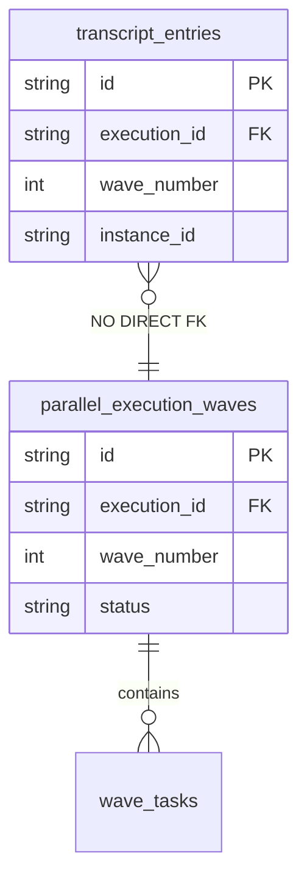
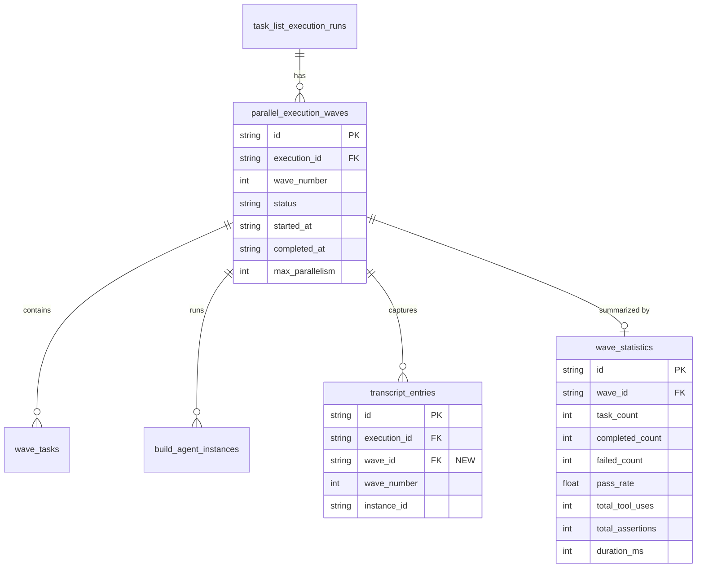
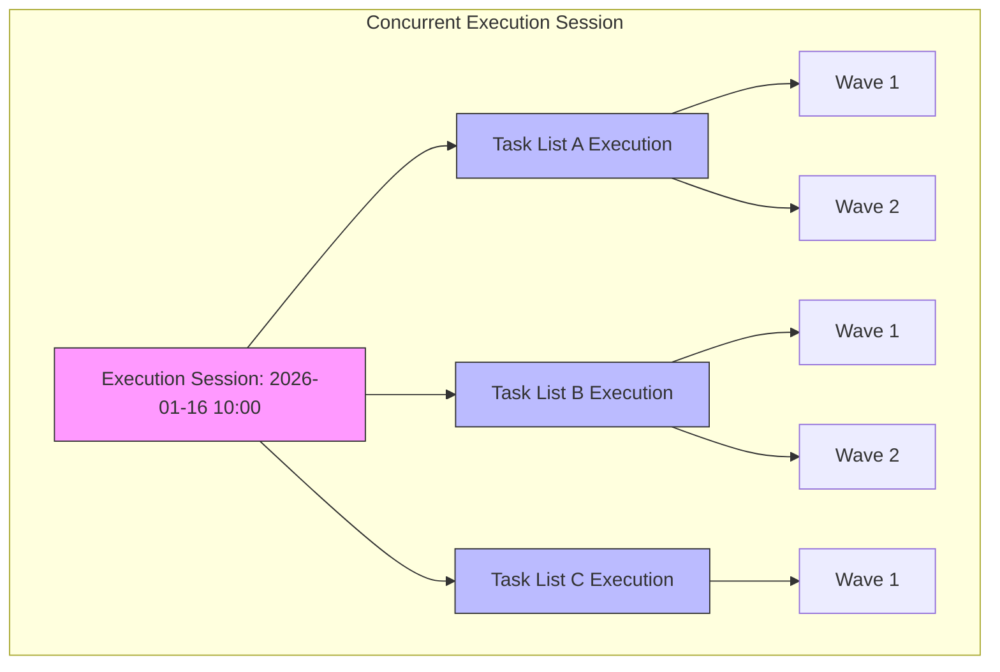

# Parallel Execution Observability Extensions

> **Navigation:** [Documentation Index](../../DOCUMENTATION-INDEX.md) > [Observability Spec](../SPEC.md) > [Data Model](./README.md) > Parallel Execution Extensions
> **Location:** `docs/specs/observability/data-model/PARALLEL-EXECUTION-EXTENSIONS.md`
> **Purpose:** Enhanced data model for tracking parallel task execution and wave visualization
> **Status:** Extension to core observability schema

---

## Table of Contents

1. [Overview](#1-overview)
2. [Gap Analysis](#2-gap-analysis)
3. [Wave Execution Enhancements](#3-wave-execution-enhancements)
4. [Concurrent Task List Tracking](#4-concurrent-task-list-tracking)
5. [Dashboard Visualization Support](#5-dashboard-visualization-support)
6. [Migration Extensions](#6-migration-extensions)
7. [Query Patterns](#7-query-patterns)

---

## 1. Overview

The base observability data model captures `wave_number` and `instance_id` in transcript entries, but lacks:

- Direct linkage to wave metadata tables
- Aggregated wave statistics for dashboard visualization
- Efficient indexes for wave-based queries
- Support for tracking multiple concurrent task list executions

This document extends the observability schema to prominently surface parallel execution.

### Design Goals

| Goal                  | Implementation                              |
| --------------------- | ------------------------------------------- |
| **Wave visibility**   | One-click access to all activity in a wave  |
| **Parallel progress** | Real-time visualization of concurrent tasks |
| **Performance**       | Sub-100ms queries for wave statistics       |
| **Cross-linking**     | Navigate from wave → tasks → transcripts    |

---

## 2. Gap Analysis

### 2.1 Current State



**Problem:** `transcript_entries.wave_number` is just an integer - no FK constraint or efficient join path to wave metadata.

### 2.2 Identified Gaps

| Gap                                                            | Impact                                                 | Priority |
| -------------------------------------------------------------- | ------------------------------------------------------ | -------- |
| No FK from `transcript_entries` to `parallel_execution_waves`  | Cannot efficiently join transcripts with wave metadata | P1       |
| No aggregated wave statistics                                  | Dashboard must compute stats per-request               | P1       |
| Missing wave-based indexes on `tool_uses`, `assertion_results` | Slow wave-filtered queries                             | P1       |
| No "execution session" concept                                 | Cannot track multiple concurrent task list executions  | P2       |
| No wave-level pass rate caching                                | Repeated expensive aggregations                        | P2       |

---

## 3. Wave Execution Enhancements

### 3.1 Enhanced Entity Relationship



### 3.2 New Table: `wave_statistics`

Pre-computed statistics per wave for efficient dashboard rendering:

```sql
-- Wave-level aggregated statistics (materialized for performance)
CREATE TABLE IF NOT EXISTS wave_statistics (
    id TEXT PRIMARY KEY,

    -- Foreign keys
    wave_id TEXT NOT NULL UNIQUE,          -- FK to parallel_execution_waves
    execution_id TEXT NOT NULL,            -- FK to task_list_execution_runs

    -- Task counts
    task_count INTEGER NOT NULL DEFAULT 0,
    completed_count INTEGER NOT NULL DEFAULT 0,
    failed_count INTEGER NOT NULL DEFAULT 0,
    skipped_count INTEGER NOT NULL DEFAULT 0,

    -- Pass rate
    pass_rate REAL,                        -- 0.0 to 1.0

    -- Observability counts
    transcript_entry_count INTEGER NOT NULL DEFAULT 0,
    tool_use_count INTEGER NOT NULL DEFAULT 0,
    tool_error_count INTEGER NOT NULL DEFAULT 0,
    tool_blocked_count INTEGER NOT NULL DEFAULT 0,
    assertion_count INTEGER NOT NULL DEFAULT 0,
    assertion_pass_count INTEGER NOT NULL DEFAULT 0,
    assertion_fail_count INTEGER NOT NULL DEFAULT 0,
    skill_trace_count INTEGER NOT NULL DEFAULT 0,

    -- Timing
    started_at TEXT,
    completed_at TEXT,
    duration_ms INTEGER,

    -- Update tracking
    updated_at TEXT DEFAULT (datetime('now')),

    FOREIGN KEY (wave_id) REFERENCES parallel_execution_waves(id),
    FOREIGN KEY (execution_id) REFERENCES task_list_execution_runs(id)
);

-- Index for execution-level queries
CREATE INDEX IF NOT EXISTS idx_wave_stats_execution
    ON wave_statistics(execution_id);

-- Index for timeline queries
CREATE INDEX IF NOT EXISTS idx_wave_stats_timing
    ON wave_statistics(started_at, completed_at);
```

### 3.3 Schema Modifications

#### Add wave_id FK to transcript_entries

```sql
-- Add wave_id column (nullable for backward compatibility)
ALTER TABLE transcript_entries
ADD COLUMN wave_id TEXT REFERENCES parallel_execution_waves(id);

-- Index for wave-based queries
CREATE INDEX IF NOT EXISTS idx_transcript_wave_id
    ON transcript_entries(wave_id);
```

#### Add wave_id FK to tool_uses

```sql
-- Add wave_id column
ALTER TABLE tool_uses
ADD COLUMN wave_id TEXT REFERENCES parallel_execution_waves(id);

-- Index for wave-based queries
CREATE INDEX IF NOT EXISTS idx_tool_use_wave_id
    ON tool_uses(wave_id);
```

#### Add wave_id FK to assertion_results

```sql
-- Add wave_id column
ALTER TABLE assertion_results
ADD COLUMN wave_id TEXT REFERENCES parallel_execution_waves(id);

-- Index for wave-based queries
CREATE INDEX IF NOT EXISTS idx_assertion_wave_id
    ON assertion_results(wave_id);
```

---

## 4. Concurrent Task List Tracking

### 4.1 The Problem

Multiple task lists can execute simultaneously. We need to:

- Track which task lists are running concurrently
- Visualize their relative progress
- Identify resource contention

### 4.2 Execution Session Concept



### 4.3 New Table: `concurrent_execution_sessions`

```sql
-- Tracks periods when multiple task lists execute concurrently
CREATE TABLE IF NOT EXISTS concurrent_execution_sessions (
    id TEXT PRIMARY KEY,

    -- Session timing
    started_at TEXT NOT NULL,
    completed_at TEXT,
    status TEXT NOT NULL DEFAULT 'active',  -- 'active', 'completed', 'failed'

    -- Aggregated stats
    execution_count INTEGER NOT NULL DEFAULT 0,
    total_wave_count INTEGER NOT NULL DEFAULT 0,
    total_task_count INTEGER NOT NULL DEFAULT 0,
    total_agent_count INTEGER NOT NULL DEFAULT 0,

    -- Peak parallelism
    peak_concurrent_agents INTEGER DEFAULT 0,
    peak_concurrent_tasks INTEGER DEFAULT 0,

    -- Metadata
    created_at TEXT DEFAULT (datetime('now'))
);

-- Link executions to sessions
ALTER TABLE task_list_execution_runs
ADD COLUMN session_id TEXT REFERENCES concurrent_execution_sessions(id);

CREATE INDEX IF NOT EXISTS idx_execution_session
    ON task_list_execution_runs(session_id);
```

---

## 5. Dashboard Visualization Support

### 5.1 Wave Timeline View

```mermaid
gantt
    title Wave Execution Timeline
    dateFormat  HH:mm:ss
    axisFormat %H:%M:%S

    section Task List A
    Wave 1 (3 tasks)    :a1, 10:00:00, 2m
    Wave 2 (2 tasks)    :a2, after a1, 3m
    Wave 3 (1 task)     :a3, after a2, 1m

    section Task List B
    Wave 1 (4 tasks)    :b1, 10:00:30, 4m
    Wave 2 (1 task)     :b2, after b1, 2m
```



**Data Required:**

- Wave start/end times from `parallel_execution_waves`
- Task count per wave from `wave_statistics`
- Execution grouping from `concurrent_execution_sessions`

### 5.2 Parallel Agents View

```
┌─────────────────────────────────────────────────────────────────────────────┐
│                    PARALLEL AGENTS - Session: 2026-01-16 10:00              │
├─────────────────────────────────────────────────────────────────────────────┤
│                                                                              │
│  TASK LIST A (Wave 2)              TASK LIST B (Wave 1)                     │
│  ├─ ba-001: Task TU-IDEA-FEA-042   ├─ ba-003: Task TU-INCU-BUG-007        │
│  │  └─ 🟢 Running (45s)            │  └─ 🟢 Running (23s)                  │
│  ├─ ba-002: Task TU-IDEA-FEA-043   ├─ ba-004: Task TU-INCU-BUG-008        │
│  │  └─ ✅ Completed (1m 12s)       │  └─ 🟢 Running (23s)                  │
│  └─────────────────────────────    ├─ ba-005: Task TU-INCU-ENH-001        │
│                                    │  └─ 🟢 Running (23s)                  │
│                                    ├─ ba-006: Task TU-INCU-ENH-002        │
│                                    │  └─ ⏳ Queued                         │
│                                    └─────────────────────────────          │
│                                                                              │
│  Peak Parallelism: 5 agents │ Total Tasks: 18 │ Completed: 7 │ Failed: 0   │
│                                                                              │
└──────────────────────────────────────────────────────────────────────────────┘
```

### 5.3 Required Views

#### Wave Progress Summary View

```sql
CREATE VIEW IF NOT EXISTS v_wave_progress AS
SELECT
    pew.id as wave_id,
    pew.execution_id,
    pew.wave_number,
    pew.status,
    pew.started_at,
    pew.completed_at,
    ws.task_count,
    ws.completed_count,
    ws.failed_count,
    ws.pass_rate,
    ws.tool_use_count,
    ws.assertion_count,
    ws.assertion_pass_count,
    ws.duration_ms,
    tl.title as task_list_title,
    tler.status as execution_status
FROM parallel_execution_waves pew
LEFT JOIN wave_statistics ws ON ws.wave_id = pew.id
LEFT JOIN task_list_execution_runs tler ON tler.id = pew.execution_id
LEFT JOIN task_lists_v2 tl ON tl.id = tler.task_list_id
ORDER BY pew.started_at DESC;
```

#### Active Agents View

```sql
CREATE VIEW IF NOT EXISTS v_active_agents AS
SELECT
    bai.id as agent_id,
    bai.instance_id,
    bai.status,
    bai.started_at,
    bai.last_heartbeat,
    t.id as task_id,
    t.display_id,
    t.title as task_title,
    pew.wave_number,
    pew.id as wave_id,
    tler.id as execution_id,
    tl.title as task_list_title,
    ROUND((julianday('now') - julianday(bai.started_at)) * 86400) as running_seconds
FROM build_agent_instances bai
JOIN tasks t ON t.id = bai.task_id
JOIN parallel_execution_waves pew ON pew.id = bai.wave_id
JOIN task_list_execution_runs tler ON tler.id = pew.execution_id
LEFT JOIN task_lists_v2 tl ON tl.id = tler.task_list_id
WHERE bai.status = 'running'
ORDER BY bai.started_at ASC;
```

---

## 6. Migration Extensions

### 6.1 Migration 088: Parallel Execution Observability

**File:** `database/migrations/088_parallel_execution_observability.sql`

```sql
-- =============================================================================
-- Migration: 088_parallel_execution_observability.sql
-- Purpose: Add parallel execution tracking to observability tables
-- Created: 2026-01-16
-- =============================================================================

-- -----------------------------------------------------------------------------
-- Table: wave_statistics
-- -----------------------------------------------------------------------------
CREATE TABLE IF NOT EXISTS wave_statistics (
    id TEXT PRIMARY KEY,
    wave_id TEXT NOT NULL UNIQUE,
    execution_id TEXT NOT NULL,
    task_count INTEGER NOT NULL DEFAULT 0,
    completed_count INTEGER NOT NULL DEFAULT 0,
    failed_count INTEGER NOT NULL DEFAULT 0,
    skipped_count INTEGER NOT NULL DEFAULT 0,
    pass_rate REAL,
    transcript_entry_count INTEGER NOT NULL DEFAULT 0,
    tool_use_count INTEGER NOT NULL DEFAULT 0,
    tool_error_count INTEGER NOT NULL DEFAULT 0,
    tool_blocked_count INTEGER NOT NULL DEFAULT 0,
    assertion_count INTEGER NOT NULL DEFAULT 0,
    assertion_pass_count INTEGER NOT NULL DEFAULT 0,
    assertion_fail_count INTEGER NOT NULL DEFAULT 0,
    skill_trace_count INTEGER NOT NULL DEFAULT 0,
    started_at TEXT,
    completed_at TEXT,
    duration_ms INTEGER,
    updated_at TEXT DEFAULT (datetime('now')),
    FOREIGN KEY (wave_id) REFERENCES parallel_execution_waves(id),
    FOREIGN KEY (execution_id) REFERENCES task_list_execution_runs(id)
);

CREATE INDEX IF NOT EXISTS idx_wave_stats_execution ON wave_statistics(execution_id);
CREATE INDEX IF NOT EXISTS idx_wave_stats_timing ON wave_statistics(started_at);


-- -----------------------------------------------------------------------------
-- Table: concurrent_execution_sessions
-- -----------------------------------------------------------------------------
CREATE TABLE IF NOT EXISTS concurrent_execution_sessions (
    id TEXT PRIMARY KEY,
    started_at TEXT NOT NULL,
    completed_at TEXT,
    status TEXT NOT NULL DEFAULT 'active',
    execution_count INTEGER NOT NULL DEFAULT 0,
    total_wave_count INTEGER NOT NULL DEFAULT 0,
    total_task_count INTEGER NOT NULL DEFAULT 0,
    total_agent_count INTEGER NOT NULL DEFAULT 0,
    peak_concurrent_agents INTEGER DEFAULT 0,
    peak_concurrent_tasks INTEGER DEFAULT 0,
    created_at TEXT DEFAULT (datetime('now'))
);


-- -----------------------------------------------------------------------------
-- Schema modifications: Add wave_id FKs
-- -----------------------------------------------------------------------------

-- transcript_entries
ALTER TABLE transcript_entries ADD COLUMN wave_id TEXT REFERENCES parallel_execution_waves(id);
CREATE INDEX IF NOT EXISTS idx_transcript_wave_id ON transcript_entries(wave_id);

-- tool_uses
ALTER TABLE tool_uses ADD COLUMN wave_id TEXT REFERENCES parallel_execution_waves(id);
CREATE INDEX IF NOT EXISTS idx_tool_use_wave_id ON tool_uses(wave_id);

-- assertion_results
ALTER TABLE assertion_results ADD COLUMN wave_id TEXT REFERENCES parallel_execution_waves(id);
CREATE INDEX IF NOT EXISTS idx_assertion_wave_id ON assertion_results(wave_id);

-- task_list_execution_runs
ALTER TABLE task_list_execution_runs ADD COLUMN session_id TEXT REFERENCES concurrent_execution_sessions(id);
CREATE INDEX IF NOT EXISTS idx_execution_session ON task_list_execution_runs(session_id);


-- -----------------------------------------------------------------------------
-- Views
-- -----------------------------------------------------------------------------

CREATE VIEW IF NOT EXISTS v_wave_progress AS
SELECT
    pew.id as wave_id,
    pew.execution_id,
    pew.wave_number,
    pew.status,
    pew.started_at,
    pew.completed_at,
    COALESCE(ws.task_count, 0) as task_count,
    COALESCE(ws.completed_count, 0) as completed_count,
    COALESCE(ws.failed_count, 0) as failed_count,
    ws.pass_rate,
    COALESCE(ws.tool_use_count, 0) as tool_use_count,
    COALESCE(ws.assertion_count, 0) as assertion_count,
    COALESCE(ws.assertion_pass_count, 0) as assertion_pass_count,
    ws.duration_ms
FROM parallel_execution_waves pew
LEFT JOIN wave_statistics ws ON ws.wave_id = pew.id
ORDER BY pew.started_at DESC;

CREATE VIEW IF NOT EXISTS v_active_agents AS
SELECT
    bai.id as agent_id,
    bai.instance_id,
    bai.status,
    bai.started_at,
    bai.last_heartbeat,
    t.id as task_id,
    t.display_id,
    t.title as task_title,
    pew.wave_number,
    pew.id as wave_id,
    pew.execution_id
FROM build_agent_instances bai
JOIN tasks t ON t.id = bai.task_id
LEFT JOIN parallel_execution_waves pew ON pew.id = bai.wave_id
WHERE bai.status = 'running'
ORDER BY bai.started_at ASC;
```

---

## 7. Query Patterns

### 7.1 Get Wave Progress for Execution

```sql
SELECT * FROM v_wave_progress
WHERE execution_id = ?
ORDER BY wave_number;
```

### 7.2 Get Active Agents with Context

```sql
SELECT * FROM v_active_agents
WHERE execution_id = ?;
```

### 7.3 Get Transcript Entries by Wave

```sql
SELECT * FROM transcript_entries
WHERE wave_id = ?
ORDER BY sequence;
```

### 7.4 Get Tool Uses by Wave with Errors

```sql
SELECT * FROM tool_uses
WHERE wave_id = ?
  AND is_error = 1
ORDER BY start_time;
```

### 7.5 Get Wave Timeline for Dashboard

```sql
SELECT
    pew.wave_number,
    pew.started_at,
    pew.completed_at,
    ws.task_count,
    ws.completed_count,
    ws.pass_rate,
    (SELECT COUNT(*) FROM build_agent_instances WHERE wave_id = pew.id) as agent_count
FROM parallel_execution_waves pew
LEFT JOIN wave_statistics ws ON ws.wave_id = pew.id
WHERE pew.execution_id = ?
ORDER BY pew.wave_number;
```

### 7.6 Get Concurrent Execution Summary

```sql
SELECT
    ces.id as session_id,
    ces.started_at,
    ces.peak_concurrent_agents,
    GROUP_CONCAT(tl.title, ', ') as task_lists,
    COUNT(DISTINCT tler.id) as execution_count,
    SUM(ws.task_count) as total_tasks
FROM concurrent_execution_sessions ces
JOIN task_list_execution_runs tler ON tler.session_id = ces.id
JOIN task_lists_v2 tl ON tl.id = tler.task_list_id
LEFT JOIN parallel_execution_waves pew ON pew.execution_id = tler.id
LEFT JOIN wave_statistics ws ON ws.wave_id = pew.id
WHERE ces.id = ?
GROUP BY ces.id;
```

---

## Summary

| Enhancement                           | Purpose                             | Tables/Views Affected                                  |
| ------------------------------------- | ----------------------------------- | ------------------------------------------------------ |
| `wave_statistics` table               | Pre-computed wave metrics           | New table                                              |
| `concurrent_execution_sessions` table | Track parallel task list executions | New table                                              |
| `wave_id` FK on observability tables  | Direct linkage to wave metadata     | `transcript_entries`, `tool_uses`, `assertion_results` |
| `v_wave_progress` view                | Dashboard wave timeline             | New view                                               |
| `v_active_agents` view                | Dashboard agent status              | New view                                               |
| Wave-based indexes                    | Efficient filtering                 | All observability tables                               |

These extensions ensure that parallel task execution is prominently surfaced in the observability system, enabling:

1. **Wave-level dashboards** - See progress per wave
2. **Concurrent execution tracking** - Monitor multiple task lists running simultaneously
3. **Agent status visualization** - Real-time view of all active agents
4. **Efficient queries** - Sub-100ms response times for dashboard data

---

## Related Documents

| Document                                                                                               | Description                   |
| ------------------------------------------------------------------------------------------------------ | ----------------------------- |
| [Data Model README](./README.md)                                                                       | Core data model documentation |
| [Database Schema](../appendices/DATABASE.md)                                                           | Full SQL schema               |
| [PARALLEL-TASK-EXECUTION-IMPLEMENTATION-PLAN.md](../../PARALLEL-TASK-EXECUTION-IMPLEMENTATION-PLAN.md) | Parallel execution plan       |

---

_Migration file: `database/migrations/088_parallel_execution_observability.sql`_
