# Observability Data Model

> **Navigation:** [Documentation Index](../../DOCUMENTATION-INDEX.md) > [Observability Spec](../SPEC.md) > Data Model
> **Location:** `docs/specs/observability/data-model/README.md`
> **Purpose:** Comprehensive data model documentation with ER diagrams for the observability system
> **Audience:** Developers implementing the database layer and understanding data relationships

---

## Table of Contents

1. [Overview](#1-overview)
2. [Complete Entity Relationship Diagram](#2-complete-entity-relationship-diagram)
3. [Core Entities](#3-core-entities)
4. [Execution Context Model](#4-execution-context-model)
5. [Tool Use Model](#5-tool-use-model)
6. [Skill Trace Model](#6-skill-trace-model)
7. [Assertion Model](#7-assertion-model)
8. [Message Bus Log Model](#8-message-bus-log-model)
9. [Parallel Execution Model](#9-parallel-execution-model)
10. [Cross-Reference Model](#10-cross-reference-model)
11. [Data Flow Diagrams](#11-data-flow-diagrams)

---

## 1. Overview

The observability data model captures events from **any source** in the system - agents, Telegram, scripts, webhooks, and user interactions. It's designed for:

- **Source-Agnostic**: Any event source can emit entries with appropriate context
- **Traceability**: Every action can be traced back to its context
- **Queryability**: Efficient filtering by source, execution, task, time, status
- **Cross-referencing**: Entities link to each other for context
- **Real-time updates**: Support for WebSocket streaming across all sources

### Key Design Principles

| Principle                  | Implementation                                         |
| -------------------------- | ------------------------------------------------------ |
| **Source-aware**           | Every entry declares its source (agent, telegram, etc) |
| **Single source of truth** | All data flows through SQLite                          |
| **Chronological ordering** | `sequence` numbers within execution/session            |
| **Flexible context**       | execution_id optional; source-specific context fields  |
| **Evidence linking**       | Assertions link to supporting data                     |
| **File-based backup**      | JSONL files alongside SQLite                           |

### Event Source Types

| Source     | Description                        | Context Fields                            |
| ---------- | ---------------------------------- | ----------------------------------------- |
| `agent`    | Build, Spec, Validation agents     | execution_id, task_id, wave_number        |
| `telegram` | Telegram bot messages and commands | chat_id, user_id, session_id              |
| `script`   | CLI scripts, cron jobs             | script_name, execution_id (if applicable) |
| `webhook`  | External webhooks, API calls       | webhook_url, correlation_id               |
| `user`     | User interactions in UI            | user_id, session_id                       |
| `system`   | Server lifecycle events            | correlation_id                            |
| `ideation` | Ideation session events            | session_id, user_id                       |
| `custom`   | Extensible for future sources      | Any relevant fields in details JSON       |

---

## 2. Complete Entity Relationship Diagram

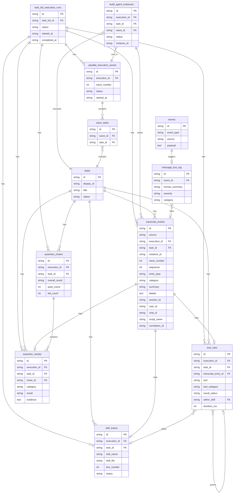
```mermaid
erDiagram
    %% Execution Context
    task_list_execution_runs ||--o{ transcript_entries : "has"
    task_list_execution_runs ||--o{ tool_uses : "has"
    task_list_execution_runs ||--o{ skill_traces : "has"
    task_list_execution_runs ||--o{ assertion_results : "has"
    task_list_execution_runs ||--o{ assertion_chains : "has"
    task_list_execution_runs ||--o{ parallel_execution_waves : "has"

    %% Build Agent Instances
    build_agent_instances ||--o{ transcript_entries : "writes"
    build_agent_instances }o--|| parallel_execution_waves : "runs in"
    build_agent_instances }o--|| tasks : "executes"

    %% Tasks
    tasks ||--o{ transcript_entries : "has"
    tasks ||--o{ tool_uses : "has"
    tasks ||--o{ skill_traces : "has"
    tasks ||--o{ assertion_results : "has"
    tasks ||--o{ assertion_chains : "has"

    %% Transcript relationships
    transcript_entries ||--o| tool_uses : "logs"
    transcript_entries ||--o| skill_traces : "logs"
    transcript_entries ||--o| assertion_results : "logs"

    %% Tool Use relationships
    tool_uses }o--o| skill_traces : "within"
    tool_uses }o--o| tool_uses : "parent"

    %% Assertion relationships
    assertion_chains ||--o{ assertion_results : "contains"

    %% Message Bus
    events ||--o| message_bus_log : "triggers"
    message_bus_log }o--o| transcript_entries : "links"

    %% Wave relationships
    parallel_execution_waves ||--o{ wave_tasks : "contains"
    wave_tasks }o--|| tasks : "includes"

    %% Entity definitions
    task_list_execution_runs {
        string id PK
        string task_list_id FK
        string status
        string started_at
        string completed_at
    }

    build_agent_instances {
        string id PK
        string execution_id FK
        string task_id FK
        string wave_id FK
        string status
        string instance_id
    }

    parallel_execution_waves {
        string id PK
        string execution_id FK
        int wave_number
        string status
        string started_at
    }

    wave_tasks {
        string id PK
        string wave_id FK
        string task_id FK
    }

    tasks {
        string id PK
        string display_id
        string title
        string status
    }

    transcript_entries {
        string id PK
        string source
        string execution_id FK
        string task_id FK
        string instance_id
        int wave_number
        int sequence
        string entry_type
        string category
        string summary
        text details
        string session_id
        string user_id
        string chat_id
        string script_name
        string correlation_id
    }

    tool_uses {
        string id PK
        string execution_id FK
        string task_id FK
        string transcript_entry_id FK
        string tool
        string tool_category
        string result_status
        string within_skill FK
        int duration_ms
    }

    skill_traces {
        string id PK
        string execution_id FK
        string task_id FK
        string skill_name
        string skill_file
        int line_number
        string status
    }

    assertion_results {
        string id PK
        string execution_id FK
        string task_id FK
        string chain_id FK
        string category
        string result
        text evidence
    }

    assertion_chains {
        string id PK
        string execution_id FK
        string task_id FK
        string overall_result
        int pass_count
        int fail_count
    }

    message_bus_log {
        string id PK
        string event_id FK
        string human_summary
        string severity
        string category
    }

    events {
        string id PK
        string event_type
        string source
        text payload
    }
```

---

## 3. Core Entities

### 3.1 Entity Summary

| Entity               | Purpose                  | Primary Key | Key Foreign Keys                      |
| -------------------- | ------------------------ | ----------- | ------------------------------------- |
| `transcript_entries` | Unified execution log    | `id` (UUID) | `execution_id`, `task_id`             |
| `tool_uses`          | Tool invocation records  | `id` (UUID) | `execution_id`, `transcript_entry_id` |
| `skill_traces`       | Skill invocation records | `id` (UUID) | `execution_id`, `task_id`             |
| `assertion_results`  | Test assertion records   | `id` (UUID) | `execution_id`, `task_id`, `chain_id` |
| `assertion_chains`   | Ordered assertion groups | `id` (UUID) | `execution_id`, `task_id`             |
| `message_bus_log`    | Human-readable events    | `id` (UUID) | `event_id`                            |

### 3.2 Core Entity Relationships

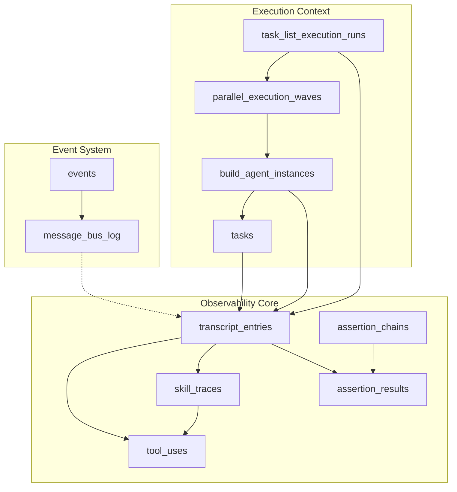
```mermaid
graph TD
    subgraph "Execution Context"
        EXEC[task_list_execution_runs]
        WAVE[parallel_execution_waves]
        AGENT[build_agent_instances]
        TASK[tasks]
    end

    subgraph "Observability Core"
        TRANS[transcript_entries]
        TOOL[tool_uses]
        SKILL[skill_traces]
        ASSERT[assertion_results]
        CHAIN[assertion_chains]
    end

    subgraph "Event System"
        EVENT[events]
        MBUS[message_bus_log]
    end

    EXEC --> WAVE
    WAVE --> AGENT
    AGENT --> TASK

    EXEC --> TRANS
    TASK --> TRANS
    AGENT --> TRANS

    TRANS --> TOOL
    TRANS --> SKILL
    TRANS --> ASSERT

    SKILL --> TOOL
    CHAIN --> ASSERT

    EVENT --> MBUS
    MBUS -.-> TRANS
```

---

## 4. Event Context Model

### 4.1 Context by Source Type

Different event sources use different context fields. The system is **flexible** - only relevant fields are populated:

```mermaid
graph TD
    subgraph "Agent Context (Task Execution)"
        TL[Task List] --> EXEC[Execution Run]
        EXEC --> W1[Wave 1]
        W1 --> A1[Agent 1]
        A1 --> T1[Task A]
    end

    subgraph "Telegram Context"
        CHAT[Chat ID] --> TUSER[Telegram User]
        TUSER --> MSG[Message/Command]
    end

    subgraph "Script Context"
        SCRIPT[Script Name] --> SRUN[Script Run]
    end

    subgraph "User Context"
        USER[User ID] --> SESSION[Session]
        SESSION --> ACTION[UI Action]
    end

    style TL fill:#f9f,stroke:#333
    style EXEC fill:#bbf,stroke:#333
    style CHAT fill:#bfb,stroke:#333
    style SCRIPT fill:#fbf,stroke:#333
    style USER fill:#ffb,stroke:#333
```

### 4.2 Flexible Context Fields

The context model is **source-aware** - each entry declares its source and uses appropriate context:

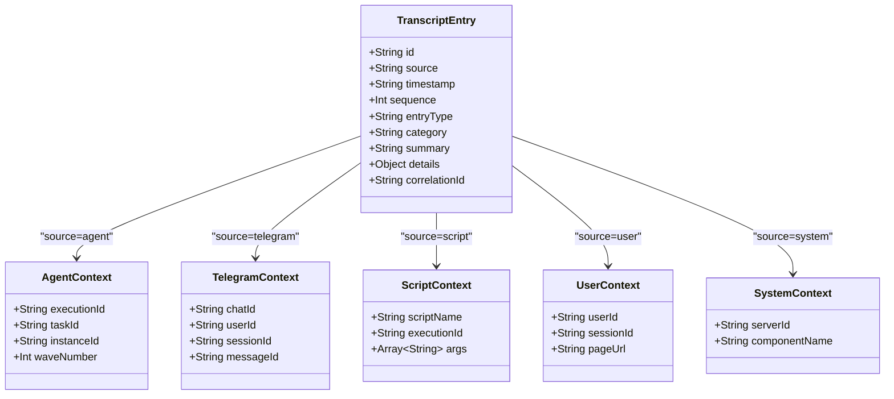
```mermaid
classDiagram
    class TranscriptEntry {
        +String id
        +String source
        +String timestamp
        +Int sequence
        +String entryType
        +String category
        +String summary
        +Object details
        +String correlationId
    }

    class AgentContext {
        +String executionId
        +String taskId
        +String instanceId
        +Int waveNumber
    }

    class TelegramContext {
        +String chatId
        +String userId
        +String sessionId
        +String messageId
    }

    class ScriptContext {
        +String scriptName
        +String executionId
        +Array~String~ args
    }

    class UserContext {
        +String userId
        +String sessionId
        +String pageUrl
    }

    class SystemContext {
        +String serverId
        +String componentName
    }

    TranscriptEntry --> AgentContext : "source=agent"
    TranscriptEntry --> TelegramContext : "source=telegram"
    TranscriptEntry --> ScriptContext : "source=script"
    TranscriptEntry --> UserContext : "source=user"
    TranscriptEntry --> SystemContext : "source=system"
```

### 4.3 Context Field Requirements by Source

| Field          | agent    | telegram | script   | webhook  | user     | system   | ideation |
| -------------- | -------- | -------- | -------- | -------- | -------- | -------- | -------- |
| source         | Required | Required | Required | Required | Required | Required | Required |
| timestamp      | Required | Required | Required | Required | Required | Required | Required |
| sequence       | Required | Optional | Optional | Optional | Optional | Optional | Optional |
| execution_id   | Required | -        | Optional | -        | -        | -        | -        |
| task_id        | Optional | -        | Optional | -        | -        | -        | -        |
| instance_id    | Required | -        | -        | -        | -        | -        | -        |
| wave_number    | Optional | -        | -        | -        | -        | -        | -        |
| chat_id        | -        | Required | -        | -        | -        | -        | -        |
| user_id        | -        | Optional | -        | -        | Required | -        | Optional |
| session_id     | -        | Optional | -        | -        | Optional | -        | Required |
| script_name    | -        | -        | Required | -        | -        | -        | -        |
| webhook_url    | -        | -        | -        | Optional | -        | -        | -        |
| correlation_id | Optional | Optional | Optional | Optional | Optional | Optional | Optional |

---

## 5. Tool Use Model

### 5.1 Tool Use Entity Detail

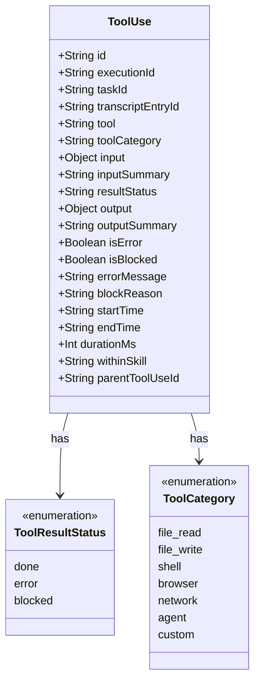
```mermaid
classDiagram
    class ToolUse {
        +String id
        +String executionId
        +String taskId
        +String transcriptEntryId
        +String tool
        +String toolCategory
        +Object input
        +String inputSummary
        +String resultStatus
        +Object output
        +String outputSummary
        +Boolean isError
        +Boolean isBlocked
        +String errorMessage
        +String blockReason
        +String startTime
        +String endTime
        +Int durationMs
        +String withinSkill
        +String parentToolUseId
    }

    class ToolResultStatus {
        <<enumeration>>
        done
        error
        blocked
    }

    class ToolCategory {
        <<enumeration>>
        file_read
        file_write
        shell
        browser
        network
        agent
        custom
    }

    ToolUse --> ToolResultStatus : has
    ToolUse --> ToolCategory : has
```

### 5.2 Tool Use Nesting

Tools can be nested within skills and can have parent-child relationships:

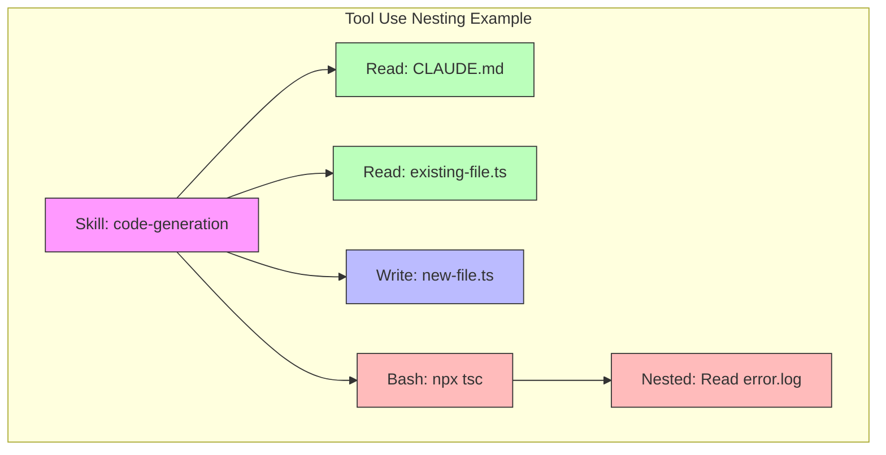
```mermaid
graph TD
    subgraph "Tool Use Nesting Example"
        SKILL[Skill: code-generation]

        SKILL --> TOOL1[Read: CLAUDE.md]
        SKILL --> TOOL2[Read: existing-file.ts]
        SKILL --> TOOL3[Write: new-file.ts]
        SKILL --> TOOL4[Bash: npx tsc]

        TOOL4 --> TOOL4A[Nested: Read error.log]
    end

    style SKILL fill:#f9f,stroke:#333
    style TOOL1 fill:#bfb,stroke:#333
    style TOOL2 fill:#bfb,stroke:#333
    style TOOL3 fill:#bbf,stroke:#333
    style TOOL4 fill:#fbb,stroke:#333
    style TOOL4A fill:#fbb,stroke:#333
```

---

## 6. Skill Trace Model

### 6.1 Skill Trace Entity Detail

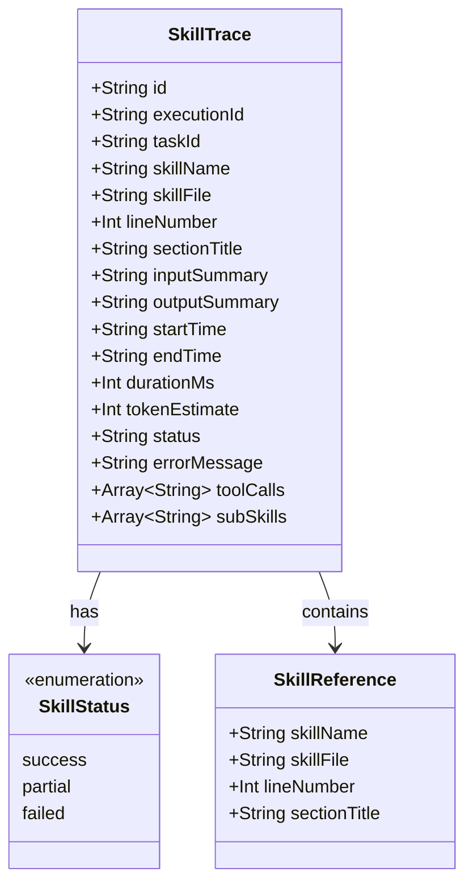
```mermaid
classDiagram
    class SkillTrace {
        +String id
        +String executionId
        +String taskId
        +String skillName
        +String skillFile
        +Int lineNumber
        +String sectionTitle
        +String inputSummary
        +String outputSummary
        +String startTime
        +String endTime
        +Int durationMs
        +Int tokenEstimate
        +String status
        +String errorMessage
        +Array~String~ toolCalls
        +Array~String~ subSkills
    }

    class SkillStatus {
        <<enumeration>>
        success
        partial
        failed
    }

    class SkillReference {
        +String skillName
        +String skillFile
        +Int lineNumber
        +String sectionTitle
    }

    SkillTrace --> SkillStatus : has
    SkillTrace --> SkillReference : contains
```

### 6.2 Skill Trace Relationships

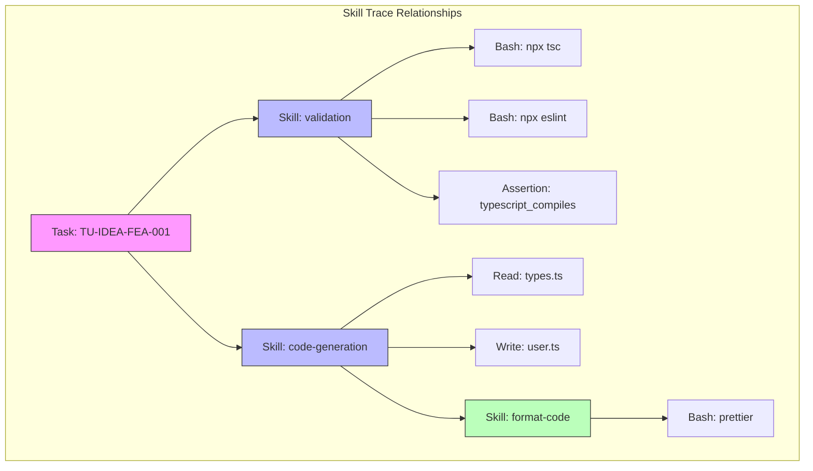
```mermaid
graph TD
    subgraph "Skill Trace Relationships"
        TASK[Task: TU-IDEA-FEA-001]

        TASK --> SKILL1[Skill: validation]
        TASK --> SKILL2[Skill: code-generation]

        SKILL1 --> TOOL1[Bash: npx tsc]
        SKILL1 --> TOOL2[Bash: npx eslint]
        SKILL1 --> ASSERT1[Assertion: typescript_compiles]

        SKILL2 --> TOOL3[Read: types.ts]
        SKILL2 --> TOOL4[Write: user.ts]
        SKILL2 --> SUBSKILL[Skill: format-code]

        SUBSKILL --> TOOL5[Bash: prettier]
    end

    style TASK fill:#f9f,stroke:#333
    style SKILL1 fill:#bbf,stroke:#333
    style SKILL2 fill:#bbf,stroke:#333
    style SUBSKILL fill:#bfb,stroke:#333
```

---

## 7. Assertion Model

### 7.1 Assertion Entities

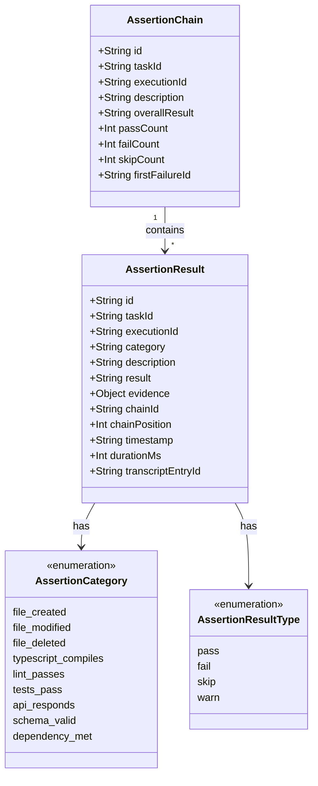
```mermaid
classDiagram
    class AssertionResult {
        +String id
        +String taskId
        +String executionId
        +String category
        +String description
        +String result
        +Object evidence
        +String chainId
        +Int chainPosition
        +String timestamp
        +Int durationMs
        +String transcriptEntryId
    }

    class AssertionChain {
        +String id
        +String taskId
        +String executionId
        +String description
        +String overallResult
        +Int passCount
        +Int failCount
        +Int skipCount
        +String firstFailureId
    }

    class AssertionCategory {
        <<enumeration>>
        file_created
        file_modified
        file_deleted
        typescript_compiles
        lint_passes
        tests_pass
        api_responds
        schema_valid
        dependency_met
    }

    class AssertionResultType {
        <<enumeration>>
        pass
        fail
        skip
        warn
    }

    AssertionChain "1" --> "*" AssertionResult : contains
    AssertionResult --> AssertionCategory : has
    AssertionResult --> AssertionResultType : has
```

### 7.2 Assertion Evidence Structure

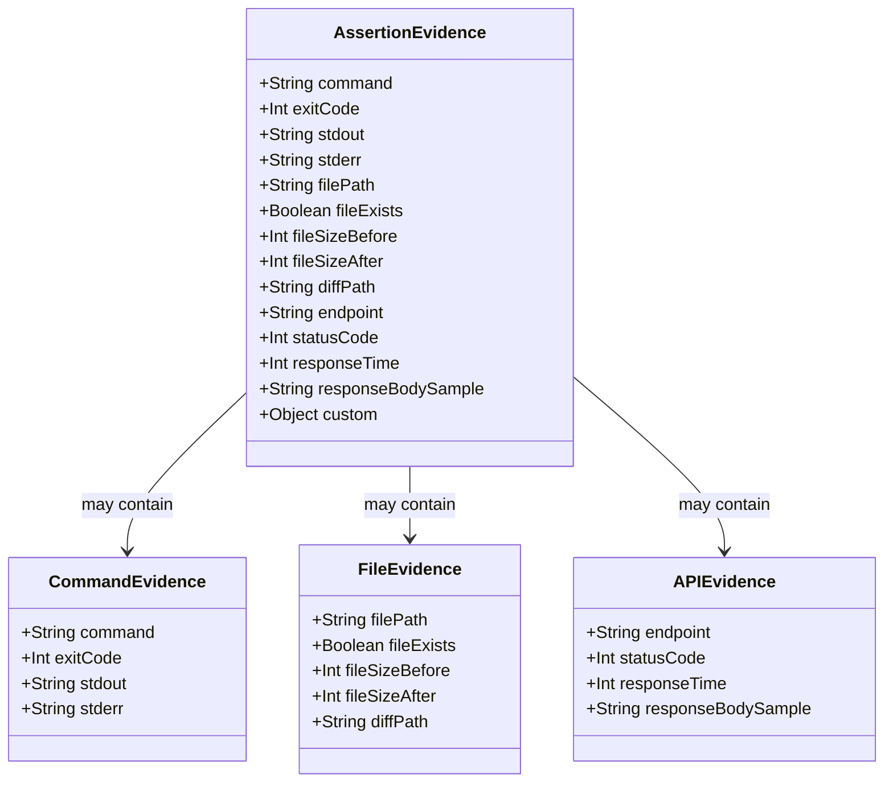
```mermaid
classDiagram
    class AssertionEvidence {
        +String command
        +Int exitCode
        +String stdout
        +String stderr
        +String filePath
        +Boolean fileExists
        +Int fileSizeBefore
        +Int fileSizeAfter
        +String diffPath
        +String endpoint
        +Int statusCode
        +Int responseTime
        +String responseBodySample
        +Object custom
    }

    class CommandEvidence {
        +String command
        +Int exitCode
        +String stdout
        +String stderr
    }

    class FileEvidence {
        +String filePath
        +Boolean fileExists
        +Int fileSizeBefore
        +Int fileSizeAfter
        +String diffPath
    }

    class APIEvidence {
        +String endpoint
        +Int statusCode
        +Int responseTime
        +String responseBodySample
    }

    AssertionEvidence --> CommandEvidence : may contain
    AssertionEvidence --> FileEvidence : may contain
    AssertionEvidence --> APIEvidence : may contain
```

### 7.3 Assertion Chain Flow

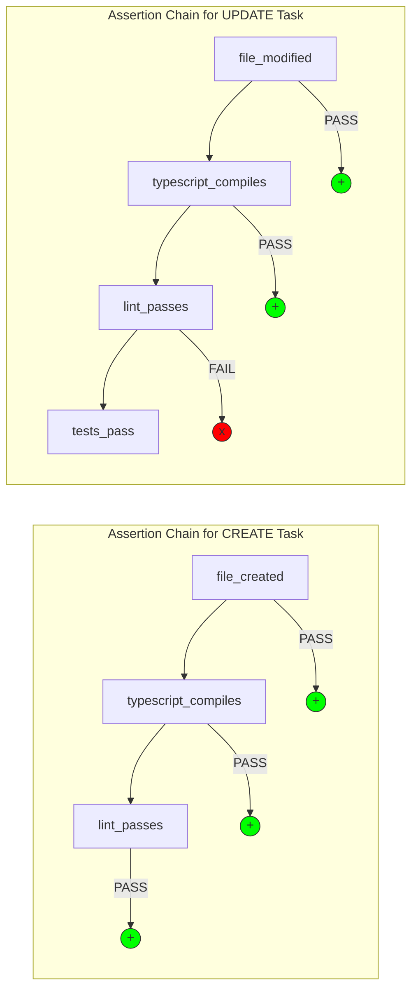
```mermaid
graph LR
    subgraph "Assertion Chain for CREATE Task"
        A1[file_created] --> A2[typescript_compiles]
        A2 --> A3[lint_passes]

        A1 --> |PASS| CHECK1((+))
        A2 --> |PASS| CHECK2((+))
        A3 --> |PASS| CHECK3((+))
    end

    subgraph "Assertion Chain for UPDATE Task"
        B1[file_modified] --> B2[typescript_compiles]
        B2 --> B3[lint_passes]
        B3 --> B4[tests_pass]

        B1 --> |PASS| CHECK4((+))
        B2 --> |PASS| CHECK5((+))
        B3 --> |FAIL| CROSS1((x))
    end

    style CHECK1 fill:#0f0,stroke:#333
    style CHECK2 fill:#0f0,stroke:#333
    style CHECK3 fill:#0f0,stroke:#333
    style CHECK4 fill:#0f0,stroke:#333
    style CHECK5 fill:#0f0,stroke:#333
    style CROSS1 fill:#f00,stroke:#333
```

---

## 8. Message Bus Log Model

### 8.1 Message Bus Log Entity

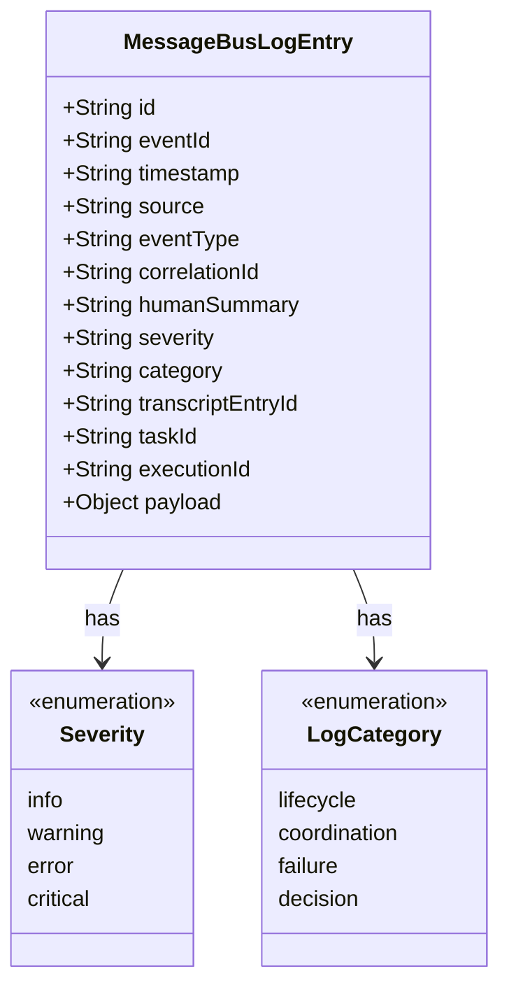
```mermaid
classDiagram
    class MessageBusLogEntry {
        +String id
        +String eventId
        +String timestamp
        +String source
        +String eventType
        +String correlationId
        +String humanSummary
        +String severity
        +String category
        +String transcriptEntryId
        +String taskId
        +String executionId
        +Object payload
    }

    class Severity {
        <<enumeration>>
        info
        warning
        error
        critical
    }

    class LogCategory {
        <<enumeration>>
        lifecycle
        coordination
        failure
        decision
    }

    MessageBusLogEntry --> Severity : has
    MessageBusLogEntry --> LogCategory : has
```

### 8.2 Event to Log Transformation

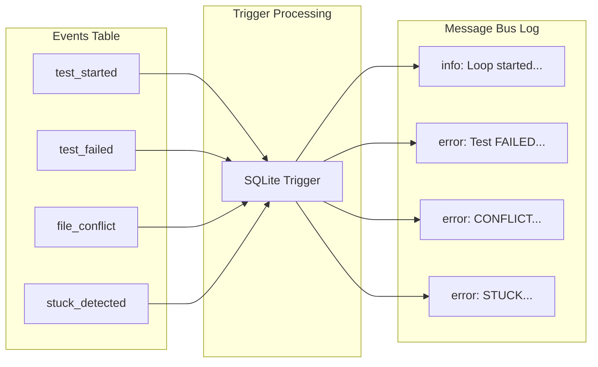
```mermaid
flowchart LR
    subgraph "Events Table"
        E1[test_started]
        E2[test_failed]
        E3[file_conflict]
        E4[stuck_detected]
    end

    subgraph "Trigger Processing"
        TRIG[SQLite Trigger]
    end

    subgraph "Message Bus Log"
        L1[info: Loop started...]
        L2[error: Test FAILED...]
        L3[error: CONFLICT...]
        L4[error: STUCK...]
    end

    E1 --> TRIG
    E2 --> TRIG
    E3 --> TRIG
    E4 --> TRIG

    TRIG --> L1
    TRIG --> L2
    TRIG --> L3
    TRIG --> L4
```

---

## 9. Parallel Execution Model

### 9.1 Wave Execution Entities

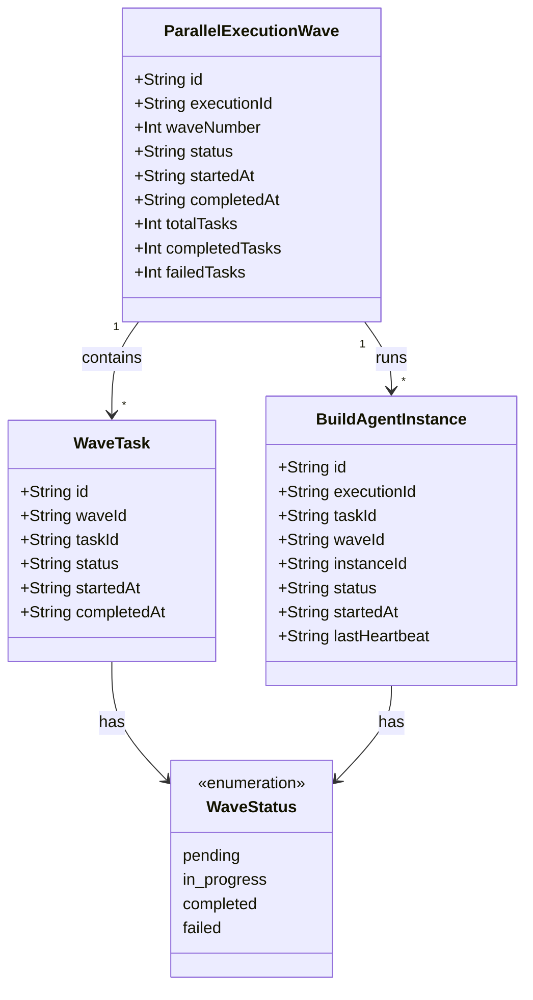
```mermaid
classDiagram
    class ParallelExecutionWave {
        +String id
        +String executionId
        +Int waveNumber
        +String status
        +String startedAt
        +String completedAt
        +Int totalTasks
        +Int completedTasks
        +Int failedTasks
    }

    class WaveTask {
        +String id
        +String waveId
        +String taskId
        +String status
        +String startedAt
        +String completedAt
    }

    class BuildAgentInstance {
        +String id
        +String executionId
        +String taskId
        +String waveId
        +String instanceId
        +String status
        +String startedAt
        +String lastHeartbeat
    }

    class WaveStatus {
        <<enumeration>>
        pending
        in_progress
        completed
        failed
    }

    ParallelExecutionWave "1" --> "*" WaveTask : contains
    ParallelExecutionWave "1" --> "*" BuildAgentInstance : runs
    WaveTask --> WaveStatus : has
    BuildAgentInstance --> WaveStatus : has
```

### 9.2 Wave Execution Flow

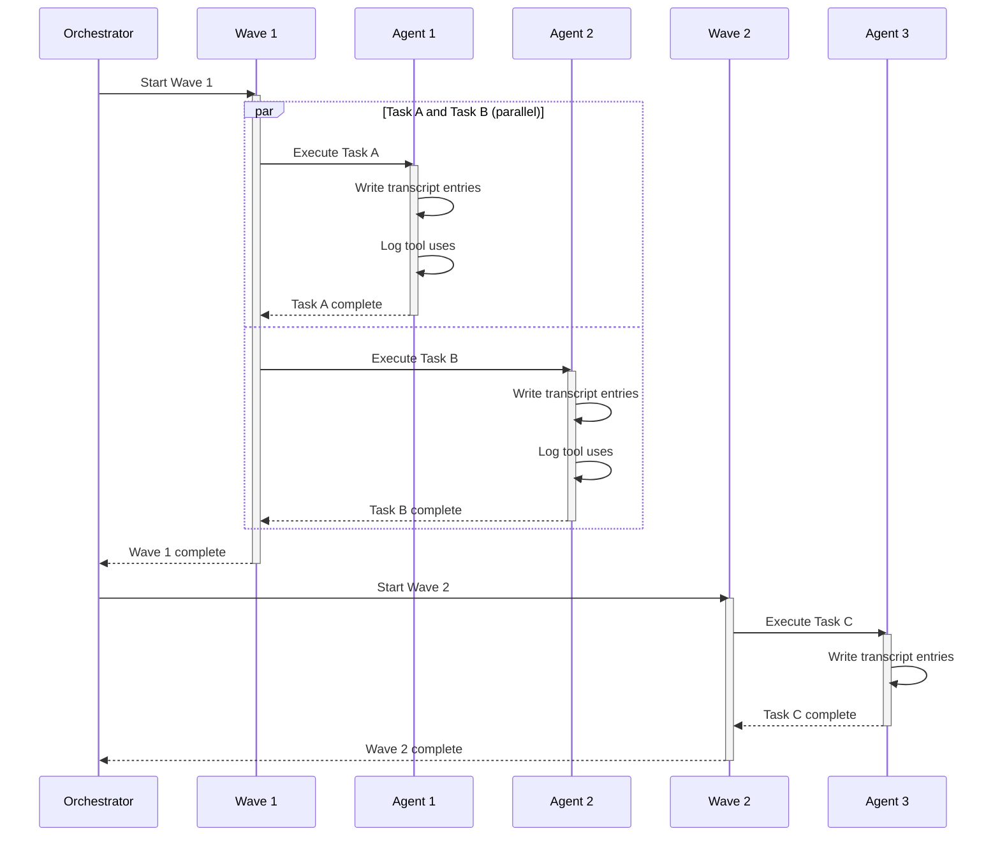
```mermaid
sequenceDiagram
    participant ORCH as Orchestrator
    participant W1 as Wave 1
    participant A1 as Agent 1
    participant A2 as Agent 2
    participant W2 as Wave 2
    participant A3 as Agent 3

    ORCH->>W1: Start Wave 1
    activate W1

    par Task A and Task B (parallel)
        W1->>A1: Execute Task A
        activate A1
        A1->>A1: Write transcript entries
        A1->>A1: Log tool uses
        A1-->>W1: Task A complete
        deactivate A1
    and
        W1->>A2: Execute Task B
        activate A2
        A2->>A2: Write transcript entries
        A2->>A2: Log tool uses
        A2-->>W1: Task B complete
        deactivate A2
    end

    W1-->>ORCH: Wave 1 complete
    deactivate W1

    ORCH->>W2: Start Wave 2
    activate W2
    W2->>A3: Execute Task C
    activate A3
    A3->>A3: Write transcript entries
    A3-->>W2: Task C complete
    deactivate A3
    W2-->>ORCH: Wave 2 complete
    deactivate W2
```

### 9.3 Wave to Transcript Relationship

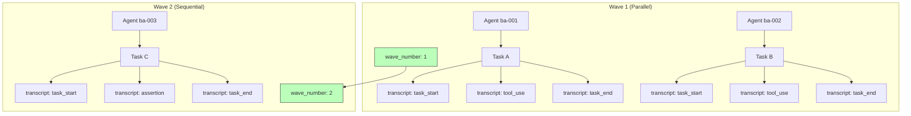
```mermaid
graph TD
    subgraph "Wave 1 (Parallel)"
        W1[wave_number: 1]

        A1[Agent ba-001] --> T1[Task A]
        A2[Agent ba-002] --> T2[Task B]

        T1 --> TE1[transcript: task_start]
        T1 --> TE2[transcript: tool_use]
        T1 --> TE3[transcript: task_end]

        T2 --> TE4[transcript: task_start]
        T2 --> TE5[transcript: tool_use]
        T2 --> TE6[transcript: task_end]
    end

    subgraph "Wave 2 (Sequential)"
        W2[wave_number: 2]

        A3[Agent ba-003] --> T3[Task C]

        T3 --> TE7[transcript: task_start]
        T3 --> TE8[transcript: assertion]
        T3 --> TE9[transcript: task_end]
    end

    W1 --> W2

    style W1 fill:#bfb,stroke:#333
    style W2 fill:#bfb,stroke:#333
```

---

## 10. Cross-Reference Model

### 10.1 Entity Cross-References

Every observability entity maintains links to related entities:

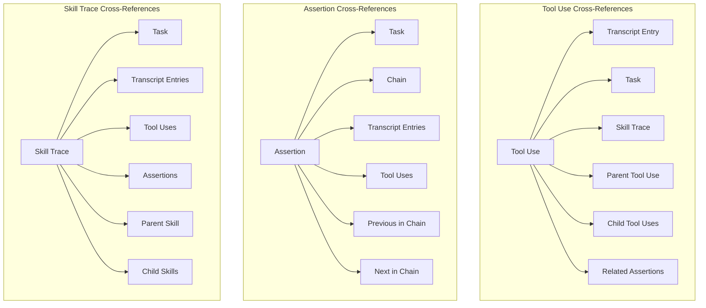
```mermaid
graph TD
    subgraph "Tool Use Cross-References"
        TU[Tool Use]
        TU --> TE[Transcript Entry]
        TU --> TASK[Task]
        TU --> SKILL[Skill Trace]
        TU --> PARENT[Parent Tool Use]
        TU --> CHILDREN[Child Tool Uses]
        TU --> ASSERTS[Related Assertions]
    end

    subgraph "Assertion Cross-References"
        ASSERT[Assertion]
        ASSERT --> TASK2[Task]
        ASSERT --> CHAIN[Chain]
        ASSERT --> TE2[Transcript Entries]
        ASSERT --> TU2[Tool Uses]
        ASSERT --> PREV[Previous in Chain]
        ASSERT --> NEXT[Next in Chain]
    end

    subgraph "Skill Trace Cross-References"
        SK[Skill Trace]
        SK --> TASK3[Task]
        SK --> TE3[Transcript Entries]
        SK --> TU3[Tool Uses]
        SK --> ASSERTS2[Assertions]
        SK --> PARENT_SK[Parent Skill]
        SK --> CHILD_SK[Child Skills]
    end
```

### 10.2 Cross-Reference Service

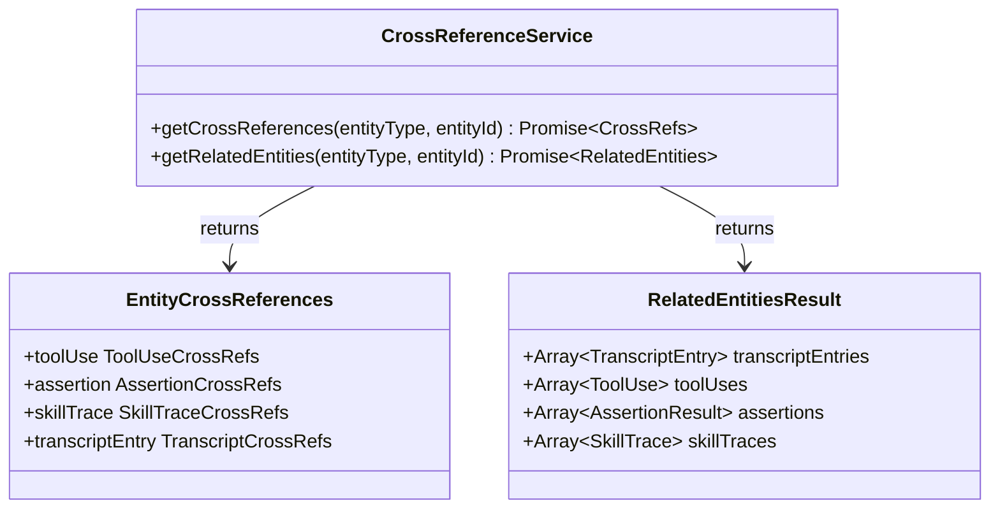
```mermaid
classDiagram
    class CrossReferenceService {
        +getCrossReferences(entityType, entityId) Promise~CrossRefs~
        +getRelatedEntities(entityType, entityId) Promise~RelatedEntities~
    }

    class EntityCrossReferences {
        +toolUse ToolUseCrossRefs
        +assertion AssertionCrossRefs
        +skillTrace SkillTraceCrossRefs
        +transcriptEntry TranscriptCrossRefs
    }

    class RelatedEntitiesResult {
        +Array~TranscriptEntry~ transcriptEntries
        +Array~ToolUse~ toolUses
        +Array~AssertionResult~ assertions
        +Array~SkillTrace~ skillTraces
    }

    CrossReferenceService --> EntityCrossReferences : returns
    CrossReferenceService --> RelatedEntitiesResult : returns
```

---

## 11. Data Flow Diagrams

### 11.1 Write Path (Build Agent to Database)

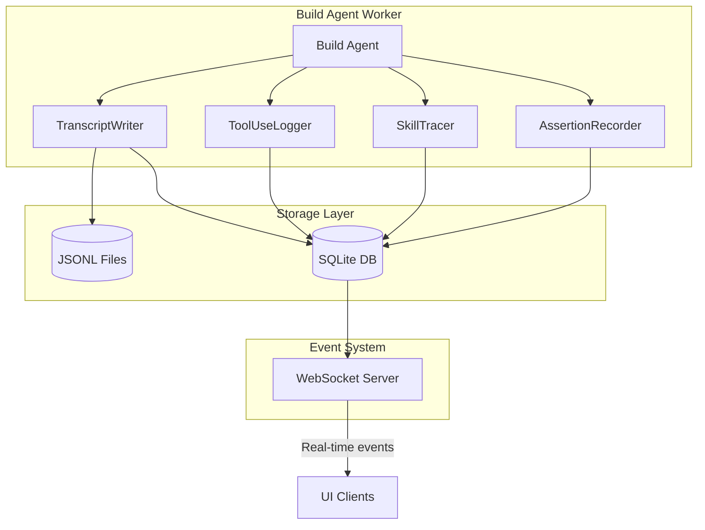
```mermaid
flowchart TD
    subgraph "Build Agent Worker"
        BA[Build Agent]
        TW[TranscriptWriter]
        TUL[ToolUseLogger]
        ST[SkillTracer]
        AR[AssertionRecorder]
    end

    subgraph "Storage Layer"
        JSONL[(JSONL Files)]
        SQLITE[(SQLite DB)]
    end

    subgraph "Event System"
        WS[WebSocket Server]
    end

    BA --> TW
    BA --> TUL
    BA --> ST
    BA --> AR

    TW --> JSONL
    TW --> SQLITE
    TUL --> SQLITE
    ST --> SQLITE
    AR --> SQLITE

    SQLITE --> WS

    WS --> |Real-time events| UI[UI Clients]
```

### 11.2 Read Path (UI to Database)

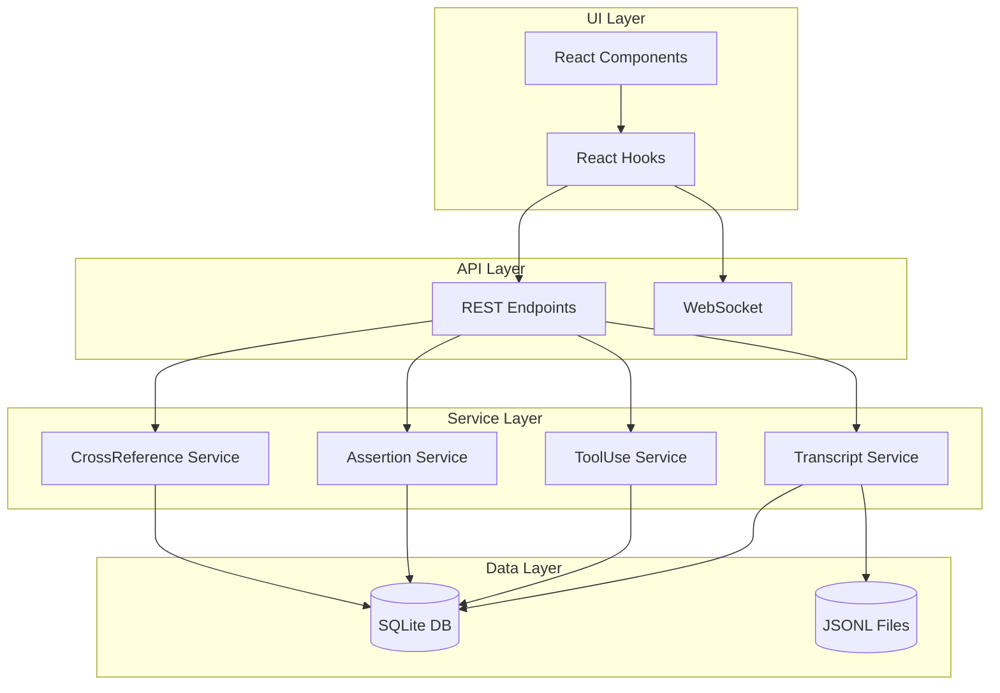
```mermaid
flowchart TD
    subgraph "UI Layer"
        REACT[React Components]
        HOOKS[React Hooks]
    end

    subgraph "API Layer"
        REST[REST Endpoints]
        WS[WebSocket]
    end

    subgraph "Service Layer"
        TRANS_SVC[Transcript Service]
        TOOL_SVC[ToolUse Service]
        ASSERT_SVC[Assertion Service]
        XREF_SVC[CrossReference Service]
    end

    subgraph "Data Layer"
        SQLITE[(SQLite DB)]
        JSONL[(JSONL Files)]
    end

    REACT --> HOOKS
    HOOKS --> REST
    HOOKS --> WS

    REST --> TRANS_SVC
    REST --> TOOL_SVC
    REST --> ASSERT_SVC
    REST --> XREF_SVC

    TRANS_SVC --> SQLITE
    TOOL_SVC --> SQLITE
    ASSERT_SVC --> SQLITE
    XREF_SVC --> SQLITE

    TRANS_SVC --> JSONL
```

### 11.3 Real-Time Event Flow

```mermaid
sequenceDiagram
    participant BA as Build Agent
    participant TW as TranscriptWriter
    participant DB as SQLite
    participant WS as WebSocket Server
    participant UI as UI Client

    BA->>TW: write(transcript_entry)
    TW->>DB: INSERT INTO transcript_entries
    TW->>WS: emit('transcript:entry', entry)
    WS->>UI: {type: 'transcript:entry', entry}
    UI->>UI: Update view (< 100ms)

    BA->>TW: log_tool_start(tool_use)
    TW->>WS: emit('tooluse:start', tool)
    WS->>UI: {type: 'tooluse:start', tool}

    BA->>TW: log_tool_end(tool_result)
    TW->>DB: UPDATE tool_uses
    TW->>WS: emit('tooluse:end', result)
    WS->>UI: {type: 'tooluse:end', result}
```

---

## Index Summary

### Tables by Layer

| Layer                  | Tables                                                                                        |
| ---------------------- | --------------------------------------------------------------------------------------------- |
| **Execution Context**  | `task_list_execution_runs`, `parallel_execution_waves`, `wave_tasks`, `build_agent_instances` |
| **Observability Core** | `transcript_entries`, `tool_uses`, `skill_traces`                                             |
| **Validation**         | `assertion_results`, `assertion_chains`                                                       |
| **Events**             | `events`, `message_bus_log`                                                                   |

### Key Queries

| Query                    | Purpose                     | Tables Involved                          |
| ------------------------ | --------------------------- | ---------------------------------------- |
| Transcript for execution | Get chronological log       | `transcript_entries`                     |
| Tool uses with errors    | Debug failures              | `tool_uses`                              |
| Assertion summary        | Validate task completion    | `assertion_results`, `assertion_chains`  |
| Skill usage              | Track SKILLS.md invocations | `skill_traces`                           |
| Wave progress            | Monitor parallel execution  | `parallel_execution_waves`, `wave_tasks` |
| Cross-references         | Navigate related entities   | All tables                               |

---

## Related Documents

| Document                                                              | Description           |
| --------------------------------------------------------------------- | --------------------- |
| [Database Schema (appendices/DATABASE.md)](../appendices/DATABASE.md) | Full SQL schema       |
| [Types (appendices/TYPES.md)](../appendices/TYPES.md)                 | TypeScript interfaces |
| [SPEC.md](../SPEC.md)                                                 | Full specification    |
| [API Reference](../api/README.md)                                     | API endpoints         |

---

_Data model implementation: `database/migrations/087_observability_schema.sql`_
